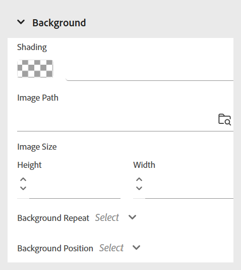

# インラインスタイルの使用

インラインスタイルを適用して、コースコンテンツ内で特定のテキストの外観を直接カスタマイズできます。 これにより、フォントサイズ、カラー、整列などの書式設定を素早く調整できます。 選択したテキストのインラインスタイルは、**コンテンツプロパティ** パネルを使用して変更できます。

ここでは、さまざまなインラインスタイルについて説明する簡単なチュートリアル動画を紹介します。

>[!NOTE]
>
> これらのスタイル設定オプションは、管理者が有効にしている場合にのみ表示されます。

>[!VIDEO](https://video.tv.adobe.com/v/3469533/aem-guides-learning-content)

使用可能なインラインスタイルオプションの説明は次のとおりです。

- **フォント：** フォントファミリー、フォントの太さ、テキストの装飾、フォントサイズなど、様々なオプションを使用して、テキストの外観をカスタマイズできます。 これらの設定は、次の例に示すように、コンテンツのスタイル設定に役立ちます。

  {width="350"}

- **境界線**：境界線の辺、幅、スタイル（実線、破線、点線など）、カラーなどのオプションを使用して、要素の境界線を定義およびカスタマイズできます。 これらの設定は、コンテンツの特定のセクションを視覚的に分離したり、強調表示したりするのに役立ちます。

  {width="350"}

- **レイアウト**: コンテンツ内の要素の配置と間隔を制御するのに役立ちます。 余白、パディング、整列、表示タイプなどのプロパティを調整できます。 コンテンツを効率的に整理できます。

  {width="350"}

- **背景**：背景色、画像、位置、繰り返しスタイルなどのオプションを設定して、要素の背景をカスタマイズできます。 これらの設定は、コンテンツの視覚的な魅力と明瞭性を高めるのに役立ちます。

  {width="350"}

- **列**: コンテンツを複数の列に整理できます。 列数、列間の間隔、列幅などを調整できます。 コンテンツ内の読みやすさとレイアウト構造を向上させます。

  {width="350"}
