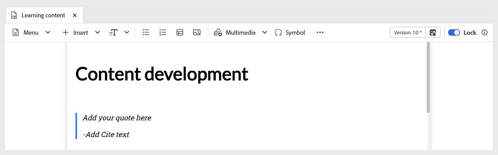
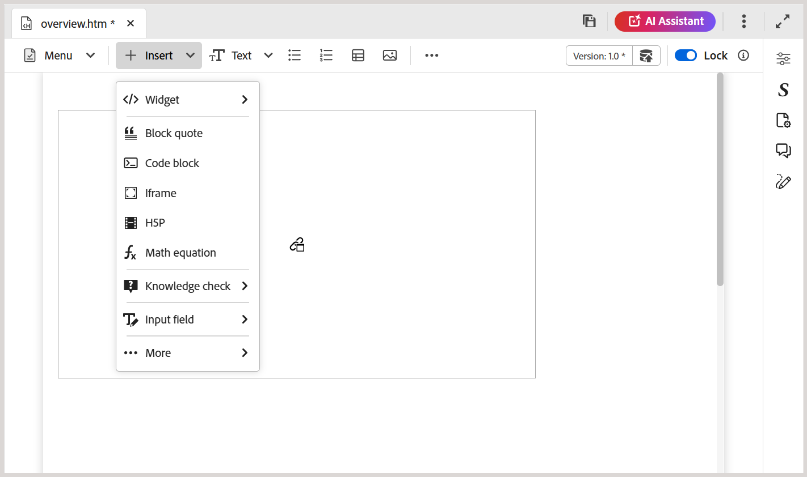

# 挿入メニューのその他のオプション

エディターツールバーの挿入メニューで使用できるその他のオプションには、次のものがあります。

- **ブロック引用符：** ブロック引用符と引用符をコンテンツに追加します。

  {width="650"}

- **コードブロック：** コンテンツにコードブロックを追加します。

  {width="650"}

- **Iframes:**&#x200B;外部web ページまたはインタラクティブリソースを埋め込むために、iframeをコンテンツに挿入します。 ソース URL、幅、高さ、整列、タイトルなど、**コンテンツ プロパティ** パネルを使用して、iframe プロパティを設定できます。 次に示すように、**プレビュー** モードに切り替えることで、iframeに追加されたコンテンツを表示できます。

  **作成者** ビュー：

  {width="650"}

  **プレビュー** モード：

  {width="650"}

- **H5P:** インタラクティブ H5P パッケージを学習コンテンツに追加します。 H5P コンテンツを追加するには、目的の場所にカーソルを置き、挿入メニューから&#x200B;**H5P**&#x200B;を選択します。 H5Pを挿入ダイアログで、学習コンテンツに追加するH5P ファイルへの参照を指定します。

  

  システムからH5P コンテンツを使用する場合は、まず[ アセットのアップロード **オプションを使用してDAM](../user-guide/authoring-upload-existing-files.md)にファイルをアップロードし、リポジトリビュー/Assetsの一部にします。**

  

  完了したら、プレビューモードと公開済み出力でH5P コンテンツを確認します。

  >[!NOTE]
  >
  > H5P コンテンツの編集や作成は、Adobe Experience Manager Guidesではサポートされていません。 アップロードする前に、H5P パッケージを外部で準備します。

- **MathML数式：**&#x200B;は、MathML数式をコンテンツに挿入します。 MathML数式を作成し、**挿入**&#x200B;を選択して文書に追加できます。

  {width="350"}

  方程式が薄いグレーの背景で挿入されます。 既存の数式を右クリックし、コンテキストメニューから「**数式を編集**」を選択して、いつでも数式を更新できます。 Experience Manager GuidesでのMathML数式の検証について詳しくは、[MathML エディターでの数式の検証](../user-guide/web-editor-other-features.md#validation-of-equations-in-the-mathml-editor)を参照してください。

- **知識の確認：**&#x200B;使用できる形式で質問を追加し（Single Correct、Multiple Correct、True/False、Match the Following、またはinsert from the question bank）、レビュー用にトピックに追加し、採点なしで理解を確認できます。 これらの質問は標準的な形式を反映しており、スコアリングを除外できるため、自己評価に最適で、コースコンテンツの一部として、またはクイズや評価の前に、後で行う場合はトピックとして適しています。

  {width="650"}

  **コンテンツのプロパティ** パネルを使用して、正解およびその他の必須フィールドを設定できます。 詳しくは、[質問タイプ ](./quiz-insert-questions.md)を参照してください。 次に示すように、ナレッジチェックオプションを使用して、さまざまな質問タイプを追加できます。

  {width="650"}

- **入力フィールド：** テキスト入力フィールドとボタンをコンテンツに追加します。 この組み合わせにより、ユーザー入力とトリガー固有のアクションを取得できます。 コンテンツに再生ボタンが追加されます（下図を参照）。

  {width="650"}

- **その他のオプション：**&#x200B;横線、改行、テキストボックス、配置されたテキストボックス、埋め込みHTMLの挿入など、学習コンテンツを強化するための追加のオプションがあります。

  {width="650"}
