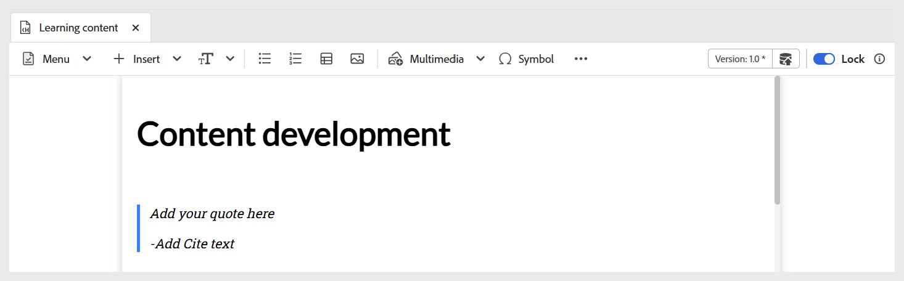

# 挿入メニューのその他のオプション

エディターツールバーの挿入メニューで使用できるその他のオプションには、次のものがあります。

- **ブロック引用：** コンテンツにブロック引用と引用文を追加します。

  {width="650" align="left"}

- **コードブロック：** コンテンツブロックに追加します。

  {width="650" align="left"}

- **Iframes:** 外部 web ページまたはインタラクティブリソースを埋め込むために、コンテンツに iframe を挿入します。 ソース URL、幅、高さ、整列、タイトルなど、**コンテンツのプロパティ** パネルを使用して、iframe プロパティを設定できます。 以下に示すように、**プレビュー** モードに切り替えると、iframe に追加されたコンテンツを表示できます。

  **オーサー** ビュー：

  {width="650" align="left"}

  **プレビュー** モード：

  {width="650" align="left"}

- **H5P:** 学習コンテンツにインタラクティブな H5P パッケージを追加します。 H5P コンテンツを追加するには、目的の場所にカーソルを置き、「挿入」メニューから「**H5P**」を選択します。 H5P を挿入ダイアログで、学習コンテンツに追加する H5P ファイルへの参照を入力します。

  

  システムから H5P コンテンツを使用する場合は、まず [ アセットをアップロード ](../user-guide/authoring-upload-existing-files.md) オプションを使用して **DAM にファイルをアップロード** してから、リポジトリビュー/Assetsに含めます。

  

  完了したら、プレビューモードで H5P コンテンツをレビューし、公開された出力を確認します。

  >[!NOTE]
  >
  > Adobe Experience Manager Guidesでは、H5P コンテンツの編集や作成はサポートされていません。 アップロードする前に、H5P パッケージを外部に準備します。

- **数式：** MathMLの数式をコンテンツに挿入します。 MathMLの数式を作成し、「**挿入**」を選択してドキュメントに追加できます。

  {width="350" align="left"}

  数式は、明るい灰色の背景で挿入されます。 既存の数式を右クリックし、コンテキストメニューから **数式を編集** を選択することで、いつでも数式を更新できます。 MathMLでのMathML式の検証について詳しくは、[Experience Manager Guides エディターでの式の検証 ](../user-guide/web-editor-other-features.md#validation-of-equations-in-the-mathml-editor) を参照してください。

- **ナレッジチェック：** 利用可能な形式（単正解、複数正解、正解/正解/正解、以下に一致、質問バンクから挿入）で質問をトピックに追加して、レビューし、評価やレポートを行わずに理解を確認できます。 これらの質問は、標準的な形式を反映しており、スコアリングを除外しているので、自己評価に最適です。必要に応じて、クイズや評価の前に、コースコンテンツまたはトピックの一部として使用できます。

  {width="650" align="left"}

  **コンテンツのプロパティ** パネルを使用して、正解およびその他の必須フィールドを設定できます。 詳しくは、[ 質問のタイプ ](./quiz-insert-questions.md) を参照してください。 以下に示すように、ナレッジチェックオプションを使用して、様々な質問タイプを追加できます。

  {width="650" align="left"}

- **入力フィールド：** テキスト入力フィールドとボタンをコンテンツに追加します。 この組み合わせを使用して、ユーザー入力を取得し、トリガー固有のアクションを実行できます。 次に示すように、コンテンツに再生ボタンが追加されます。

  {width="650" align="left"}

- **その他のオプション：** 横線、改行、テキストボックス、配置したテキストボックス、埋め込みHTMLなど、ラーニングコンテンツを強化する追加オプションがあります。

  {width="650" align="left"}
