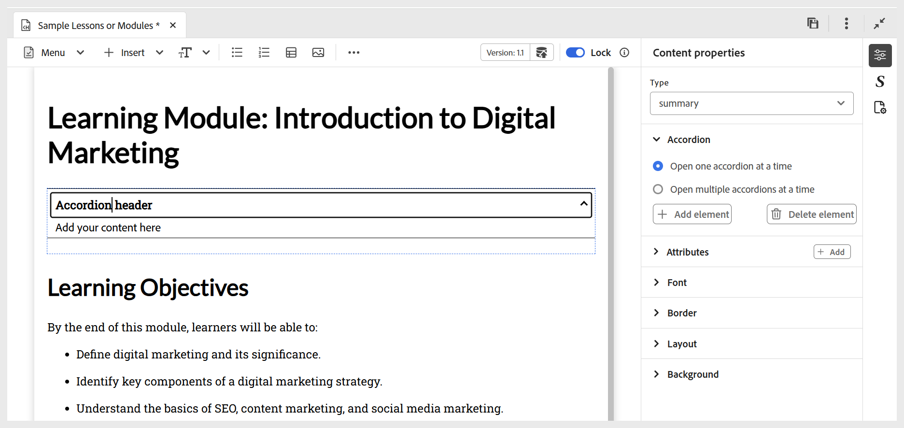
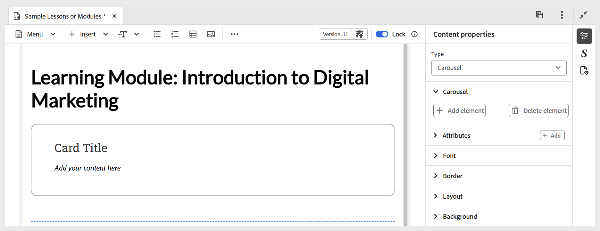

# インタラクティブウィジェットの使用

複数のウィジェットを追加して学習コンテンツを強化し、コースをよりインタラクティブにすることができます。 これは、利用可能なさまざまなウィジェットの簡単なチュートリアル動画です。

>[!VIDEO](https://video.tv.adobe.com/v/3469531/learning-content-aem-guides)

ユーザーエクスペリエンスの向上とコンテンツ配信の合理化を目的として設計された利用可能なウィジェットには、次のようなものがあります。

- **アコーディオン：** アコーディオンをコンテンツに追加します。 アコーディオンヘッダーと本文の両方に適切なテキストを挿入できます。 プロパティは、**コンテンツのプロパティ** パネルを使用して管理できます。これには、単一または複数のアコーディオンを同時に開いたり、要素を追加または削除したりするためのオプションが含まれます。 ウィジェットの要素または項目を削除するには、**右クリック/項目を削除**&#x200B;を使用することもできます。

  {width="650"}

- **カルーセル：** カルーセルをコンテンツに追加します。 カードのタイトルと本文の両方に適切なテキストを挿入できます。 プロパティは、**コンテンツのプロパティ** パネルを使用して管理できます。これには、要素を追加または削除するオプションが含まれます。 ウィジェットの要素または項目を削除するには、**右クリック/項目を削除**&#x200B;を使用することもできます。

  {width="650"}

- **ホットスポット：**&#x200B;選択した画像にホットスポットを追加します。 最初に画像を選択してから、**挿入/ホットスポット**&#x200B;に移動します。 これにより、ホットスポットダイアログが開き、異なるホットスポットサイズの設定、対応するリンクの追加、領域の前後への移動によるレイヤーの調整など、様々なオプションを設定できます。 ウィジェットの要素または項目を削除するには、**右クリック/項目を削除**&#x200B;を使用することもできます。

  {width="650"}

- **タブ：** コンテンツをインタラクティブなセクションに整理できます。  各タブは、明確なトピックやカテゴリーを表すことができます。学習者はタブをクリックまたはタップして、対応するコンテンツを表示できます。 コンテンツにタブウィジェットを表示する場所にカーソルを置き、**挿入/ ウィジェット / タブ**&#x200B;に移動します。 これにより、コンテンツにタブコンテナが追加されます。 次に、タブタイトルと対応するコンテンツを含むタブにコンテンツを追加します。  ウィジェットの要素または項目を削除するには、**右クリック/項目を削除**&#x200B;を使用することもできます。

  

  タブレイアウト（縦のタブまたは横のタブ）を追加、削除、切り替えるには、右側のパネルの「**コンテンツのプロパティ**」セクションを使用します。
- **フリップカード：** フリップするコンテンツにインタラクティブカードを追加して、追加情報を表示します。 各カードには表と裏の2つの側面があり、学習者は魅力的な方法で情報を調べることができます。  フリップカードを挿入するには、目的の場所にカーソルを置き、**挿入/ウィジェット/フリップカード**&#x200B;に移動します。これにより、フリップカードコンテナがコンテンツに追加されます。 次に、表側にタイトルとオプション画像を追加し、裏側に対応するコンテンツを入力します。 ウィジェットの要素または項目を削除するには、**右クリック/項目を削除**&#x200B;を使用することもできます。

  

  カードを追加または削除したり、レイアウトを変更したりするには、右側のパネルの「**コンテンツのプロパティ**」セクションを使用します。
- **クリックして表示：**&#x200B;学習者がクリックして表示するまで、コンテンツを非表示にするインタラクティブウィジェットをコンテンツに挿入します。 これは、混乱を減らし、探索を奨励するのに役立ちます。 目的の場所にカーソルを置き、**挿入/ ウィジェット / クリックして表示**&#x200B;を選択して、ウィジェットを挿入します。 挿入したら、ウィジェットヘッダーのタイトルを指定し、学習者が操作したときに表示される非表示のコンテンツを定義します。

  

  ウィジェットを追加または削除したり、ウィジェットの向きを管理したりするには、右側のパネルの「**コンテンツのプロパティ**」セクションを使用します。 ウィジェットの要素または項目を削除するには、**右クリック/項目を削除**&#x200B;を使用することもできます。