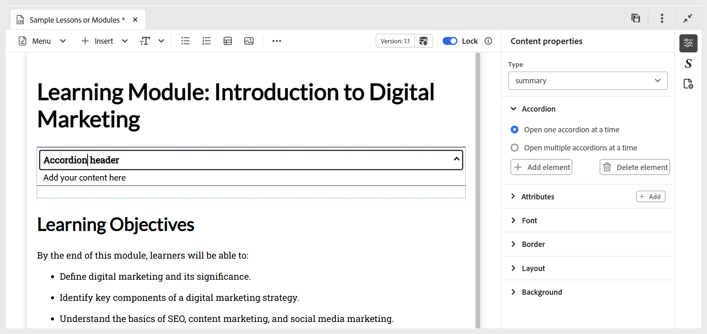

# インタラクティブウィジェットの使用

複数のウィジェットを追加してコースをよりインタラクティブにすることで、学習コンテンツを強化できます。 次に、使用可能な様々なウィジェットの短いチュートリアルビデオを示します。

>[!VIDEO](https://video.tv.adobe.com/v/3469531/learning-content-aem-guides)

ユーザーエクスペリエンスを向上させ、コンテンツ配信を効率化するために設計された利用可能なウィジェットを次に示します。

- **アコーディオン：** コンテンツにアコーディオンを追加します。 アコーディオンヘッダーとその本文の両方に、適切なテキストを挿入できます。 そのプロパティは、**コンテンツプロパティ** パネルを使用して管理できます。このパネルには、1 つまたは複数のアコーディオンを同時に開いたり、要素を追加または削除したりするためのオプションが含まれています。 ウィジェットの要素または項目を削除するには、**右クリック/項目を削除** を使用することもできます。

  {width="650" align="left"}

- **カルーセル：** カルーセルをコンテンツに追加します。 カードのタイトルと本文の両方に、適切なテキストを挿入できます。 要素を追加または削除するオプションなど、プロパティは **コンテンツのプロパティ** パネルを使用して管理できます。 ウィジェットの要素または項目を削除するには、**右クリック/項目を削除** を使用することもできます。

  {width="650" align="left"}

- **ホットスポット：** 選択した画像にホットスポットを追加します。 画像を選択し、**挿入/ホットスポット** に移動します。 ホットスポットダイアログが開き、様々なオプションを設定できます。これらのオプションでは、様々なホットスポットサイズの設定、対応するリンクの追加、領域を前後に移動することによるレイヤーの調整などを行うことができます。 ウィジェットの要素または項目を削除するには、**右クリック/項目を削除** を使用することもできます。

  {width="650" align="left"}

- **Tab:** コンテンツをインタラクティブなセクションに整理できます。  各タブは個別のトピックまたはカテゴリを表すことができます。学習者はタブをクリックまたはタップすると、対応するコンテンツを表示できます。 コンテンツ内でタブウィジェットを表示する場所にカーソルを置き、**挿入/ウィジェット/タブ** に移動します。 これにより、コンテンツにタブコンテナが追加されます。 次に、タブにコンテンツを追加します。このタブには、タブタイトルと対応するコンテンツが含まれています。  ウィジェットの要素または項目を削除するには、**右クリック/項目を削除** を使用することもできます。

  

  タブのレイアウト（垂直タブまたは水平タブ）を追加、削除、切り替えるには、右側のパネルの「**コンテンツのプロパティ**」セクションを使用します。
- **カードを反転：** コンテンツにインタラクティブカードを追加し、反転させて追加情報を表示します。 各カードには前面と背面の 2 つの側面があり、学習者は魅力的な方法で情報を探索できます。  フリップカードを挿入するには、目的の場所にカーソルを置き、**挿入/ウィジェット/フリップカード** に移動します。これにより、コンテンツにフリップカードコンテナが追加されます。 その後、表側にタイトルとオプション画像を追加し、対応するコンテンツを背面に入力できます。 ウィジェットの要素または項目を削除するには、**右クリック/項目を削除** を使用することもできます。

  

  カードの追加や削除、レイアウトの変更を行うには、右側のパネルの「**コンテンツのプロパティ**」セクションを使用します。
- **クリックして表示：** 学習者がクリックして表示するまでコンテンツを非表示にするインタラクティブなウィジェットをコンテンツに挿入します。 これにより、クラッターを減らし、探索を促進できます。 目的の場所にカーソルを置き、**挿入/ウィジェット/クリックして表示** を選択して、ウィジェットを挿入します。 挿入したら、ウィジェットヘッダーのタイトルを指定し、学習者がやり取りするときに表示される非表示のコンテンツを定義します。

  

  ウィジェットを追加または削除したり、ウィジェットの向きを管理したりするには、右側のパネルの **コンテンツのプロパティ** セクションを使用します。 ウィジェットの要素または項目を削除するには、**右クリック/項目を削除** を使用することもできます。