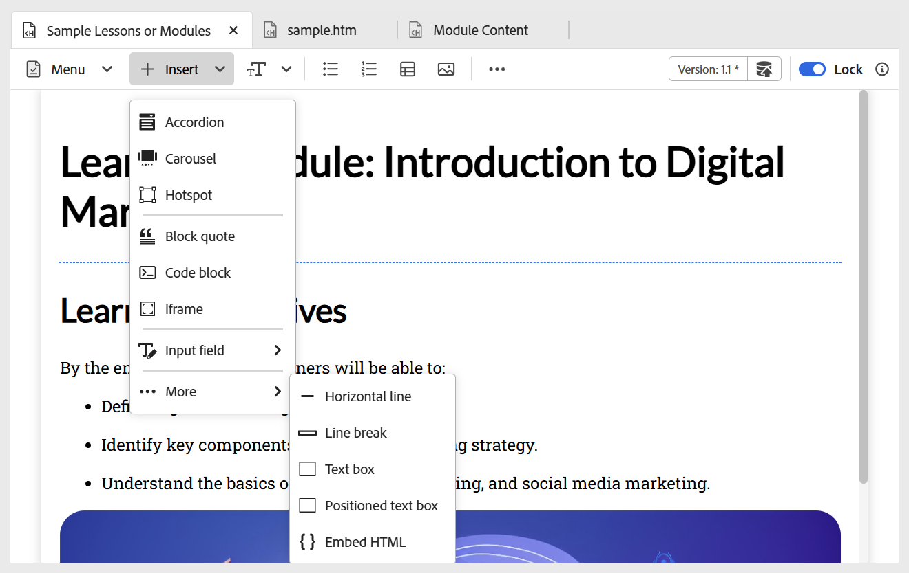

# インタラクティブウィジェットの使用

複数のウィジェットを追加してコースをよりインタラクティブにすることで、学習コンテンツを強化できます。 ツールバーの **挿入** メニューを選択して、ウィジェットにアクセスします。 使用できるウィジェットは次のとおりです。

- **アコーディオン：** コンテンツにアコーディオンを追加します。 アコーディオンヘッダーとその本文の両方に、適切なテキストを挿入できます。 そのプロパティは、**コンテンツプロパティ** パネルを使用して管理できます。このパネルには、1 つまたは複数のアコーディオンを同時に開いたり、要素を追加または削除したりするためのオプションが含まれています。

  {width="650" align="left"}

- **カルーセル：** カルーセルをコンテンツに追加します。 カードのタイトルと本文の両方に、適切なテキストを挿入できます。 要素を追加または削除するオプションなど、プロパティは **コンテンツのプロパティ** パネルを使用して管理できます。

  {width="650" align="left"}

- **ホットスポット：** 選択した画像にホットスポットを追加します。 画像を選択し、**挿入/ホットスポット** に移動します。 ホットスポットダイアログが開き、様々なオプションを設定できます。これらのオプションでは、様々なホットスポットサイズの設定、対応するリンクの追加、領域を前後に移動することによるレイヤーの調整などを行うことができます。

  {width="650" align="left"}

- **ブロック引用：** コンテンツにブロック引用と引用文を追加します。

  {width="650" align="left"}

- **コードブロック：** コンテンツブロックに追加します。

  {width="650" align="left"}

- **Iframes:** コンテンツに iframe を挿入して、外部 web ページやインタラクティブリソースを埋め込みます。 ソース URL、幅、高さ、整列、タイトルなど、**コンテンツのプロパティ** パネルを使用して、iframe プロパティを設定できます。 以下に示すように、**プレビュー** モードに切り替えると、iframe に追加されたコンテンツを表示できます。

  **オーサー** ビュー：

  {width="650" align="left"}

  **プレビュー** モード：

  {width="650" align="left"}

- **入力フィールド：** テキスト入力フィールドとボタンをコンテンツに追加します。 この組み合わせを使用して、ユーザー入力を取得し、トリガー固有のアクションを実行できます。 次に示すように、コンテンツに再生ボタンが追加されます。

  {width="650" align="left"}

- **その他のオプション：** 横線、改行、テキストボックス、配置したテキストボックス、埋め込みHTMLなど、ラーニングコンテンツを強化する追加オプションがあります。

  {width="650" align="left"}
