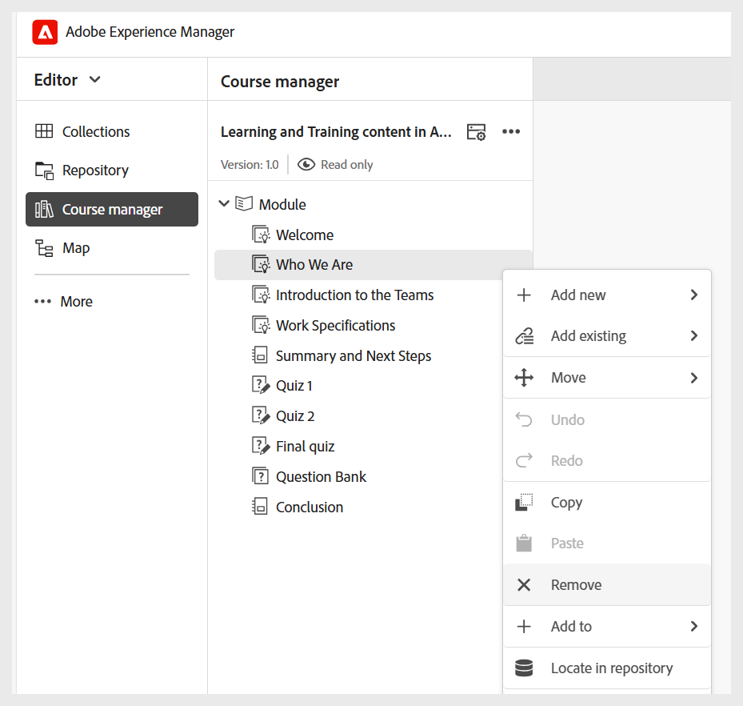
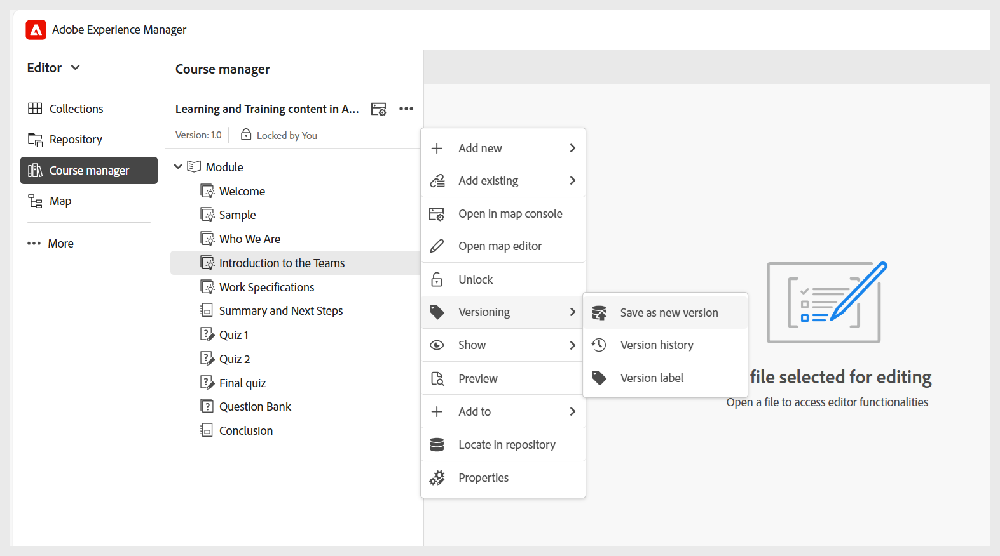
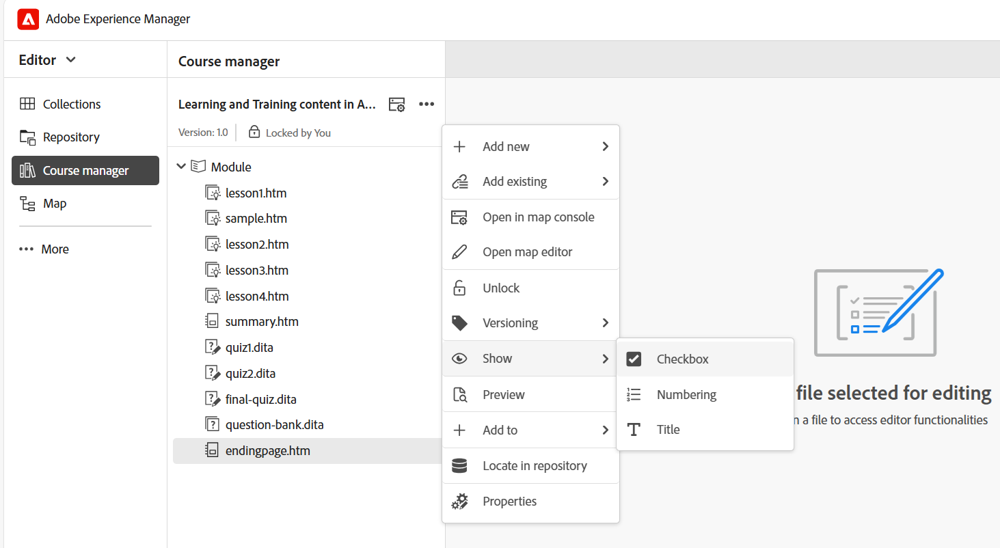
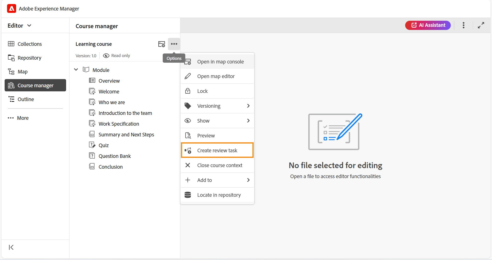

# コースの管理

コースを作成すると、コースマネージャーパネルが開きます。 コースをロックし、コースレベルで必要なすべての変更を行うことができます。 次の節では、コースを編集するために使用できるオプションについて説明します。

## 新しいコンテンツを追加

コースに新しいコンテンツを追加するには、次の手順を実行します。

1. **オプション** メニュー/**新規を追加**&#x200B;を選択します。

   
2. 作成するコンテンツのタイプを選択します。 使用できるオプションは以下のとおりです。
   - **概要**: コースの最初のトピックで、コースの内容をすばやく説明します。
   - **トピック**: コースの主な教材は、特定のスキルやアイデアを教える、手順、例、説明などの短く焦点を絞った部分で構成されます。 詳細については、[&#x200B; トピックの作成とカスタマイズ &#x200B;](./create-content.md)を参照してください。
   - **概要**: コースの章の最後にあるクイックレビューで、学習者に学習したばかりの重要なポイントを思い出してもらいます。
   - **クイズ**：学習した内容をどの程度理解しているかを確認するために使用される一連の質問です。 詳細については、[&#x200B; クイズの作成と管理](./create-quiz.md)を参照してください。
   - **質問バンク**：迅速かつ一貫性のあるクイズの作成に使用できる、再利用可能な質問の共有プール。 詳細については、[質問バンク &#x200B;](./create-qb.md)を参照してください。
   - **グループ**：学習グループは、章、トピック、その他のモジュールなどの関連トピックを論理的な順序で整理し、トレーニング資料の管理と再利用を容易にする明確な階層を構築するのに役立ちます。
3. 「**作成**」を選択します。

選択したコンテンツが作成され、コースに追加されます。 ビデオの概要については、[&#x200B; コースに新しいコンテンツを追加](https://video.tv.adobe.com/v/3469537/aem-guides-learning-content?quality=12&learn=on) を参照してください。

## 既存コンテンツの追加

コンテンツリポジトリの既存のコンテンツをコースに追加できます。 既存のコンテンツを追加するには、次の手順を実行します。

1. **オプション** メニュー/**既存の**&#x200B;を追加を選択します。
2. 作成するコースコンテンツのタイプを選択します。
3. **ファイルを選択** ダイアログで、コンテンツの場所に移動し、目的の学習コンテンツを選択します。

   
4. **Select**&#x200B;を選択します。

選択したコースコンテンツがリポジトリからコースに追加されます。

>[!NOTE]
>
>また、**既存ファイルを追加** > **ファイル（リソースのみzip）** オプションを使用して、解凍されたzip ファイルを最終的なSCORM出力のフォルダー構造に含めることもできます。 これにより、コースの公開中にリソースのパッケージ化を効率化することができます。

ビデオの概要については、[&#x200B; コースに既存のコンテンツを追加](https://video.tv.adobe.com/v/3469537/aem-guides-learning-content?quality=12&learn=on) を参照してください。

## コンテンツを削除

コースから任意のトピックを削除するには、特定のトピックの&#x200B;**オプション** メニューを選択し、次に示すように&#x200B;**エントリを削除**&#x200B;を選択します。

ビデオの概要については、[&#x200B; コースからコンテンツを削除](https://video.tv.adobe.com/v/3475210/learning-content-aem-guides) を参照してください。

## コースバージョンの作成

コースのバージョン管理は、**オプション** メニュー/**バージョン管理**&#x200B;を選択することで制御できます。

コースのバージョン管理には、次のオプションがあります。

- **新しいバージョンとして保存**：新しいバージョン番号でコースを保存します。
- **バージョン履歴**：現在のバージョンのプレビューを表示し、コースの他の利用可能なバージョンと比較することもできます。
- **バージョンラベル**：自由形式のテキスト形式でラベルを指定するか、定義済みのラベルのセットを使用できます。

## 表示設定：表示

「**表示**」オプションによって、トピックの表示方法が決まります。 複数のトピック選択のチェックボックス、階層構造を示す番号付け、またはトピックタイトルまたはファイル名を表示して、それらを表示するように選択できます。

>[!NOTE]
>
> これらのビュー設定は、コースマネージャー内でのみ適用され、公開された出力には影響しません。

ビデオの概要については、[設定の表示](https://video.tv.adobe.com/v/3475210/learning-content-aem-guides) を参照してください。

## レビュータスクの作成

学習コースまたは管理者の作成者は、コースのレビュータスクを作成し、レビュー担当者にフィードバック用に割り当てることができます。 最初に、**コースマネージャー** パネルでコースを開き、次に示すように、**オプション** メニューから「**レビュータスクを作成**」を選択します。

**レビュータスクの作成** ページに移動します。レビュータスクのタイトルなどのタスクの詳細を追加し、DITA プロジェクトを指定し、タスクタイムラインを定義し、レビュー担当者を割り当てるなどをおこなう必要があります。 完了すると、レビュー担当者はこのタスクの通知を受け取ります。 選択したコーストピックがレビューUIで開き、レビュー担当者がコメントを追加し、トピックを更新のために戻すことができます。

Experience Manager Guidesのレビューワークフローを理解するには、[&#x200B; レビュー用にトピックを送信](../user-guide/review-send-topics-for-review.md)を表示します。

