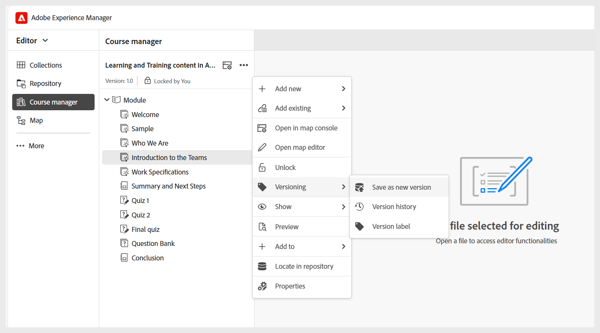

# コースの管理

コースを作成すると、コースマネージャーパネルに表示されます。 コースをロックし、コースレベルで必要な変更をすべて行うことができます。 次の節では、コース編集に使用できるオプションについて説明します。

## 新しいコンテンツを追加

次の手順を実行して、コースに新しいコンテンツを追加します。

1. **オプション** メニュー/**新規追加** を選択します。

   
2. 作成するコンテンツのタイプを選択します。 使用できるオプションは以下のとおりです。
   - **概要**：コースの内容の簡単な紹介を行う、コースの最初のトピックです。
   - **トピック**：コースのメイン資料は、特定のスキルやアイデアを教える手順、例、説明など、短く焦点を当てた部分で構成されています。 詳しくは、[&#x200B; トピックの作成とカスタマイズ &#x200B;](./create-content.md) を参照してください。
   - **概要**：コースチャプターの最後にあるクイックレビューで、学習した重要な点を学習者に思い出させます。
   - **クイズ**：学習した内容をどの程度理解しているかを確認するために使用される一連の質問です。 詳しくは、[&#x200B; クイズの作成と管理 &#x200B;](./create-quiz.md) を参照してください。
   - **Question bank**：迅速かつ一貫してクイズを作成するために使用できる、再利用可能な質問の共有プール。 詳しくは、[&#x200B; 質問バンク &#x200B;](./create-qb.md) を参照してください。
   - **グループ**：学習グループは、チャプター、トピック、その他のモジュールなどの関連トピックを論理的な順序に整理し、トレーニング資料の管理と再利用を容易にする明確な階層を構築するのに役立ちます。
3. 「**作成**」を選択します。

選択したコンテンツが作成され、コースに追加されます。 ビデオの概要については、 を参照してください。

## 既存のコンテンツを追加

既存のコンテンツをコンテンツリポジトリからコースに追加できます。 既存のコンテンツを追加するには、次の手順を実行します。

1. **オプション** メニュー/**既存を追加** を選択します。
2. 作成するコースコンテンツのタイプを選択します。
3. **パスを選択** ダイアログで、コンテンツの場所に移動し、目的の学習コンテンツを選択します。

   
4. **選択** を選択します。

選択したコースコンテンツがリポジトリからコースに追加されます。

>[!NOTE]
>
>**既存の追加**/**ファイル（リソースのみの zip）** オプションを使用して、解凍されて最終的な SCORM 出力のフォルダ構造に統合される zip ファイルを含めることもできます。 これにより、コースの公開中にリソースのパッケージ化を合理化できます。

ビデオの概要については、 を参照してください。

## コンテンツを削除

以下に示すように、特定のトピックの **オプション** メニューを選択してから「エントリを削除 **を選択すると、コースから任意のトピックを削除でき** す。

ビデオの概要については、 を参照してください。

## コースバージョンの作成

コースのバージョン管理を制御するには、**オプション** メニュー/**バージョン管理** を選択します。

コースのバージョン管理には、次のオプションがあります。

- **新しいバージョンとして保存**：コースを新しいバージョン番号で保存します。
- **バージョン履歴**：現在のバージョンのプレビューが表示され、コースで利用可能な他のバージョンと比較することもできます。
- **バージョンラベル**：自由形式のテキスト形式でラベルを指定したり、事前定義済みのラベルのセットを使用したりできます。

## 表示設定：表示

**表示** オプションは、トピックの表示方法を決定します。 複数のトピックを選択する場合はチェックボックスを使用し、階層構造を示す番号付けを使用するか、トピックのタイトルまたはファイル名を表示するかを選択できます。

>[!NOTE]
>
> これらの表示設定はコースマネージャー内でのみ適用され、公開済みの出力には影響しません。

ビデオの概要については、 を参照してください。
