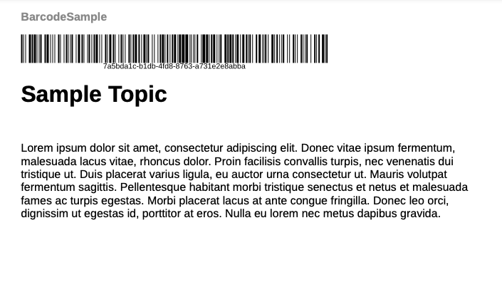

# PDF出力にバーコードを追加する

バーコードとは、機械が読み取れるデータパターンのことです。 顧客はバーコードスキャナーやスマートフォンのカメラでバーコードをスキャンできます。 商品の詳細、在庫番号、web サイトのURLなどの情報をエンコードすると役に立ちます。 バーコードを追加すると、データを簡単に取得し、顧客体験を向上させ、より優れたデータ管理とセキュリティを促進できます。

バーコードのスタイルを作成できます。 バーコードを挿入するために使用します。 スタイルは、目的のページレイアウトのサンプルバーコードに適用できます。


このチュートリアルでは、PDF出力にバーコードを追加する方法を説明します。

## バーコードを生成する手順

バーコードを生成するには、次の手順を実行します。

### テンプレートのCSSを更新して、バーコード値をレンダリングします

PDF生成時に`layout.css` ファイルを変更して、バーコードをレンダリングします。 「qrcode」や「pdf417」など、様々なバーコードタイプがサポートされています。  詳細については、[&#x200B; バーコードタイプ &#x200B;](#barcode-types)を参照してください。


```css
...
.barcode { 
-ro-replacedelement: barcode;   
-ro-barcode-type: code128;   
-ro-barcode-size: 100%;   
-ro-barcode-content: content();   
object-fit: contain;   
margin-top: 2mm;
 
}
...
```

### CSS スタイルを使用してバーコードを生成する

バーコードは、様々な方法で生成できます。 一部の例は次のとおりです。

**例 1**

テンプレートヘッダーにバーコードプレースホルダーを追加し、スタイルを適用します。

1. **テンプレート** / **ページレイアウト**&#x200B;を編集
1. ページレイアウトを選択します。 例えば、ヘッダーまたはフッターを含むBackCover ページレイアウトを選択できます。
1. バーコードを挿入する場所に次のスパンを追加します。

   `<span class="barcode">Sample barcode</span></p>`。

   >[!NOTE]
   >
   > `layout.css`で定義したのと同じクラス名を使用してください。

1. `<Sample barcode>`を、バーコードスキャナーで読み取る値に置き換えます。

出力PDFの生成に関するバーコードは、ページレイアウトを含むテンプレートを使用して表示できます。 前の手順を実行したら、バーコードを使用してPDF出力を生成できます。

次のスクリーンショットは、PDF出力のサンプルバーコードを示しています。



**例 2**

`Common.plt`Basic **テンプレートの** ファイルを変更して、プロジェクトタイトルの後にバーコードを追加します。

ISBN番号のバーコードを作成するには、ISBN番号を追加します。 次に、ISBN番号を使用してバーコードを生成します。

```html
...

  <div data-region="header">
    <p class="chapter-header"><span data-field="project-title" data-format="default">Project Title</span> </p>
    <p><span class="barcode">978-1-56619-909-4</span></p>
  </div>
} 
...
```

**例 3**

マップメタデータを使用してバーコードを作成するには：

DITA マップの`<topicmeta>`要素に存在するメタデータを使用して、バーコードとして表示します。 適切なXPathを使用する。 例えば、DITA マップの`<resourceid>`に`<topicmeta>`を追加できます。

次の例では、リソース IDがバーコードを生成するためのメイン入力として機能します。

```xml
<?xml version="1.0" encoding="UTF-8"?>
<!DOCTYPE map PUBLIC "-//OASIS//DTD DITA Map//EN" "technicalContent/dtd/map.dtd">
<map id="GUID-3c330691-4dac-4020-904a-d2d6246aeeb1-en">
  <title>Barcode Sample</title>
  <topicmeta>
    <resourceid id="7a5bda1c-b1db-4fd8-8763-a731e2e8abba">
    </resourceid>
  </topicmeta>
  <topicref href="GUID-139f6c64-bea3-4f17-8b22-ee131557e249-en.dita" type="topic">
  </topicref>
</map>  
```


ページレイアウトでは、次のようにリソース IDを使用できます。


```html
  <div data-region="header">
    <p class="chapter-header"><span data-field="project-title" data-format="default">Project Title</span> </p>
    <p><span class="barcode" data-field="metadata" data-format="default" data-subtype="//resourceid/@id">Resource ID (barcode)</span></p>
  </div>
} 
```

## バーコードタイプ {#barcode-types}

一般的に使用されるバーコードの一部は次のとおりです。

| タイプ | -ro-barcode-type | 追加情報 |
| ---| --- | --- |
| QR コード | qrcode | ISO/IEC 18004:2015に準拠したQR コードのバーコード記号。 |
| コード 128 | code128 | ISO/IEC 15417:2007で定義されているコード 128 バーコード記号。 |
| コード 32 | code32 | コード 32、イタリアのハルマコードとも呼ばれます。 |
| コード 49 | code49 | ANSI/AIM-BC6-2000に準拠したコード 49。 |
| コード 11 | code11 |                            |
| コード 93 | code93 |                            |
| Code16k | code16k |                            |
| PDF417 | pdf417 | ISO/IEC 15438:2006およびISO/IEC 24728:2006に準拠したPDF417/MicroPDF417 バーコードシンボル。 |
| コード 3 / 9 | code39 | ISO/IEC 16388:2007に準拠した9つのバーコード記号のコード 3。 |
| MSI プレッシー | msiplessey |                            |
| チャネルコード | channelcode | ANSI/AIM BC12-1998に準拠したチャネルコード。 |
| Codabar | コダバル | BS EN 798:1996に準拠したCodabar バーコードシンボル。 |
| EAN-8 | ean-8 | BS EN 797:1996に準拠したEAN バーコード記号。 |
| EAN-13 | ean-13 | BS EN 797:1996に準拠したEAN バーコード記号。 |
| UPC-A | upc-a | BS EN 797:1996に準拠したUPC バーコード記号。 |
| UPC-E | upc-e | BS EN 797:1996に準拠したUPC バーコード記号。 |
| Ean/UPC アドオン | アドオン | EAN/UPC アドオンのバーコード記号は、BS EN 797:1996に準拠しています。 |
| Telepen | telepen | Telepen Alphaとも呼ばれます。 |
| GS1 Databar / Databar 14 | databar | ISO/IEC 24724:2011に準拠したGS1 DataBar。 |
| GS1 Databar Expanded / Databar 14 Expanded | databar-expanded | GS1 DataBarがISO/IEC 24724:2011に従って拡張されました。 |
| GS1 Databar Limited | databar-limited | GS1 DataBarは、ISO/IEC 24724:2011に従って制限されています。 |
| POSTNET （郵便番号エンコーディング技術） | postnet | 米国郵政公社が使用するPOSTNET （Postal Numeric Encoding Technique）バーコードシンボル。 |
| Pharmazentralnummer （PZN-8） | pzn8 | ドイツの製薬業界で使用されているコード 39に基づくシンボルです。 |
| Pharmacode | ファーマコード |                            |
| Codablock F | codablockf | AIM Europe &quot;Uniform Symbology Specification Codablock F&quot;, 1995. |
| Logmars | logmars | LOGMARS （Logistics Applications of Automated Marking and Reading Symbols）は、米国国防総省が使用する規格です。 |
| アステカ・ルネス | アステック=リュヌ | Aztecは、ISO/IEC 24778:2008附属書Aに準拠したバーコード記号を実行します。 |
| アステカ語コード | aztec-code | Aztec コード バーコードのシンボル ISO/IEC 24778:2008に準拠しています。 |
| DataMatrix | data-matrix | Data Matrix ECC 200 バーコードシンボル ISO/IEC 16022:2006に準拠。 |
| Code One | code-one |                            |
