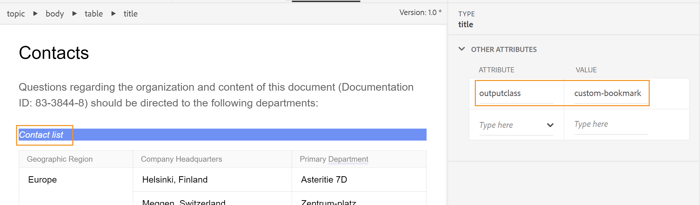

# PDF出力にカスタムブックマークを追加する

一般的に、DITA マップの目次は、選択すると目次ページが開く&#x200B;**目次** タイトルを含む、最終的なPDF出力のブックマークとしてレプリケートされます。 この目次は、DITA マップのトピックタイトルまたはセクションタイトルから作成されます。

PDF出力の特定のコンテンツにカスタムブックマークを追加して、簡単に操作できるようにしたい場合があります。 これは、要素に`outputclass`属性を追加し、それに次の属性を適用することで実現できます。

`bookmark-level: 3`

ここでは、`bookmark-level`は属性で、数値`3`はブックマークが追加されたブックマーク階層のレベルを示す値です。 次の例では、最初のレベルのトピック「連絡先」には、値`custom-bookmark`を持つ`outputclass`属性が追加されたテーブル「連絡先リスト」があります。




CSS ファイルに`custom-bookmark` クラスの次の定義が追加されます。

```css
…
/*Adding a custom bookmark*/
.custom-bookmark{
    bookmark-level: 2
}
…
```

PDF出力では、次に示すように、*コンタクトリスト* テーブルがPDFのブックマークリストの2番目のレベルに追加されます。

 {width="300"}

>[!NOTE]
>
>カスタムブックマークが追加される正しいレベルを選択する必要があります。 親トピックのブックマークより小さい数値を指定すると、カスタムブックマークは親ブックマークの位置を取り、他のすべてのブックマークは子として表示されます。 これにより、予期しないブックマーク構造になる可能性があります。

**PDF出力ブックマークからコンテンツ タイトルを削除しています**

PDF出力に&#x200B;**Contents** タイトルを含めたくない場合は、`<h1>`要素ではなく`<p>`要素に&#x200B;**Contents**&#x200B;を配置して削除できます。

ブックマークからコンテンツのタイトルを削除する手順は次のとおりです。

1. PDF出力に使用しているPDF テンプレートを開きます。
2. **ページレイアウト**&#x200B;内の&#x200B;**目次ページ**&#x200B;を開きます。
目次ページが右側に表示されます。
3. **Source** モードに切り替え、コンテンツが配置されているエレメントを`<h1>`から`<p>`に変更します。

変更前：

```
<h1 class="toc-title">Contents</h1>
```

変更後：

```
<p class="toc-title">Contents</p>
```

変更を保存し、出力を再生成します。


