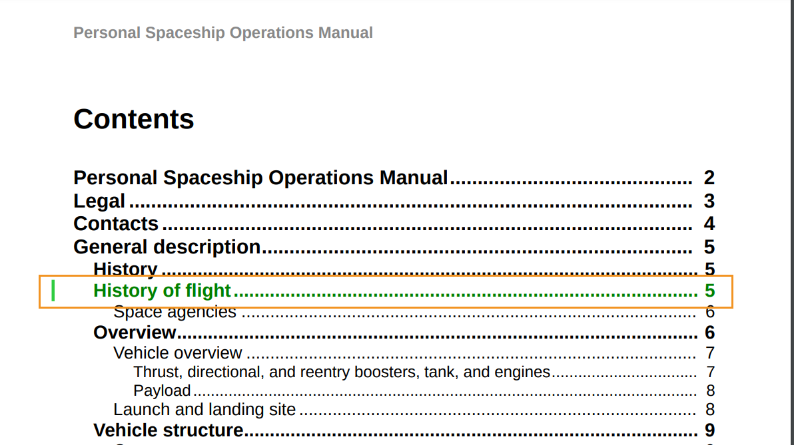

# カスタム変更バーのスタイルを使用する

変更バーは、新しいコンテンツや改訂されたコンテンツを視覚的に識別する縦線です。 AEM Guidesでは、トピック内の変更済みコンテンツの左側に変更バーを表示できるほか、PDF出力の目次に変更されたトピックを表示することもできます。

変更バーの表示について詳しくは、[Publish PDF出力の *公開済みバージョン間で変更バーを使用してPDFを作成* 設定 ](../web-editor/native-pdf-web-editor.md) を参照してください。

## トピック内の変更されたコンテンツ

変更バーは、挿入、変更、または削除されたトピックのコンテンツの左側に表示されます。

次のスタイルを変更して、変更されたコンテンツを表示したり、変更バーと共にコンテンツ間を表示したりできます。


>[!NOTE]
>
>これらのスタイルはファイル `layout.css` 一部であり、必要に応じて編集できます。

例えば、`.inserted-block` スタイルのカラー属性を使用して、挿入したコンテンツが公開済みPDF出力にどのように表示されるかを定義できます。


```css
...
.inserted-block { 
  color: #2ECC40; 
  display: inline; 
  -ro-comment-content: " "; 
  -ro-comment-style: underline; 
  -ro-comment-title: "Inserted"; 
  -ro-comment-date: attr(data-time); 
  -ro-comment-dateformat: "yyyy/dd/MM HH:mm:ss"; 
} 
...
```

同様に、`.deleted-block` スタイルを使用して、削除したコンテンツが公開済みPDF出力にどのように表示されるかを定義できます。

```css
...
.deleted-block { 
  display: inline; 
  color: #FF6961; 
  text-decoration: line-through; 
  -ro-comment-content: " "; 
  -ro-comment-style: strikeout; 
  -ro-comment-title: "Deleted"; 
  -ro-comment-date: attr(data-time); 
  -ro-comment-dateformat: "yyyy/dd/MM HH:mm:ss"; 
} 
...
```

`.inserted-change-bar` と `.deleted-change-bar` スタイルを使用して、更新されたコンテンツの左側に表示される変更バーの外観を変更できます。

例えば、スタイルで `-ro-change-bar-color` 属性 `.inserted-change-bar` 使用して、挿入した変更バーを緑色で表示できます。 スタイルで属性 `-ro-change-bar-color` 使用して、削除 `.deleted-change-bar` た変更バーを赤で表示することもできます。

```css
...
.inserted-change-bar { 
  -ro-change-bar-color: #2ECC40; 
} 

.deleted-change-bar { 
  -ro-change-bar-color: #FF6961; 
  } 
...
```


## 目次（TOC）のトピックを変更しました

PDF出力の目次に、変更されたトピックの左側に変更バーを追加することもできます。 `.changed-topic` スタイルで `-ro-change-bar-color` 属性を使用して、目次リストの更新されたトピックに選択した色の変更バーを追加できます。

例えば、緑色の変更バーを追加できます。

```css
...
.changed-topic { 
 -ro-change-bar-color: #2ECC40; 
}  
...
```


これにより、更新が完了した TOC のすべてのトピックに対して緑色の変更バーが表示されます。 目次で変更されたトピックをクリックすると、詳細な変更を表示できます。


