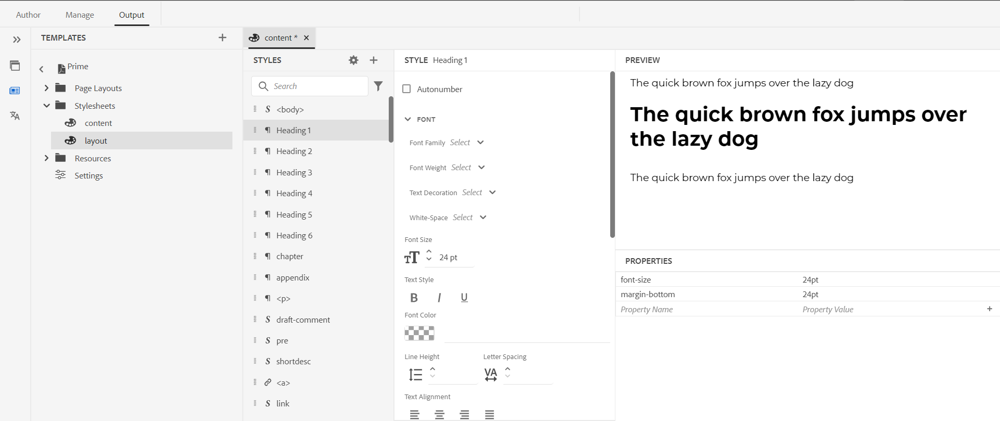
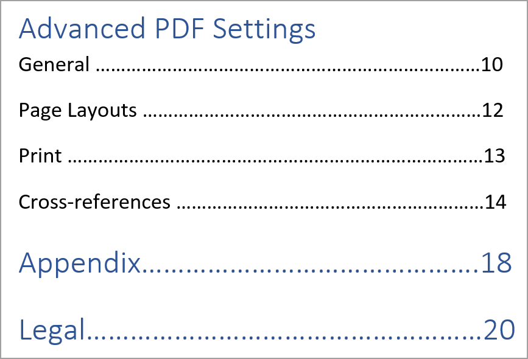

# PDF テンプレートのコンポーネント {#components-pdf-template}

PDF テンプレートには、ページレイアウト、スタイルシート、リソース、設定の 4 つのコンポーネントがあります。 PDF出力の生成時に、これらの個々のコンポーネントをカスタマイズし、テンプレートを出力プリセットに関連付けることで、テンプレートを作成できます。 以下の節では、これらのコンポーネントとそのカスタマイズプロセスについて詳しく説明します。

## ページレイアウトの作成とカスタマイズ {#create-customize-page-layout}

ページレイアウト コンポーネントの設定を使用すると、ページのヘッダー、フッター、コンテンツ領域を定義して、ページの構造をデザインできます。 WYSIWYGのページレイアウトエディターを使用すると、表紙や裏表紙、チャプター、表など、PDFの様々なセクションのページレイアウトを作成できます
目次（TOC）、索引、空白ページ、フロント・マターページ、バック・マターページ、図のリスト（LOF）、表のリスト（LOT）、用語集、カスタム・ページのレイアウトの作成 PDF テンプレート設定では、PDF内の異なるセクションを持つページレイアウトを割り当て、それを使用してPDF出力を生成できます。

### 新しいページレイアウトの作成 {#create-page-layout}

>[!NOTE]
>
>初期状態で出荷されているサンプルページレイアウトがあります。 これらをカスタマイズすることも、新しいページレイアウトを作成することもできます。

1. Web エディターで、「**出力**」タブに移動します。
1. 左側のサイドバーを展開し、「**テンプレート**」をクリックします。
1. 使用するテンプレートを開きます。

   >[!NOTE]
   >
   >テンプレートを開くには、名前をダブルクリックするか、名前の横にある > アイコンをクリックします。

1. 新しいページレイアウトを作成するには、次のいずれかの操作を行います。

   * **ページレイアウト** にポインタを合わせ、（*オプション* アイコン） **...** をクリックして **新規ページレイアウト** を選択します。

   * **テンプレート** パネルで、**テンプレート** の横にある **+** アイコンをクリックし、コンテキストメニューから **ページレイアウト** を選択します。

     **レイアウトを追加** ダイアログが開きます。

     

1. 新しいページレイアウトの名前を指定します。
   >[!NOTE]
   >
   >ページレイアウトに名前を付ける際は、特殊文字を使用しないでください。 名前に含まれるスペースは、アンダースコア「_」に置き換えられます。

1. 「**完了**」をクリックします。

   新しいレイアウトが作成され、「ページレイアウト」に追加されます。

### ページレイアウトの複製 {#duplicate-page-layout}

1. 複製するテンプレートの **テンプレート** セクションで、**ページレイアウト** をダブルクリックするか **&#x200B;**&#x200B;ページレイアウト **の前の**> ページレイアウトアイコンをクリックします。

   テンプレート内のページレイアウトのリストが表示されます。

1. 複製するページレイアウトにポインタを合わせて、（*オプション* アイコン） **...** をクリックし、コンテキストメニューから **複製** を選択します。

1. _レイアウトを複製_ ダイアログで、ページレイアウトの名前を入力します。

1. 「**完了**」をクリックします。
選択したページレイアウトのコピーが作成され、「ページレイアウト」に追加されます。

### ページレイアウトのカスタマイズ {#customize-page-layout}

1. 編集するテンプレートの [**テンプレート**] セクションで、&lbrack; ページレイアウト **をダブルクリックするか**&#x200B;**ページレイアウト** の前の **>** アイコンをクリックします。

   テンプレート内のページレイアウトのリストが表示されます。
1. ページレイアウトをカスタマイズするには、次のいずれかの操作を行います。
   * 任意のページレイアウトをダブルクリックします。
   * 任意のページレイアウトにポインタを合わせ、（*オプション* アイコン） **...** をクリックし、コンテキストメニューから **編集** を選択します。

   これにより、カスタマイズ用のページレイアウトエディターが開きます。
1. 必要な変更を加えたら、「*すべて保存* （または `Crl+S`）をクリックします。

   ヘッダー、フッター、ページ番号、タイトルなどの個々のレイアウト要素の定義について詳しくは、[&#x200B; ページレイアウトのデザイン &#x200B;](design-page-layout.md) を参照してください。

## スタイルシートを使用したPDFのカスタマイズ {#stylesheet-customization}

スタイルシートコンポーネントの設定では、WYSIWYG エディタを使用して、または CSS ファイルを直接操作して、ページレイアウトコンポーネントおよび DITA コンテンツのスタイルを設定できます。 独自のスタイルを作成したり、デフォルトのスタイルプロパティをカスタマイズしたりできます。 WYSIWYGエディタを使用すると、ページレイアウトや DITA コンテンツのスタイル設定に必要なプロパティのほとんどにアクセスできます。 高度なカスタマイズの場合は、Source ビューで直接作業できます。

### 新しいスタイルシートの作成 {#create-stylesheet}

CSS ファイルはコンテンツとレイアウト用に提供されますが、新しいスタイルシートを作成して、特定のスタイルタイプに複数のカスタマイズを適用して、ターゲットコンポーネントに適用することができます。 デフォルトでは、サンプル CSS ファイルは製品内にバンドルされています。 これらの CSS ファイルは、コンテンツやレイアウトをまたいでスタイル設定情報を整理するのに役立ちます。 これらのスタイルを 1 つまたは複数の CSS ファイルに結合するように選択できます。

デフォルトでは、新しいページレイアウトを作成するたびに、`layout.css` ファイルが新しいページレイアウトに含まれます。 ページレイアウトに別の CSS ファイルからのスタイルを含める場合は、目的の CSS ファイルを新しいページレイアウトのコンテンツ編集領域にドラッグ&amp;ドロップするだけで済みます。 CSS ファイルがページレイアウトに埋め込まれているかどうかを検証するには、Source ビューに切り替えると、`<head>` 要素に CSS ファイルへのリンクが表示されます。

スタイルシートを作成するには、次の手順に従います。
1. **テンプレート** パネルで、次のいずれかの操作を行います。
   * 「**スタイルシート**」タブにマウスポインターを置き、「*オプション*」アイコン **「。..**」をクリックして、「**新規スタイルシート**」を選択します。
   * **テンプレート** の横にある **+** アイコンをクリックし、コンテキストメニューから **スタイルシート** を選択します。

   スタイルシートを追加ダイアログが開きます。

   
1. 新規スタイルシートの名前を指定します。
1. 「**完了**」をクリックします。

   新しいスタイルシートが作成され、「スタイルシート」セクションに追加されます。

### 新しいスタイルの作成 {#create-style}

テンプレートに付属する CSS ファイルには、デフォルトで、見出し、段落、文字、ハイパーリンク、画像、表、div、ページなどのスタイルが含まれています。 デフォルトのスタイル形式を上書きするか、新しいスタイルを作成できます。

新しいスタイルを作成してテンプレートのページレイアウトで使用したり、任意の DITA 要素にカスタムスタイルを適用したりできます。 これらのカスタムスタイルを DITA エレメントに適用するには、スタイルのクラス名が DITA エレメントの名前または `outputclass` 属性と同じであることを確認する必要があります。  例えば、DITA の `
` は、CSS の `.div {}` またはその `outputclass` 属性によって管理されます。 DITA で `
` を適用する場合は、CSS の `.div {}` または `.my-div {}` によって管理されます。

新しいスタイルを作成するには、次の手順に従います。
1. 左側のサイドバーを展開して、スタイルを作成するテンプレートをダブルクリックします。
1. 「**スタイルシート**」セクションを展開します。 すべてのスタイルオプションを含む **スタイル** パネルが開きます。
1. 「+」アイコンを選択して、新しいスタイルを追加します。

   **スタイルを追加** ダイアログボックスが開きます。

   

1. **クラス** 名を指定します。 スタイルを DITA エレメントに適用するには、スタイルのクラス名が DITA エレメントの名前または `outputclass` 属性と同じであることを確認します。
1. **タグ** フィールド（オプション）で、新しいスタイルを作成するタグを選択します。

1. 要素のスタイルを設定する **疑似クラス** を選択します。 疑似クラスは、要素の特別な状態を定義するのに役立ちます。 例えば、疑似クラスを使用して、マウスを要素の上に置いたり、要素にフォーカスを合わせたりすると、要素のスタイルを設定できます。 複数の疑似クラスを選択することもできます。 例えば、訪問したリンクのスタイルを設定するために、疑似クラス `a::visited {color: blue;}` を使用できます。

1. 新しいスタイルのセレクターを追加します。 **セレクター** フィールドを使用すると、クラス、タグ、疑似クラスの組み合わせ以外のカスタムセレクターを追加できます。 例えば、テーブル内のすべて `table a.link` ハイパーリンクにスタイルを作成できます。

   CSS タグについて詳しくは、[CSS スタイル文法を参照 &#x200B;](https://www.w3.org/TR/CSS21/syndata.html#characters) を参照してください。

1. 「**完了**」をクリックします。

   新しいスタイルが作成され、スタイル リストに追加されます。

### 定義済みスタイルまたは新しいスタイルのカスタマイズ {#customize-style}

デフォルトのスタイルを使用して新しい CSS ファイルを作成した後、または既存の CSS ファイルのスタイルをカスタマイズする場合は、スタイルエディターを使用します。

スタイルをカスタマイズするには、次の手順に従います。
1. 「スタイルシート **」をダブルクリックするか** 「スタイルシート **」の前の「**>**」アイコンをクリック** ます。

   デフォルト（コンテンツとレイアウト）の CSS ファイルとカスタムの CSS ファイルが表示されます。
1. 編集用のスタイルシートを開きます。

   編集用にスタイルシートを開くには、次のいずれかの操作を行います。
   * スタイルシート名をダブルクリックします。
   * スタイルシート名の上にマウスポインターを置き、（「オプション」アイコン） ...をクリックして、「編集」を選択します。

   これにより、編集用のスタイルシートが開き、「スタイル」パネルにスタイルのリストが表示されます。

   

1. スタイルをカスタマイズするには、表示するスタイルを選択し、スタイルエディターを使用してカスタマイズします。

### スタイルのプロパティ

中央のパネルではプロパティを編集できますが、すべての値が存在するスナップショットを取得するのは難しい場合があります。  **プロパティ** ペインには、スタイルのすべての属性と値のクイックビューが表示されます。

中央のパネルでは、よく使用されるプロパティを編集できますが、CSS がサポートするすべてのプロパティを編集できるわけではありません。 **プロパティ** ペインでは、CSS がサポートするすべてのプロパティを編集し、プレビューできます。 プロパティを編集する場合は、ソースビューに切り替える必要はありません。

スタイルエディターを使用して [&#x200B; 共通コンテンツスタイルの操作 &#x200B;](stylesheet.md) を行う方法について説明します。

## リソースの操作 {#work-with-resources}

これは、テンプレートのデザインに使用するすべてのアセットのコンテナです。 背景画像、カスタムフォント、ロゴなどのアセットを含むフォルダーと考えることができます。 テンプレートにアセットを追加すると、そのアセットはアセットフォルダーにアップロードまたはチェックインされます。 その後、これらのアセットを使用して、PDF テンプレートをカスタマイズまたはデザインできます。

アセットファイルをリソースフォルダーに追加するには、次の手順に従います。

1. リソースフォルダータブにマウスポインターを置き、（オプションアイコン） ...をクリックして、「読み込み」を選択します。

   Assetsをアップロード ダイアログが開きます。

   

   アセットファイルがアップロードされるパスは、「**アセットフォルダーを選択**」フィールドに表示されます。
   >[!NOTE]
   >
   >アセットのアップロード用パスは変更できません。 デフォルトでは、すべてのアセットが `/content/dam/dita-templates/pdf/<PDF-template-name>` フォルダーに保存されます。

1. **ファイルを選択** をクリックして、ローカルマシンからアセットファイルを参照します

1. **アップロード** をクリックします。
選択したファイルが読み込まれ、リソース フォルダーに一覧表示されます。

## PDFの詳細設定 {#advanced-pdf-settings}

「設定」セクションでは、PDFのページレイアウトの詳細設定、奇数ページまたは偶数ページからPDFを開始する方法、相互参照の書式および生成される最終的なPDFでのトンボの有効化を行うことができます
テンプレートの使用。

>
>
> Experience Manager Guides 5.0/2025.02.0 リリース以降、PDFの詳細設定の **印刷** セクションが **出力プリセット** パネルに移動されました。 印刷を設定するには、[PDF出力を公開 &#x200B;](../web-editor/native-pdf-web-editor.md#print) を表示します。

設定するには、**テンプレート** パネルの **設定** をクリックして、次のオプションを表示します。

### 一般

奇数ページまたは偶数ページからチャプターを開始するための基本設定、目次の構造を設定し、目次エントリの引出線の形式を定義します。 次の設定を定義できます。

* **新規チャプターの開始元**：最終的なPDFでの各チャプターの公開方法を定義できます。 「**新規ページ**」、「**奇数ページ**」、「**偶数ページ**」、「**現在のページ**」の各オプションから選択できます。 奇数ページから新しいチャプターを開始する場合は、奇数ページで終わるチャプターの後に空白ページが挿入されます。 例えば、チャプターがページ番号 15 で終了する場合、公開プロセスによって 16 目の空白のページが挿入されるので 17 目のページから新しいチャプターを開始でき  す。  「**現在のページ**」オプションを選択すると、すべてのチャプターが連続して公開され、改ページは一切行われません。 例えば、チャプターが 15 ページの途中で終了する場合、次のチャプターも 15 ページ目から開始されます。

* **各トピックを新しいページから開始**：チャプター内の各トピックを新しいページから開始する場合は、「**各トピックを新しいページから開始**」オプションを選択します。 ページに空白を挿入せずにトピックの続きを保持する場合は、このオプションの選択を解除します。

* **目次の構造**：目次の階層をカスタマイズできます。 次の追加設定を使用します。

   * **見出しをレベルまで使用**:PDFの目次に表示する見出しレベルの数を調整できます。
   * **目次の最初のレベルのページ番号を表示しない**：ネストされたトピックまたは子トピックを含むすべてのチャプターの対応するページ番号を非表示にするには、このオプションを選択します。 次の例について考えてみます。このオプションを選択せずに出力を作成する場合を考えてみましょう。

  

  上記の例では、高度なPDF設定、付録、法的事項が最初のレベルのトピックの見出しまたは章のタイトルです。 これらの見出しすべてにページ番号が割り当てられます。

  このオプションを選択して出力を生成すると、次の目次が得られます。

  

  ここで、最初の章のPDFの詳細設定では、ネストされたトピックまたは子トピックがあるので、ページ番号が指定されていないことを確認できます。 一方、ページ番号は、付録とリーガルに割り当てられている場合は、子トピックのないスタンドアロントピックであるためです。

* **目次にチャプター番号を表示しない**：目次にチャプター番号を含めないチャプター名を表示する場合は、このオプションを選択します。   デフォルトでは、章番号はPDF出力の目次に表示されます。
* **引出線形式**：ドロップダウンを使用して、点線、実線、またはスペースの引出線を選択し、見出しレベルを対応するページ番号に接続します。
目次の構造とスタイル設定の見出しレベルを適用するには、[&#x200B; チャプター目次の追加 &#x200B;](design-page-layout.md#add-chapter-toc) を参照してください。

  >[!NOTE]
  >
  >CSS 開発者の場合は、CSS ファイルで直接リーダー形式を定義することもできます。

* **テーブル継続マーカーを使用**：複数のページに広がる長いテーブルのマーカーを定義する場合は、このオプションを選択します。
区切りの前後に表示するテキストを定義できます。 例えば、テーブルが 5 ページ目で区切られる場合は、「区切り前のテキスト **に `<Continued on page %page-num%>` を定義し** す。  テキストは、ページ 5 の下部に「6 ページに続く」と表示されます。

  言語変数を使用して、区切りの前後の継続マーカーテキストを定義します。 選択した言語に応じて、ローカライズされた値がPDF出力で自動的に選択されます。 例えば、`Continued on page %page-num%` をテキストとして英語で、`Fortsetzung auf Seite %page-num%` をドイツ語で公開できます。

  カーソルを合わせる 詳細を表示するには、オプションの近くを  リックします。
* **用語集の用語を用語集ページにリンク**：用語集の用語をコンテンツ内のハイパーリンクとして表示し、用語集ページの用語にリンクさせるには、このオプションを選択します。 これにより、読者は用語集で定義されている用語の定義をすばやく確認できます。

  用語集の用語をハイパーリンクに変換するには、次の操作が必要です。
   * DITA マップの「**ページレイアウトの順序**」タブで **用語集** を有効にします。
   * ブックマップのバックマターページに用語集を追加します。

  用語集ページを有効にしない場合、コンテンツ内の用語集の用語はPDF出力でハイパーリンクに変換されません。
  <!--For more information on using table continuation markers, see Use table continuation markers.-->

### ページレイアウト {#page-layouts}

ページレイアウト設定を使用すると、ドキュメントの特定のセクションに使用するページレイアウトを完全に制御できます。 例えば、目次のレイアウトを選択するには、「目次」フィールドの下のドロップダウンメニューをクリックし、目次を生成するためにデザインしたレイアウトを選択します。

ブックマップの設定は、ページレイアウトの設定よりも優先されることに注意してください。

「ページレイアウト」セクションでは、次の設定を使用できます。

**デフォルトのページレイアウト**:PDFのすべてのページのデフォルトのレイアウトとして機能するページレイアウトを選択します。 これは、専用のページレイアウトを作成していないセクションやトピックに適用される基本ページレイアウトです。

**様々なセクションのページレイアウト**:PDF出力の次のセクションで、ページレイアウトをマッピングできます。 関連セクションのページレイアウトをデザインした場合は、ドロップダウンリストから選択します。 特定のセクションに対してページレイアウトが作成されていない場合は、デフォルトのページレイアウトが適用されます。

* **チャプターとトピック**：チャプターとトピックのページレイアウトを指定できます。 選択したレイアウトが、すべてのチャプターとトピックに適用されます。

* **目次**：目次ページレイアウトをデザインした場合は、ドロップダウンリストで **目次** を選択すると、ドキュメント内のすべての目次ページに目次ページレイアウトが表示されます。

* **図表目次**：図や表のページレイアウトを指定することもできます。 選択したレイアウトは、すべての図と表に適用されます。

* **インデックス**：インデックスページレイアウトをデザインした場合は、それをインデックスオプションにマッピングします。 スタイルシートを使用すると、PDF出力内の様々なインデックス要素のスタイルを設定できます。 インデックスのスタイル `.idx-header`、`.idx-footer`、`.idx-body`、`.idx-title`、`.idx-keyword-group`、`.idx-unit`、`.idx-keyword`、`.idx-name`、`.idx-link` および `.idx-child` を使用して、インデックスの要素のスタイルをカスタマイズします。

* **用語集**：用語集ページレイアウトがある場合は、用語集オプションにマッピングします。

  PDF出力の用語集に記載されている用語は、常にアルファベット順に並べ替えられています。

  また、タグ `sort-as` を追加して、用語集の用語の並べ替えキーを定義することもできます。 Experience Manager Guidesは、ソートキーを使用して、用語集の用語の代わりに用語集の用語を並べ替えます。 並べ替えキーを定義していない場合、並べ替えに用語集の用語を使用します。 例えば、タグ `sort-as` を `glossterm` に追加して、「USB」という用語の値を `A` に設定できます（例：`<glossterm>USB<sort-as>A</sort-as></glossterm>`）。 同様に、タグ `sort-as` 追加し、その値を「ペンドライブ」という用語の `B` に設定できます。 これらの用語集の用語を並べ替えると、用語集の用語「USB」の並べ替えキー `A` が、用語集の用語「Pen Drive」の並べ替えキー `B` の前に表示されます。 そのため、PDFの出力では、「USB」が用語集ページの「Pen Drive」の前に表示されます。

  スタイルシートを使用して、PDF出力のさまざまな用語集要素のスタイルを設定できます。 用語集の要素のスタイルをカスタマイズするには、用語集スタイル `.glo-header`、`.glo-footer`、`.glo-body`、`.glo-title`、`.glo-unit`、`.glo-link`、`.glo-term` を使用します。

  スタイルエディターを使用して [&#x200B; 共通コンテンツスタイルの操作 &#x200B;](stylesheet.md) を行う方法について説明します。

* **最前面の問題ページと背面の問題ページ**：これらのページレイアウトは、ブックの前面または背面の問題ページのスタイルを定義します。 フロント・マターのレイアウトを設計した場合は、「フロント・マター・ページ **オプションにマッピングし** す。 ドロップダウンからフロント・マター・レイアウトを選択すると、フロント・マターに存在するすべてのトピックにフロント・マターのレイアウトが適用されます。

  重要事項のレイアウトをデザインした場合は、「重要事項の背面ページ **オプションにマッピン** します。 ドロップダウンから重要事項のレイアウトを選択すると、重要事項に存在するすべてのトピックに重要事項のレイアウトが適用されます。

  **フロントマターページ** は、**TOC**、**図のリスト** およびテーブルのリストのフォールバックレイアウトとしても使用されます。  同様に、**バックマターページ** は、**インデックス** および **用語集** レイアウトのフォールバックレイアウトとしても使用されます。 これらに対するレイアウトを選択していない場合、選択した前面または背面の問題ページのレイアウトが適用されます。  前面または背面の重要ページのレイアウトを選択していない場合、デフォルトのページレイアウトが適用されます。

* **空のページのページレイアウト**:    また、空のページのページレイアウトを指定することもできます。 選択したレイアウトが、すべての空のページに適用されます。 例えば、すべての空のページに対して空白ページのレイアウトをデザインした場合、ドロップダウンリストで「**空白**」を選択すると、ドキュメント内のすべての空のページに空白ページのレイアウトが表示されます。

* **表紙と裏面**：表紙レイアウトをデザインした場合は、それを「**表紙**」オプションにマッピングします。 同様に、バックページレイアウトがある場合は、それを「**バックページ**」オプションにマッピングします。 表紙または裏表紙のレイアウトが作成されていない場合、デフォルトのページレイアウトが適用されます。

ページレイアウトの詳細については、[&#x200B; ページレイアウトのデザイン &#x200B;](design-page-layout.md) を参照してください。

### ページレイアウトの順序 {#page-order}

PDFの以下のセクションの表示/非表示を切り替えたり、最終的なPDF出力で表示する順序を調整したりできます。

* 目次
* チャプターとトピック
* 図のリスト
* テーブルのリスト
* 索引
* 用語集
* 引用

  

  PDF出力の特定のセクションを表示しない場合は、切り替えスイッチをオフにして、非表示にできます。

  また、PDFでこれらの様々なセクションを生成する順序を定義することもできます。 これらのセクションのデフォルトの順序を変更するには、点線バーを選択して、セクションを目的の場所にドラッグ&amp;ドロップします。

  >[!NOTE]
  >
  > 順序と包含の設定は、DITA マップにのみ適用されます。 ブックマップの場合、これらの設定は適用されません。 ブックマップ内のページは、ブックマップ内のセクションの順序に従って表示されます。

。
**チャプターとトピック** レイアウトは、デフォルトで常に有効になっています。 切り替えることはできません。

**ページの結合**

デフォルトでは、すべてのセクションは新しいページから始まります。 **結合** ドロップダウンから「**前のページ**」または「**次のページ**」オプションを選択して、セクションを前のページまたは次のページと結合します。 これにより、PDF出力で選択したページに続くセクションが公開されます。 これにより、中間に改ページがなくなります。

>[!NOTE]
>
> この設定はセクションにのみ適用され、そのコンポーネントには適用されません。  例えば、「章とトピック **」に対して「**&#x200B;**前のページ**」オプションを選択すると、「**章とトピック**」セクションが前のページと結合されます。 **一般** の設定に従って、さまざまなチャプターおよびトピックが発行されます。たとえば、「**新しいチャプターを設定から開始**」で **奇数ページ** を選択した場合、奇数ページで終わるチャプターの後に空白ページが挿入されます。

セクションを前のページまたは次のページに結合すると、コンテンツが結合され、コンテンツが結合されるターゲットセクションのスタイルが適用されます。

例えば、**目次** と **チャプターとトピック** を有効にして、**目次** に対して **次のページ** を選択すると、**目次** は、次のセクション（**チャプターとトピック**）に結合されます。 **チャプターとトピック** セクションのスタイルは、両方のセクションの結合コンテンツに適用されます。

結合オプションは順番に機能するので、連続した複数のセクションに対して **次のページ** を選択した場合、すべてのセクションはこのプロパティが設定されていない最初のセクション（次の方向）に結合されます。 例えば、「**目次**」、「**チャプターとトピック**」、「**図のリスト**」、「**インデックス**」を有効にします。 次に、**目次**、**&#x200B;** チャプターとトピック **、** 図のリスト **、** インデックス **に** 次のページ **&#x200B;**&#x200B;を設定すると、それらはすべて **インデックス** に結合されます。

**静的ページ**

様々なページレイアウトを使用して、様々なセクションの出力をデザインできます。 これらのセクションは、出力の公開時に DITA マップから生成されます。
カスタムページレイアウトを作成して、PDF出力で静的ページとして公開することもできます。 これにより、メモや空白のページなどの静的コンテンツを追加できます。

カスタムページレイアウトを追加するには、次の手順を実行します。

1. **追加** を選択して、新しいページレイアウトを追加します。 ページレイアウトパネルを追加が開きます。
2. リストからページレイアウトを選択し、「追加」をクリックします。 新しいページレイアウトがページレイアウトのリストに追加されます。

また、次のアクションも実行できます。

* 点線バーを選択して、ページレイアウトを目的の場所にドラッグ&amp;ドロップします。

* **レイアウトを削除** を選択して、レイアウトを削除します。

* 静的なページを前のページや次のページに結合することもできます。

* また、カスタムレイアウトを複数回追加して、並べ替えることもできます。 これにより、静的コンテンツを適切に公開できます。

  例えば、カスタムレイアウトを使用して、PDFの出力内で静的警告を複数回公開できます。

### ページ組織

PDF文書のページは、通常、DITA マップまたはブックマップファイルに編成されたコンテンツに従って公開されます。 ただし、PDF ドキュメント内のページの順序を変更することもできます。 例えば、複数ページのドキュメントを小冊子として印刷することができます。 シートを丁合、折り、ホチキス止めすると、正しいページ順を持つ 1 冊の本が作成されます。  その後、出版された小冊子を本のように読むことができます。

「**ページ組織**」セクションでは、次の設定を使用できます。

#### ページの順序

PDF ドキュメント内のページの順序を決定するページ順を選択します。 ドロップダウンから次のオプションを選択できます。

* **デフォルト**：ソースファイルごとのページのデフォルトの順序。
* **奇数ページから始める**：奇数ページはすべて偶数ページより先に移動されます。
* **最初に偶数ページ**：すべての偶数ページが奇数ページよりも先に移動されます。
* **反転**：ページの順序が反転されます。
* **小冊子**：すべてのページが小冊子のように並べ替えられます。
* **右から左の小冊子**：すべてのページが右から左の小冊子の順序になります。
* **カスタム**：定義済みの順序ではなく、ページのカスタム順序を定義します。
   * ア・・・b&quot; — a から b までのすべての連続ページ。
   * 「a,b,c」 – 新しいページの順序 a、b、c。
   * 「a*b」 – ページ a を b 回繰り返します。
   * 「– a」 – 負のページ番号は、最後のページから始まって後方にカウントされ、他のカスタム注文と組み合わせることができます。
   * 「X」 – ドキュメントのすべてのページ。 「1..-1&quot;.

例えば、「2,3,5*2,7..10,-1,-2」のようなカスタム順序を指定できます。
指定したページの順序では、元の文書の次のページ番号を持つPDFになります。この場合、合計 25 ページであるとすると、2、3、5、5、7、8、9、10、25、24 です。

#### シートごとに複数のページを設定する

1 枚の用紙に複数のページを発行する場合は、このオプションを選択します。  次に、行数と列数を選択し、グリッドのように 1 枚のシートにページを公開します。 例えば、ページを 2 行 4 列のグリッドとして公開できます。

ターゲットシートサイズと、シートのパブリッシュ方向を定義します。 また、シートの余白とパディングのプロパティを指定することもできます。

### 相互参照 {#cross-references}

「**相互参照**」タブを使用して、相互参照をPDFに公開する方法を定義します。 トピックのタイトル、表、図などの相互参照を書式設定できます。

>[!NOTE]
>
> 相互参照を挿入する際にリンクテキストを定義した場合は、ネイティブのPDF テンプレートで定義されている相互参照フォーマットよりも優先されます。

変数を使用して相互参照を定義することもできます。  変数を使用すると、その値がプロパティから選択されます。 1 つまたは複数の変数を使用して、相互参照を定義できます。 文字列と変数を組み合わせて使用することもできます。

例えば、`View details on {chapter}` を使用できます。 チャプター名が「一般設定」の場合、出力内の相互参照は「一般設定の詳細を表示」です。

AEM Guidesには、次の標準変数が用意されています。

* {title}: トピックのタイトルへの相互参照を作成します。 例えば、2 ページ目の「参考になるリンク」を参照してください。
* {page} ページ番号に相互参照を追加します。 例えば、1 ページ目のを参照してください。
* {description}：説明のテキストに相互参照を追加します。 例えば、AEM Guidesの詳細を参照してください。
* {chapter}：チャプター番号への相互参照を追加します。 たとえば、第 1 章のを参照してください。
* {bookmarkText}：ブックマークされたテキストへの相互参照を作成します。 例えば、5 ページ目の stop_words を参照してください。
* {captionText}: トピック内の図または表のキャプションへの相互参照を作成します。 たとえば、Page 2 の Airflow を参照してください。
* {figure}：図形番号に相互参照を追加します。 図形図表用に定義した自動番号スタイルから図形番号を選択します。  例えば、「ページ {page} で {figure} を確認」を使用できます。 出力の相互参照には、自動生成された図形番号とそのページ番号が含まれます。「5 ページの図 1 を参照」
* {table}：テーブル番号に相互参照を追加します。 キャプションに定義した自動番号スタイルからテーブル番号を選択します。 例えば、「ページ {page} で {table} を確認」を使用できます。 出力の相互参照には、自動生成されたテーブル番号とそのページ番号が含まれます（「5 ページのテーブル 1 を参照」）。

  >[!NOTE]
  >
  >キャプションタグとキャプションタグに自動番号スタイルを作成できます。

#### デフォルトの相互参照形式

このテキストフィールドを空白のままにし、相互参照を挿入する際にリンクテキストを定義しなかった場合、Experience Manager Guidesではそれぞれの相互参照に対して次の変数を追加します。

* **タイトル**: `{title}`
* **説明**: `{description}`
* **段落**:`{bookmarkText}`
* **ブックマーク**: `{bookmarkText}`
* **図**: `{captionText}`
* **テーブル**: `{captionText}`

相互参照の優先順位は次のとおりです。
* 相互参照に追加されたリンクテキスト
* ネイティブのPDF テンプレートで定義された相互参照形式
* デフォルトの相互参照形式

#### 相互参照の言語変数

また、言語変数を使用して、ローカライズされたクロスリファレンスを定義することもできます。 選択した言語に応じて、ローカライズされた値がPDF出力で自動的に選択されます。

例えば、言語変数「reference-label」を追加して、英語とドイツ語の値を定義できます。

* 英語 – &quot;View on page {page}&quot;
* ドイツ語 – 「Einzelheiten finden Sie auf der Seite {page}」

「段落」セクションに `${lng:<variable name>}` を追加すると、出力の段落内の相互参照には、ローカライズされたテキストとページ番号が含まれます。\
例えば、以下のスクリーンショットは、英語の「View on page 1」と、ドイツ語の「Einzelheiten finden Sie auf der Seite 1」の相互参照を示しています。

*英語で公開された場合の段落内の相互参照。*

*ドイツ語で公開された場合の段落内の相互参照。*

<!--For more information, see *Format cross-references*.-->
