# PDF テンプレートのコンポーネント {#components-pdf-template}

PDF テンプレートには、ページレイアウト、スタイルシート、リソース、設定の4つのコンポーネントがあります。 これらの個々のコンポーネントをカスタマイズし、PDF出力の生成時にテンプレートを出力プリセットに関連付けることで、テンプレートを作成できます。 以下の節では、これらのコンポーネントとそのカスタマイズプロセスについて詳しく説明します。

## ページレイアウトの作成とカスタマイズ {#create-customize-page-layout}

ページレイアウトコンポーネントの設定を使用すると、ページ上のヘッダー、フッター、コンテンツ領域を定義して、ページの構造をデザインできます。 WYSIWYG ページレイアウトエディターを使用すると、PDFの表紙や裏表紙、章、表など、様々なセクション用のページレイアウトを作成できます
目次（TOC）、索引、空白ページ、フロントマターページ、バックマターページ、図のリスト（LOF）、表のリスト（LOT）、用語集、またはカスタムページのレイアウトを作成します。 PDF テンプレート設定では、PDF内の様々なセクションにページレイアウトを割り当てて、PDF出力を生成するために使用できます。

### 新しいページレイアウトの作成 {#create-page-layout}

>[!NOTE]
>
>サンプルページレイアウトが用意されています。 これらをカスタマイズしたり、新しいページレイアウトを作成したりできます。

1. Web エディターで、「**出力**」タブに移動します。
1. 左側のサイドバーを展開し、**テンプレート**&#x200B;をクリックします。
1. 操作するテンプレートを開きます。

   >[!NOTE]
   >
   >テンプレートを開くには、名前をダブルクリックするか、名前の横にある「>」アイコンをクリックします。

1. 新しいページレイアウトを作成するには、次のいずれかの操作を行います。

   * **ページレイアウト**&#x200B;にカーソルを合わせ、（*オプション* アイコン） **...**&#x200B;をクリックし、**新しいページレイアウト**&#x200B;を選択します。

   * **テンプレート** パネルで、**テンプレート**&#x200B;の横にある&#x200B;**+** アイコンをクリックし、コンテキストメニューから&#x200B;**ページレイアウト**&#x200B;を選択します。

     これにより、**レイアウトを追加** ダイアログが開きます。

     

1. 新しいページレイアウトの名前を指定します。
   >[!NOTE]
   >
   >ページレイアウトの命名時に特殊文字を使用することは避けてください。 名前のスペースは、アンダースコア「_」に置き換えられます。

1. 「**完了**」をクリックします。

   新しいレイアウトが作成され、ページレイアウトの下に追加されます。

### ページレイアウトの複製 {#duplicate-page-layout}

1. 複製するテンプレートの&#x200B;**テンプレート** セクションで、**ページレイアウト**&#x200B;をダブルクリックするか、**ページレイアウト**&#x200B;の前にある&#x200B;**>** アイコンをクリックします。

   テンプレート内のページレイアウトのリストが表示されます。

1. 複製するページレイアウトにカーソルを合わせ、（*オプション* アイコン） **...**&#x200B;をクリックし、コンテキストメニューから「**複製**」を選択します。

1. _レイアウトを複製_ ダイアログで、ページレイアウトの名前を入力します。

1. 「**完了**」をクリックします。
選択したページレイアウトのコピーが作成され、ページレイアウトの下に追加されます。

### ページレイアウトのカスタマイズ {#customize-page-layout}

1. 編集するテンプレートの&#x200B;**テンプレート** セクションで、**ページレイアウト**&#x200B;をダブルクリックするか、**ページレイアウト**&#x200B;の前にある&#x200B;**>** アイコンをクリックします。

   テンプレート内のページレイアウトのリストが表示されます。
1. 任意のページレイアウトをカスタマイズするには、次のいずれかの操作を行います。
   * ページレイアウトをダブルクリックします。
   * 任意のページレイアウトにカーソルを合わせ、（*オプション* アイコン） **...**&#x200B;をクリックし、コンテキストメニューから&#x200B;**編集**&#x200B;を選択します。

   カスタマイズ用のページレイアウトエディターが開きます。
1. 必要な変更を行ったら、*すべて保存* （または`Crl+S`）をクリックします。

   ヘッダー、フッター、ページ番号、タイトルなどの個々のレイアウト要素の定義について詳しくは、[&#x200B; ページレイアウトのデザイン &#x200B;](design-page-layout.md)を参照してください。

## スタイルシートを使用したPDFのカスタマイズ {#stylesheet-customization}

「スタイルシート」コンポーネントの設定を使用すると、WYSIWYG エディターを使用するか、CSS ファイルを直接操作して、ページレイアウトコンポーネントとDITA コンテンツにスタイルを設定できます。 独自のスタイルを作成したり、デフォルトのスタイルプロパティをカスタマイズしたりできます。 WYSIWYG エディターでは、ページレイアウトやDITA コンテンツのスタイル設定に必要なほとんどのプロパティにアクセスできます。 高度なカスタマイズを行うには、Source ビューで直接作業します。

### 新しいスタイルシートの作成 {#create-stylesheet}

コンテンツとレイアウト用にCSS ファイルが用意されていますが、新しいスタイルシートを作成して、特定のスタイルタイプに複数のカスタマイズを適用し、ターゲットコンポーネントに適用することができます。 デフォルトでは、サンプル CSS ファイルは製品にバンドルされます。 これらのCSS ファイルは、コンテンツとレイアウト全体でスタイル情報を整理するのに役立ちます。 これらのスタイルを1つのCSS ファイルまたは複数のファイルに結合するように選択できます。

デフォルトでは、新しいページレイアウトを作成するたびに、`layout.css` ファイルが新しいページレイアウトに含まれます。 ページレイアウトに別のCSS ファイルのスタイルを含める場合は、目的のCSS ファイルを新しいページレイアウトのコンテンツ編集エリアにドラッグ&amp;ドロップするだけです。 CSS ファイルがページレイアウト内に埋め込まれているかどうかを検証するには、Source ビューに切り替えると、`<head>`要素にCSS ファイルへのリンクが表示されます。

スタイルシートを作成するには、次の手順に従います。
1. **テンプレート** パネルで、次のいずれかの操作を行います。
   * 「**スタイルシート**」タブにカーソルを合わせて、（*オプション* アイコン） **...**&#x200B;をクリックし、**新しいスタイルシート**&#x200B;を選択します。
   * **テンプレート**&#x200B;の横にある&#x200B;**+** アイコンをクリックし、コンテキストメニューから&#x200B;**スタイルシート**&#x200B;を選択します。

   「スタイルシートを追加」ダイアログが開きます。

   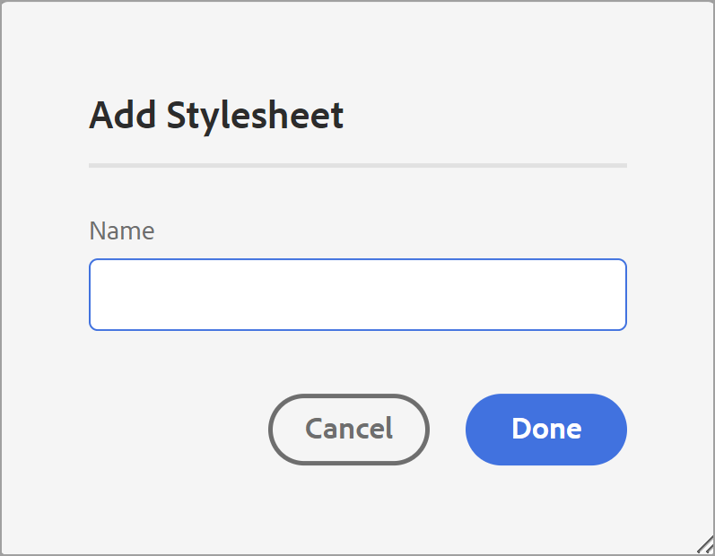
1. 新しいスタイルシートの名前を指定します。
1. 「**完了**」をクリックします。

   新しいスタイルシートが作成され、「スタイルシート」セクションの下に追加されます。

### 新しいスタイルを作成 {#create-style}

デフォルトでは、テンプレートに含まれるCSS ファイルには、見出し、段落、文字、ハイパーリンク、画像、表、div、ページなどのスタイルが含まれます。 デフォルトのスタイル形式を上書きしたり、新しいスタイルを作成したりできます。

新しいスタイルを作成して、テンプレートのページレイアウトで使用したり、任意のDITA要素にカスタムスタイルを適用したりできます。 これらのカスタムスタイルをDITA要素に適用するには、スタイルのクラス名がDITA要素の名前または`outputclass`属性と同じであることを確認する必要があります。  例えば、DITAの`
`は、CSSの`.div {}`またはその`outputclass`属性によって管理されます。 DITAで`
`を適用すると、CSSの`.div {}`または`.my-div {}`によって管理されます。

新しいスタイルを作成するには、次の手順に従います。
1. 左サイドバーを展開し、スタイルを作成するテンプレートをダブルクリックします。
1. 「**スタイルシート**」セクションを展開します。 すべてのスタイル設定オプションを含む&#x200B;**スタイル** パネルが開きます。
1. 「+」アイコンを選択して、新しいスタイルを追加します。

   **スタイルを追加** ダイアログボックスが開きます。

   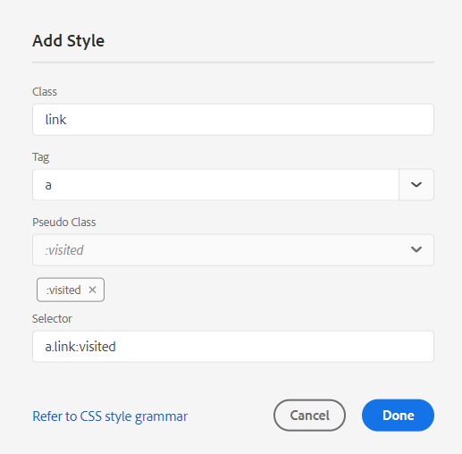

1. **クラス**&#x200B;名を指定してください。 DITA要素にスタイルを適用するには、スタイルのクラス名がDITA要素の名前または`outputclass`属性と同じであることを確認します。
1. 「**タグ**」フィールド（オプション）で、新しいスタイルを作成するタグを選択します。

1. 要素のスタイルを設定するには、**擬似クラス**&#x200B;を選択します。 擬似クラスは、要素の特別な状態を定義するのに役立ちます。 例えば、疑似クラスを使用して、要素にマウスポインターを置いたときや、その上にマウスポインターを置いたときに要素のスタイルを設定します。 複数の疑似クラスを選択することもできます。 例えば、疑似クラス `a::visited {color: blue;}`を使用して、訪問したリンクのスタイルを設定できます。

1. 新しいスタイルのセレクターを追加します。 「**セレクター**」フィールドを使用すると、クラス、タグ、擬似クラスの組み合わせ以外にもカスタムセレクターを追加できます。 例えば、テーブル内のすべてのハイパーリンクに`table a.link` スタイルを作成できます。

   CSS タグについて詳しくは、[CSS スタイルの文法](https://www.w3.org/TR/CSS21/syndata.html#characters)を参照してください。

1. 「**完了**」をクリックします。

   新しいスタイルが作成され、スタイルリストに追加されます。

### 定義済みのスタイルまたは新しいスタイルのカスタマイズ {#customize-style}

デフォルトスタイルを含む新しいCSS ファイルを作成した後、または既存のCSS ファイルでスタイルをカスタマイズする場合は、スタイルエディターを使用します。

スタイルをカスタマイズするには、次の手順に従います。
1. **スタイルシート**&#x200B;をダブルクリックするか、**スタイルシート**&#x200B;の前にある&#x200B;**>** アイコンをクリックします。

   これにより、デフォルト（コンテンツとレイアウト）とカスタム CSS ファイルが表示されます。
1. 編集のためにスタイルシートを開きます。

   編集のためにスタイルシートを開くには、次のいずれかの操作を行います。
   * スタイルシート名をダブルクリックします。
   * スタイルシート名にカーソルを合わせ、（オプションアイコン） ...をクリックし、「編集」を選択します。

   これにより、編集用のスタイルシートが開き、スタイルパネルにスタイルのリストが表示されます。

   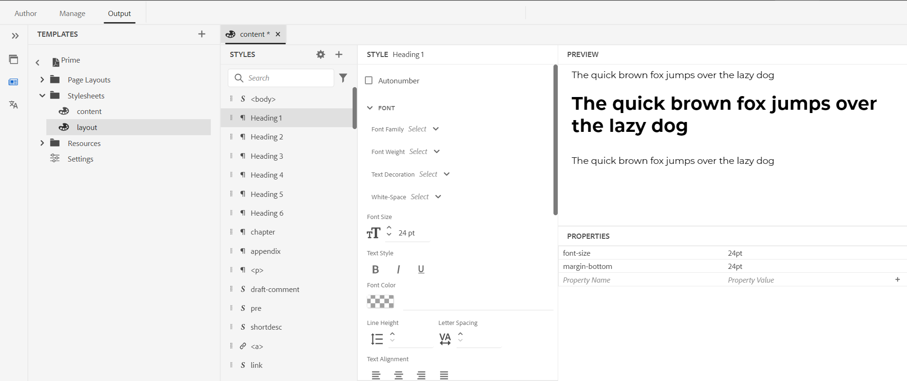

1. スタイルをカスタマイズするには、表示するスタイルを選択し、スタイルエディターを使用してカスタマイズします。

### スタイルのプロパティ

中央パネルでは、プロパティを編集できますが、すべての値が存在するスナップショットを取得するのは困難な場合があります。  **プロパティ** ペインでは、スタイルのすべての属性と値をすばやく表示できます。

中央パネルでは、一般的に使用されるプロパティを編集できますが、CSSがサポートするすべてのプロパティを編集することはできません。 **プロパティ** ペインでは、CSSがサポートするすべてのプロパティを編集し、プレビューできます。 プロパティを編集するためにソースビューに切り替える必要はありません。

スタイルエディターを使用して、一般的なコンテンツスタイルを[使用する方法について詳しく説明します](stylesheet.md)。

## リソースの操作 {#work-with-resources}

これは、テンプレートのデザインに使用されるすべてのアセットのコンテナです。 これは、背景画像、カスタムフォント、ロゴなどのアセットを含むフォルダーと考えることができます。 テンプレートにアセットを追加すると、そのアセットはアップロードされるか、アセットフォルダーにチェックインされます。 これらのアセットを使用して、PDF テンプレートをカスタマイズまたはデザインできます。

アセットファイルをリソースフォルダーに追加するには、次の手順に従います。

1. 「リソース」フォルダーのタブにカーソルを合わせ、（オプションアイコン） ...をクリックし、「読み込み」を選択します。

   Assetsをアップロード ダイアログが開きます。

   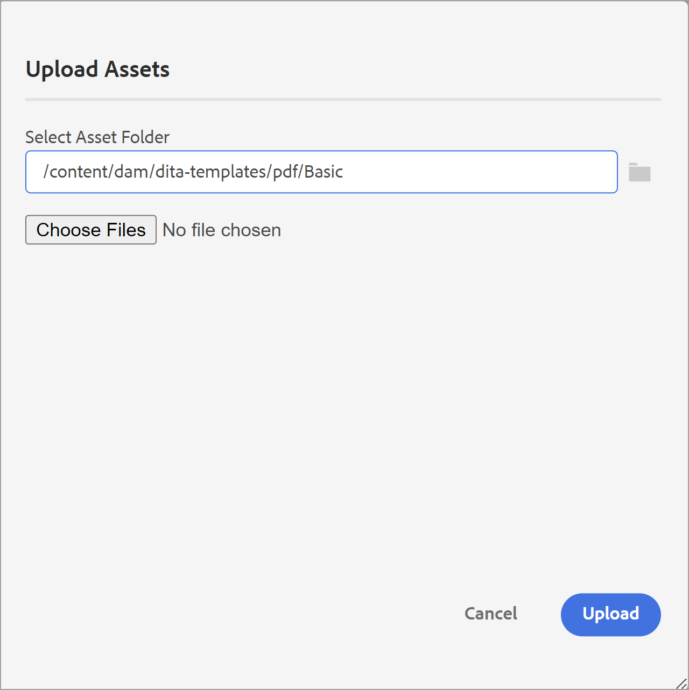

   アセットファイルがアップロードされるパスは、**アセットフォルダーを選択** フィールドに表示されます。
   >[!NOTE]
   >
   >アセットをアップロードするパスは変更できません。 デフォルトでは、すべてのアセットは`/content/dam/dita-templates/pdf/<PDF-template-name>` フォルダーに保存されます。

1. **ファイルを選択**&#x200B;をクリックして、ローカルマシンからアセットファイルを参照します

1. 「**アップロード**」をクリックします。
選択したファイルが読み込まれ、「リソース」フォルダーに一覧表示されます。

## PDFの詳細設定 {#advanced-pdf-settings}

「設定」セクションを使用して、PDFのページレイアウトの詳細設定、PDFを奇数ページまたは偶数ページから開始、相互参照の書式、生成された最終的なPDFでのプリントマークの有効化を行います
すばやく作成できます。

>[!NOTE]
>
> Experience Manager Guides 5.0/2025.02.0 リリース以降、PDFの詳細設定の「**印刷**」セクションが&#x200B;**出力プリセット** パネルに移動されました。 印刷の設定を行うには、[PDF出力の公開](../web-editor/native-pdf-web-editor.md#print)を参照してください。

設定するには、**テンプレート** パネルの&#x200B;**設定**&#x200B;をクリックして、次のオプションを表示します。

### 一般

奇数ページまたは偶数ページから章を開始するための基本的な設定設定、目次構造、および目次エントリの引出線形式を定義します。 次の設定を定義できます。

* **新しい章を**&#x200B;から開始：最終的なPDFで各章がどのように公開されるかを定義できます。 **新しいページ**、**奇数ページ**、**偶数ページ**、または&#x200B;**現在のページ**&#x200B;のオプションから選択できます。 奇数ページから新しい章を開始する場合、奇数ページで終わる章の後に空白ページが挿入されます。 例えば、章が15 ページ目で終了した場合、公開プロセスは空白の16th ページを挿入して、新しい章を17th ページから開始できるようにします。  「**現在のページ**」オプションを選択すると、すべての章がページ区切りなしで継続して公開されます。 例えば、章が15 ページの途中で終わる場合、次の章も15 ページ自体から始まります。

* **新しいページから各トピックを開始**：章内の各トピックを新しいページから開始する場合は、**新しいページから各トピックを開始** オプションを選択します。 ページのギャップなしでトピックを続行する場合は、このオプションの選択を解除します。

* **目次構造**：目次の階層をカスタマイズできます。 次の追加設定を使用します。

   * **レベル**&#x200B;までの見出しを使用：PDFの目次構造に表示する見出しレベルの数を調整できます。
   * **目次**&#x200B;の最初のレベルのページ番号を表示しない：ネストされたトピックまたは子トピックを含むすべてのチャプターに対応するページ番号を非表示にするには、このオプションを選択します。 次の例では、このオプションを選択せずに出力が作成されます。

  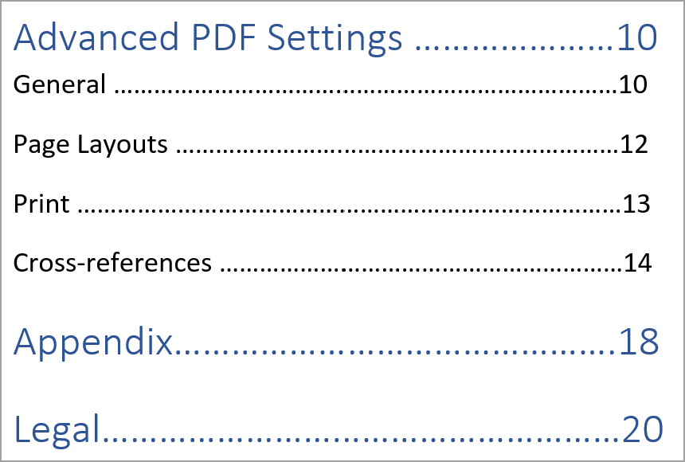

  上記の例では、PDFの詳細な設定、付録、法務が、最初のレベルのトピック見出しまたは章タイトルです。 これらの見出しには、ページ番号が割り当てられています。

  このオプションを選択して出力を生成すると、次の目次が表示されます。

  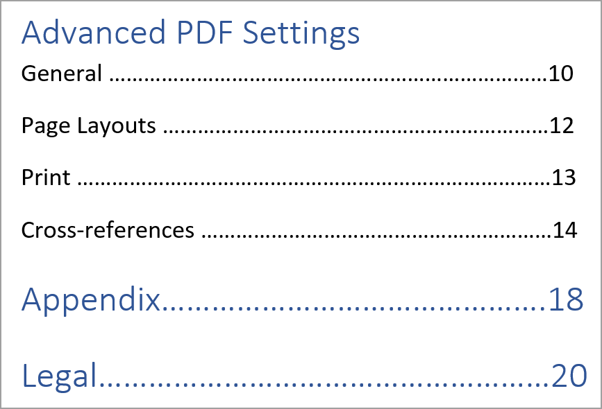

  ここでは、最初の章の詳細なPDF設定には、ネストされたトピックや子トピックがあるため、ページ番号が指定されていないことがわかります。 一方、付録と法務に割り当てられたページ番号は、子トピックのない独立したトピックであるため、

* **目次に章番号を表示しない**：このオプションを選択すると、目次に章番号が含まれていない章名が表示されます。   デフォルトでは、章番号はPDF出力の目次に表示されます。
* **引出線の形式**: ドロップダウンを使用して、点線、実線、またはスペース引出線を選択し、見出しレベルを対応するページ番号に接続します。
目次構造を適用し、見出しレベルをスタイル設定する方法については、[章の目次を追加](design-page-layout.md#add-chapter-toc)を参照してください。

  >[!NOTE]
  >
  >CSS開発者の場合は、CSS ファイルで直接リーダー形式を定義することもできます。

* **テーブル継続マーカーを使用**：複数のページに広がる長いテーブルのマーカーを定義するには、このオプションを選択します。
ブレークの前後に表示するテキストを定義できます。 例えば、5 ページ目で表が区切られ、`<Continued on page %page-num%>`改行前のテキスト **に**&#x200B;が定義されているとします。  テキストは、ページ 5の下部に「ページ 6に続く」と表示されます。

  言語変数を使用して、ブレークの前後の継続マーカーテキストを定義します。 選択した言語に応じて、ローカライズされた値がPDF出力で自動的に選択されます。 例えば、英語のテキストとして`Continued on page %page-num%`を公開し、ドイツ語のテキストとして`Fortsetzung auf Seite %page-num%`を公開できます。

  カーソルを合わせる オプションの近くにあるをクリックすると、その詳細が表示されます。
* **用語集の用語を用語集ページにリンク**：このオプションを選択すると、用語集の用語がコンテンツ内のハイパーリンクとして表示され、用語集ページの用語にリンクされます。 これにより、用語集で定義された用語の定義をすばやく確認できます。

  用語集の用語をハイパーリンクに変換するには、次の操作を行う必要があります。
   * DITA マップの「**ページレイアウト順序**」タブで「**用語集**」を有効にします。
   * ブックマップのバックマターページに用語集を追加します。

  用語集ページを有効にしない場合、コンテンツ内の用語集の用語は、PDF出力のハイパーリンクに変換されません。
  <!--For more information on using table continuation markers, see Use table continuation markers.-->

### ページレイアウト {#page-layouts}

ページレイアウト設定では、ドキュメントの特定のセクションに使用するページレイアウトを完全に制御できます。 例えば、目次のレイアウトを選択するには、目次フィールドの下にあるドロップダウンメニューをクリックし、目次を生成するためにデザインしたレイアウトを選択します。

ブックマップ設定は、ページレイアウト設定よりも優先されることに注意することが重要です。

ページレイアウト セクションでは、次の設定を使用できます。

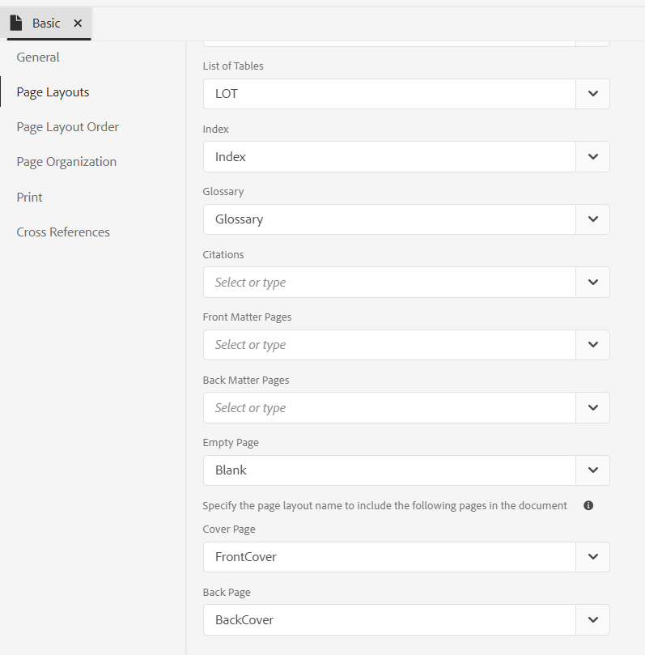

**既定のページレイアウト**: PDFのすべてのページの既定のレイアウトとして機能するページレイアウトを選択します。 これは、専用ページレイアウトを作成していないセクションまたはトピックに適用される基本ページレイアウトです。

**異なるセクションのページレイアウト**: PDF出力の次のセクションを使用して、ページレイアウトをマッピングできます。 関連するセクションのページレイアウトをデザインした場合は、ドロップダウンリストから選択します。 特定のセクションに対してページレイアウトが作成されていない場合は、デフォルトのページレイアウトが適用されます。

* **章とトピック**：章とトピックののページレイアウトを指定できます。 選択したレイアウトがすべての章とトピックに適用されます。

* **目次**：目次ページレイアウトをデザインした場合、ドロップダウンリストで「**目次**」を選択すると、文書内のすべての目次ページに目次ページレイアウトが表示されます。

* **図のリストと表のリスト**：図と表のページレイアウトを指定することもできます。 選択したレイアウトがすべての図と表に適用されます。

* **索引**：索引ページレイアウトをデザインした場合は、「索引」オプションにマッピングします。 スタイルシートを使用すると、PDF出力で様々なインデックスエレメントのスタイルを設定できます。 索引スタイル `.idx-header`、`.idx-footer`、`.idx-body`、`.idx-title`、`.idx-keyword-group`、`.idx-unit`、`.idx-keyword`、`.idx-name`、`.idx-link`および`.idx-child`を使用して、索引の要素のスタイルをカスタマイズします。

* **用語集**：用語集ページレイアウトがある場合は、用語集オプションにマッピングします。

  PDF出力の用語集の用語は、常にアルファベット順に並べ替えられます。

  タグ `sort-as`を追加して、用語集の用語の並べ替えキーを定義することもできます。 次に、Experience Manager Guidesはソートキーを使用して、用語集の用語の代わりに用語集の用語をソートします。 並べ替えキーを定義していない場合は、用語集の用語を使用して並べ替えます。 例えば、タグ `sort-as`を`glossterm`に追加し、「USB」という用語の値を`A`に設定できます（例：`<glossterm>USB<sort-as>A</sort-as></glossterm>`）。 同様に、`sort-as` タグを追加し、「ペンドライブ」という用語の値を`B`に設定できます。 これらの用語集の用語を並べ替えると、用語集の用語「USB」の並べ替えキー`A`が、用語集の用語「Pen Drive」の並べ替えキー`B`の前に表示されます。 したがって、PDF出力では、用語集ページの「ペンドライブ」の前に「USB」が表示されます。

  スタイルシートを使用すると、PDF出力で様々な用語集エレメントのスタイルを設定できます。 用語集スタイル `.glo-header`、`.glo-footer`、`.glo-body`、`.glo-title`、`.glo-unit`、`.glo-link`および`.glo-term`を使用して、用語集の要素のスタイルをカスタマイズします。

  スタイルエディターを使用して、一般的なコンテンツスタイルを[使用する方法について詳しく説明します](stylesheet.md)。

* **フロントマターページとバックマターページ**：これらのページレイアウトは、ブック内のフロントマターページまたはバックマターページのスタイル設定を定義します。 前面物質のレイアウトをデザインした場合は、**前面物質ページ** オプションにマッピングします。 ドロップダウンから前方物レイアウトを選択すると、前方物レイアウトは、前方物に存在するすべてのトピックに適用されます。

  バックマターレイアウトをデザインした場合は、**バックマターページ** オプションにマッピングします。 ドロップダウンから後付けレイアウトを選択すると、後付けレイアウトは、後付けレイアウトに存在するすべてのトピックに適用されます。

  **フロントマターページ**&#x200B;は、**目次**、**図のリスト**、表のリストのフォールバックレイアウトとしても使用されます。  同様に、**後付ページ**&#x200B;も、**索引**&#x200B;および&#x200B;**用語集** レイアウトのフォールバックレイアウトとして使用されます。 これらのレイアウトを選択していない場合は、選択したフロントページまたはバックマターページレイアウトが適用されます。  フロントページまたはバックマターページのレイアウトを選択していない場合は、デフォルトのページレイアウトが適用されます。

* **空のページのページレイアウト**:    空のページのページレイアウトを指定することもできます。 選択したレイアウトがすべての空のページに適用されます。 例えば、すべての空のページに対して空白ページレイアウトをデザインした場合、ドロップダウンリストで「**空白**」を選択すると、ドキュメント内のすべての空のページに空白ページレイアウトが適用されます。

* **表紙と裏ページ**：表紙レイアウトをデザインした場合は、**表紙** オプションにマッピングします。 同様に、バックページレイアウトがある場合は、**バックページ** オプションにマッピングします。 カバーまたはバックページレイアウトが作成されていない場合は、デフォルトのページレイアウトが適用されます。

ページレイアウトについて詳しくは、[&#x200B; ページレイアウトのデザイン &#x200B;](design-page-layout.md)を参照してください。

### ページレイアウト順序 {#page-order}

PDFで次のセクションを表示または非表示にしたり、最終的なPDF出力に表示する順序を調整したりできます。

* 目次
* 章とトピック
* 図のリスト
* テーブルのリスト
* 索引
* 用語集
* 引用

  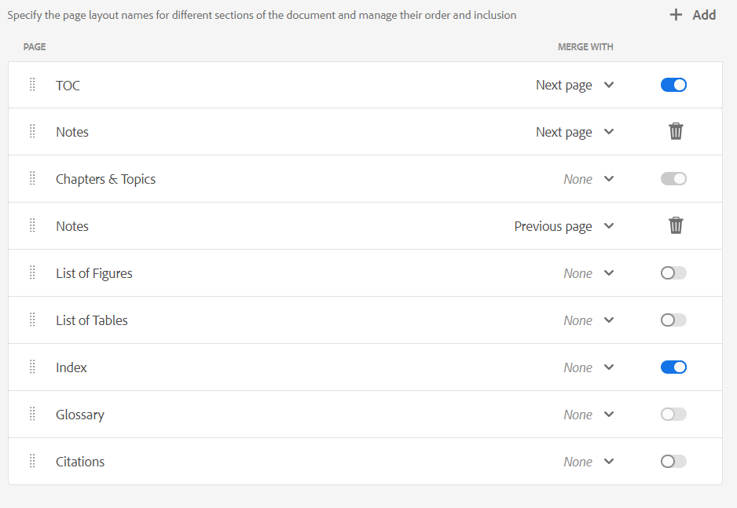

  PDF出力に特定のセクションを表示したくない場合は、切り替えスイッチをオフにすることで非表示にできます。

  また、これらのセクションがPDFで生成される順序を定義することもできます。 これらのセクションのデフォルトの順序を変更するには、点線バーを選択して、目的の場所にセクションをドラッグ&amp;ドロップします。

  >[!NOTE]
  >
  > 順序とインクルージョンの設定は、DITA マップにのみ適用されます。 ブックマップの場合、これらの設定は適用されません。 ブックマップ内のページは、ブックマップ内のセクションの順序に従って表示されます。

。
**章とトピック**&#x200B;のレイアウトは、デフォルトで常に有効になっています。 切り替えることはできません。

**ページを結合**

デフォルトでは、すべてのセクションは新しいページから始まります。 「**で結合**」ドロップダウンから「**前ページ**」または「**次ページ**」オプションを選択して、セクションを前ページまたは次ページと結合します。 これにより、PDF出力で選択したページに続けてセクションが公開されます。 これを使用すると、間にページブレークはありません。

>[!NOTE]
>
> この設定は、セクションにのみ適用され、そのコンポーネントには適用されません。  例えば、**章とトピック**&#x200B;の&#x200B;**前ページ** オプションを選択すると、**章とトピック** セクションが前のページと結合されます。 様々な章とトピックは、**一般**&#x200B;の設定に従って公開されます。例えば、**設定から新しい章を開始**&#x200B;する場合、**奇数ページ**&#x200B;を選択すると、奇数ページで終わる章の後に空白ページが挿入されます。

セクションを前のページまたは次のページに結合すると、コンテンツが結合され、コンテンツが結合されるターゲットセクションのスタイルが適用されます。

例えば、**目次**&#x200B;と&#x200B;**章とトピック**&#x200B;を有効にし、**目次**&#x200B;の&#x200B;**次ページ**&#x200B;を選択すると、**目次**&#x200B;は次のセクション（**章とトピック**）と結合されます。 **章とトピック** セクションのスタイルは、両方のセクションの結合されたコンテンツに適用されます。

結合オプションは連続して機能するので、複数の連続セクションに対して&#x200B;**次ページ**&#x200B;を選択した場合、これらはすべて、このプロパティが設定されていない最初のセクション（次の方向）と結合されます。 例えば、**目次**、**章とトピック**、**図のリスト**、および&#x200B;**索引**&#x200B;を有効にします。 次に、**索引**&#x200B;に&#x200B;**次ページ**&#x200B;を&#x200B;**目次**&#x200B;に、**章とトピック**、**図のリスト**、**なし**&#x200B;に設定した場合、それらはすべて&#x200B;**索引**&#x200B;と結合されます。

**静的ページ**

様々なページレイアウトは、様々なセクションの出力をデザインするのに役立ちます。 これらのセクションは、出力の公開時にDITA マップから生成されます。
また、カスタムページレイアウトを作成し、PDF出力で静的ページとして公開することもできます。 これにより、メモや空白ページなどの静的コンテンツを追加できます。

カスタムページレイアウトを追加するには、次の手順を実行します。

1. **追加** を選択して、新しいページレイアウトを追加します。 ページレイアウトパネルを追加パネルが開きます。
2. リストからページレイアウトを選択し、「追加」をクリックします。 新しいページレイアウトがページレイアウトのリストに追加されます。

次のアクションを実行することもできます。

* 点線バーを選択して、ページレイアウトを目的の場所にドラッグ&amp;ドロップします。

* 「**レイアウトを削除** 」を選択して、レイアウトを削除します。

* 静的ページを前のページまたは次のページと結合することもできます。

* また、カスタムレイアウトを複数回追加して注文することもできます。 これにより、静的コンテンツを適切に公開できます。

  例えば、カスタムレイアウトを使用して、PDF出力内で静的警告を複数回公開できます。

### ページの整理

PDF ドキュメント内のページは、通常、DITA マップファイルまたはブックマップファイルで整理された内容に従って公開されます。 ただし、PDF ドキュメント内のページの順序を変更することもできます。 例えば、複数ページの文書を小冊子として印刷できます。 シートを照合、折りたたみ、ホチキス止めすると、正しいページ順序のブックが1つ作成されます。  その後、本のように出版された小冊子を読むことができます。

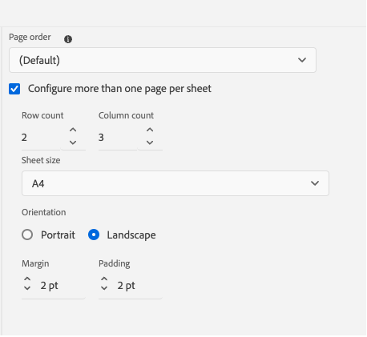

**ページ組織** セクションでは、次の設定を使用できます。

#### ページの順序

PDF ドキュメント内のページの順序を決定するページ順序を選択します。 ドロップダウンから次のオプションを選択できます。

* **Default**: ソースファイルに従ったページのデフォルトの順序。
* **奇数ページが最初**：すべての奇数ページは、すべての偶数ページの前に移動されます。
* **偶数ページが最初**：すべての偶数ページは、すべての奇数ページの前に移動されます。
* **Reverse**: ページの順序が逆になっています。
* **小冊子**：すべてのページが小冊子のように並べられます。
* **右から左の小冊子**：すべてのページが右から左の小冊子の順序になっています。
* **カスタム**：定義済みの順序ではなく、ページのカスタム順序を定義します。
   * 「あら…b&quot; — aからbまでの連続したページ。
   * &quot;a,b,c&quot; – 新しいページの順序a, b, c.
   * &quot;a*b&quot; — ページ aはb回繰り返されます。
   * 「 – a」 – 負のページ番号は、最後のページから逆順にカウントされ、他のカスタム注文と組み合わせることができます。
   * &quot;X&quot; — ドキュメントのすべてのページ。 結果は、「1..-1&quot;。

例えば、「2,3,5*2,7..10,-1,-2」のようなカスタム注文を設定できます。
指定されたページ順序では、元の文書から次のページ番号を持つPDFが生成されます。この文書の合計ページ数は25 ページであると仮定します。2、3、5、5,7、8、9、10、25、24。

#### シートごとに複数のページを設定する

1枚の用紙に複数のページを発行する場合は、このオプションを選択します。  次に、行数と列数を選択し、1枚のシートにグリッドのようにページを公開します。 例えば、2行と4列のグリッドとしてページを公開できます。

シートをパブリッシュする対象シートのサイズと方向を定義します。 また、シートの余白とパディングのプロパティを指定することもできます。

### 相互参照 {#cross-references}

「**相互参照**」タブを使用して、相互参照をPDFに公開する方法を定義します。 トピックのタイトル、表、図などの相互参照を書式設定できます。

>[!NOTE]
>
> 相互参照の挿入時にリンクテキストを定義した場合は、Native PDF テンプレートで定義されている相互参照書式よりも優先されます。

変数を使用して相互参照を定義することもできます。  変数を使用すると、その値はプロパティから選択されます。 単一または複数の変数の組み合わせを使用して、相互参照を定義できます。 また、文字列と変数を組み合わせて使用することもできます。

例えば、`View details on {chapter}`を使用できます。 章名が「一般設定」の場合、出力の相互参照は「一般設定の詳細を見る」です。

AEM Guidesには、次のすぐに使用できる変数が用意されています。

* {title}: トピックのタイトルへの相互参照を作成します。 例えば、2 ページの便利なリンクを参照してください。
* {page} ページ番号に相互参照を追加します。 例えば、1 ページを参照してください。
* {description}：説明のテキストに相互参照を追加します。 例えば、AEM Guidesの詳細を参照してください。
* {chapter}：章番号に相互参照を追加します。 例えば、第1章を参照してください。
* {bookmarkText}：ブックマーク付きテキストへの相互参照を作成します。 例えば、5 ページのstop_wordsを参照してください。
* {captionText}: トピック内の図または表のキャプションへの相互参照を作成します。 例えば、2 ページのエアフローを参照してください。
* {figure}：図番号に相互参照を追加します。 図のキャプション用に定義した自動番号スタイルから図番号を選択します。  例えば、「ページ {figure}の{page}を参照」を使用できます。 出力の相互参照には、自動生成された図形番号とそのページ番号が含まれています。「ページ 5の図1を参照してください。」
* {table}: テーブル番号に相互参照を追加します。 キャプション用に定義した自動番号スタイルから表番号を選択します。 例えば、「ページ {table}の{page}を参照」を使用できます。 出力の相互参照には、自動生成されたテーブル番号とそのページ番号が含まれています。「5 ページの表1を参照してください。」

  >[!NOTE]
  >
  >キャプションタグとキャプションタグの自動番号スタイルを作成できます。

#### デフォルトの相互参照形式

テキストフィールドを空白のままにし、相互参照の挿入時にリンクテキストを定義していない場合、Experience Manager Guidesはそれぞれの相互参照に対して次の変数を追加します。

* **タイトル**: `{title}`
* **説明**: `{description}`
* **段落**: `{bookmarkText}`
* **ブックマーク**: `{bookmarkText}`
* **図**: `{captionText}`
* **表**: `{captionText}`

相互参照の優先順位は次のとおりです。
* 相互参照に追加されたリンクテキスト
* ネイティブ PDF テンプレートで定義された相互参照書式
* デフォルトの相互参照形式

#### 相互参照の言語変数

言語変数を使用して、ローカライズされた相互参照を定義することもできます。 選択した言語に応じて、ローカライズされた値がPDF出力で自動的に選択されます。

例えば、言語変数「reference-label」を追加し、値を英語とドイツ語で定義できます。

* 英語 – 「ページ {page}で表示」
* ドイツ語 – &quot;Einzelheiten finden Sie auf der Seite {page}&quot;

段落セクションに`${lng:<variable name>}`を追加すると、出力の段落内の相互参照に、ローカライズされたテキストとページ番号が含まれます。\
例えば、次のスクリーンショットは、相互参照「View on page 1」を英語で、「Einzelheiten finden Sie auf der Seite 1」をドイツ語で示しています。

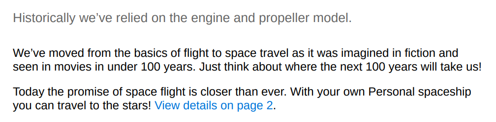

*英語で公開された段落内の相互参照。*

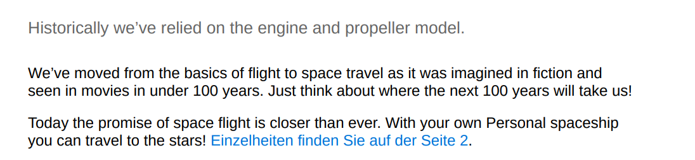

*ドイツ語で公開された段落内の相互参照。*

<!--For more information, see *Format cross-references*.-->
