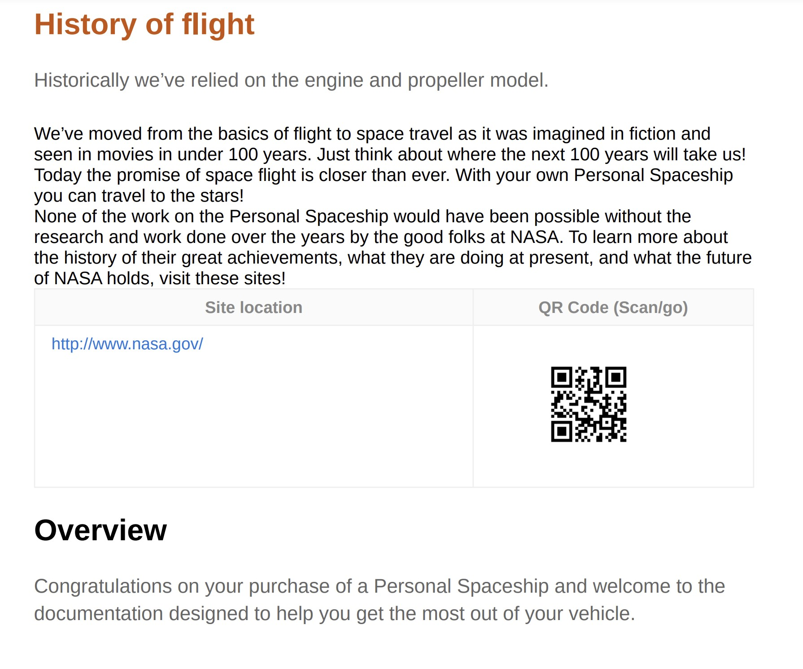

# 目次エントリとトピックコンテンツにカスタムスタイルを適用

場合によっては、目次エントリや特定のトピックにカスタムスタイルを適用する必要があります。 これを行うには、`outputclass` 属性を DITA マップの `<topicref>` 要素に関連付けます。 また、トピック全体にカスタム形式を適用する場合は、CSS で属性のスタイル定義を拡張して、これを実現することもできます。

レビュー用に送信する新しいトピックの例を見てみましょう。 更新されたトピックを簡単に識別するには、DITA マップの `<topicref>` 要素に `outputclass` 属性を追加し、CSS で同じ要素のカスタムスタイル設定を定義する必要があります。

次の例では、*フライトの履歴* トピックに、値が `new-topic` の `outputclass` 属性が割り当てられています。


CSS の `new-topic` のクラス定義を使用すると、次の項目のスタイルを定義できます。
* 目次またはミニ目次のメインエントリ
* メインコンテンツのトピックのタイトル
* タイトルを含む、トピックのコンテンツ全体

これらの各シナリオを CSS でどのように定義できるかを説明します。 `new-topic` クラスの次の CSS 定義では、テキストのカラーが変更されています。

```css
…
.new-topic {
  color: #CC5309
}
…
```

この定義は、目次のテキストの色とトピックのタイトルを制御します。 次のPDF出力は、目次エントリに適用される様々な色を示しています。


トピックのタイトルも同じ色を使用してスタイル設定されます。



TOC エントリとトピックのタイトルに異なるスタイルを設定する場合は、次のように別々に定義できます。

```css
...
/*for styling TOC entry */
.new-topic {
  color: #CC3509
}

/* for styling topic's title */
.new-topic.title {
  color: #092ACC
}
...
```

最後に、トピック内のコンテンツ全体にスタイルを適用することもできます。 この場合、クラス名にサフィックス「`-content`」を追加する必要があります。 次の例では、変更バーがトピックのコンテンツ全体に追加されています。

```css
...
/* for styling the topic's content */
.new-topic-content {
  -ro-change-bar-color: #A609CC;
}
...
```

上記のスタイル属性を使用して、次に示すように、変更バーが *フライトの履歴* トピックの左側に追加されます。


## 目次から空の行を削除

トピックのタイトルを定義していない場合、それらのトピックの目次には空の行が表示されます。

目次とミニ目次から空の行を削除するには、`layout.css` に次のスタイルを追加します。

```css
.toc-body a:empty,
.chaptoc-body a:empty {
    display: none;
} 
```

