# ページレイアウトのデザイン {#design-page-layout}

PDF ドキュメントを作成する場合は、様々な種類の情報を表示するための様々なセクションが用意されています。 例えば、PDFのドキュメントは、フロントページやカバーページから始まり、会社のロゴ、本のタイトル、バージョン情報が含まれます。 そこには章、付録、用語集のページがあります。 PDF ドキュメントの各セクションは異なって見え、ページレイアウトを作成およびカスタマイズすることで達成されます。

ページレイアウトをデザインするときは、ページを構成するさまざまな要素を定義できます。 例えば、ページのサイズ、余白、ヘッダーとフッター、方向、その他のページ仕様をページ上で定義できます。 ネイティブ PDF パブリッシング機能を使用すると、[Page Media標準](https://www.w3.org/TR/css-page-3/)に従ってページをデザインできます。 Paged Media標準の対象となる設定のほとんどは、ネイティブ PDF パブリッシング機能のユーザーインターフェイスを使用して簡単にカスタマイズできます。 その他の高度なレベルの書式設定では、Source ビューを使用して独自のCSS コードを記述できます。

ページレイアウトをデザインしたら、これらのレイアウトをPDF ページレイアウト設定の各セクションに関連付ける必要があります。 カスタマイズ用のページレイアウトを作成して開く方法について詳しくは、[ ページレイアウトの作成とカスタマイズ ](components-pdf-template.md#create-customize-page-layout)の節を参照してください。

## ページレイアウトの種類 {#types-of-page-layout}

PDF ドキュメントには、通常、次のセクションがあります。

* 表紙
* 目次
* 数字の上昇
* テーブルのリフト
* 章ページまたはトピックページ
* 用語集
* 索引
* バックページ

これらのセクションでは、情報を特定の形式で表示するために、対応するページレイアウトが必要になります。 さらに、奇数ページや偶数ページから新しい章を開始するためのフィラーとして使用される空白ページを作成することもできます。 その場合、デフォルトのページレイアウトを使用するか、空白ページ用のページレイアウトを作成できます。 詳しくは、[新しいページレイアウトの作成](components-pdf-template.md#create-page-layout)を参照してください。

「**テンプレート >設定**」セクションのページレイアウト設定では、PDFの様々なセクションに使用するページレイアウトを定義できます。 各ページレイアウトには、最初、右、左のページのバリエーションをさらに配置できます。

### 最初、右、左のページレイアウトのバリエーションを作成する {#page-layout-variants}

PDFテンプレートのページレイアウトは、最初、右、左のページレイアウトのバリエーションを異なることで、さらにカスタマイズできます。 ページレイアウトデザイナーを使用して、これらのページを異なる方法でデザインできます。

>[!NOTE]
>
>ブック内のセクションに単一のページレイアウトを使用する場合は、最初、右、左のページレイアウトを作成する必要はありません。

ページレイアウトを作成する際には、次の点を考慮してください。

>[!NOTE]
>
>以下の点は、章ページレイアウトを例として取り上げたものです。 ただし、これらのポイントは他のページレイアウトでも有効です。

* 章内のすべてのページに1つのページレイアウトを使用する場合は、バリエーションを含まない1つの章ページレイアウトのみを作成します。

* ブック内のチャプターの最初のページの外観を変えたい場合は、チャプターの最初のページレイアウトのバリエーションを作成する必要があります。

* ブックの左右のページごとに異なるルックアンドフィールを使用する場合は、チャプターページレイアウトの左右のバリエーションを作成する必要があります。

* 章を奇数ページまたは偶数ページから開始する場合は、空白ページのページレイアウトを作成します。 このページレイアウトは、2つのチャプター間のギャップを埋めるために使用され、チャプターが目的の奇数または偶数ページから始まるようにします。

  >[!NOTE]
  >
  >空白のページレイアウトを個別に作成しない場合は、デフォルトのページレイアウトが使用されます。 ページレイアウトの作成については、[新しいページレイアウトの作成](components-pdf-template.md#create-page-layout)を参照してください。

次の例では、ページレイアウトのバリエーションを作成する手順を説明します。

1. 「新規ページレイアウトの作成」手順で指定した手順を使用して、「章」ページレイアウトを作成します。

   空白のチャプターページレイアウトが作成され、ページレイアウトの下に追加されます。

   デフォルトでは、ページレイアウトを作成する際にも、編集のために開かれます。 次のスクリーンショットは、空白（デフォルト）のページレイアウトを表示します。

   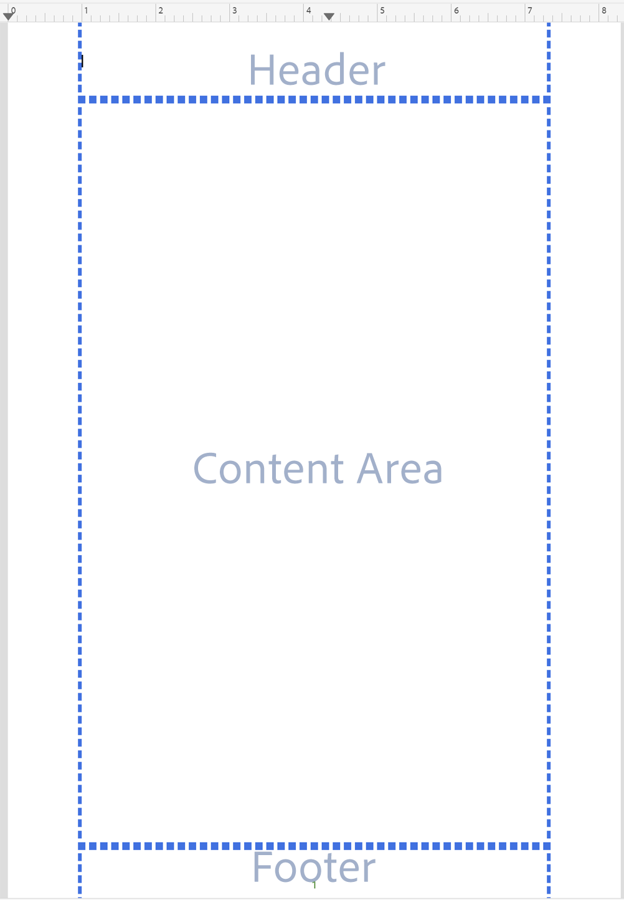

   テンプレートのヘッダー、フッター、コンテンツ領域は、デフォルトで作成されます。 これらの領域は、ページプロパティ、コンテンツプロパティのほか、ユーザーインターフェイスに表示される様々なツール（画像の挿入やフィールドなど）を使用して、容易にカスタマイズできます。

   >[!NOTE]
   >
   >高度な設定を行うには、Source ビューを使用して、カスタムのHTMLとCSS コードを追加します。

1. **章** レイアウトにマウスを合わせ、**オプション**&#x200B;をクリックしてコンテキストメニューを表示します。

1. 「**レイアウトのバリアントを追加**」をクリックまたはマウスオーバーし、作成するページレイアウト（最初、左、右）を選択します。

選択したページレイアウトは、ベースのチャプターレイアウトのコピーを使用して作成されます。 つまり、デフォルトのチャプターページレイアウトに変更を加えた場合、同じ変更がページレイアウト作成時にバリアントページレイアウトにレプリケートされます。

## ページレイアウトのページプロパティの操作 {#page-props-page-layout}

ページレイアウトをデザインするには、さまざまなページプロパティを制御することが不可欠です。 ネイティブのPDF公開機能では、ページプロパティパネルの下にあるすべての主要ページプロパティがカプセル化されます。 ページプロパティパネルでは、次のセクションで様々なプロパティにアクセスできます。

>[!NOTE]
>
>ページプロパティパネルには、プロパティが含まれ、[ ページメディア標準](https://www.w3.org/TR/css-page-3/)で定義されているルールに従います。

* **ページサイズ**：ページレイアウトに使用するページサイズを指定します。 ページサイズ ドロップダウンリストでは、15以上のページサイズから選択できます。 カスタムページサイズを使用してページレイアウトを作成することもできます。詳しくは、[ ページサイズの設定](#set-page-size)を参照してください。

* **方向**：ページレイアウトに使用するページの方向を指定します。 縦または横のページの向きから選択できます。 ページレイアウトで、異なるページバリエーションに異なる方向を適用することができます。 例えば、コンテンツに幅の広い表や大きな画像が含まれている場合は、横向きページレイアウトを作成し、そのレイアウトを幅の広い表や画像に適用できます。

* **回転表示**：回転後に元の上辺を表す辺または方向を指定します。 時計回り90、反時計回り90、または反時計回り180度から選択できます。 これは、出力にポートレート レイアウトと風景レイアウトを組み合わせて使用する場合に非常に便利です。 例えば、一般的なページレイアウトとしてポートレートを使用したり、幅広い表をレンダリングするための横向きページレイアウトを設定したりできます。 そのような場合は、テーブルの内容を時計回りに90度表示するように設定できます。 これにより、ページは横方向に配置され、コンテンツは90度回転して、表示の連続性を維持します。 これについては、この節の後半で例として説明します。

* **ページ番号** :The ページ番号は、デフォルトではPDFで連続しています。 例えば、100 ページのPDFの場合、1から100までの連続ページ番号を持つことができます。 すべての異なるセクションまたはセクションの最初の出現の特定の番号から番号付けを再開することもできます。
   * **開始**：このページレイアウトの番号付けを開始するページ番号を指定します。 例えば、ページ番号を設定して、各章で再開することができます。 その場合は、チャプターページレイアウトの最初のページレイアウトのバリアントで「再起動」プロパティを1に設定する必要があります。 デフォルトでは、ページ番号は前のページから続きます。

   * **最初の出現にのみ適用**: セクションの最初の出現に対してのみ、特定の数字から開始することもできます。 例えば、最初の章は1からのみ開始し、その他の章のページ番号を続行できます。

* **レイアウト**：ページの余白と、上下、左、右のパディングを指定します。 次の図は、コンテンツの周囲の余白、パディング、および境界線のレンダリング方法を示しています。 ページの上下の余白には、ヘッダーとフッターが含まれています。

  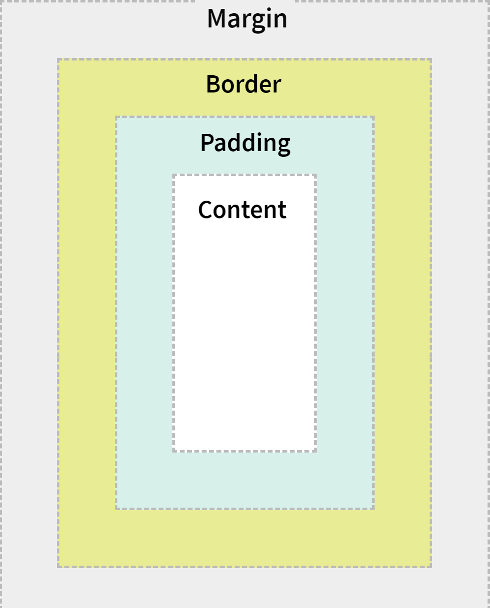

* **背景**：ページレイアウトの背景として、画像または色を含めます。 画像の場合、画像の高さと幅を、繰り返しと位置のプロパティとともに指定できます。

* **脚注**：出力に脚注を表示するプロパティを指定します。 境界線スタイルと共に、余白とパディングのプロパティを指定することができます。

### ページサイズの設定 {#set-page-size}

ページレイアウトで最初に定義すべきことは、ページサイズです。 ページプロパティには、ページレイアウト用に選択できる15以上のページサイズがあります。 次の手順を実行して、カスタムページサイズを作成することもできます。

1. 編集に必要なページレイアウトを開きます。

   >[!NOTE]
   >
   >カスタマイズまたは編集のためにページレイアウトを開く方法については、[ ページレイアウトのカスタマイズ ](components-pdf-template.md#customize-page-layout)の節を参照してください。

1. 右側のパネルで、**ページプロパティ**&#x200B;をクリックします。
1. 「**ページサイズ**」ドロップダウンリストで、「**カスタム**」を選択します。

   「ページの幅」フィールドと「ページの高さ」フィールドが表示されます。

1. 「**ページ幅**」および「**ページ高さ**」フィールドに目的のページ寸法を入力します。

   >[!NOTE]
   >
   >最も一般的に使用される単位は、px （ピクセル）、pt （ポイント）、rem、em、% （パーセント）、in （インチ）です。

### ページの向きとビューの回転の使用 {#page-orientation-rotation}

縦と横のページの向きとビューの回転プロパティを組み合わせて使用する例を見てみましょう。 この例では、デフォルトの縦方向を持つPDFを作成しますが、テーブルは時計回りに90度ビューでコンテンツを持つ横方向にレンダリングされます。 最終的な出力は次のようになります。

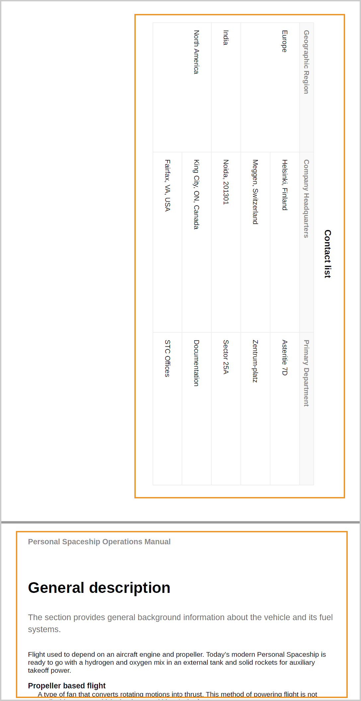

上記の出力では、連絡先リストの情報が横モードで表示され、コンテンツも90度回転します。 残りのコンテンツは通常のポートレートモードで表示されます。

このような出力を実現するには、次の主なタスクを実行する必要があります。

1. 横向きのページレイアウトを作成します。

1. コンテンツを90°でレンダリングするには、**回転を表示** プロパティを変更します。

1. 新しいページレイアウトを使用するカスタムスタイルを作成します。

1. 横向きページレイアウトでレンダリングするテーブルの出力クラス定義にスタイルを追加します。

上記のタスクを達成するには、次の手順を実行します。

1. 横向きのページレイアウトを作成します。
   1. 「新規ページレイアウトを作成」手順で指定した手順を使用して、「横」ページレイアウトを作成します。

   1. 右側のパネルで、**ページプロパティ**&#x200B;をクリックします。

      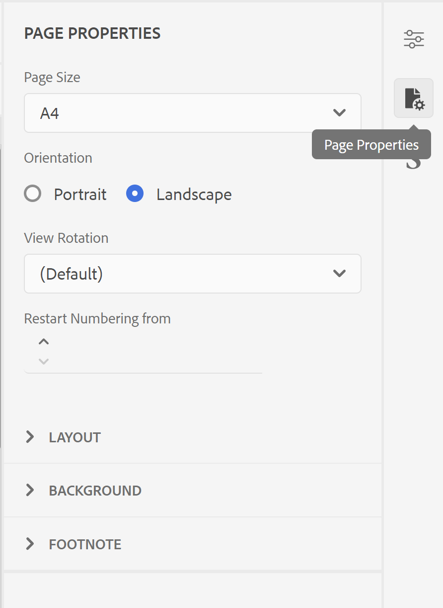
   1. **方向**&#x200B;を&#x200B;**横**&#x200B;に変更します。

1. 「回転を表示」プロパティを変更して、コンテンツを時計回りに90°表示します。

   1. 「回転を表示」ドロップダウンリストから「**時計回り90°**」を選択します。
   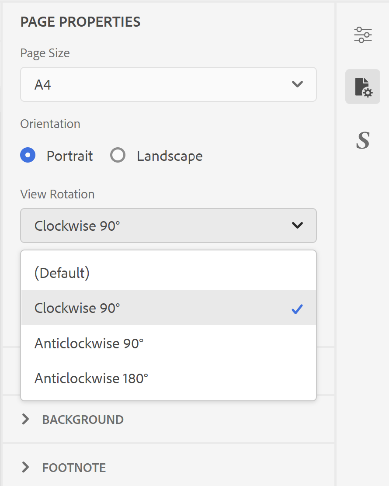

   1. 「**すべて保存**」をクリックして、更新されたページレイアウトプロパティを保存します。

1. 新しいページレイアウトを使用するカスタムスタイルを作成します。
   1. 左サイドバーを展開し、スタイルを作成するテンプレートをダブルクリックします。

   1. 「スタイルシート」セクションを展開します。

   1. レイアウトスタイルシートにカーソルを合わせ、（_オプション_ アイコン） ...をクリックし、「編集」を選択します。

      レイアウトスタイルシートが開いて編集できます。

   1. **その他のスタイル**&#x200B;を右クリックし、**新しいスタイル**を選択します。
      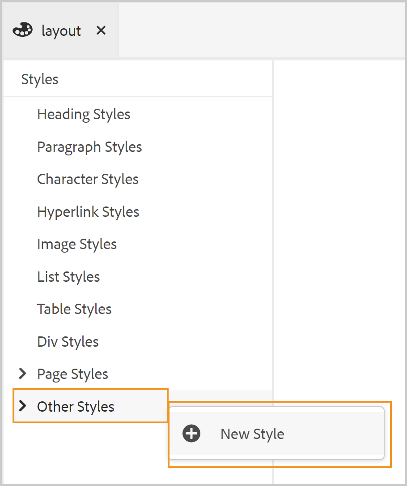

   1. スタイルを追加ポップアップで、**classname**&#x200B;に&#x200B;**landscape-style**と入力します。
      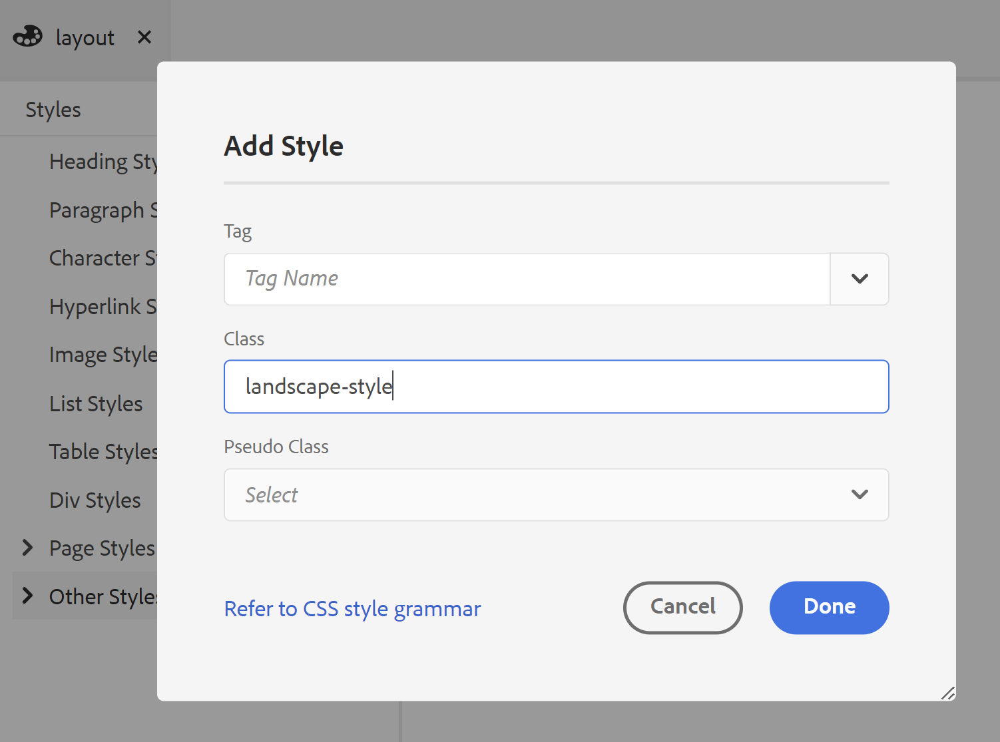

   1. 「**完了**」をクリックします。

      `.landscape-style`という名前の新しいスタイルが作成され、その他のスタイル リストの最後に追加されます。

   1. `.landscape-style` スタイルをダブルクリックして、編集用に開きます。

   1. **Pagination** プロパティを展開します。

   1. `Landscape` ページレイアウト **プロパティに**&#x200B;と入力します。

      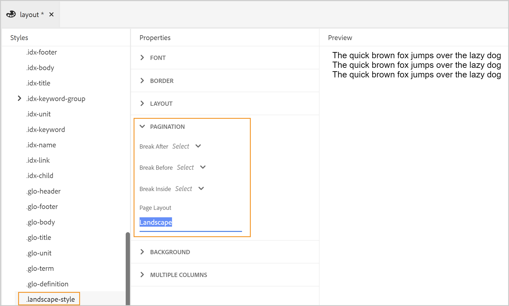

   1. 「**すべて保存**」をクリックして、更新されたスタイルプロパティを保存します。

1. 横向きページレイアウトでレンダリングするテーブルの`outputclass`定義にスタイルを追加します。
   1. DITA ファイルエディターで、新しいページレイアウトを適用するファイルを開きます。

   1. 横モードでレンダリングする`<table>`要素を見つけます。

   1. パンくずリストで、表エレメントをクリックして表を選択します。

      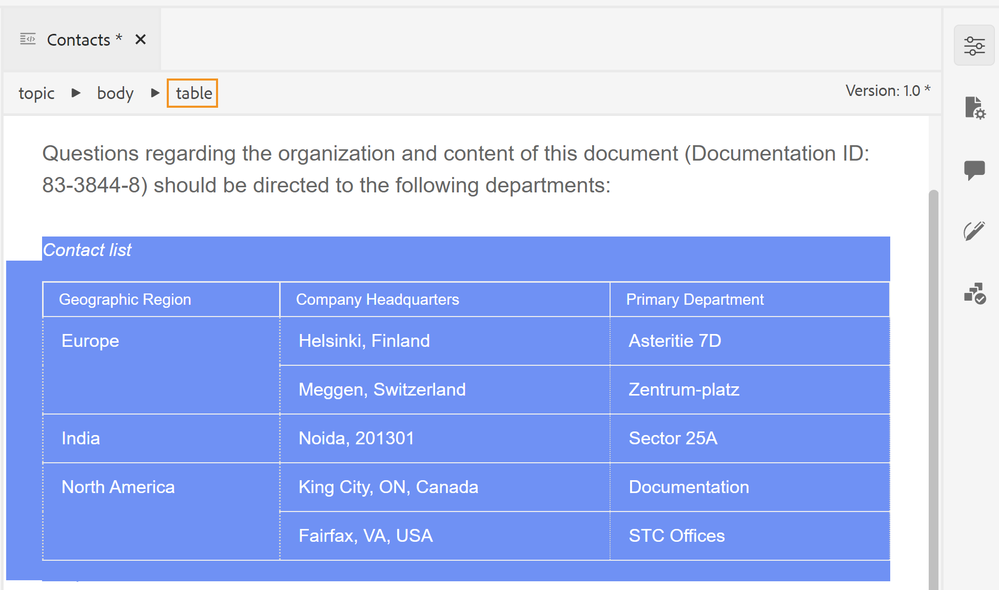

   1. 右側のパネルで、「コンテンツのプロパティ」パネルをクリックして開きます。

   1. コンテンツのプロパティパネルで、**landscape-style**&#x200B;をプロパティ値として持つ新しい&#x200B;**outputclass** プロパティを追加します。

      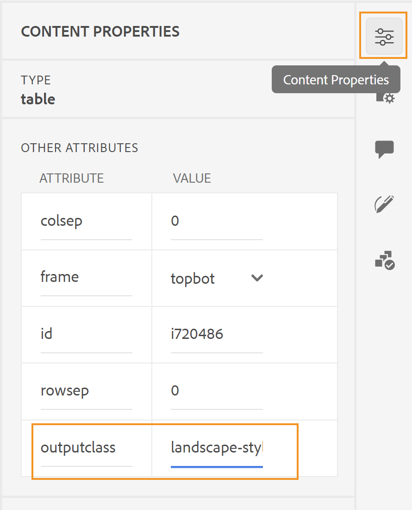

1. 「**すべて保存**」をクリックして、更新されたファイルを保存します。
1. PDF出力を生成します。

最後のPDFでは、例の先頭に示すように、テーブルコンテンツが横モードでレンダリングされます。

### 背景画像を追加 {#add-bg-image}

必要に応じて、章（PDF）出力のすべての最初のページに表示される背景画像を追加することができます。 ページプロパティの下にある背景プロパティを使用すると、背景画像を簡単に追加できます。 この画像をページ全体で複製し、ページの上部、下部、または中央領域のどこにでも画像を配置することができます。

例えば、コンテンツ領域の中央部に背景画像を挿入するには、次の手順を実行します。

1. 編集に必要なページレイアウトを開きます。

   >[!NOTE]
   >
   >カスタマイズまたは編集のためにページレイアウトを開く方法については、[ ページレイアウトのカスタマイズ ](components-pdf-template.md#customize-page-layout)の節を参照してください。

1. コンテンツ領域の任意の場所をクリックします。

1. 右側のパネルで、**ページプロパティ**&#x200B;をクリックします。

1. 「**背景**」セクションを展開します。

1. 「**画像パス**」フィールドの「参照」ボタンをクリックします。

1. 背景画像として使用する画像を参照して選択します。

   画像が挿入され、ページ全体をカバーするように複製されます。

1. 高さと幅のプロパティを調整して、画像サイズを変更します。

   >[!NOTE]
   >
   >縦横比を維持するために画像が自動的に拡大・縮小されるので、高さプロパティまたは幅プロパティのいずれかを入力できます。

1. 他のプロパティを設定して、背景画像の表示方法を調整します。

   * **背景の繰り返し**：背景を繰り返すかどうかを指定します。

   * **背景位置**：ページ上の背景画像の位置を指定します。

次のスクリーンショットは、Background Repeat プロパティが&#x200B;_no-repeat_&#x200B;に設定され、Background Position プロパティが&#x200B;_center center_&#x200B;に設定された背景画像を表示しています。

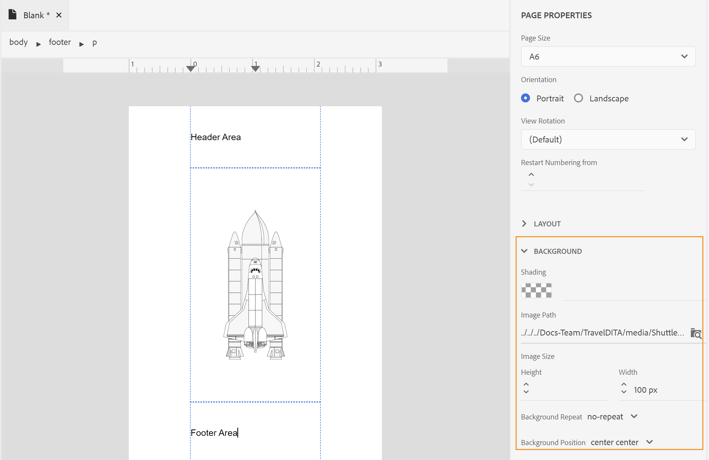

## ページのヘッダーとフッターの操作 {#work-header-footer}

ページレイアウトのヘッダーまたはフッターに情報を含めると、その情報はそのページレイアウトを使用するすべてのページで繰り返されます。 通常、ヘッダー領域は章またはトピックのタイトルに使用され、フッター領域はページ番号の表示に使用されます。

新しいページレイアウトを作成すると、ヘッダーとフッター領域がデフォルトで作成されます。 ページレイアウトのヘッダー領域とフッター領域で、多くのカスタマイズを行うことができます。 例えば、画像（ロゴなど）、変数（動的情報を含む）、または静的コンテンツを挿入できます。

### ヘッダーとフッターの余白と行の変更 {#header-footer-margins}

デフォルトでは、ヘッダーとフッターの余白は1 インチに設定されています。 このデフォルト値は、ページプロパティパネルの「マージン」設定を変更することで変更できます。 ヘッダーとフッターのサイズを変更するには、次の手順を実行します。

1. 編集に必要なページレイアウトを開きます。

   >[!NOTE]
   >
   >カスタマイズまたは編集のためにページレイアウトを開く方法については、[ ページレイアウトのカスタマイズ ](components-pdf-template.md#customize-page-layout)の節を参照してください。

1. 右側のパネルで、**ページプロパティ**&#x200B;をクリックします。
1. 「**レイアウト**」セクションを展開します。
1. **Margin** プロパティの横にあるロックアイコンをクリックします。
1. ヘッダーサイズを変更するには、「上余白」フィールドに目的の値を入力します。

   >[!NOTE]
   >
   >最も一般的に使用される単位は、px （ピクセル）、pt （ポイント）、rem、em、% （パーセント）、in （インチ）です。

1. フッターサイズを変更するには、「下余白」フィールドに目的の値を入力します。

複数の行を含むようにヘッダーとフッター領域をデザインできます。 それには、HTML Elements （ヘッダーまたはフッター領域の）アイコン。

| _開発者コーナー_:  |
|---|

CSSおよびHTML コードを直接操作する場合は、次のコードスニペットに示すように、マージン値を変更できます。

```css
…

<meta name="page-style" content="size:A4 portrait;margin-top:3cm;margin-right:30pt;margin-bottom:1in;margin-left:90px;" />

…
```

>[!NOTE]
>
>上記の例では、マージン値を指定するために異なる単位が使用されています。

### ヘッダーとフッターの削除 {#remove-header-footer}

ヘッダーとフッターのオーバーレイを上下の余白に配置します。 技術的には、ページレイアウトにヘッダーとフッターを使用する場合は、上下の余白に必要なスペースを確保する必要があります。

ページレイアウトにヘッダーとフッターを付けたくない場合は、次の2つの方法で作成します。

* 上下の余白を維持する場合は、ヘッダーとフッター領域を空白のままにします。
* 上下の余白を保持したくない場合（雑誌の表裏表紙のデザインなど）、上下の余白プロパティを0に設定して余白を削除できます。 これにより、ヘッダーとフッターのスペースが残りません。

### ヘッダーに画像またはロゴを追加する {#add-image-header}

必要に応じて、ページレイアウトのヘッダー領域（またはその他の部分）に表示される画像を追加することができます。 ページレイアウトに画像を追加するには、次の2つの方法があります。

* テンプレートのリソースから画像を使用します。
* ページレイアウトエディターで「\&lt;画像を追加\>」ツールを使用します。

>[!NOTE]
>
>画像やフォントなど、すべてのテンプレートアセットを管理するには、リソース フォルダーを使用することをお勧めします。

ヘッダー領域に会社のロゴなどの画像を挿入するには、次の手順を実行します。

1. 編集に必要なページレイアウトを開きます。

>[!NOTE]
>
>カスタマイズまたは編集のためにページレイアウトを開く方法については、[ ページレイアウトのカスタマイズ ](components-pdf-template.md#customize-page-layout)の節を参照してください。

1. 編集ヘッダー（） アイコンをクリックして、ヘッダー領域にカーソルを移動します。

   または、ヘッダー領域内をクリックします。

1. 画像を追加するには、次のいずれかの方法を選択します。
1. **Inert Image**&#x200B;をクリックします（）ツールバーのアイコン。**パスを選択** ポップアップで、画像の場所を参照し、**選択**&#x200B;をクリックしてヘッダー領域に挿入します。
1. 「リソース」フォルダーからヘッダー領域に画像をドラッグ&amp;ドロップします。

次のスクリーンショットは、ヘッダー領域に追加されたサンプル画像を示しています。

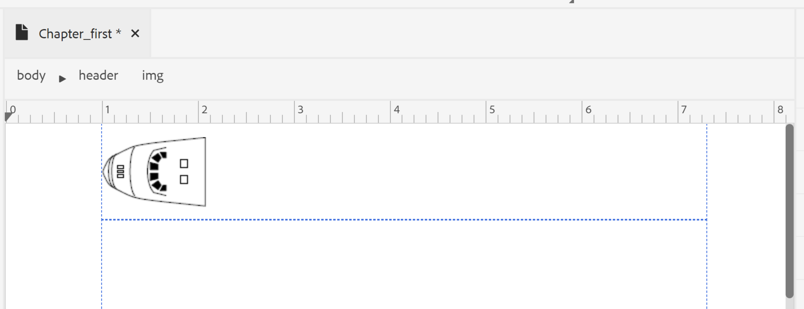

画像を挿入したら、その属性を変更して、必要な外観を与えることができます。 ページレイアウト上の画像やその他の要素の見た目を変更する最も簡単な方法は、コンテンツプロパティパネルを使用することです。 UIを通じてカスタマイズ可能な様々なプロパティについては、[ コンテンツのプロパティ パネルの操作](#work-with-content-props)を参照してください。

### フィールドとメタデータの追加 {#add-fields-metadata}

フィールドは、定義済みの情報を挿入する場合に非常に便利です。 例えば、章のヘッダー領域に章のタイトルフィールドを含めることができます。このフィールドは、公開時に実際の章のタイトルに置き換えられます。

ページレイアウトに挿入できるフィールドには、次のカテゴリがあります。

* メタデータ
* トピックタイトル
* 章タイトル
* マップタイトル
* ページ番号
* 章番号
* 合計ページ数
* 日付
* 時刻


これらの各フィールドカテゴリには、フィールド情報を挿入できる様々なバリエーションが含まれています。 例えば、日付フィールドには、`YYYY-MM-DD`、`MM/DD/YY`、`MM/DD/YYYY`など、様々なバリエーションを設定できます。 同様に、ページ番号には、ローマ字、小数、または&#x200B;_アラビア語_、_デバナガリ_、_ヘブライ語_&#x200B;など、ロケール固有の形式のバリエーションを含めることができます。


定義済みのフィールドに加えて、ページレイアウトの変数またはフィールドとしてメタデータ情報を追加することもできます。 このメタデータは、ソース DITA **マップコンテンツ**、**トピックコンテンツ**&#x200B;に保存するか、DITA **マップファイルプロパティ**、**トピックファイルプロパティ**&#x200B;から選択できます。

メタデータは、次のオプションから選択できます。

* **マップコンテンツ**&#x200B;には、DITA マップの`<topicmeta>`要素で定義したメタデータが含まれます。
* **マップファイルのプロパティ**&#x200B;にはメタデータが含まれており、DITA マップの&#x200B;**プロパティ** ページからアクセスできます。
* **トピックコンテンツ**&#x200B;には、DITA トピックの`<prolog>`要素で定義されたメタデータ（著作権、作成者、その他の詳細など）が含まれます。 個々の`<prolog>`要素を取得するには、シンプルなXPath式（作成者名に//authorなど）を使用できます。 属性メタデータの場合、XPathに`@`記号を含めます（例：変更日の//critdates/revised/@modified）。
* **トピックファイルのプロパティ**&#x200B;にはメタデータが含まれており、トピックの&#x200B;**プロパティ** ページからアクセスできます。


**マップファイルプロパティ**&#x200B;および&#x200B;**トピックファイルプロパティ**&#x200B;のメタデータを1つのドキュメントで結合できます。 例えば、表紙にマップタイトル、他のページの見出しにトピックタイトルを含むPDFを公開できます。 これを行うには、**マップファイルプロパティ**&#x200B;からマップタイトルメタデータをカバーページレイアウトに追加できます。 次に、**トピックファイルプロパティ**&#x200B;のトピックタイトルメタデータをチャプターとトピックページレイアウトのヘッダーに追加します。

一方のトピックがページで終了し、もう一方のトピックが同じページで開始される場合、最初のトピックのメタデータが選択されます。 カスタムプロパティを追加し、ページレイアウトのフィールドとして挿入することもできます。


>[!NOTE]
>
> メタデータ フィールドは、**から** ドロップダウンで選択したアセットまたはマップに従って表示されます。


<!--For more information, see [Add fields and metadata](design-page-layout.md#add-fields-and-metadata).-->

次の例では、ページレイアウトのフッター領域にページ番号と章タイトルを挿入します。

1. 編集に必要なページレイアウトを開きます。

   >[!NOTE]
   >
   >カスタマイズまたは編集のためにページレイアウトを開く方法については、[ ページレイアウトのカスタマイズ ](components-pdf-template.md#customize-page-layout)の節を参照してください。

1. 「**フッターを編集** （）」アイコンをクリックして、フッター領域にカーソルを移動します。

   または、フッター領域内をクリックします。

1. 段落エレメントを挿入するには、**HTML エレメントを挿入** （）アイコンをクリックし、要素のリストから段落を選択します。

1. 「**フィールドを挿入** （）」アイコンをクリックします。

   フィールドポップアップが表示されます。

1. フィールド リストから&#x200B;**ページ番号** カテゴリ、書式リストから&#x200B;**デフォルト（1）** ページ番号形式を選択し、**挿入**&#x200B;をクリックします。

   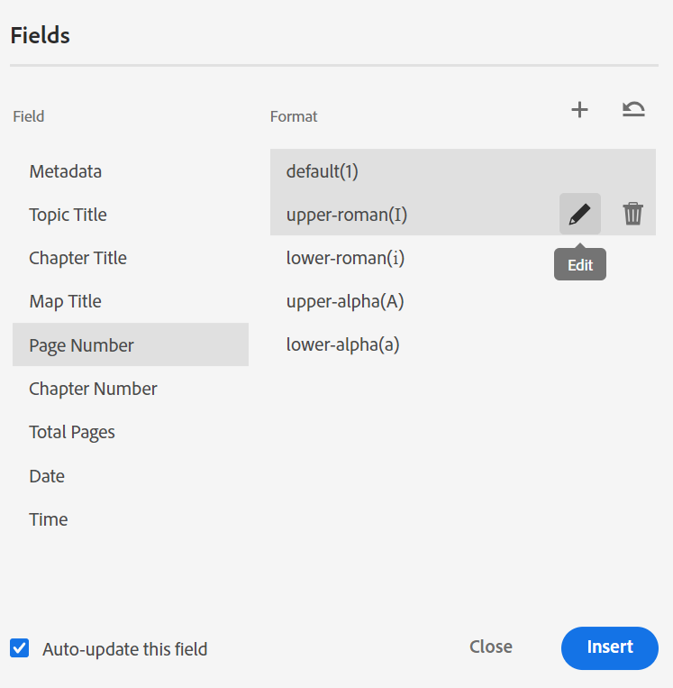

   >[!NOTE]
   >
   >デフォルトの形式を除くすべてのフィールドの形式を編集することもできます。 編集するには、編集する形式の横にある「編集」アイコンをクリックし、変更を加え、「OK」をクリックします。 詳しくは、[ フィールドとメタデータの追加](#add-fields-metadata)を参照してください。

   デフォルトのページ番号フィールドは、ページレイアウトのフッター領域に挿入されます。

   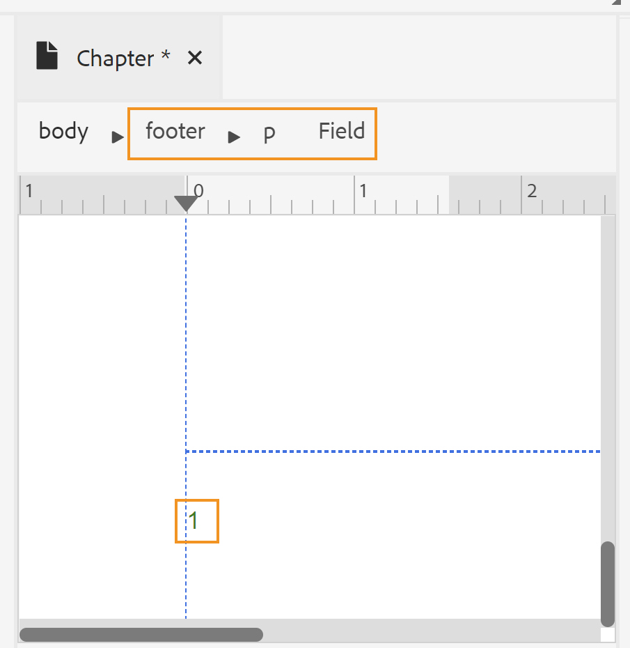

   一番上のパンくずリストには、情報が格納される要素が一覧表示されます。

1. ページ番号フィールドの後に空白スペースを入力し、**フィールドを挿入** アイコンをクリックします。

1. フィールドリストから&#x200B;**章タイトル** カテゴリ、書式リストから&#x200B;**章タイトル**&#x200B;形式を選択し、**挿入**&#x200B;をクリックします。

   公開時に章のタイトルが入力された&#x200B;_章タイトル_ フィールドがフッター領域に挿入されます。 このとき、ページ番号と章タイトルのフィールドはスペースで区切られます。

   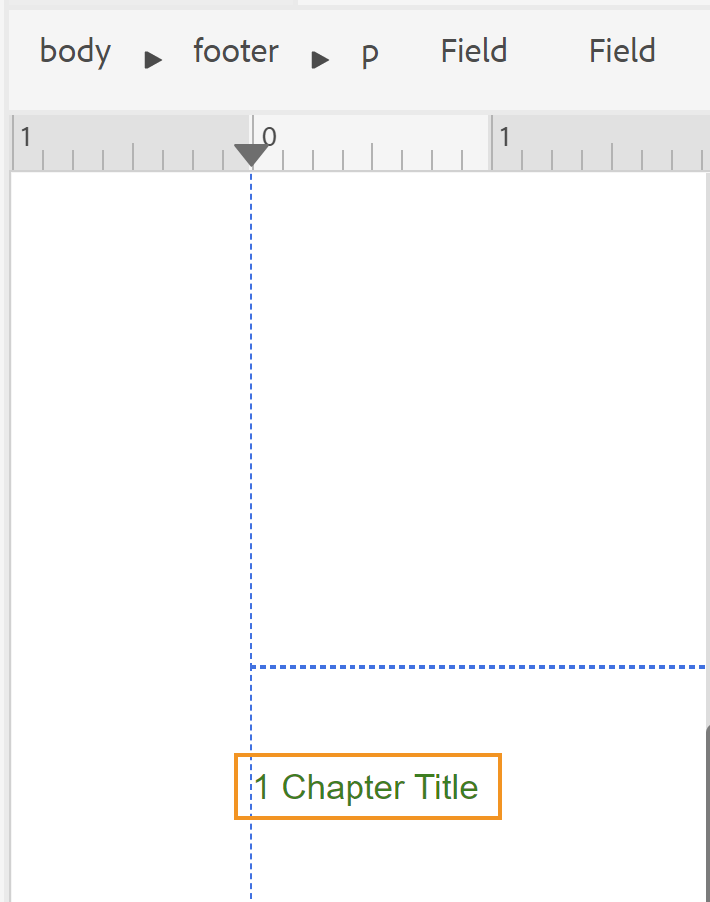

1. 章タイトルを右揃えするには、次の手順を実行します。

   1. パンくずリストのフィールド要素をクリックして、「章タイトル」フィールドを選択します。

   1. 右側のパネルで、**コンテンツのプロパティ** （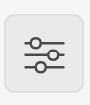）アイコン。

   1. **レイアウト** プロパティ セクションを展開し、**浮動小数** プロパティの値を&#x200B;**右**に設定します。
      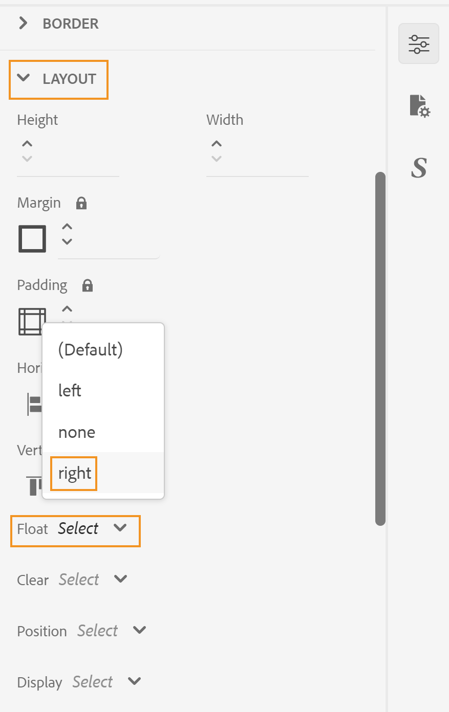

      章タイトルフィールドは、ページフッターの右側に配置されます。
      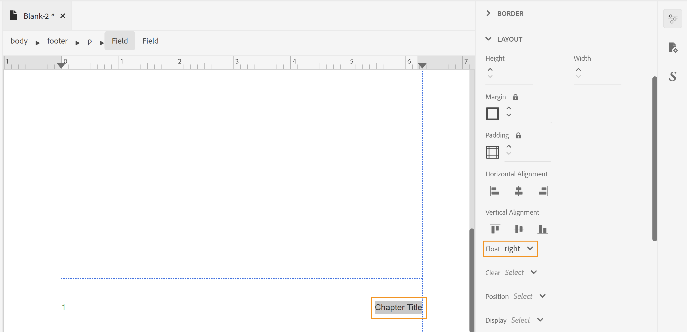


| _開発者コーナー_:  |
|---|

CSSとHTML コードを直接操作する場合は、ページレイアウトのSource ビューに移動してコードを変更することで、これを実現することもできます。 次のコードスニペットは、コードを使用して行われた同じフッター設定を示しています。

```css
…
<p>

<span data-field="page-number" data-format="default">1</span>

<span data-field="chapter-title" data-format="default" style="float: right">Chapter Title</span>

</p>
…
```

## コンテンツ領域の操作 {#content-area}

コンテンツエリアは、コンテンツスペースの観点から最大のエリアです。 コンテンツ領域には、トピックのコンテンツが入力されます。 場合によっては、コンテンツ領域に定型文コンテンツを追加できます。 このコンテンツは、ページレイアウトの指定された場所に公開されます。 例えば、目次、用語集、索引の見出しをボイラープレートコンテンツとして追加し、最終的な出力で「そのまま」公開することができます。 別の例として、すべての章の最初のページに通常は追加される章の目次があります。

コンテンツ領域で最もよく使用されるカスタマイズの1つは、複数列レイアウトです。 強力なページレイアウトデザイナーを使用すると、コンテンツを他のページの1列に保持しながら、特定のページをカスタマイズして複数の列でレンダリングできます。

次の節では、コンテンツ領域をカスタマイズするための様々なシナリオについて説明します。

### 章の目次を追加 {#add-chapter-toc}

章目次は、読者が章の内容を知るためのクイックリファレンスとして機能します。 通常、章の目次は、章の最初に追加されます。 したがって、章目次を使用する場合は、メインチャプターページレイアウトのコンテンツ領域または章の最初のページレイアウトバリアントに追加できます。

次の例では、章の最初のページレイアウトに章の目次を挿入します。

>[!NOTE]
>
>この手順では、章ページレイアウトの最初のページバリアントを作成したと仮定します。 ページバリエーションの作成方法については、[最初、右、左のページレイアウトバリエーションの作成](#page-layout-variants)を参照してください。

1. 編集に必要なページレイアウトを開きます。

   >[!NOTE]
   >
   >カスタマイズまたは編集のためにページレイアウトを開く方法については、[ ページレイアウトのカスタマイズ ](components-pdf-template.md#customize-a-page-layout)の節を参照してください。

1. ページレイアウトのコンテンツ領域にカーソルを置きます。

1. 章の目次（）アイコン。

   デフォルトの章の目次がコンテンツ領域に挿入されます。

   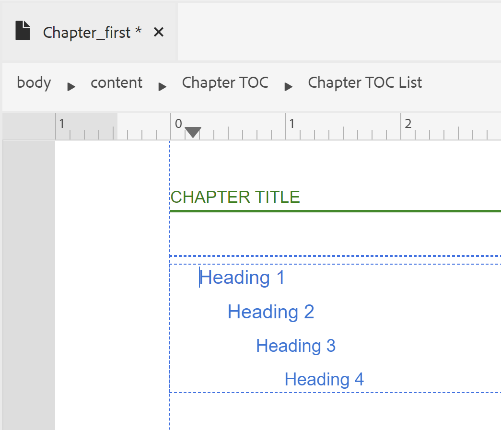

   >[!NOTE]
   >
   >デフォルトの章目次には、見出し1 ～ 4が含まれています。 見出し1は章タイトルそのものです。 そのため、目次に章タイトルを再度追加する必要がない場合や、目次に追加する見出しのレベルを上げる必要がある場合があります。 プロパティを変更することで、目次をカスタマイズできます。

1. コンテンツのプロパティパネルを開いて、目次の見出しレベルをカスタマイズします。

   例えば、見出し2から開始する場合は、最初のドロップダウンリストを2から開始するように変更します。

   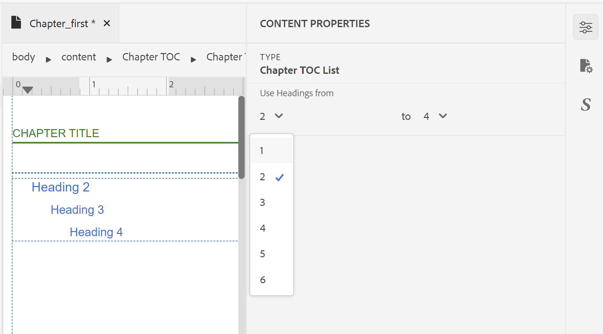

   同様に、レベル 5まで見出しを持たせたい場合は、2番目のドロップダウンリストを5に変更します。 更新された目次は次のようになります。

   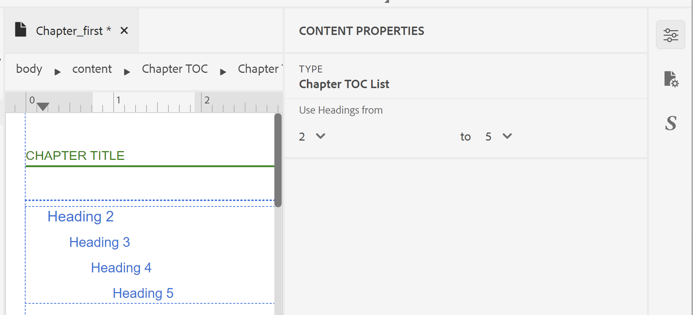

   >[!NOTE]
   >
   >最終的に公開されたPDFには、チャプター内のコンテンツに基づく目次エントリのみが表示されます。 章内にレベル 5の見出しがない場合、最終的な出力には表示されません。

デフォルトの目次のルックアンドフィールは、スタイルシートを使用してカスタマイズできます。 `chaptoc-level-#`で始まるスタイル （`chaptoc-level-1`、`chaptoc-level-2`など）は、章の目次のスタイルをカスタマイズするために使用されます。<!--For more details on the stylesheet elements used in the TOC and how to customize them, see _Customize default chapter TOC_-->。

>[!IMPORTANT]
>
>現在、スタイルシートでスタイルを更新した場合、コンテンツのプレビューに反映されない可能性があります。 ただし、出力は更新されたスタイルでレンダリングされます。

### 複数列ページレイアウトの操作 {#multi-column-layout}

複数列ページレイアウトは、ブック内の雑誌や索引を公開する際に非常に一般的です。 PDFのネイティブ公開機能を使用すれば、ドキュメントを複数の列に容易に分割できます。 異なるページレイアウトを使用すると、特定のセクションを複数の列に分割し、他のセクションを単一の列（または通常）レイアウトに維持することができます。

複数の列を持つページレイアウトを作成するには、次の手順を実行します。

1. 編集に必要なページレイアウトを開きます。

   >[!NOTE]
   >
   >カスタマイズまたは編集のためにページレイアウトを開く方法については、[ ページレイアウトのカスタマイズ ](components-pdf-template.md#customize-a-page-layout)の節を参照してください。

1. ヘッダーとフッター領域を除くコンテンツに複数列レイアウトが適用される場合は、パンくずリストでコンテンツ要素を選択する必要があります。

   コンテンツのパンくずリストを選択すると、コンテンツプロパティパネルに複数の列のプロパティが表示されます。

   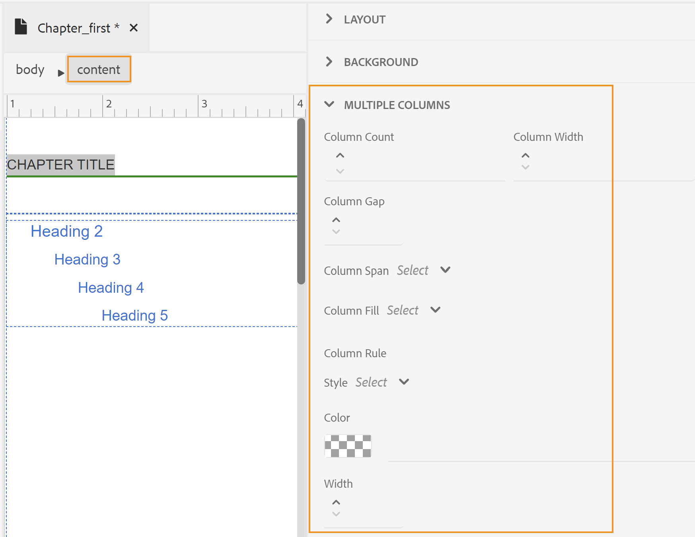

1. 複数列のプロパティを使用して、複数列のページレイアウトをカスタマイズします。

   * **列数：** ページを分割する列数を指定します。 上向き矢印アイコンと下向き矢印アイコンを使用するか、数値を入力して列数を設定します。

   * **列幅：**&#x200B;複数列レイアウトの列の幅を指定します。 デフォルトでは、サイズはピクセル（px）で設定されますが、pt、rem、em、%または単位で指定することもできます。

     >[!NOTE]
     >
     >サイズを指定しない場合、列は特定のページに収まるように均等に分割されます。 ほとんどの場合、この値を指定する必要はありません。

   * **列の間隔**：個々の列の間隔を指定します。

   * **列のスパン**：ページレイアウト上の任意の要素を列にまたげる場合は、このプロパティを使用する必要があります。 これは、スタイルシートを使用して目的の要素のスタイルを変更することによって実現されます。<!--for more information see _Section explaining style customization_-->。

   ページレイアウトで、すべてのチャプターページレイアウトの最初のページに特定のテキストを表示する場合は、チャプターページレイアウトの最初のページバリアントに追加できます。

   次の例に示すように、見出しテキストのSpan Column プロパティはallに設定されます。 これにより、文書が複数列であっても、見出しが複数の列にまたがることを確認できます。

   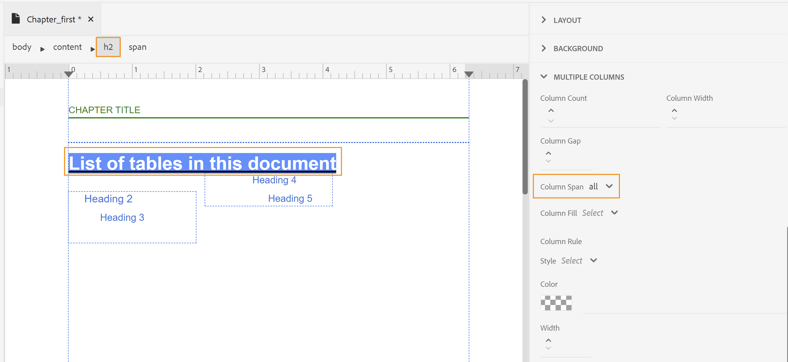

   >[!IMPORTANT]
   >
   >outputclass属性を使用して、任意のDITA要素にSpan Column プロパティを適用できます。

   * **列の塗りつぶし**：コンテンツの列の塗りつぶし方法を指定します。 デフォルトでは、「バランス」に設定されており、各列に同じ量のコンテンツを入力します。

   * **列ルール**：列の間に行を配置する場合は、このプロパティを使用して行または罫線スタイルを定義します。 罫線のスタイル、色、幅の値を指定して、列の間に線を追加します。

## コンテンツのプロパティパネルの操作 {#work-with-content-props}

コンテンツプロパティパネルを使用すると、ページレイアウト上の要素のルックアンドフィールを簡単に更新できます。 コンテンツプロパティパネルのプロパティは、次のセクションに分かれています。

* **フォント**：テキスト関連のプロパティを含みます。 フォントファミリー、太さ、サイズ、テキストのデコレーション（下線、オーバーライン、行全体など）、テキストスタイル（太字、斜体など）、テキストの整列（左、右、中央、または両端揃えなど）、白いスペースの処理（書式の事前定義、折り返し不可、区切り文字など）、行高、文字間隔、テキストインデントを設定できます。

* **境界線**：ページレイアウトの要素に境界線を追加および書式設定するためのプロパティが含まれます。 境界線の境界線（すべて、上、下、右、左）、境界線スタイル（実線、破線、点線など）、境界線の色、幅、半径を設定して、曲線の境界線を作成できます。 次の例では、ページのヘッダー領域に曲線の境界線が追加されています。

  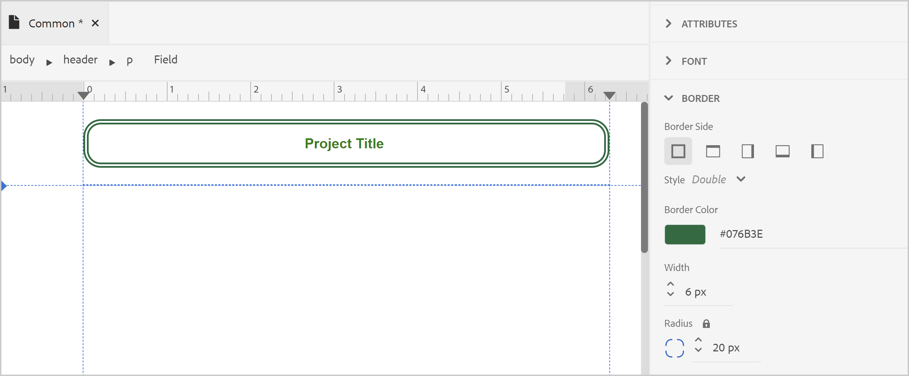

* **レイアウト**：ページレイアウト内の要素のレイアウトを設定するためのプロパティが含まれます。 高さ、幅、余白およびパディング（上、下、左、右、または右）、水平または垂直方向の整列、浮動小数（左、右、またはなし）、クリア（左、右、両方、またはなし）、エレメントの位置（絶対、固定、相対など）、表示（ブロック、コンテンツ、修正など）、Z インデックス、透明度、変形（回転または拡大・縮小）、変形の原点（XおよびY オフセット）を設定できます。

* **背景**：背景画像または色合いを含めるプロパティが含まれます。 画像サイズ（高さまたは幅を設定）、背景の繰り返し（繰り返し、繰り返さない、丸みを付けるなど）、および背景の位置（左上、右中央、中央下など）を設定できます。
* **複数列**：ページまたは章目次などの特定の要素の複数列プロパティを設定するためのプロパティが含まれます。 プロパティとその使用方法について詳しくは、[複数列ページレイアウトの操作](#multi-column-layout)を参照してください。
