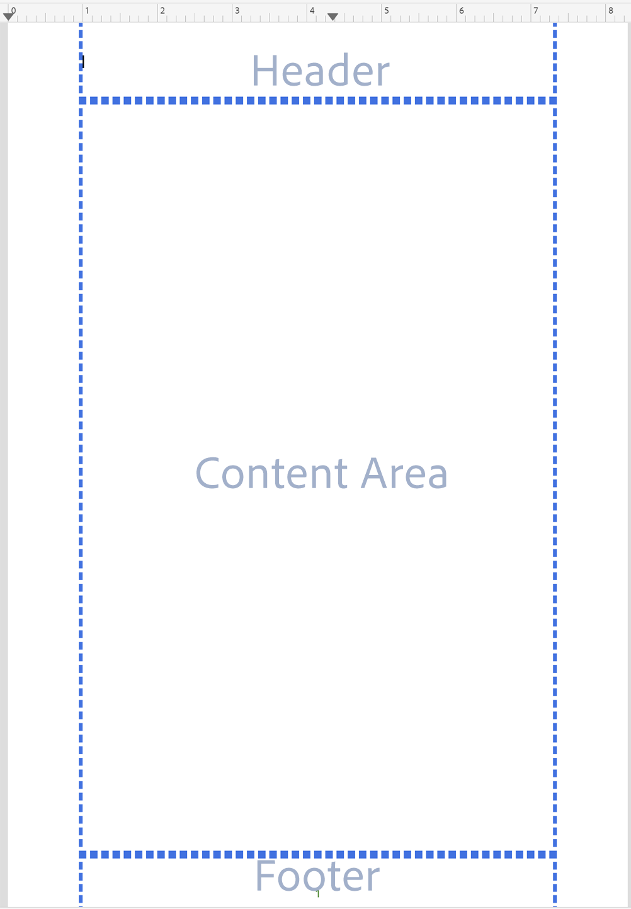
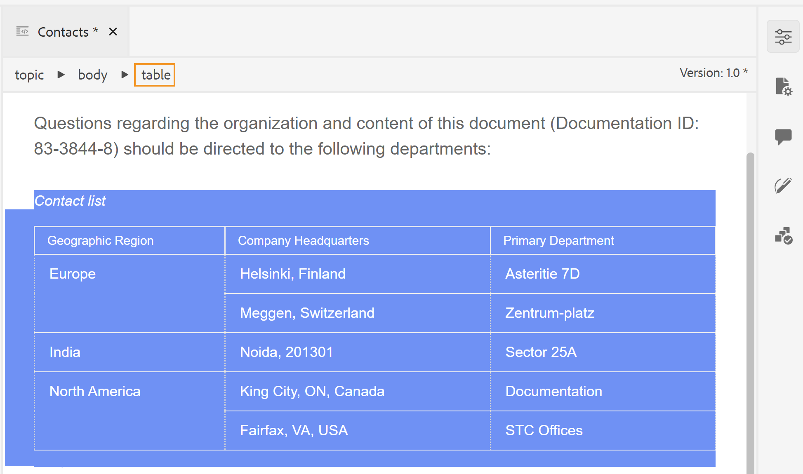
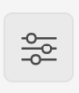
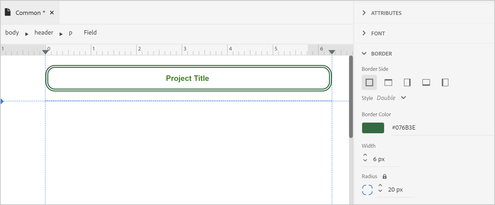

# ページレイアウトのデザイン {#design-page-layout}

PDFのドキュメントを作成する場合は、セクションが異なるので、各種の情報を提供できます。 例えば、PDFのドキュメントは前面または表紙から開始します。これには、会社のロゴ、本のタイトルまたはバージョン情報が含まれます。 その後、章、付録、用語集のページがあります。 PDF ドキュメントの各セクションの外観は異なります。これを行うには、ページレイアウトを作成してカスタマイズします。

ページレイアウトをデザインする場合、ページを構成する様々な要素を定義できます。 例えば、ページのサイズ、余白、ヘッダーとフッター、向き、その他のページ仕様をページ上で定義できます。 PDFのネイティブ公開機能を使用すると、[ ページメディア標準 ](https://www.w3.org/TR/css-page-3/) に従ってページをデザインできます。 ページメディア標準で扱われる設定のほとんどは、Native PDF公開機能のユーザーインターフェイスを使用して簡単にカスタマイズできます。 その他の詳細レベルの書式設定の場合は、Source ビューを使用して独自の CSS コードを記述できます。

ページレイアウトをデザインしたら、これらのレイアウトをPDF ページレイアウト設定の各セクションに関連付ける必要があります。 カスタマイズ用のページレイアウトを作成して開く方法について詳しくは、[ ページレイアウトの作成とカスタマイズ ](components-pdf-template.md#create-customize-page-layout) の節を参照してください。

## ページレイアウトのタイプ {#types-of-page-layout}

通常、PDF ドキュメントには次のセクションが含まれます。

* 表紙
* 目次
* 数値の上昇率
* テーブルの上昇率
* チャプターページまたはトピックページ
* 用語集
* 索引
* バックページ

これらのセクションでは、情報を特定の形式で表示するために、対応するページレイアウトが必要になります。 さらに、奇数ページまたは偶数ページから新しいチャプターを開始するための目印として使用される空白のページを作成することもできます。 その場合は、デフォルトのページレイアウトを使用するか、空白のページに対してページレイアウトを作成します。 詳しくは、[ 新しいページレイアウトの作成 ](components-pdf-template.md#create-page-layout) を参照してください。

**テンプレート/設定** セクションのページレイアウト設定を使用すると、PDFの様々なセクションで使用するページレイアウトを定義できます。 各ページレイアウトには、先頭、右または左の異なるページバリアントを含めることができます。

### 最初、右または左のページレイアウトのバリアントの作成 {#page-layout-variants}

PDF テンプレート内の様々なページレイアウトは、最初、右または左のページレイアウトのバリアントを異ならせることで、さらにカスタマイズできます。 ページレイアウトデザイナーを使用して、これらのページを異なる方法でデザインできます。

>[!NOTE]
>
>ブックのセクションに単一のページ レイアウトを使用する場合は、最初、右、または左のページ レイアウトを作成する必要はありません。

ページレイアウトを作成する際は、次の点を考慮してください。

>[!NOTE]
>
>以下のポイントでは、チャプターページのレイアウトを例として説明しました。 ただし、これらのポイントは他のページレイアウトにも有効です。

* チャプター内のすべてのページに対して 1 つのページレイアウトを使用する場合、バリアントを使用せずに 1 つのチャプターページレイアウトのみを作成します。

* ブックの章の最初のページの外観を変更する場合は、章の最初のページのレイアウトを変更する必要があります。

* 本の左右のページごとに異なるルックアンドフィールを使用する場合は、チャプターページレイアウトの左右のバリエーションを作成する必要があります。

* 章を奇数ページまたは偶数ページから開始する場合は、空白ページ用のページレイアウトを作成するように選択できます。 このページレイアウトは、2 つのチャプターの間のギャップを埋め、チャプターが目的の奇数ページまたは偶数ページから開始されるようにするために使用されます。

  >[!NOTE]
  >
  >空白のページレイアウトを別途作成しない場合は、デフォルトのページレイアウトが使用されます。 ページレイアウトの作成については、[ 新しいページレイアウトの作成 ](components-pdf-template.md#create-page-layout) を参照してください。

次の例では、ページレイアウトのバリアントを作成するプロセスについて説明します。

1. 「新しいページレイアウトの作成」の手順を使用して、「チャプター」ページレイアウトを作成します。

   空白のチャプターページレイアウトが作成され、「ページレイアウト」に追加されます。

   デフォルトでは、ページレイアウトを作成すると、そのページレイアウトも編集用に開かれます。 次のスクリーンショットは、空白（デフォルト）のページレイアウトを示しています。

   

   テンプレートのヘッダー、フッター、およびコンテンツ領域は、デフォルトで作成されます。 ユーザーインターフェイスに用意されているページプロパティやコンテンツプロパティのほか、様々なツール（画像やフィールドの挿入など）を使用して、これらの領域を簡単にカスタマイズできます。

   >[!NOTE]
   >
   >高度な設定の場合は、Source ビューを使用して、カスタムのHTMLと CSS コードを追加できます。

1. **チャプター** レイアウトの上にマウスポインターを置き、**オプション** をクリックしてコンテキストメニューを表示します。

1. **レイアウトバリアントを追加** をクリックまたはマウスでポイントし、作成する目的のページレイアウト（最初、左または右）を選択します。

選択したページレイアウトは、基本のチャプターレイアウトのコピーを使用して作成されます。 つまり、デフォルトのチャプターページレイアウトに変更を加えると、ページレイアウトの作成時に同じ変更がバリアントのページレイアウトに複製されます。

## ページレイアウトのページプロパティの操作 {#page-props-page-layout}

ページレイアウトをデザインする場合、様々なページプロパティを制御できることが不可欠です。 ネイティブのPDF公開機能は、すべての主要なページプロパティをページプロパティパネルにカプセル化します。 ページのプロパティパネルを使用すると、次のセクションの様々なプロパティにアクセスできます。

>[!NOTE]
>
>ページプロパティ パネルはプロパティをカプセル化し、[ ページメディア標準 ](https://www.w3.org/TR/css-page-3/) で定義されているルールに従います。

* **ページサイズ**：ページレイアウトに使用するページサイズを指定します。 「ページサイズ」ドロップダウンリストを使用すると、15 を超えるページサイズから選択できます。 カスタムのページサイズを使用してページレイアウトを作成することもできます。詳しくは、[ ページサイズの設定 ](#set-page-size) を参照してください。

* **向き**：ページレイアウトに使用するページの向きを指定します。 ページの向きは、縦または横から選択できます。 ページレイアウト内の異なるページバリアントに、異なる向きを適用することもできます。 例えば、コンテンツに幅の広いテーブルや大きな画像が含まれている場合、横長のページレイアウトを作成して、幅の広いテーブルや画像にそのレイアウトを適用できます。

* **ビュー回転**：元の上面が回転後に表示される側または方向を指定します。 [ 時計回り 90]、[ 反時計回り 90]、または [ 反時計回り 180] から選択できます。 これは、出力で縦長レイアウトと横長レイアウトを組み合わせて使用する場合に非常に便利です。 例えば、一般的なページレイアウトとして縦を使用したり、幅の広いテーブルをレンダリングするための横のページレイアウトを設定したりできます。 この場合、テーブルコンテンツを時計回りに 90 度表示するようにを設定できます。 こうすることで、ページは横向きになり、コンテンツはビューの連続性を維持するために 90 度回転されます。 これを例としてどのように実現するかを、この節で後ほど説明します。

* **ページ番号**：ページ番号は、デフォルトでは、PDFで連続して付けられます。 例えば、100 ページのPDFの場合、1 ～ 100 の連続したページ番号を持つことができます。 また、すべての異なるセクションまたはセクションの最初のオカレンスで、特定の番号から番号付けを再開することもできます。
   * **再起動元**：このページレイアウトの番号付けを開始するページ番号を指定します。 例えば、チャプターごとに再開するページ番号を設定できます。 その場合、チャプターページレイアウトの最初のページレイアウトバリアントで、restart from プロパティを 1 に設定する必要があります。 デフォルトでは、ページ番号は前のページから継続して付けられます。

   * **最初のオカレンスにのみ適用**：セクションの最初のオカレンスに対してのみ、特定の数から開始することもできます。 例えば、1 から最初のチャプターのみを開始し、他のチャプターのページ番号を続行できます。

* **レイアウト**：ページの余白および上下左右のパディングを指定します。 次の図では、コンテンツの周囲の余白、パディングおよび境界線をレンダリングする方法を説明します。 ページの上部と下部の余白には、ヘッダーとフッターが含まれます。

  

* **背景**：ページレイアウトの背景として画像または色を含めます。 画像の場合は、繰り返しと位置のプロパティと共に、画像の高さと幅を指定できます。

* **脚注**：出力に脚注を表示するプロパティを指定します。 境界線のスタイルに加えて、余白とパディングのプロパティを指定することもできます。

### ページサイズの設定 {#set-page-size}

ページレイアウトで最初に定義する必要があるのは、ページサイズです。 ページプロパティでは、ページレイアウトに 15 ページを超えるサイズを選択できます。 次の手順を実行してカスタムのページサイズを作成することもできます。

1. 必要なページレイアウトを編集用に開きます。

   >[!NOTE]
   >
   >カスタマイズや編集のためにページレイアウトを開く方法については、[ ページレイアウトのカスタマイズ ](components-pdf-template.md#customize-page-layout) セクションを参照してください。

1. 右側のパネルで「**ページプロパティ**」をクリックします。
1. 「**ページサイズ**」ドロップダウンリストから「**カスタム**」を選択します。

   「ページの幅」フィールドと「ページの高さ」フィールドが表示されます。

1. **ページの幅** および **ページの高さ** フィールドに、必要なページのサイズを入力します。

   >[!NOTE]
   >
   >最もよく使用される単位には、px （ピクセル）、pt （ポイント）、rem、em、% （パーセンテージ）、in （インチ）があります。

### ページの向きとビューの回転を使用する {#page-orientation-rotation}

例として、縦長ページと横長ページの向きとビューの回転プロパティを組み合わせて使用する場合を見てみましょう。 この例では、デフォルトの縦向きを使用してPDFを作成しますが、テーブルはコンテンツを時計回りに 90 度のビューで横向きにレンダリングします。 最終的な出力は次のようになります。


上記の出力では、連絡先リスト情報は横向きモードで表示され、コンテンツも 90 度回転されます。 残りのコンテンツは、通常の縦長モードで表示されます。

このような出力を実現するには、次の主なタスクを実行する必要があります。

1. 横向きのページレイアウトを作成します。

1. コンテンツを 90 度でレンダリングするには、「**ビューの回転**」プロパティを変更します。

1. 新しいページレイアウトを使用するカスタムスタイルを作成します。

1. 横ページレイアウトでレンダリングするテーブルの outputclass 定義に、スタイルを追加します。

上記のタスクを実行するには、次の手順を実行します。

1. 横向きのページレイアウトを作成します。
   1. 「新しいページレイアウトの作成」の手順に従って、「横」ページレイアウトを作成します。

   1. 右側のパネルで「**ページプロパティ**」をクリックします。

      
   1. **方向** を **横** に変更します。

1. コンテンツを 90°時計回りにレンダリングするには、「ビューの回転」プロパティを変更します。

   1. 「ビューの回転」ドロップダウンリストから「**時計回りに 90°**」を選択します。

   

   1. **すべて保存** をクリックして、更新したページレイアウトプロパティを保存します。

1. 新しいページレイアウトを使用するカスタムスタイルを作成します。
   1. 左側のサイドバーを展開して、スタイルを作成するテンプレートをダブルクリックします。

   1. 「スタイルシート」セクションを展開します。

   1. レイアウトスタイルシートにカーソルを合わせ、（_オプション_ アイコン）「。..」をクリックして「編集」を選択します。

      レイアウトスタイルシートが編集用に開きます。

   1. **その他のスタイル** を右クリックし、**新規スタイル** を選択します。

      

   1. スタイルを追加ポップアップで、**classname** に **landscape-style** と入力します。

      

   1. 「**完了**」をクリックします。

      `.landscape-style` という名前の新しいスタイルが作成され、[ その他のスタイル ] リストの最後に追加されます。

   1. `.landscape-style` スタイルをダブルクリックして、編集用に開きます。

   1. 「**ページネーション**」プロパティを展開します。

   1. **ページレイアウト** プロパティに「`Landscape`」と入力します。

      

   1. **すべて保存**&rbrack; をクリックして、更新したスタイル プロパティを保存します。

1. 横ページレイアウトでレンダリングするテーブルの `outputclass` 定義に、スタイルを追加します。
   1. DITA ファイルエディタで、新規ページレイアウトを適用するファイルを開きます。

   1. 横モードでレンダリングされる `<table>` 要素を見つけます。

   1. パンくずリストで、テーブル要素をクリックしてテーブルを選択します。

      

   1. 右側のパネルでをクリックし、コンテンツのプロパティ パネルを開きます。

   1. コンテンツのプロパティパネルで、**landscape-style** をプロパティ値として使用して、新しい **outputclass** プロパティを追加します。

      

1. 「**すべて保存**」をクリックして、更新したファイルを保存します。
1. PDF出力を生成します。

最終的なPDFでは、例の最初に示すように、テーブルコンテンツが横長モードでレンダリングされます。

### 背景画像の追加 {#add-bg-image}

必要に応じて、チャプター（PDF）出力の最初のページごとに表示される背景画像を追加できます。 ページプロパティの下にある背景のプロパティを使用すると、背景画像を簡単に追加できます。 この画像をページ全体にレプリケートし、ページの上部、下部、または中央の任意の場所に画像を配置するように選択できます。

例えば、コンテンツ領域の中央に背景画像を挿入するには、次の手順を実行します。

1. 必要なページレイアウトを編集用に開きます。

   >[!NOTE]
   >
   >カスタマイズや編集のためにページレイアウトを開く方法については、[ ページレイアウトのカスタマイズ ](components-pdf-template.md#customize-page-layout) セクションを参照してください。

1. コンテンツ領域内の任意の場所をクリックします。

1. 右側のパネルで「**ページプロパティ**」をクリックします。

1. 「**背景**」セクションを展開します。

1. 「**画像のパス** location フィールドの参照ボタンをクリックします。

1. 背景画像として使用する画像を参照して選択します。

   画像が挿入および複製されて、ページ全体に表示されます。

1. 高さと幅のプロパティを調整して、画像サイズを変更します。

   >[!NOTE]
   >
   >高さまたは幅のプロパティのいずれかを入力できます。画像は縦横比を維持するために自動スケールされます。

1. 他のプロパティを設定して、背景画像の表示方法を調整します。

   * **背景の繰り返し**：背景を繰り返すかどうかを指定します。

   * **背景の位置**：ページ上の背景画像の位置を指定します。

次のスクリーンショットは、Background Repeat プロパティが _no-repeat_ に設定され、Background Position プロパティが _center_ に設定された背景画像を示しています。


## ページのヘッダーとフッターの操作 {#work-header-footer}

ページレイアウトのヘッダーやフッターに情報を含めると、そのページレイアウトを使用するすべてのページでその情報が繰り返されます。 通常、ヘッダー領域はチャプターまたはトピックのタイトルに使用され、フッター領域はページ番号の表示用に使用されます。

新しいページレイアウトを作成すると、ヘッダーとフッターの領域がデフォルトで作成されます。 ページレイアウトのヘッダーおよびフッター領域では、多くのカスタマイズを行うことができます。 例えば、画像（ロゴなど）、変数（動的情報を含む）、静的コンテンツなどを挿入できます。

### ヘッダーとフッターの余白および行を変更する {#header-footer-margins}

既定では、ヘッダーとフッターの余白は 1 インチに設定されています。 このデフォルト値は、ページプロパティパネルで「余白」の設定を変更することで変更できます。 ヘッダーとフッターのサイズを変更するには、次の手順を実行します。

1. 必要なページレイアウトを編集用に開きます。

   >[!NOTE]
   >
   >カスタマイズや編集のためにページレイアウトを開く方法については、[ ページレイアウトのカスタマイズ ](components-pdf-template.md#customize-page-layout) セクションを参照してください。

1. 右側のパネルで「**ページプロパティ**」をクリックします。
1. **レイアウト** セクションを展開します。
1. **Margin** プロパティの横にあるロックアイコンをクリックします。
1. ヘッダーサイズを変更するには、目的の値を「上余白」フィールドに入力します。

   >[!NOTE]
   >
   >最もよく使用される単位には、px （ピクセル）、pt （ポイント）、rem、em、% （パーセンテージ）、in （インチ）があります。

1. フッターサイズを変更するには、目的の値を「下余白」フィールドに入力します。

ヘッダーとフッター領域をデザインして、複数の行を含めることができます。 これを行うには、「HTML要素を挿入」（）アイコンをクリックします。

| _開発者コーナー_:  |
|---|

CSS とHTML コードを直接操作する場合は、次のコードスニペットに示すように、マージンの値を変更できます。

```css
…

<meta name="page-style" content="size:A4 portrait;margin-top:3cm;margin-right:30pt;margin-bottom:1in;margin-left:90px;" />

…
```

>[!NOTE]
>
>上記の例では、別の単位を使用してマージン値を指定しています。

### ヘッダーとフッターの削除 {#remove-header-footer}

ヘッダーとフッターは、上下の余白に重ねて表示されます。 技術的には、ページレイアウトにヘッダーとフッターを配置する場合は、上下の余白に必要なスペースを確保する必要があります。

ページレイアウトにヘッダーとフッターを含めない場合は、次の 2 つの方法で実現できます。

* 上下の余白を保持する場合は、ヘッダーとフッターの領域を空白のままにします。
* マガジンの表紙や裏表紙など、上下の余白を保持しない場合は、上下の余白のプロパティを 0 に設定すると、余白を削除できます。 これにより、ヘッダーとフッターのためのスペースが残されません。

### ヘッダーへの画像またはロゴの追加 {#add-image-header}

ページレイアウトのヘッダー領域（またはその他の部分）に表示する画像を、必要に応じて追加することができます。 ページレイアウトに画像を追加する方法は 2 とおりあります。

* テンプレートのリソースの画像を使用します。
* ページレイアウトエディターの\&lt; 画像を追加\> ツールを使用します。

>[!NOTE]
>
>画像やフォントなど、すべてのテンプレートアセットを管理するには、リソースフォルダーを使用することをお勧めします。

ヘッダー領域に会社のロゴなどの画像を挿入するには、次の手順を実行します。

1. 必要なページレイアウトを編集用に開きます。

>[!NOTE]
>
>カスタマイズや編集のためにページレイアウトを開く方法については、[ ページレイアウトのカスタマイズ ](components-pdf-template.md#customize-page-layout) セクションを参照してください。

1. 「編集」ヘッダー（）アイコンをクリックしてヘッダー領域にカーソルを移動します。

   または、ヘッダー領域内をクリックします。

1. 画像を追加するには、次のいずれかの方法を選択します。
1. **イメージを使用しない** （） ツールバーのアイコン。**パスを選択** ポップアップで画像の場所を参照し、**選択** をクリックして、ヘッダー領域に挿入します。
1. リソース フォルダーからヘッダー領域に画像をドラッグ&amp;ドロップします。

次のスクリーンショットは、ヘッダー領域に追加されたサンプル画像を示しています。


イメージを挿入したら、その属性を変更して、イメージの外観を変更できます。 ページレイアウト上の画像やその他の要素の外観を変更する最も簡単な方法は、コンテンツのプロパティパネルを使用することです。 カスタマイズする UI から使用できる様々なプロパティについては、[ コンテンツのプロパティパネルの操作 ](#work-with-content-props) を参照してください。

### フィールドとメタデータの追加 {#add-fields-metadata}

フィールドは、事前に定義された情報を挿入する場合に非常に役立ちます。 例えば、チャプターのヘッダー領域に「チャプタータイトル」フィールドを含めることができます。このフィールドは、公開時に実際のチャプターのタイトルに置き換えられます。

ページ レイアウトに挿入できるフィールドには、次のカテゴリがあります。

* メタデータ
* トピック タイトル
* チャプタータイトル
* マップ タイトル
* ページ番号
* チャプター番号
* 合計ページ数
* 日付
* 時刻


これらの各フィールド カテゴリには、フィールド情報を挿入できる異なるバリエーションが含まれます。 例えば、日付フィールドには、`YYYY-MM-DD`、`MM/DD/YY`、`MM/DD/YYYY` など、異なるバリエーションを含めることができます。 同様に、ページ番号には、ローマ字、10 進数、またはロケール固有の形式（_アラビア語_、_デバナガリ_、_ヘブライ語_ など）のバリエーションを含めることができます。


定義済みのフィールドに加えて、メタデータ情報を変数またはフィールドとしてページレイアウトに追加することもできます。 このメタデータは、ソース DITA **マップコンテンツ**、**トピックコンテンツ** に保存することも、DITA **マップファイルプロパティ**、**トピックファイルプロパティ** から選択することもできます。

次のオプションからメタデータを選択できます。

* **マップコンテンツ** には、DITA マップの `<topicmeta>` 要素で定義したメタデータが含まれます。
* **マップファイルプロパティ** には、DITA マップの **プロパティ** ページからアクセスできるメタデータが含まれています。
* **トピックコンテンツ** には、著作権、作成者、その他の詳細など、DITA トピックの `<prolog>` 要素で定義されたメタデータが含まれます。 個々の `<prolog>` 要素を取得するには、単純な XPath 式を使用できます（例：作成者名に//author）。 属性メタデータの場合は、XPath に `@` 記号を含めます（例：変更日の//critdates/revised/@modified）。
* **トピックファイルのプロパティ** メタデータが含まれます。このメタデータは、トピックの **プロパティ** ページからアクセスできます。


**マップファイルプロパティ** および **トピックファイルプロパティ** のメタデータを 1 つのドキュメントに結合できます。 例えば、表紙にマップのタイトル、その他のページの見出しにトピックのタイトルを含めるPDFを公開できます。 これを行うには、**マップ ファイル プロパティ** から表紙レイアウトにマップ タイトル メタデータを追加します。 次に、**トピックファイルプロパティ** からトピックのタイトルメタデータをチャプターとトピックのページレイアウトのヘッダーに追加します。

一方のトピックがページで終了し、もう一方が同じページで開始した場合、最初のトピックのメタデータが選択されます。 また、カスタムプロパティを追加し、それらをフィールドとしてページレイアウトに挿入することもできます。


>[!NOTE]
>
> メタデータフィールドは、「開始 **ドロップダウンでのアセットまたはマップの選択に従って表示さ** ます。


<!--For more information, see [Add fields and metadata](design-page-layout.md#add-fields-and-metadata).-->

次の例では、ページレイアウトのフッター領域にページ番号とチャプタータイトルを挿入します。

1. 必要なページレイアウトを編集用に開きます。

   >[!NOTE]
   >
   >カスタマイズや編集のためにページレイアウトを開く方法については、[ ページレイアウトのカスタマイズ ](components-pdf-template.md#customize-page-layout) セクションを参照してください。

1. **フッターを編集** （）アイコンをクリックして、フッター領域にカーソルを移動します。

   または、フッター領域内をクリックします。

1. HTML **段落要素を挿入** （）アイコンをクリックし、要素のリストから「段落」を選択します。

1. **フィールドを挿入** （）アイコンをクリックします。

   フィールド ポップアップが表示されます。

1. [ フィールド ] ボックスの一覧から **ページ番号** カテゴリを選択し、[ 書式 ] ボックスの一覧から **既定（1）** ページ番号の書式を選択して、[**挿入**] をクリックします。

   

   >[!NOTE]
   >
   >また、デフォルトの形式を除くすべてのフィールドの形式を編集することもできます。 編集するには、編集する形式の横にある編集アイコンをクリックし、変更を加えて「OK」をクリックします。 詳しくは、[ フィールドとメタデータの追加 ](#add-fields-metadata) を参照してください。

   デフォルトのページ番号フィールドは、ページレイアウトのフッター領域に挿入されます。

   

   上部のパンくずリストには、情報が保存されている要素が表示されます。

1. ページ番号フィールドの後に空白を入力し、「**フィールドを挿入**」アイコンをクリックします。

1. 「フィールド」リストから **チャプタータイトル** カテゴリを選択し、「形式」リストから **チャプタータイトル** 形式を選択して、「**挿入**」をクリックします。

   公開時にチャプターのタイトルが設定された _チャプタータイトル_ フィールドが、フッター領域に挿入されます。 この場合、ページ番号フィールドとチャプタータイトルフィールドはスペースで区切られます。

   

1. チャプタータイトルを右揃えにするには、次の手順を実行します。

   1. パンくずリストのフィールド要素をクリックして、「チャプタータイトル」フィールドを選択します。

   1. 右側のパネルで「**コンテンツのプロパティ** （）アイコンをクリックします。

   1. 「**レイアウト** プロパティ」セクションを展開し、「**浮動小数**」プロパティ値を「**右**」に設定します。

      

      チャプタータイトル フィールドが、ページフッターの右側に配置されます。
      


| _開発者コーナー_:  |
|---|

CSS とHTML コードを直接操作する場合は、Sourceのページレイアウト表示に移動して、コードを変更することもできます。 次のコードスニペットは、このコードを使用して行われた同じフッター設定を示しています。

```css
…
<p>

<span data-field="page-number" data-format="default">1</span>

<span data-field="chapter-title" data-format="default" style="float: right">Chapter Title</span>

</p>
…
```

## コンテンツ領域の操作 {#content-area}

コンテンツ領域は、コンテンツ領域の観点から見ると最大の領域です。 コンテンツ領域には、トピックのコンテンツが入力されます。 特殊なケースでは、コンテンツ領域にボイラープレートコンテンツを追加できます。 このコンテンツは、ページレイアウトの指定された場所で公開されます。 例えば、目次、用語集、インデックスの見出しをボイラープレートコンテンツとして追加し、最終的な出力で「そのまま」公開することができます。 もう 1 つの例として、通常は各チャプターの最初のページに追加されるチャプター目次があります。

コンテンツ領域で最も一般的に使用されるカスタマイズの 1 つは、複数列のレイアウトです。 強力なページレイアウトデザイナーを使用すると、特定のページをカスタマイズして複数の列でレンダリングしながら、他のページのコンテンツは 1 つの列に保持できます。

以降の節では、コンテンツ領域をカスタマイズするための様々なシナリオについて説明します。

### チャプター目次の追加 {#add-chapter-toc}

チャプター目次は、読者がチャプター内の内容を知るためのクイックリファレンスの役割を果たします。 通常、チャプター目次はチャプターの最初に追加されます。 そのため、チャプター目次を使用する場合は、メインのチャプターページレイアウトのコンテンツ領域またはチャプターの最初のページレイアウトバリアントにチャプター目次を追加できます。

次の例では、チャプターの最初のページレイアウトにチャプター目次を挿入します。

>[!NOTE]
>
>この手順では、チャプターページレイアウトの最初のページバリアントを既に作成していることを前提としています。 ページバリアントの作成方法については、[ 最初、右または左のページレイアウトのバリアントの作成 ](#page-layout-variants) を参照してください。

1. 必要なページレイアウトを編集用に開きます。

   >[!NOTE]
   >
   >カスタマイズや編集のためにページレイアウトを開く方法については、[ ページレイアウトのカスタマイズ ](components-pdf-template.md#customize-a-page-layout) セクションを参照してください。

1. ページレイアウトのコンテンツ領域にカーソルを置きます。

1. チャプター目次（）をクリックします）アイコンをクリックします。

   デフォルトのチャプター目次がコンテンツ領域に挿入されます。

   

   >[!NOTE]
   >
   >デフォルトのチャプター目次には、見出し 1～4 が含まれます。 ここで、見出し 1 はチャプタータイトル自体です。 したがって、目次にチャプタータイトルを再度含めたくない場合や、目次に必要な見出しのレベルを上げたい場合があります。 プロパティを変更することで、目次をカスタマイズできます。

1. コンテンツのプロパティパネルを開き、目次の見出しレベルをカスタマイズします。

   たとえば、[ 見出し 2] から開始する場合は、最初のドロップダウン リストを [2] から開始するように変更します。

   

   同様に、レベル 5 まで見出しを追加する場合は、2 番目のドロップダウンリストを 5 に変更します。 更新された目次は次のようになります。

   

   >[!NOTE]
   >
   >最終的に公開されたPDFには、章のコンテンツに基づく目次エントリのみが表示されます。 チャプターにレベル 5 の見出しがない場合、最終的な出力には表示されません。

デフォルトの目次のルックアンドフィールは、スタイルシートを使用してカスタマイズできます。 `chaptoc-level-#` で始まるスタイル（`chaptoc-level-1`、`chaptoc-level-2` など）を使用して、チャプター目次のスタイルをカスタマイズします。<!--For more details on the stylesheet elements used in the TOC and how to customize them, see _Customize default chapter TOC_-->。

>[!IMPORTANT]
>
>現在、スタイルシートでスタイルを更新しても、コンテンツプレビューに反映されない場合があります。 ただし、出力は更新されたスタイルでレンダリングされます。

### 複数列のページレイアウトの操作 {#multi-column-layout}

複数列のページレイアウトは、雑誌や本のインデックスを公開する場合に非常に一般的です。 PDFのネイティブ公開機能を使用すると、ドキュメントを複数の列に簡単に分割できます。 異なるページレイアウトを使用して、特定のセクションのみを複数の列に分割し、他のセクションは 1 列（または通常の）レイアウトを維持するように選択できます。

複数の列を持つページレイアウトを作成するには、次の手順を実行します。

1. 必要なページレイアウトを編集用に開きます。

   >[!NOTE]
   >
   >カスタマイズや編集のためにページレイアウトを開く方法については、[ ページレイアウトのカスタマイズ ](components-pdf-template.md#customize-a-page-layout) セクションを参照してください。

1. 複数列のレイアウトがコンテンツ（ヘッダーおよびフッター領域を除く）に適用されるので、パンくずリストでコンテンツ要素を選択する必要があります。

   コンテンツのパンくずリストを選択すると、コンテンツのプロパティパネルに複数の列のプロパティが表示されます。

   

1. 複数列のプロパティを使用して、複数列のページレイアウトをカスタマイズします。

   * **列数：** ページを分割する列数を指定します。 上向き矢印アイコンと下向き矢印アイコンを使用するか、数値を入力して列数を設定します。

   * **列の幅：** 複数列のレイアウトにおける列の幅を指定します。 デフォルトでは、サイズはピクセル（px）単位で設定され、pt、rem、em、%、または単位で指定することもできます。

     >[!NOTE]
     >
     >サイズを指定しない場合、列は指定したページに収まるように均等に分割されます。 ほとんどの場合、この値を指定する必要はありません。

   * **列ギャップ**：個々の列間の間隔を指定します。

   * **列の範囲**：ページレイアウトの任意の要素を複数の列にまたがって表示する場合は、このプロパティを使用する必要があります。 これを行うには、スタイルシートを使用して目的の要素のスタイルを変更します。<!--for more information see _Section explaining style customization_-->。

   ページレイアウトでは、特定のテキストをすべてのチャプターページレイアウトの最初のページに表示する場合、そのテキストをチャプターページレイアウトの最初のページバリアントに追加できます。

   次の例に示すように、見出しテキストの Span Column/スパン カラム プロパティを [all/すべて ] に設定します。 これにより、ドキュメントが複数列の場合でも、見出しが複数の列にまたがって表示されます。

   

   >[!IMPORTANT]
   >
   >outputclass 属性を使用して、任意の DITA 要素に Span Column プロパティを適用できます。

   * **列の塗りつぶし**：コンテンツが列にどのように塗りつぶされるかを指定します。 デフォルトでは、バランスに設定されており、各列に等しい量のコンテンツが入力されます。

   * **段間罫線**：列間に行を挿入する場合は、このプロパティを使用して行や罫線のスタイルを定義します。 列間に線を追加するには、罫線のスタイル、色、幅の値を指定します。

## コンテンツのプロパティパネルの操作 {#work-with-content-props}

コンテンツプロパティパネルを使用すると、ページレイアウト上の要素のルックアンドフィールを簡単に更新できます。 コンテンツのプロパティパネルのプロパティは、次のセクションに分かれています。

* **フォント**：テキスト関連のプロパティが含まれます。 フォントファミリー、太さ、サイズ、テキストの装飾（アンダーライン、オーバーライン、ラインスルーなど）、テキストスタイル（太字、斜体など）、テキストの整列（左、右、中央または両端揃え）、空白の処理（事前定義フォーマット、非折り返し、区切りスペースなど）、行の高さ、文字間隔、テキストのインデントを設定できます。

* **ボーダー**：ページレイアウトの要素にボーダーを追加および書式設定するプロパティが含まれています。 境界線（Border Side）（すべて、上、下、右、左）、境界線のスタイル（実線、破線、点線など）、境界線のカラー、幅、半径を設定して、曲線的な境界線を作成できます。 次の例では、ページのヘッダー領域に曲線の境界線が追加されています。

  

* **レイアウト**：ページレイアウト内の要素のレイアウトを設定するためのプロパティが含まれています。 高さ、幅、余白および余白（上、下、左または右）、水平方向または垂直方向の整列、浮動小数（左、右またはなし）、消去（左、右、両方またはなし）、要素の位置（絶対、固定、相対または以上）、表示（ブロック、コンテンツ、固定または以上）、Z インデックス、透明度、変換（回転またはスケール）、変換原点（X および Y オフセット）を設定できます。

* **背景**：背景画像またはカラーシェードを含むプロパティが含まれます。 画像サイズ（高さまたは幅を設定）、背景の繰り返し（繰り返し、繰り返しなし、丸みまたは複数）および背景の位置（左、上、右、中央、下など）を設定できます。
* **複数列**：ページまたは特定の要素（チャプター目次など）について複数列のプロパティを設定するためのプロパティが含まれます。 プロパティとその使用方法について詳しくは、[ 複数列のページレイアウトの操作 ](#multi-column-layout) を参照してください。
