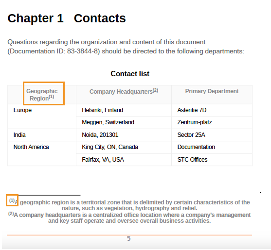

# 脚注スタイルの適用


脚注とは、ページの下部に配置されたメモで、テキストの指定された部分に対するコメントや引用を行います。

すべての脚注には、ページの下部に脚注マーカーがあります。これは一般的に、アスタリスクのような数字または記号です。 メインコンテンツ内では、同じ脚注マーカーが脚注呼び出しとして表示され、上付き文字と同じ番号または記号で示されます。


## 脚注呼び出しとマーカーのスタイルを変更する

脚注の呼び出しとマーカーのスタイルを変更し、PDF出力でそのアピアランスを管理できます。 これらのスタイルは、文書内の脚注をすばやく識別するのに役立ちます。


**例1**:

脚注の呼び出しとマーカーの前後にブラケットを追加するには、次の例を使用します。

* `footnote-call` スタイルのcontent属性を使用して、プレフィックス「（」とサフィックス「）」を追加します。これにより、トピックコンテンツの脚注番号の周囲に括弧が追加されます。
* `footnote-marker` スタイルのcontent属性を使用して、プレフィックス「（」とサフィックス「）」を追加します。これにより、ページの下部にある脚注番号の周囲に括弧が追加されます。

```css
...
.fn::footnote-call { 
content: "(" counter(footnote, decimal) ")"; 
} 

.fn::footnote-marker { 
content: "(" counter(footnote, decimal) ")"; 
} 

...
```




*脚注の呼び出しと脚注マーカーの周囲に角括弧を追加します。*

**例2**:

脚注の呼び出しとマーカーに、数字の代わりにアスタリスクまたは低いギリシャ文字を使用してフラグを設定することもできます。


```css
.fn::footnote-call {
 content: counter(footnote, asterisks);
}
.fn::footnote-marker {
 content: counter(footnote, asterisks) " ";
}
```

出力には、次のような表示が表示されます。


*脚注の呼び出しとマーカーにアスタリスクを追加します。*

## 脚注呼び出しを非表示にする

特定の属性を持つ脚注呼び出しにスタイルを適用することもできます。 例えば、次のスタイルを使用して、IDを含む脚注を非表示にします。
脚注呼び出しはメインコンテンツでは非表示ですが、脚注マーカーはページの下部に表示されます。

```css
.fn[id]::footnote-call {
        display: none;
                        }
```

## 脚注領域の書式設定

脚注領域は、すべての脚注が配置される場所で、通常はページの下部にあります。 脚注領域は、ページレイアウトまたはCSS スタイルを使用して書式設定できます。


### ページレイアウト

ページレイアウトのページプロパティを使用して、PDF ドキュメントの様々なセクションの脚注領域にスタイルを設定できます。 例えば、章の脚注領域の余白とパディングのプロパティを指定できます。 境界線の側面、スタイル、カラー、幅、半径も変更できます。

ページレイアウト [&#128279;](./design-page-layout.md#page-props-page-layout)のページプロパティを操作する方法について説明します。

### CSS スタイル

PDF ドキュメント内の脚注領域にスタイルを適用し、書式を設定することができます。 例えば、境界線の長さ、スタイル、色、幅を変更できます。

```css
   @page {
     @footnote {
           border-top-style: solid;
           border-top-color: #FF0000;
           border-top-width: 3px;
                 }
         }
```

## 脚注の番号付けを再開する

デフォルトでは、脚注は文書内で連続して番号が付けられます。 ただし、ページレイアウトやCSS スタイルを使用して、脚注の番号付けを再開できます。


### ページレイアウト

ページレイアウトで番号を指定すると、PDF ドキュメントの様々なセクションで脚注番号を再開できます。 例えば、ページプロパティパネルの「**から番号を再開」フィールドから番号を選択して、各章の脚注の番号を再開します。**

### CSS スタイル

次のスタイルを使用して、PDF出力の各ページの脚注番号をリセットします。

```css
@page
{
counter-reset: footnote
}
```

そのため、各ページの脚注は1から再開します。

## インライン脚注の表示

通常、各脚注はブロックとして表示されるか、新しい行から始まります。 ラインに配置したり、横に配置したりすることもできます。

```css
.fn{
      display: inline;
              }
```

## 脚注の相互参照にスタイルを適用する

PDF出力では、脚注を相互参照したり、同じ脚注を複数回参照したりすることもできます。 これにより、ドキュメント内で同じ引用や詳細なメモを何度も作成することなく参照することができます。

例えば、次のスクリーンショットは、同じ脚注がPDF出力のすべての市区町村に相互参照される様子を示しています。


*脚注への相互参照を挿入します。*


CSS スタイルを使用して、脚注への相互参照を書式設定することもできます。 例えば、相互参照の背景色を変更できます。

```css
    .xref-fn{
    background-color: red;
    }
```


