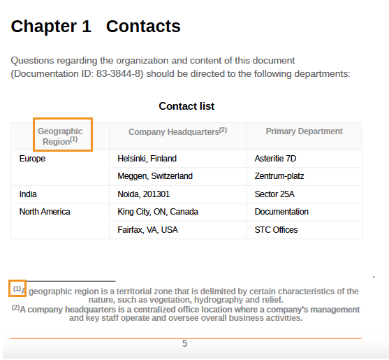

# 脚注のスタイルの適用


脚注は、ページの下部に配置されるメモで、テキストの指定された部分についてコメントしたり参照を引用したりします。

すべての脚注には、ページの下部に脚注マーカーが表示されます。通常は、アスタリスクのような数字または記号です。 メインコンテンツ内では、同じ脚注マーカーが脚注の呼び出しとして表示され、上付き文字と同じ番号または記号で示されます。


## 脚注の呼び出しとマーカーのスタイルの変更

脚注の呼び出しとマーカーのスタイルを変更し、PDF出力での外観を管理できます。 これらのスタイルを使用すると、文書内の脚注をすばやく識別できます。


**例 1**:

次の例では、脚注の呼び出しとマーカーの前後に角括弧を追加できます。

* `footnote-call` スタイルのコンテンツ属性を使用して、接頭辞「（」と接尾辞「）」を追加します。これにより、トピック コンテンツ内の脚注番号を角括弧で囲むようになります。
* `footnote-marker` スタイルのコンテンツ属性を使用して、接頭辞「（」と接尾辞「）」を追加します。これにより、ページの下部にある脚注番号を囲む角括弧が追加されます。

```css
...
.fn::footnote-call { 
content: "(" counter(footnote, decimal) ")"; 
} 

.fn::footnote-marker { 
content: "(" counter(footnote, decimal) ")"; 
} 

...
```




*脚注の呼び出しと脚注マーカーを括弧で囲みます。*

**例 2**:

脚注の呼び出しとマーカーには、数字ではなくアスタリスクまたはギリシャ語の小文字を使用してフラグを付けることもできます。


```css
.fn::footnote-call {
 content: counter(footnote, asterisks);
}
.fn::footnote-marker {
 content: counter(footnote, asterisks) " ";
}
```

出力には、次のように表示されます。


*脚注の呼び出しとマーカーにアスタリスクを追加します。*

## 脚注の呼び出しを非表示

特定の属性を持つ脚注の呼び出しにスタイルを適用することもできます。 例えば、次のスタイルを使用して、ID を持つ脚注を非表示にします。
脚注の呼び出しはメインコンテンツでは非表示になりますが、脚注マーカーはページの下部に表示されます。

```css
.fn[id]::footnote-call {
		display: none;
                        }
```

## 脚注領域の書式設定

脚注エリアは、すべての脚注が配置される場所で、通常はページの下部にあります。 脚注エリアの書式を設定するには、ページレイアウトまたは CSS スタイルを使用します。


### ページレイアウト

ページレイアウトのページプロパティを使用して、PDF文書内の異なるセクションの脚注エリアのスタイルを設定することができます。 例えば、チャプター内の脚注エリアの余白とパディングのプロパティを指定できます。 境界線の辺、スタイル、色、幅、半径を変更することもできます。

[&#x200B; ページレイアウトのページプロパティの操作 &#x200B;](./design-page-layout.md#page-props-page-layout) 方法について説明します。

### CSS スタイル

PDF文書の脚注領域にスタイルを適用して書式を設定できます。 例えば、境界線の長さ、スタイル、色、幅を変更できます。

```css
	@page {
	  @footnote {
   		border-top-style: solid;
   		border-top-color: #FF0000;
   		border-top-width: 3px;
 		        }
	      }
```

## 脚注の番号付けを再開します

デフォルトでは、脚注は文書内で連続して番号が付けられます。 ただし、ページレイアウトまたは CSS スタイルを使用して、脚注の番号付けを再開することができます。


### ページレイアウト

ページレイアウトで数値を指定すると、PDF文書内の別のセクションの脚注の番号付けを再開できます。 例えば、ページプロパティパネルの **番号付けの再開** フィールドから番号を選択して、各チャプターの脚注の番号付けを再開します。

### CSS スタイル

次のスタイルを使用して、PDF出力の各ページの脚注の段落番号をリセットします。

```css
@page
{
counter-reset: footnote
}
```

したがって、各ページの脚注は 1 から再開されます。

## 脚注のインライン表示

通常、各脚注はブロックとして表示されるか、新しい行で開始します。 ただし、それらを並べたり、隣り合わせに配置したりすることもできます。

```css
.fn{
  	display: inline;
              }
```

## 脚注の相互参照へのスタイルの適用

脚注を相互参照して、PDF出力で同じ脚注を複数回参照することもできます。 これにより、同じ引用や詳細なメモをドキュメント内で何度も参照するときに、再度脚注を作成する必要がなくなります。

例えば、次のスクリーンショットは、同じ脚注がPDF出力内のすべての都市にどのように相互参照されるかを示しています。


*脚注への相互参照を挿入します。*


CSS スタイルを使用して、脚注への相互参照の形式を設定することもできます。 例えば、相互参照の背景色を変更できます。

```css
    .xref-fn{
	background-color: red;
	}
```


