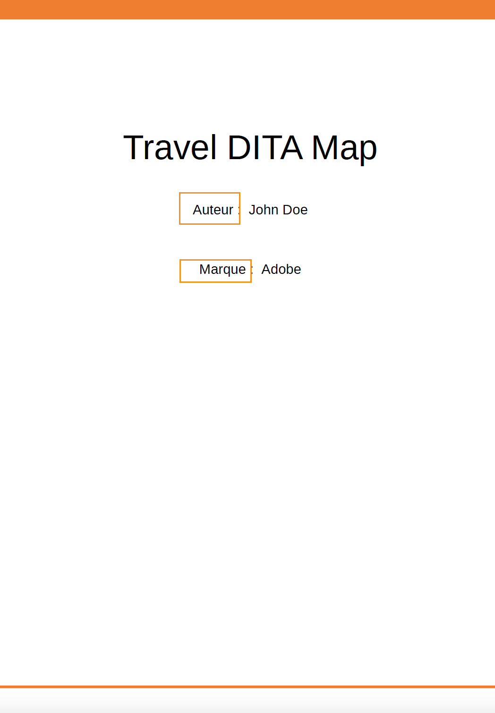

# 言語変数のサポート

Adobe Experience Manager Guidesには、言語変数を使用する機能が用意されています。 言語変数を使用して、PDF出力にローカライズされた文字列を定義したり、出力テンプレートに静的テキストをローカライズしたりできます。 CSS スタイルを使用して、CSS から取得する文字列をローカライズすることができます。

## PDF出力での言語変数の使用

言語変数を使用して、標準提供のラベルのローカライズ版を定義できます（メモ、注意、警告、PDF出力の静的テキストなど）。 変数名はすべての言語で同じですが、様々な言語で異なる値を持つことができます。 これらの変数の値を 1 つ以上の言語で更新すると、ローカライズされた値がPDF出力で自動的に選択されます。

例えば、PDF出力にラベル `Note` を表示するには、次のような方法があります。

- 英語：Note

- フランス語：Remarque

- ドイツ語：ヒンワイス


*英語、フランス語、ドイツ語のサンプルノート。*

>[!NOTE]
>
> 変数の値が特定の言語で定義されていない場合、AEM Guidesは、フォールバックメカニズムとして UI の言語（アプリケーションのユーザーインターフェイス）から文字列を選択します。
>
> UI の言語で値を定義していない場合は、英語（`en_us`）が検索されます。それ以外の場合は、英語（`en`）の値が選択され、PDFの出力に表示されます。

## 言語変数のタイプ

AEM Guidesは、アプリケーション変数とユーザー変数の 2 種類の変数をサポートしています。

### アプリケーション変数

AEM Guidesには、事前定義済みまたは標準のアプリケーション変数のセットが用意されています。 これらの事前定義済みの変数を使用して、AEM Guidesに固有のドキュメントに関する情報を追加できます。 例えば、ページに `chapter-number` 変数を含めると、そのページが属する章番号が表示されます。 `author-label` 変数には、ドキュメント作成者の名前が表示されます。

>[!NOTE]
>
> アプリケーション変数の値を上書きできます。


### ユーザー変数

また、新しい言語変数を作成することもできます。 例えば、ドキュメントのパブリッシャーのラベルとしてユーザー変数 Publisher を作成できます。

>[!NOTE]
>
>  ユーザー変数を作成し、アプリケーション変数を編集するには、管理者権限が必要です。


*選択した言語の言語変数を追加および表示します。*

## 新しい言語変数を追加

1. エディターで、左パネルに移動し、「**言語変数**」を選択します。 このオプションは、「その他」セクションで使用できます。
1. 「**編集**」を選択して、「**言語変数** ウィンドウを開きます。 選択した言語に存在するアプリケーションおよびユーザー変数が、アルファベット順に表示されます。 選択した言語に従って値が表示されます。 例えば、フランス語を選択した場合、「ヒント」は「Conseil」と表示されます。
1. **言語** ドロップダウンから、変数を編集する言語を選択します。

   >[!NOTE]
   >
   > 目的の言語が表示されない場合は、「言語を設定 **設定から目的の言語を有効に** ます。 設定を選択  言語の設定 **ダイアログボックスを開く** とができます。

1. **名前** 列に変数名を、**値** 列に値を入力します。

   >[!NOTE]
   >
   >任意のHTML コンテンツを変数値として使用し、変数値を特定の形式で表示できます。 例えば、変数値にタグ `<b>` 追加して、公開者を太字で表示できます。

1. 「**言語変数を追加**」を選択します。 選択した言語に新しい言語変数を追加で  ません。 1 つの言語に変数を追加すると、その変数がすべての言語に自動的に追加されます。 既存の変数と同じ名前の変数を作成することはできません。 エラーが表示されます。

>[!NOTE]
>
> **言語変数を追加** を選択しない場合、変数は作成されず、リストにも追加されません

## 言語変数の書き出しと読み込み

Experience Manager Guidesでは、選択した言語に存在する言語変数を書き出しおよび読み込むことができます。 すべての言語変数を、定義済みの値と共に簡単に書き出すことができます。 これには、アプリケーション変数とユーザー変数の両方が含まれます。 書き出したファイルを使用して、必要な変更を値に加えたり、他の言語にローカライズしたりできます。

また、言語変数を含む XML ファイルを読み込むこともできます。 Experience Manager Guidesでは、application 変数と user 変数の両方を含め、既に定義されている言語変数のみが読み込まれます。 まだ定義されていない変数は読み込まれません。

### 言語変数の書き出し

言語の言語変数を書き出すには、ドロップダウンから言語を選択して、「**書き出し**」を選択します  などの相対リンクにすることも可能です。
`language_variable_<ln>` という形式の XML ファイルが作成されます。`<ln>` は選択された言語のコードです。 例えば、英語は `language_variable_en.xml`、フランス語は `language_variable_fr.xml` です。

>[!NOTE]
> 
>言語変数に未保存の変更がある場合、それらを書き出すことはできません。 変更を保存して、有効な **書き出し** を表示します  アイコン。

### 言語変数の読み込み

言語変数を読み込むには：

1. ドロップダウンから言語を選択し、「**読み込み**」を選択します 。
2. 言語変数を含む XML を参照して選択します。 例えば、language_variable_en.xml のように指定します。
次の形式の XML ファイルを読み込むことができます。

```
<?xml version="1.0" encoding="UTF-8"?>
<variables>    
<variable id="note-important">Important: </variable>    
<variable id="note-caution">Avertir: </variable>    
<variable id="image-with-text">Text and image &lt;img src=&quot;/content/dam/assets/images/image_with_text.png&quot; /&gt; </variable> 
</variables> 
```

ファイルを読み込むと、同じ ID を持つ変数が読み込まれます。 選択した言語の変数の値が XML ファイルの変数の値で更新されます。  更新された変数の数に関するメッセージが表示されます。

>[!NOTE]
> 
><ul><li>ファイルが XML ファイルでない場合や、言語変数に対応しない間違った形式がファイルに含まれている場合は、XML ファイルに問題があるというエラーが表示されます。 
>&gt;<li>ファイルに同じ ID の変数が含まれていない場合は、読み込まれたファイルに一致する言語変数が見つからないという警告が表示されます。

### 言語変数のオプション

変数にポインタを合わせると、その **オプション** メニューが表示されます。


***オプション**&#x200B;メニューを使用して、言語変数を削除、プレビューまたは複製します。*

アプリケーション変数とユーザー変数の両方をプレビューできます。 変数の値が出力にどのように表示されるかを確認するには、選択した変数の **オプション** メニューから **プレビュー** を選択します。
ユーザー変数として **削除** または **複製** を選択することもできます。 ある言語から変数を削除すると、すべての言語から自動的に削除されます。

### アプリケーション変数を編集または元に戻す

また、アプリケーション変数の値を編集することもできます。 後で、アプリケーション変数を元の値に戻すことができます。 **リセット**  は、値が変更されたアプリケーション変数に対して表示されます。

## 出力テンプレートでの言語変数の使用

ローカライズしたドキュメントには、言語変数を追加する必要があります。 これらの言語変数は、ローカライズされたドキュメントの異なるページに表示されるページレイアウト内に挿入できます。 例えば、ページレイアウトのヘッダー領域（またはフッターや本文などの他の部分）に表示される `author-name` ージの言語変数を追加できます。





*フランス語用に生成されたPDF出力にローカライズされた作成者とブランド名。*

ヘッダー領域に `copyright-label` などの言語変数を挿入するには、次の手順を実行します。

1. 必要なページレイアウトを編集用に開きます。

   >[!NOTE]
   >
   > ページレイアウトを開いてカスタマイズや編集をおこなうための「[ ページレイアウトをカスタマイズ ](../native-pdf/components-pdf-template.md#customize-a-page-layout-customize-page-layout)」セクションを表示します。

1. ヘッダーを選択してアクティブにし、変数を挿入します。
1. 「**変数を挿入**」を選択します。  ツールバーのを  きます。
1. **変数を挿入** ポップアップで、挿入する言語変数の名前を選択し、**挿入** をクリックして、ヘッダー領域に挿入します。

   >[!NOTE]
   >
   > テキストボックスに検索文字列を入力することもできます。 指定された文字列を含む変数名がフィルタリングされ、リストに表示されます。
   > 選択した言語変数がヘッダー領域に挿入されます。


*ヘッダー領域に追加された `copyright-label`。*

### 言語変数へのコンテンツスタイルの適用

言語変数に割り当てた値の他に、HTML タグを使用して変数値を特定の形式で表示することもできます。 例えば、`publisher-label` の値を太字で表示することができます。

- タグを使用して値のスタイルの書式設定 <span> 行うこともできます。 例えば、page-number 言語変数を使用して、ページ番号をローマ字形式の英語で表示し、他の言語の形式を指定できます。

  英語の値：
  `<span data-field="page-number" data-format="upper-roman">1</span>`

  タミル語の値：
  `<span data-field="page-number" data-format="tamil">1</span>`

同様に、ページレイアウトのフィールドの挿入機能にリストされている言語変数を追加し、その他のフィールドを書式設定することができます。 フィールドの追加について詳しくは、[ フィールドとメタデータの追加 ](../native-pdf/design-page-layout.md#add-fields-metadata) を参照してください。

- また、値にローカライズされた画像を追加することもできます。 例えば、チャプター番号言語で画像アイコンを追加すると、PDF出力でそのアイコンのローカライズされた画像を取得できます。

  英語の場合、画像の変数値は `` のようになります。ドイツ語の同じ変数の場合は `` になります。 そのため、言語に応じて画像を選択します。

## CSS スタイルを使用して文字列をローカライズする

CSS スタイルを使用すると、チャプター、セクション、図、テーブルなど、自動番号で使用する文字列をローカライズすることもできます。 これらの文字列は CSS ファイルから得られるので、言語変数を使用してローカライズすることはできません。 これらの文字列をローカライズするには、文字列をローカライズする言語ごとに CSS スタイルを作成します。
例えば、次の CSS を使用して、チャプターのプレフィックスと対応する数値形式を様々な言語で表示できます。
例えば、次の CSS を使用して、チャプターをドイツ語で Hoofdstuk として表示し、チャプター番号を 10 進数形式で表示することができます。 日本語の場合は、日本語の表示形式を使用して、目次にチャプター番号を表示できます。

```
// for English
h1:before {
  counter-increment: h11;
  content: "Chapter " counter(h11, decimal)".";
}

// for German
:root:lang(de) h1:before {
  content: "Hoofdstuk " counter(h11, decimal)".";
}

// for Japanese
:root:lang(ja) h1:before {
  content: "章 " counter(h11, japanese-formal)".";
}
```

次のスクリーンショットは、ドイツ語出力と日本語PDF出力にローカライズされた文字列を示しています。


### プレフィックスのフォーマット

CSS スタイルを使用すると、接頭辞の書式設定も可能です。 例えば、様々な言語のPDF出力で赤で表示されるようにラベル `Note` を書式設定できます。

```
.note .prefix-content 
{
color: red;
} 
```
