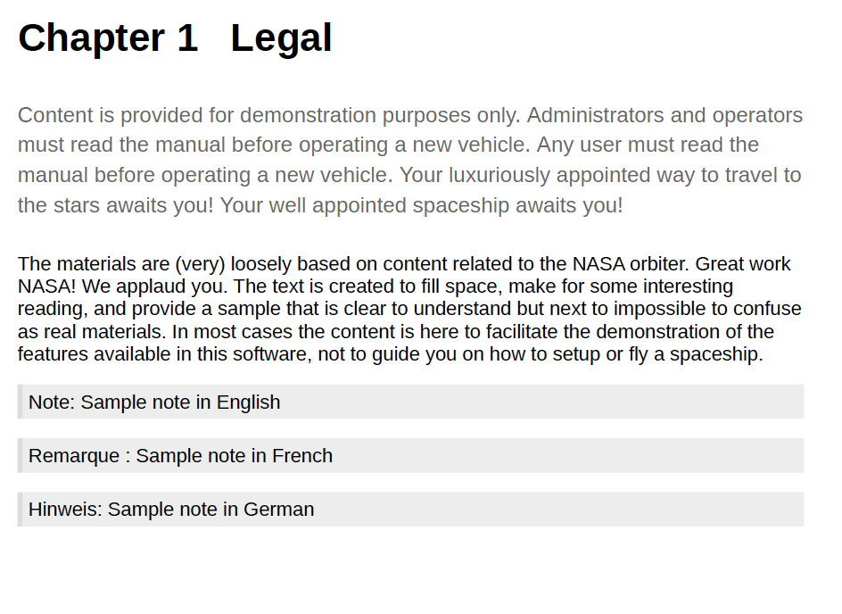
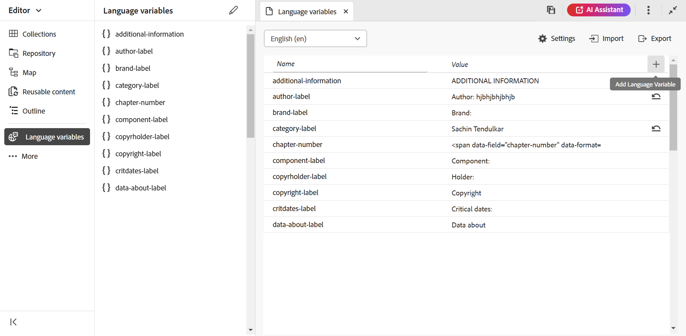
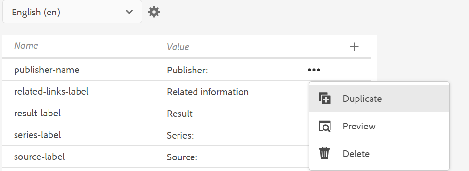
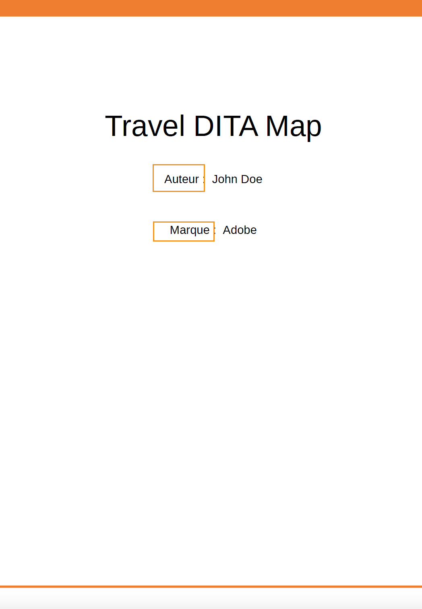
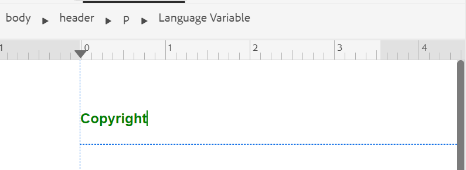
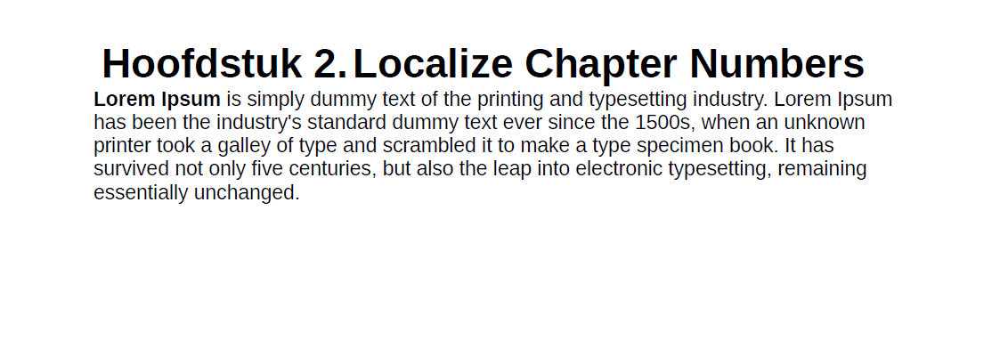
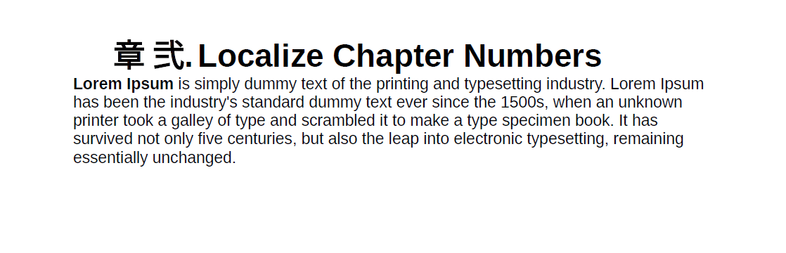

# 言語変数のサポート

Adobe Experience Manager Guidesには、言語変数を使用する機能が用意されています。 言語変数を使用して、PDF出力でローカライズされた文字列を定義したり、出力テンプレートの静的テキストをローカライズしたりできます。 CSS スタイルを使用すると、CSSから取得した文字列をローカライズできます。

## PDF出力での言語変数の使用

言語変数を使用すると、メモ、注意、警告などの標準ラベルのローカライズ版や、PDF出力の静的テキストを定義できます。 変数名はすべての言語で同じですが、様々な言語に異なる値を持つことができます。 これらの変数の値を1つ以上の言語で更新すると、ローカライズされた値がPDF出力で自動的に選択されます。

例えば、次の方法でPDF出力にラベル `Note`を表示できます。

- 英語：メモ

- フランス語：Remarque

- ドイツ語：Hinweis



*英語、フランス語、ドイツ語のサンプルノート。*

>[!NOTE]
>
> 任意の変数の値が特定の言語で定義されていない場合、AEM Guidesは、UI （アプリケーションのユーザーインターフェイス）の言語からフォールバックメカニズムとして文字列を選択します。
>
> UIの言語で値を定義していない場合は、英語（`en_us`）を検索するか、英語（`en`）の値を選択して、PDF出力に同じ値を表示します。

## 言語変数の種類

AEM Guidesでは、アプリケーション変数とユーザー変数の2種類の変数をサポートしています。

### アプリケーション変数

AEM Guidesには、定義済みまたは標準のアプリケーション変数のセットが用意されています。 これらの定義済み変数を使用して、AEM Guides固有のドキュメントに関する情報を追加できます。 例えば、ページに`chapter-number`変数が含まれている場合、そのページが属する章番号が表示されます。 `author-label`変数には、ドキュメント作成者の名前が表示されます。

>[!NOTE]
>
> アプリケーション変数の値を上書きできます。


### ユーザー変数

新しい言語変数を作成することもできます。 例えば、ドキュメントの発行者のラベルのユーザー変数「発行者」を作成できます。

>[!NOTE]
>
>  ユーザー変数を作成し、アプリケーション変数を編集するには、管理者権限が必要です。



*選択した言語の言語変数を追加して表示します。*

## 新しい言語変数の追加

1. エディターで、左側のパネルに移動し、**言語変数**&#x200B;を選択します。 このオプションは、「その他」セクションで使用できます。
1. **編集**&#x200B;を選択して、**言語変数** ウィンドウを開きます。 選択した言語に存在するアプリケーションとユーザー変数は、アルファベット順に一覧表示されます。 値は、選択した言語に従って表示されます。 例えば、フランス語を選択した場合、「ヒント」は「Conseil」と表示されます。
1. **言語** ドロップダウンから、変数を編集する目的の言語を選択します。

   >[!NOTE]
   >
   > 目的の言語を表示しない場合は、**言語の設定**&#x200B;から目的の言語を有効にします。 設定を選択 で&#x200B;**言語の設定** ダイアログボックスを開きます。

1. **Name**&#x200B;列に変数名を入力し、その値を&#x200B;**Value**&#x200B;列に入力します。

   >[!NOTE]
   >
   >任意のHTML コンテンツを変数値として使用すると、変数値を特定の形式で表示できます。 例えば、変数値に`<b>` タグを追加して、発行者を太字で表示できます。

1. **言語変数を追加**&#x200B;を選択 を使用して、選択した言語に新しい言語変数を追加します。 1つの言語に変数を追加すると、すべての言語に自動的に追加されます。 既存の変数と同じ名前の変数を作成することはできません。 エラーが表示されます。

>[!NOTE]
>
> **言語変数を追加**&#x200B;を選択しない場合、変数は作成されず、リストに追加されます

## 言語変数の書き出しと読み込み

Experience Manager Guidesでは、選択した言語に存在する言語変数の書き出しと読み込みがサポートされています。 定義された値と共に、すべての言語変数を簡単に書き出すことができます。 これには、アプリケーション変数とユーザー変数の両方が含まれます。 書き出したファイルを使用して、値を変更したり、他の言語にローカライズしたりできます。

言語変数を含むXML ファイルを読み込むこともできます。 Experience Manager Guidesは、アプリケーション変数とユーザー変数の両方を含め、既に定義されている言語変数のみを読み込みます。 まだ定義されていない変数は読み込まれません。

### 言語変数の書き出し

言語の言語変数をエクスポートするには、ドロップダウンから言語を選択し、**書き出し**&#x200B;を選択します  などの相対リンクにすることも可能です。
`language_variable_<ln>`が選択した言語のコードである形式`<ln>`のXML ファイルが作成されます。 例えば、英語の場合は`language_variable_en.xml`、フランス語の場合は`language_variable_fr.xml`。

>[!NOTE]
> 
>言語変数に保存されていない変更がある場合、それらを書き出すことはできません。 変更を保存して、有効な&#x200B;**書き出し**&#x200B;を表示します  アイコン。

### 言語変数のインポート

言語変数を読み込むには：

1. ドロップダウンから言語を選択し、**インポート**&#x200B;を選択します 。
2. 言語変数を含むXMLを参照して選択します。 例えば、language_variable_en.xmlです。
XML ファイルは、次の形式で読み込むことができます。

```
<?xml version="1.0" encoding="UTF-8"?>
<variables>    
<variable id="note-important">Important: </variable>    
<variable id="note-caution">Avertir: </variable>    
<variable id="image-with-text">Text and image &lt;img src=&quot;/content/dam/assets/images/image_with_text.png&quot; /&gt; </variable> 
</variables> 
```

ファイルを読み込むと、同じIDの変数が読み込まれます。 選択した言語の変数の値が、XML ファイルの変数の値で更新されます。  更新された変数の数に関するメッセージが表示されます。

>[!NOTE]
> 
><ul><li>ファイルがXML ファイルでない場合、またはファイルに言語変数とマッピングしない誤った形式が含まれている場合は、XML ファイルに問題が発生しているというエラーが表示されます。 
>&gt;<li>ファイルに同じIDの変数が含まれていない場合は、読み込まれたファイルに一致する言語変数が見つからないという警告が表示されます。

### 言語変数のオプション

変数にカーソルを合わせると、**オプション** メニューが表示されます。



*言語変数を削除、プレビュー、複製するには、**オプション**&#x200B;メニューを使用します。*

アプリケーション変数とユーザー変数の両方をプレビューできます。 変数の値が出力にどのように表示されるかを表示するには、選択した変数の&#x200B;**オプション** メニューから&#x200B;**プレビュー**&#x200B;を選択します。
ユーザー変数を&#x200B;**削除**&#x200B;または&#x200B;**複製**&#x200B;することもできます。 ひとつの言語から変数を削除すると、すべての言語から自動的に削除されます。

### アプリケーション変数を編集または元に戻す

アプリケーション変数の値を編集することもできます。 後で、アプリケーション変数を元の値に戻すことができます。 **リセット** 値が変更されたアプリケーション変数にが表示されます。

## 出力テンプレートでの言語変数の使用

ローカライズされたドキュメントに言語変数を追加する必要があります。 これらの言語変数は、ローカライズされたドキュメント内の異なるページにまたがって表示されるページレイアウト内に挿入できます。 例えば、ページレイアウトのヘッダー領域（またはフッターや本文などの他の部分）に表示される`author-name`の言語変数を追加できます。





*作成者とブランド名は、フランス語用に生成されたPDF出力にローカライズされています。*

ヘッダー領域に`copyright-label`のような言語変数を挿入するには、次の手順を実行します。

1. 編集に必要なページレイアウトを開きます。

   >[!NOTE]
   >
   > カスタマイズまたは編集用のページレイアウトを開くための[&#x200B; ページレイアウトのカスタマイズ &#x200B;](../native-pdf/components-pdf-template.md#customize-a-page-layout-customize-page-layout) セクションを表示します。

1. ヘッダーを選択して、変数の挿入をアクティブにします。
1. **変数を挿入**&#x200B;を選択  ツールバーの。
1. **変数を挿入** ポップアップで、挿入する言語変数の名前を選択し、**変数を挿入**&#x200B;をクリックしてヘッダー領域に挿入します。

   >[!NOTE]
   >
   > テキストボックスに検索文字列を入力することもできます。 指定された文字列を含む変数名がフィルタリングされ、リストに表示されます。
   > 選択した言語変数がヘッダー領域に挿入されます。




*ヘッダー領域に`copyright-label`が追加されました。*

### 言語変数へのコンテンツスタイルの適用

言語変数に割り当てる値に加えて、HTML タグを使用して、特定の形式で変数値を表示することもできます。 例えば、`publisher-label`の値を太字で表示できます。

- <span> タグを使用して、値のスタイルを書式設定することもできます。 例えば、ページ番号の言語変数を使用すると、ページ番号をローマ数字の形式で英語で表示し、他の言語の形式を指定できます。

  英語の値：
  `<span data-field="page-number" data-format="upper-roman">1</span>`

  タミル人にとっての価値：
  `<span data-field="page-number" data-format="tamil">1</span>`

同様に、ページレイアウトの「フィールドを挿入」機能にリストされている言語変数を追加したり、他のフィールドを書式設定したりできます。 フィールドの追加について詳しくは、[&#x200B; フィールドとメタデータの追加](../native-pdf/design-page-layout.md#add-fields-metadata)を参照してください。

- 値にローカライズされた画像を追加することもできます。 例えば、章番号の言語に画像アイコンを追加し、PDF出力にアイコンのローカライズされた画像を取得できます。

  英語の場合、画像の変数値は``のようになり、ドイツ語の同じ変数の場合は``になります。 言語に応じて画像をピックアップします。

## CSS スタイルを使用した文字列のローカライズ

CSS スタイルを使用すると、章、セクション、図、表など、自動番号で使用される文字列をローカライズすることもできます。 これらの文字列はCSS ファイルから取得されるため、言語変数を使用してローカライズすることはできません。 これらの文字列をローカライズするには、ローカライズする言語ごとにCSS スタイルを作成します。
例えば、次のCSSを使用して、章の接頭辞と対応する数値形式を様々な言語で表示できます。
例えば、次のCSSを使用して、ChapterをHoofdstukとしてドイツ語で表示し、章番号を10進数形式で表示できます。 日本語の場合は、日本語の数字書式を使用して、目次に章番号を表示できます。

```
// for English
h1:before {
  counter-increment: h11;
  content: "Chapter " counter(h11, decimal)".";
}

// for German
:root:lang(de) h1:before {
  content: "Hoofdstuk " counter(h11, decimal)".";
}

// for Japanese
:root:lang(ja) h1:before {
  content: "章 " counter(h11, japanese-formal)".";
}
```

次のスクリーンショットは、ドイツ語と日本語のPDF出力にローカライズされた文字列を表示しています。







### 接頭辞の書式設定

CSS スタイルを使用して、接頭辞を書式設定することもできます。 例えば、様々な言語のPDF出力でラベル `Note`を赤で表示するように書式設定できます。

```
.note .prefix-content 
{
color: red;
} 
```
