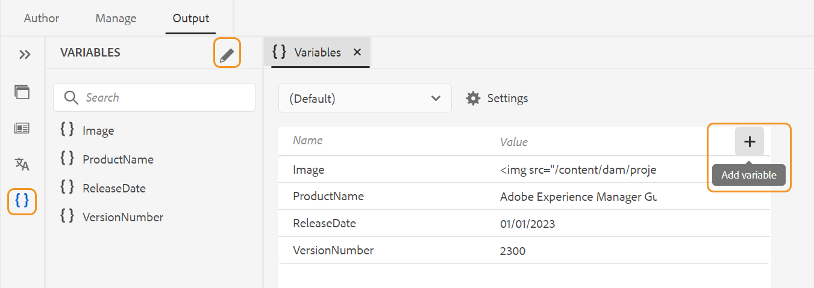
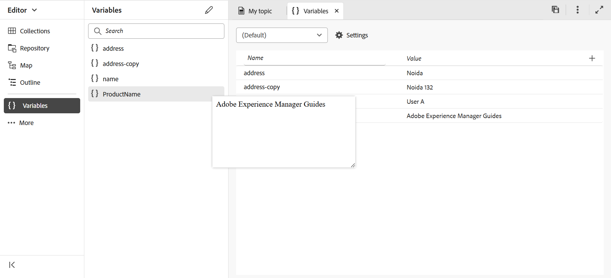
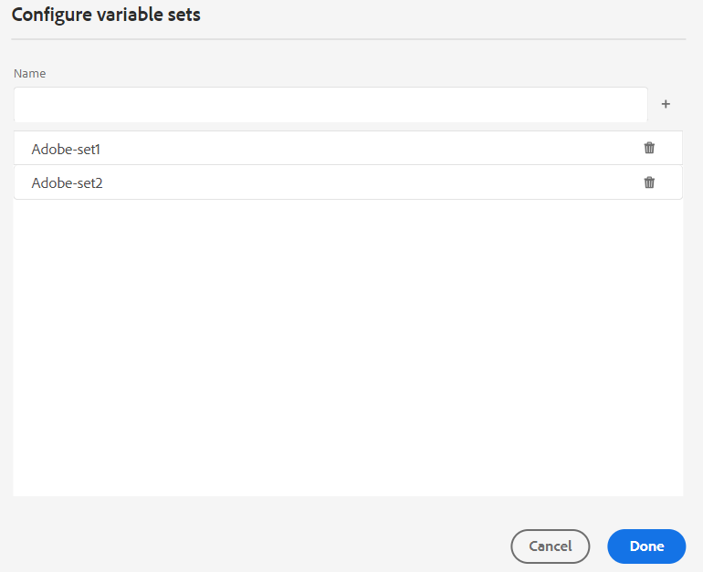
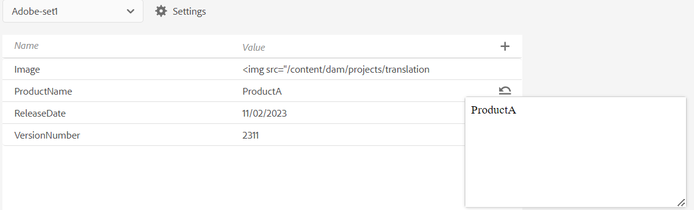
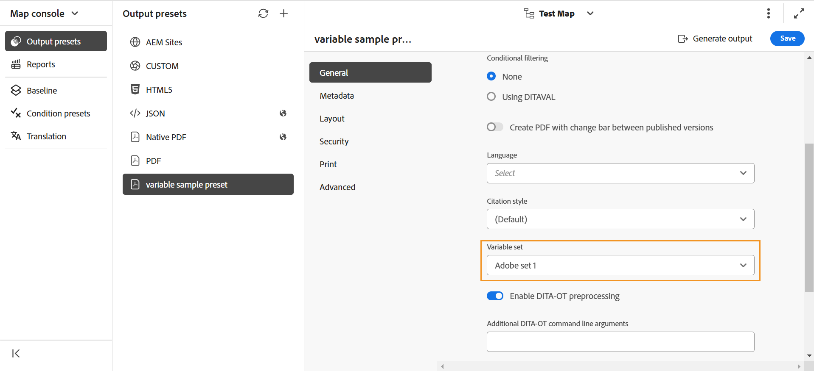
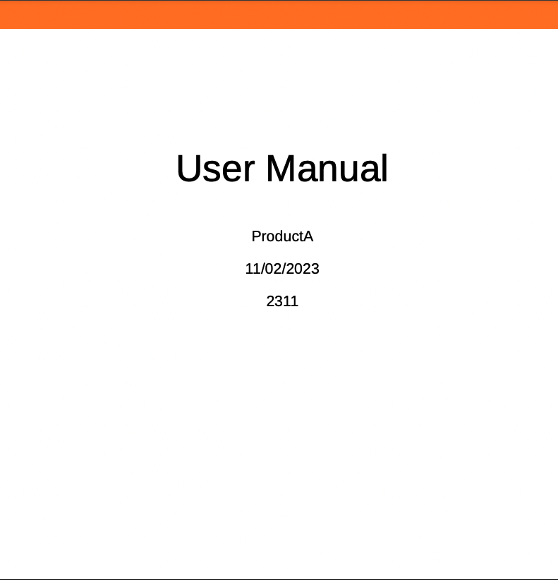

# PDF出力の変数

変数とは、再利用可能な情報となるデータの名前と値のペアのことです。 これにより、コンテンツを持ち出して更新しやすくなります。 変数またはその値を変更すると、その変数または値のすべての出現箇所が更新されます。

## 新しい変数の作成

変数を作成するには、次の手順を実行します。

{width="800" align="left"}

*変数を作成し、その値を定義します。*

1. エディターで、左パネルに移動し、**変数**&#x200B;を選択します  に移行することで使用を置き換えることができます。 このオプションは、「その他」セクションで使用できます。
1. **編集**&#x200B;を選択 で&#x200B;**変数** エディターを開きます。
変数はアルファベット順に表示されます。
1. **Name**&#x200B;列に変数名を入力し、その値を&#x200B;**Value**&#x200B;列に入力します。
   >[!TIP]
   >
   >任意のHTML コンテンツを変数値として使用すると、変数値を特定の形式で表示できます。 例えば、変数値に`<b>` タグを追加して、値&#x200B;**Experience Manager Guides**&#x200B;を太字で表示できます。 リポジトリの画像を値として追加することもできます。

1. **変数を追加**&#x200B;を選択 を使用して新しい変数を追加します。 既存の変数と同じ名前の変数を作成することはできません。 エラーが表示されます。

   >[!NOTE]
   >
   >「**変数を追加**」を選択しない場合 。変数は作成されず、リストに追加されます。

この方法で、デフォルト値を使用して変数を作成できます。 例：
* 製品名：Experience Manager Guides
* バージョン番号：2300
* リリース日：2023年1月1日（PT）

### 変数の編集

変数は、次の2つの方法で編集できます。

**左側の変数パネルから**

1. **変数** パネルで変数を選択します。
1. 変数にカーソルを合わせて&#x200B;**オプション** メニューを表示し、**編集** オプションを選択します。
1. **変数を編集** ダイアログボックスで、選択した変数のデフォルト値を編集できます。
1. 「**完了**」を選択します。

**変数エディター**&#x200B;から

1. **変数**&#x200B;を選択 左側のパネルの。
1. **編集**&#x200B;を選択 で&#x200B;**変数** エディターを開きます。

1. **変数** エディターでは、選択した変数の値を編集できます。

左側の&#x200B;**変数** パネルに表示するには、**変数** エディターで行った変更をすべて保存する必要があります。

>[!NOTE]
>
> 変数値を編集すると、Adobe Experience Manager Guidesは該当する場所ですべての参照を同時に更新します。

### 変数の検索とプレビュー

変数の値を検索してプレビューできます。 **変数** パネルの検索ボックスに文字列を入力します。 変数名とその値に基づいて両方を検索します。
変数は、次の2つの方法でプレビューできます。

変数のプレビューには、デフォルト値が表示されます。 例えば、ProductName変数のデフォルト値を「Adobe Experience Manager Guides」として定義した場合、この値はプレビューに表示されます。

**左側の変数パネルから**

1. **変数** パネルで変数を選択します。
1. 変数にカーソルを合わせて&#x200B;**オプション** メニューを表示し、**プレビュー** オプションを選択します。

   変数パネルからの{width="550" align="left"}

*変数の既定値をプレビューします。*

**変数エディター**&#x200B;から

1. リスト内の変数にカーソルを合わせると、**オプション** メニューが表示されます。
1. 「**プレビュー**」を選択します。

### 変数の複製

変数を複製し、必要に応じて値を変更できます。

1. リスト内の変数にカーソルを合わせると、**オプション** メニューが表示されます。
1. 「**重複**」を選択します。

変数のデフォルト名は`<selected variable name>`です（「sample」など）。 必要に応じて名前を変更できます。

### 変数の削除

変数を削除するには、次の2つの方法があります。

**左側の変数パネルから**

1. **変数** パネルで変数を選択します。
1. 変数にカーソルを合わせて&#x200B;**オプション** メニューを表示し、**削除** オプションを選択します。

**変数エディター**&#x200B;から

1. リスト内の変数にカーソルを合わせると、**オプション** メニューが表示されます。
1. 「**削除**」オプションを選択します。

変数は、すべての変数セットから削除されます。

## 出力プリセットの変数セット

Adobe Experience Manager Guidesでは、変数セットもサポートしており、変数に代替値を割り当てることができます。 例えば、AとBのふたつの商品を販売できます。それぞれに異なる仕様があります。 これらの仕様には、製品名、バージョン番号、リリース日などが含まれます。 ブランディングには他にも違いがあります。 変数セットを使用して、変数に異なる値のセットを定義します。 出力を生成する際に、適切な変数セットを選択し、必要な出力を生成します。

### 変数セットの設定

変数セットに変数を追加する前に、変数セットを設定する必要があります。

1. **設定**&#x200B;を選択 で&#x200B;**変数セットの設定** ダイアログボックスを開きます。
   {width="550" align="left"}
1. **Name**&#x200B;列に変数セット名を入力します。
1. **変数を追加**&#x200B;を選択 を使用して新しい変数セットを追加します。 変数セットはアルファベット順に表示されます。
1. 変数セットを削除するには、**削除**&#x200B;を選択できます。

### 変数セット操作

すべての変数セットは同じ変数を持ちますが、値が異なる場合があります。

特定の変数セットの値を表示、編集、プレビューできます。 **変数セット** ドロップダウンから変数セットを選択します。 値は、選択した変数セットに従って表示されます。
特定の変数セットの変数の値を編集すると、デフォルト値が上書きされ、選択した変数セットの値が変更されます。
例えば、*Adobe-set1*&#x200B;および&#x200B;*Adobe-set2*&#x200B;の変数セットに次の値を設定できます。

**バリアブルセット 1**: *Adobe-set1*

* 製品名：ProductA
* バージョン番号：2311
* リリース日：2023年2月11日（PT）

**バリアブルセット 2**: *Adobe-set2*

* 製品名：ProductB
* バージョン番号：2310
* リリース日：2023年9月7日（PT）

すべての変数セットに、新しい変数が追加されます。 変数を削除または複製すると、すべての変数セットに対して更新されます。

変数セットの値をプレビューすることもできます。
例えば、変数セット *Adobe-Set1*&#x200B;の場合、ProductName変数の値を「ProductA」として定義すると、この値が変数エディターのプレビューに表示されます。

{width="550" align="left"}

*選択した変数セットで定義した値をプレビューします。*

### 変数の値をリセット

値を編集した場合は、変数をデフォルト値にリセットすることもできます。
リセット 値が変更された変数にが表示されます。
例えば、ProductName変数の値をExperience Manager Guidesのデフォルト値にリセットできます。

## PDFのネイティブテンプレートでの変数の使用

製品ドキュメントの出力を生成する際に変数を追加することで、それらをポータブルで簡単に更新できます。 これらの変数は、ドキュメント内の様々なページにわたって表示されるページレイアウト内に挿入できます。 例えば、ページレイアウトのヘッダー領域（またはフッターや本文などの他の部分）に表示される変数ProductNameを追加できます。

ヘッダー領域にProductNameなどの変数を挿入するには、次の手順を実行します。
1. 編集に必要なページレイアウトを開きます。

   >[!NOTE]
   >
   > カスタマイズまたは編集用のページレイアウトを開くための[&#x200B; ページレイアウトのカスタマイズ &#x200B;](../native-pdf/components-pdf-template.md#customize-a-page-layout-customize-page-layout) セクションを表示します。

1. ヘッダーを選択して、変数の挿入をアクティブにします。

1. 変数は、次の2つの方法で挿入できます。

   **左側の変数パネルから**

   * 変数を&#x200B;**変数** パネルからドラッグし、ヘッダー領域にドロップします。

   **ツールバーから**

   1. **変数/フィールドの挿入**&#x200B;を選択 。
   1. **変数** ダイアログボックスで、変数の名前を選択してヘッダー領域に挿入します。
   1. テキストボックスに検索文字列を入力することもできます。 指定された文字列を含む変数名がフィルタリングされ、リストに表示されます。 選択した変数がヘッダー領域に挿入されます。 変数のデフォルト値を表示できます。
   1. 変数を置き換えるには、変数値をダブルクリックし、**変数** ダイアログボックスから別の変数を選択します。 変数が置き換えられます。

## 変数を使用したPDF出力の生成

異なる変数の値を使用してPDF出力を生成できます。 レイアウトを生成する前に、出力プリセットの&#x200B;**変数セット** ドロップダウンリストから変数セットを選択して、その値を選択します。

{width="550" align="left"}

*PDF出力の生成に使用する出力プリセットのドロップダウンから変数セットを選択します。*

>[!NOTE]
>
> ドロップダウンから（デフォルト）を選択して、すべての変数のデフォルト値を公開することもできます。

選択した変数セットに応じて、変数セットで定義された変数値に対応する出力が得られます。 例えば、変数セット *Adobe-set1*&#x200B;を選択すると、このセットで定義されている変数の値が出力に表示されます。

*ページレイアウトの変数を使用してPDF出力を生成します。*

必要に応じて任意の変数セットの値をすばやく更新し、出力を再生成することもできます。 例えば、バージョンの詳細を更新する必要がある場合は、VersionNumber変数のバージョンの値を更新して、出力を再生成できます。
