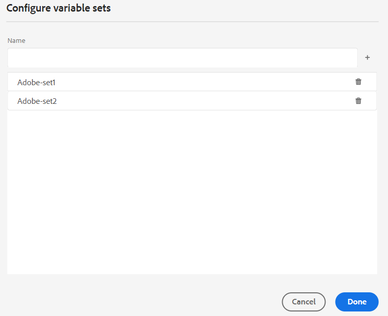

# PDF 出力での変数

変数は、再利用可能な情報として機能するデータの名前と値のペアです。 これにより、内容がポータブルになり、簡単に更新できます。 変数またはその値を変更すると、その変数または値のすべての発生件数更新されます。

## 新しい変数の作成

変数を作成するには、次の手順を実行します。

{width="800" align="left"}

*変数の作成と変数の値の定義*

1. エディターで、左パネルに移動し、「変数 **を選択し** す。  に移行することで使用を置き換えることができます。このオプションは、「その他」セクションで使用できます。
1. 「**編集**」を選択します。 **変数** エディターを開く  要があります。
変数はアルファベット順に表示されます。
1. **名前** 列に変数名を入力し、**値** 列にその値を入力します。
   >[!TIP]
   >
   >任意のHTML内容を変数値として使用して、変数値を特定の形式で表示できます。 例えば、変数値に `<b>` タグを追加して、値 **1&rbrace;Experience Manager Guides&rbrace; を太字で表示できます。**&#x200B;リポジトリから画像を値として追加することもできます。

1. 「**変数を追加**」を選択します。 新しい変数を追加で  ます。 既存の変数と同じ名前の変数を作成することはできません。 エラーが表示されます。

   >[!NOTE]
   >
   >「変数を追加 **を選択しない場合** ま 、変数は作成されず、リストにも追加されません。

この方法で、デフォルト値を使用して変数を作成できます。 例：
* 製品名：Experience Manager Guides
* バージョン番号：2300
* リリース日：2023 年 1 月 1 日（Pt）

### 変数の編集

変数は次の 2 つの方法で編集できます。

**左側の変数パネルから**

1. **変数** パネルで変数を選択します。
1. 変数の上にマウスポインターを置いて **オプション** メニューを表示し、「**編集**」オプションを選択します。
1. **変数を編集** ダイアログボックスで、選択した変数のデフォルト値を編集できます。
1. 「**完了**」を選択します。

**変数エディターから**

1. 「**変数**」を選択します。 左パネルで  をクリックします。
1. 「**編集**」を選択します。 **変数** エディターを開く  要があります。

1. 「 **変数** 」編集者では、選択した変数の値を編集できます。

**変数** 編集者 で行った変更を保存して、左側の **変数** パネルに表示する必要があります。

>[!NOTE]
>
> 変数値を編集すると、Adobe Experience Managerガイドは適用可能なすべての参照を同時に更新します。

### 変数Searchおよびプレビュー

変数の値を検索およびプレビューできます。 **変数** パネルの検索ボックスに文字列を入力します。 変数名とその値の両方に基づいて検索します。
変数は次の 2 つの方法でプレビューできます。

変数のプレビューには、デフォルト値が表示されます。 例えば、ProductName 変数のデフォルト値を「Adobe Experience Manager Guides」と定義した場合、プレビューにこの値が表示されます。

**左側の変数パネルから**

1. **変数** パネルで変数を選択します。
1. 変数にポインタを合わせて **オプション** メニューを表示し、「**プレビュー**」オプションを選択します。

   {width="550" align="left"}

*変数のデフォルト値をプレビューします。*

**変数エディターから**

1. リストの変数の上にマウスポインターを置くと、**オプション** メニューが表示されます。
1. 「**プレビュー**」を選択します。

### 変数の複製

変数重複し、要件に応じて値を修正できます。

1. リストの変数にマウスポインターを合わせて、[ **オプション** ] メニュー表示。
1. 「 **複製**」を選択します。

変数のデフォルト名は `<selected variable name>` (「sample」など)です。 必要に応じて名前を変更できます。

### 変数の削除

変数は次の 2 つの方法で削除できます。

**左側の変数パネルから**

1. **変数** パネルで変数を選択します。
1. 変数にポインタを合わせて **オプション** メニューを表示し、「**削除**」オプションを選択します。

**変数エディターから**

1. リストの変数の上にマウスポインターを置くと、**オプション** メニューが表示されます。
1. 「**削除**」オプションを選択します。

すべての変数セットから変数が削除されます。

## 出力プリセットの変数セット

Adobe Experience Managerガイドは、変数に代替値を割り当てることができる変数セットもサポートしています。 例えば、ある会社は A と B という 2 つの商品を販売できます。それぞれに異なる仕様があります。 これらの仕様には、製品名、バージョン番号、リリース日が含まれる場合があります。 ブランディングには他にも違いがあります。 変数セットを使用して、変数に対して異なる値のセットを定義します。 出力を生成する場合は、適切な変数セットを選択し、必要な出力を生成します。

### 変数セットの設定

変数セットには、変数を追加する前に設定する必要があります。

1. 選択 **設定** **変数セットの設定** ダイアログボックスを開く  法は次のとおりです。
   {width="550" align="left"}
1. **名前** 列に変数セット名を入力します。
1. 「**変数を追加**」を選択します。 新しい変数セットを追加で  ません。 変数セットはアルファベット順に表示されます。
1. 「**削除**」を選択して、変数セットを削除できます。

### 変数セット操作

すべての変数セットは同じ変数を持ちますが、異なる値を持つことができます。

特定の変数セットの値を表示、編集、プレビューできます。 **変数セット** ドロップダウンから変数セットを選択します。 選択した変数セットに従って値が表示されます。
特定の変数セット内の変数の値を編集すると、デフォルト値が上書きされ、選択した変数セットの値が変更されます。
例えば、変数セット *Adobe-set1&rbrace; および* Adobe-set2 *に次の値を設* できます。

**変数セット 1**: *Adobe-set1*

* 製品名：製品 A
* バージョン番号：2311
* リリース日：2023 年 2 月 11 日（Pt）

**変数セット 2**: *Adobe-set2*

* 製品名：製品 B
* バージョン番号：2310
* リリース日：2023 年 9 月 7 日（PT）

すべての新規変数が、すべての変数セットに追加されます。 変数を削除または複製すると、すべての変数セットの変数が更新されます。

変数セットの値をプレビューすることもできます。
例えば、変数セット *Adobe-Set1* の場合、ProductName 変数の値を「ProductA」と定義しており、この値が変数エディターのプレビューに表示されます。

{width="550" align="left"}

*選択した変数セットで定義した値をプレビューします*。

### 変数の値のリセット

値を編集した場合は、変数をデフォルト値にリセットすることもできます。
リセット  は、値が変更された変数に対して表示されます。
例えば、ProductName 変数の値をデフォルト値の Experience Manager Guides にリセットできます。

## ネイティブ PDF テンプレートでの変数の使用

製品ドキュメントの出力を生成する際に変数を追加することで、移植性が高く、更新が容易になります。 これらの変数は、ドキュメントの様々なページに表示されるページレイアウト内に挿入できます。 例えば、ページレイアウトのヘッダー領域（またはフッターや本文のような他の部分）に表示される ProductName 変数を追加できます。

ProductName などの変数をヘッダー領域に挿入するには、次の手順を実行します。
1. 必要なページレイアウトを編集用に開きます。

   >[!NOTE]
   >
   > ページレイアウトを開いてカスタマイズや編集をおこなうための「[&#x200B; ページレイアウトをカスタマイズ &#x200B;](../native-pdf/components-pdf-template.md#customize-a-page-layout-customize-page-layout)」セクションを表示します。

1. ヘッダーを選択してアクティブにし、変数を挿入します。

1. 変数は次の 2 つの方法で挿入できます。

   **左側の変数パネルから**

   * **変数**&#x200B;パネルから変数をドラッグしてヘッダー領域にドロップします。

   **ツールバーから**

   1. 「**変数/フィールドを挿入**」を選択します 。
   1. **変数** ダイアログボックスで、ヘッダー領域に挿入する変数の名前を選択します。
   1. テキストボックスに検索文字列を入力することもできます。 指定された文字列を含む変数名がフィルタリングされ、リストに表示されます。 選択した変数がヘッダー領域に挿入されます。 変数のデフォルト値を確認できます。
   1. 変数を置き換えるには、変数値をダブルクリックし、「変数 **ダイアログボックスで別の変数を選択し** す。 変数が置き換えられます。

## 変数を使用したPDF出力の生成

異なる変数の値を使用してPDF出力を生成できます。 レイアウトを生成する前に、出力プリセットの **変数セット** ドロップダウンリストから変数セットを選択し、値を選択します。

{width="550" align="left"}

*PDF 出力の生成に使用する変数セットを出力プリセットのドロップダウンから選択します。*

>[!NOTE]
>
> ドロップダウンから「(デフォルト)」を選択して、すべての変数のデフォルト値公開することもできます。

選択した変数セットに応じて、変数セットで定義された変数値に対応する出力が得られます。 例えば、変数セット *Adobe-set1* を選択すると、このセットで定義されている変数の値が出力に表示されます。

*ページレイアウトの変数を使用してPDF出力を生成します*。

また、必要に応じて、任意の変数セットの値を素早く更新し、出力を再生成することもできます。 例えば、バージョンの詳細を更新する必要がある場合、VersionNumber 変数のバージョンの値を更新して、出力を再生成できます。
