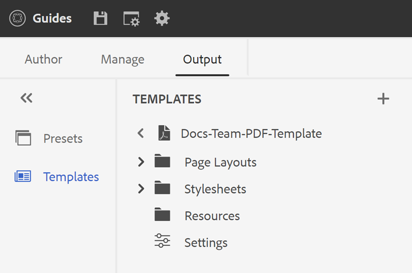

# PDF テンプレート {#PDF-template}

テンプレートを使用することで、コンテンツのレイアウトと構造の一貫性を確保できます。 テンプレートが事前に定義されているため、新規プロジェクトや更新のたびに発生する形式の問題に対する手戻りを避けることができます。 テンプレートを使用すると、ページレイアウトのデザイン、コンテンツのスタイル設定、様々な設定の適用によるPDFのカスタマイズが可能になります。

## PDFのファクトリテンプレートとカスタムテンプレート

標準装備のサンプル工場テンプレートもいくつか用意されており、開発者は基本テンプレートとして使用して、組織の要件に合わせてカスタマイズされたテンプレートを作成できます。

## 新しいPDF テンプレートの作成 {#create-pdf-template}

特定のページレイアウトを使用してカスタム PDF テンプレートを作成し、スタイルシートを使用してページレイアウトコンポーネント（目次、索引、用語集など）またはDITA コンポーネント（見出し、段落、リストなど）の書式を定義できます。

新しいPDF テンプレートを作成するには、次の手順を実行します。

1. Web エディターで、「**出力**」タブに移動します。
1. **テンプレート**&#x200B;を選択 左側のパネルの。

   

1. **テンプレート** ウィンドウで、**テンプレート**&#x200B;の横にある&#x200B;**+** アイコンを選択し、**PDF テンプレート**&#x200B;を選択します。
1. **新しいPDF テンプレート** ダイアログで、基本として使用するファクトリテンプレートを選択して、カスタムテンプレートを作成します。 検索ボックスを使用して、テンプレートを検索することもできます。
1. テンプレートのタイトルを指定します。

   >[!NOTE]
   >
   >  テンプレートの作成および複製中に、テンプレートのサムネールをプレビューすることもできます。 テンプレートの作成後、[**オプション**](#properties-option) メニューの&#x200B;**プロパティ**&#x200B;を使用して、サムネールを編集または削除します。

1. 「**作成**」をクリックします。

   新しいテンプレートが作成され、**テンプレート** パネルに追加されます。

## PDF テンプレートの複製 {#duplicate-pdf-template}

既存のテンプレートと同じページレイアウトと書式で新しいテンプレートを作成する場合は、コピーを作成できます。 テンプレートを複製したら、必要に応じてコンポーネントをさらにカスタマイズできます。

既存のPDF テンプレートを複製するには、次の手順に従います。

1. Web エディターで、「**出力**」タブに移動します。
1. **テンプレート**&#x200B;を選択 左側のパネルの。 これにより、**テンプレート** ウィンドウが開きます。
1. 複製するテンプレートにカーソルを合わせ、**...** *オプション* アイコンを選択し、コンテキストメニューから「**複製**」を選択します。

   これにより、**PDF テンプレートを複製** ダイアログが開きます。

   

   *複製するテンプレートを選択し、サムネールをプレビューして、**PDF テンプレートを複製**&#x200B;ダイアログでタイトルを更新します。*

1. テンプレートのタイトルを指定します。

   「**タイトル**」フィールドには、ソーステンプレートと同じタイトルのコピーとして事前入力されます。 同じタイトルのテンプレートが存在する場合、エラーメッセージが表示されます。

1. 好みのタイトルを指定するには、事前入力されたタイトルを削除し、タイトルを指定します。
1. 「**複製**」をクリックします。

   重複したテンプレートが作成され、**テンプレート**&#x200B;の下に追加されます。

## テンプレートに関するその他の操作

テンプレートに対して、**オプション** メニューから次の操作を実行することもできます。

### 削除

選択したテンプレートを削除するには、「削除」オプションを選択します。 次に、確認プロンプトで「はい」を選択します。
プリセットが&#x200B;**テンプレート**&#x200B;から削除されます。

### プロパティ{#properties-option}

テンプレートのプロパティを表示および編集するには、このオプションを選択します。 テンプレートの既存のサムネールをプレビューできます。 サムネールを編集または削除することもできます。 テンプレートのタイトルと説明を変更することもできます。

### Assets UIでの表示

Assets UIでテンプレートを表示するには、このオプションを選択します。 テンプレートのルートの場所が開くので、テンプレートのすべてのリソースを表示できます。

カスタムテンプレートを作成したら、PDF出力プリセットの「ページレイアウト」から選択できます。

PDF出力[を](https://experienceleague.adobe.com/docs/experience-manager-guides-learn/tutorials/user-guide/output-gen/web-editor/native-pdf-web-editor.html?lang=ja)公開する方法について説明します。

>[!NOTE]
>
>フォルダーにフォルダープロファイルが設定されている場合は、フォルダープロファイルで設定されているPDF テンプレートのみが表示されます。

設定に基づいて、管理者はテンプレートを設定できます。

+++ クラウドサービス

グローバルレベルおよびフォルダーレベルのプロファイルの設定について詳しくは、Cloud Servicesのインストールおよび設定ガイドの「[&#x200B; テンプレートの設定](../cs-install-guide/conf-folder-level.md#id1889D0IL0Y4)」セクションを参照してください。

+++

+++ オンプレミスソフトウェア

グローバルおよびフォルダーレベルのプロファイルの設定について詳しくは、オンプレミスのインストールおよび設定ガイドの「[&#x200B; オーサリングテンプレートの設定](../install-guide/conf-folder-level.md#create-custom-authoring-template-id1917d0eg0hj)」の節を参照してください。

+++

## PDF テンプレートのカスタマイズ {#customize-pdf-template}

テンプレートコンポーネントを調整し、スタイルシートを使用してスタイル形式を適用することで、テンプレートをカスタマイズできます。

PDF テンプレートをカスタマイズするには、次の手順を実行します。

1. Web エディターで、「**出力**」タブに移動します。
1. 左側のサイドバーを展開し、**テンプレート**&#x200B;を選択します。

   これにより、**テンプレート** パネルが開きます。

1. テンプレートのコンポーネントを表示するには、次のいずれかの操作を行います。

   * テンプレートの横にある/アイコンを選択するか、テンプレート名をダブルクリックします。
   * 任意のテンプレートにカーソルを合わせ、... （**オプション** アイコン）を選択し、コンテキストメニューから&#x200B;**編集**&#x200B;を選択します。

   デフォルトでは、テンプレートエディターで&#x200B;**設定** パネルが開きます。

   

   >[!NOTE]
   >
   >  管理者は、次のパスから最新のテンプレートをダウンロードし、既存のテンプレートを置き換えることができます。
   >
   > `/libs/fmdita/pdf`

   カスタマイズ可能な様々なテンプレートコンポーネントは、次の節に分類されます。

   * ページレイアウト：一般的なPDFには、表紙やタイトルページ、目次、章、索引、引用など、様々なページが含まれます。 「ページレイアウト」セクションでは、PDFを構成するさまざまなページのルックアンドフィールをデザインできます。 詳しくは、[&#x200B; ページレイアウト &#x200B;](../native-pdf/components-pdf-template.md#page-layouts)を参照してください。

     外観に加えて、ページ上のヘッダー、フッター、コンテンツ領域などのページ要素の配置を定義することもできます。 ページレイアウトのカスタマイズについて詳しくは、[&#x200B; ページレイアウトの作成とカスタマイズ &#x200B;](components-pdf-template.md#create-customize-page-layout)を参照してください。

   * スタイルシート：「スタイルシート」セクションの設定では、目次、索引、用語集、引用などのページレイアウトコンポーネントの外観をカスタマイズできます。 さらに、見出し、段落、リストなどのDITA コンテンツのスタイルをカスタマイズすることもできます。 スタイルシートの使用について詳しくは、[&#x200B; スタイルシートを使用したPDFのカスタマイズ &#x200B;](components-pdf-template.md#stylesheet-customization)を参照してください。
   * リソース：PDF テンプレートのカスタマイズやデザインに必要なアセットファイルを保存します。 ロゴ、カスタムフォント、背景画像などのAssetsは、リソースに保存されます。
リポジトリ内の他の場所にあるリソースを使用することもできます。 テンプレートごとに重複するリソースを作成する必要がなく、共有フォルダーに保存し、すべてのネイティブPDF テンプレートで使用できます。

     リソースの利用について詳しくは、[&#x200B; リソースの操作](components-pdf-template.md#work-with-resources)を参照してください。

   * 設定：テンプレートを使用してPDFを生成するための出力設定を行います。 このセクションでは、PDFの様々なページ、章の先頭ページ、印刷マーカー、引用などのテンプレートマッピングを定義できます。

   また、最終的なPDF出力に表示される順序を調整することもできます。
設定の適用について詳しくは、[PDFの詳細設定](components-pdf-template.md#advanced-pdf-settings)を参照してください。

1. テンプレートコンポーネントをカスタマイズするには、テンプレートコンポーネントをダブルクリックするか、その前にある/アイコンを選択します。

   例えば、*ページレイアウト*&#x200B;をダブルクリックするか、*ページレイアウト*&#x200B;の前にある&#x200B;*>* アイコンを選択して、使用可能なページレイアウトを表示します。

   >[!NOTE]
   >
   >[**オプション**](#properties-option) メニューの&#x200B;**プロパティ**&#x200B;を使用して、テンプレートのサムネールと説明を更新することもできます。

1. 必要な変更を行ったら、*すべて保存* （または`Ctrl+S`）を選択します。
