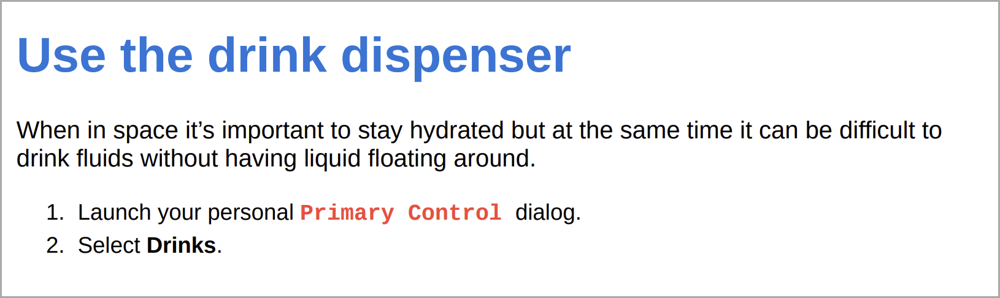

# 共通のコンテンツスタイルの使用 {#work-with-common-styles}

スタイルシートには、PDF出力で使用されるエレメントのスタイル定義が含まれます。 サンプルスタイルシートを使用するか、新しいスタイルシートを作成するかを選択できます。 ほとんどの場合、OOTB サンプルスタイルシートのコピーを作成すると、すぐに使い始めるのに役立ちます。

スタイルエディターは、ユーザーインターフェイスの背後で CSS コードの複雑さをすべて非表示にする WYSIWYG エディターです。 スタイルエディターを使用すると、選択した要素のスタイルを簡単にすばやくカスタマイズできます。 スタイルは、次の見出しに分類されます。

* 見出しスタイル
* 段落スタイル
* 文字スタイル
* ハイパーリンク スタイル
* 画像スタイル
* リストスタイル
* テーブルスタイル
* Div スタイル
* ページスタイル
* その他のスタイル

構造化 DITA コンテンツを操作する場合、ほとんどの DITA エレメントのスタイルマッピングは、デフォルトのスタイルシートに配置されます。 標準の DITA エレメントを使用する場合は、スタイル定義を直接変更することで、外観と操作性を変更できます。 これらのスタイル定義は、「その他のスタイル」カテゴリで使用できます。 詳しくは、 [他のスタイルを使用する](#other-styles) このトピックの後半。

以下のセクションでは、最も一般的に使用されるスタイル設定を例の形式で説明します。

>[!NOTE]
>
>次の例では、製品に付属するサンプルスタイルシートを使用して作業していると想定しています。

## 見出しスタイルを使用する {#heading-styles}

見出しスタイルは、コンテンツで使用される見出しのすべてのベーススタイルをカプセル化します。 OOTB では、トピック/チャプターおよび付録のタイトル見出しの 6 つの基本見出しスタイルと見出しスタイルを取得します。 構造化文書では、H1 はトピックまたはチャプターのタイトルを表し、H2 から H6 はトピックまたはチャプター内のサブトピックまたはセクションに使用されます。 この見出しの階層は、対応する見出しが見つかるたびに、コンテンツに自動的に適用されます。

>[!NOTE]
>
>独自のカスタム見出しスタイルを作成し、outputclass を使用してコンテンツで使用できます。 詳しくは、の手順 4 を参照してください [ページの向きとビューの回転を使用する](design-page-layout.md#page-orientation-rotation) 例えば、のようになります。

### カスタムのチャプターレベルの見出しの作成 {#create-chapter-level-heading}

本（またはブックマップ）では、章を使用します。 基本見出しスタイルは、カスタマイズを加えずにチャプターレベルの見出しに適用されるように設計されています。 ただし、コンテンツに専用の見出しを作成する場合は、それらの見出しを作成する必要があります。 例えば、デフォルトの `h1.chapter` 見出しは、チャプターのタイトルに適用されます。 チャプタータイトルを別のスタイルで表示する場合は、をカスタマイズする必要があります `h1.chapter` スタイル。 同様に、チャプターのサブ見出しにカスタムスタイルを作成できます。 例えば、2 つすべてにカスタムスタイルを作成する場合、<sup>番目</sup> および 3<sup>番目</sup> 章のレベルの見出しでは、新しいスタイルをとして作成する必要があります。 `h2.chatper` および `h3.chatper`.

ネイティブ PDF パブリッシュ機能には、最も一般的なスタイルの基本スタイル定義が含まれているため、誤ってスタイルを削除した場合でも、コンテンツには既定のスタイルが適用されます。 例えば、スタイルシートに h2 スタイルのスタイル定義がない場合、ネイティブPDF公開機能によって h2 コンテンツに何らかの基本スタイルが適用されます。

この例では、第 2 レベルのチャプター見出しスタイルを作成します。

1. 必要なスタイルシートを編集用に開きます。
   >[!NOTE]
   >
   >参照： [定義済みスタイルまたは新しいスタイルのカスタマイズ](components-pdf-template.md#customize-style) カスタマイズまたは編集用にスタイルシートを開くためのセクションです。

1. が含まれる **スタイル** リストで、 **見出しスタイル**.
1. 右クリック **見出しスタイル** スタイル設定と選択 **新規スタイル**.
1. が含まれる *スタイルを追加* ダイアログ、を保持 **タグ** に名前を付ける `h2` を入力します `chapter` が含まれる **クラス** 名前フィールド。
1. 「**完了**」をクリックします。

という名前の新しい見出しスタイル `h2.chapter` が作成され、「見出しスタイル」リストに追加されます。

スタイルを作成したら、スタイル エディタを使用して、スタイルの必要なプロパティをカスタマイズできます。

### 自動番号の見出しの作成 {#auto-number-heading}

最も一般的に使用される出力スタイルの 1 つは、自動番号の見出しです。 これらの見出しは、チャプター番号、トピックおよびサブトピック番号を表します。 自動番号の見出しは、トピック内の項目のリストに自動番号を割り当てるリストスタイルとは異なります。

この例では、見出しをレベル 1 からレベル 3 にカスタマイズして、異なる形式の自動番号を使用します。

1. 必要なスタイルシートを編集用に開きます。

   >[!NOTE]
   >
   >参照： [定義済みスタイルまたは新しいスタイルのカスタマイズ](components-pdf-template.md#customize-style) カスタマイズまたは編集用にスタイルシートを開くためのセクションです。

1. が含まれる **スタイル** リストで、 **見出しスタイル**.

1. 「」を選択します **h1** リストからスタイルを選択します。
h1 スタイルのプロパティが、そのプレビューと共にプロパティパネルに表示されます。

   >[!NOTE]
   >
   >プレビューパネルには、任意の要素に適用したスタイルの更新がリアルタイムで表示されます。

1. 「」を選択します **自動番号** プロパティ。

   自動番号リストに適用できるスタイルは、Autonumber プロパティの下に表示されます。

1. 次のプロパティを設定します。
   * **スタイル**：ロケール固有または一般的な様々な番号付けスタイルから選択します。 アラビア語 – インド語、デバナガリ、グルジア語、十進数、下Alphaなどのスタイルを選択できます。 現在の例では、を選択します。 `upper-alpha`.

   * **形式**：デフォルトの形式はに設定されています。 `<x>`。ここで、 `x` 値は、「スタイル」プロパティで選択した番号付けスタイルに置き換えられます。 例えば、を選択した場合 `decimal` （1）スタイル、次に値 `x` のインスタンスごとに自動的に増分 `h1` スタイルおよびは 2、3 などになります。 また、フィールドにカスタムテキストを追加して、見出しスタイルを設定することもできます。 例えば、すべての h1 見出しにというプレフィックスを付けたい場合、 `Chapter`の場合、このフィールドをに設定する必要があります `Chapter <x>`.

   * **文字の挿入**：形式に特殊文字を追加する場合は、「文字を挿入」（） アイコンをクリックします。 スタイル形式で追加する文字を選択し、「挿入」をクリックします。 特殊文字には、様々なタイプがあり、カテゴリを選択ドロップダウンリストから選択できます。 この例では、句読点カテゴリから右向きの二重引用符を選択します。

     


   * **段落番号の開始番号**：特定の番号から番号付けを開始する場合は、その値を指定します。 この例では、デフォルト値の 1 を維持します。

   * **インデント**：見出しをインデントする場合は、インデント値を設定する必要があります。 この例では、0 px に設定します。

     >[!NOTE]
     >
     >値は、px （ピクセル）、pt （ポイント）、rem、em、% （パーセンテージ）、または（インチ）単位で入力できます。

   * **プレフィックスの幅**：これは、自動番号形式が占める領域です。 選択したスタイル形式に簡単に対応できるサイズに自動的に設定されます。 サイズを大きくする場合は、デフォルト値を置き換えることができます。

     この値を手動で設定する場合は、幅に影響を与える他のプロパティを変更してみてください。 例えば、フォントサイズ、プレフィックス（Chapter）付きの形式またはサフィックス（:）を変更するには、で最大値を設定します *段落番号の開始番号* プロパティ、および最適なサイズを設定するための様々なフォントプロパティ。

     この例では、デフォルト値のままにします。

   * **間隔**：水平間隔と垂直間隔を指定します。 この例では、デフォルト値をそのまま使用します。

     上記のカスタマイズにより、スタイルは次のようにカスタマイズされます。

     

   * **書式の適用先**：自動番号カテゴリのプロパティは、番号付けスタイルの定義に役立ちます。 番号付けスタイルまたは見出し書式の内容をさらにカスタマイズするには、このフィールドで「番号付け」または「段落」を選択します。 [ 段落番号 ] を選択すると、[ フォント ]、[ 罫線 ]、[ レイアウト ]、およびその他の分類項目に対する変更は、見出しの段落番号のスタイルにのみ適用されます。 ただし、「段落」を選択すると、変更は見出しコンテンツに適用され、番号付けスタイルには適用されません。

   次の設定を使用して、次のスクリーンショットに示す出力を生成します。

   | **見出しスタイル** | **プロパティ** | **値** | **追加のコメント** |
   | :- | :- | :- | :- |
   | h1 | スタイル | 小数 | これらのプロパティは「自動番号」カテゴリに表示されます |
   |  | 形式 | `Capter <x>:` |  |
   |  | プレフィックスの幅 | 160 px |  |
   |  | フォント/テキストの配置 | 左 | 「書式の適用先」が「番号付け」に設定されていることを確認します |
   | h2 | スタイル | 小数 | これらのプロパティは「自動番号」カテゴリに表示されます |
   |  | 形式 | `Section <x>:` |  |
   |  | プレフィックスの幅 | 125 px |  |
   |  | フォント/テキストの配置 | 左 | 「書式の適用先」が「番号付け」に設定されていることを確認します |
   | h3 | スタイル | 小数 | これらのプロパティは「自動番号」カテゴリに表示されます |
   |  | レベルの挿入 | 2 |  |
   |  | 形式 | `Section <2>.<x>:` |  |
   |  | プレフィックスの幅 | 125 px |  |
   |  | フォント/テキストの配置 | 左 | 「書式の適用先」が「番号付け」に設定されていることを確認します |
   |  |

   

## 段落スタイルの操作 {#paragraph-style}

段落スタイルを作成して、段落全体に特別な書式を適用できます。 ただし、疑似クラスを使用すると、テキストの特定の部分にのみスタイルを適用できます。 次の例では、ドロップキャップスタイルを使用する段落スタイルを作成します。

### ドロップキャップスタイルの作成 {#drop-cap-style}

ドロップキャップ（またはドロップ資本）スタイルは、雑誌や文書類で使用され、段落またはセクションの最初の文字に特別なスタイルが設定されています。 ネイティブPDFの公開機能を使用しても同じ効果を得ることができます。

次の例では、ドロップキャップスタイルを作成します。

1. 必要なスタイルシートを編集用に開きます。

   >[!NOTE]
   >
   参照： [定義済みスタイルまたは新しいスタイルのカスタマイズ](components-pdf-template.md#customize-style) カスタマイズまたは編集用にスタイルシートを開くためのセクションです。

1. が含まれる **スタイル** リストで、 **段落スタイル**.

1. を右クリックします。 **段落スタイル** を選択します **新規スタイル**.

1. が含まれる *スタイルを追加* ダイアログ、を保持 **タグ** で p および p と命名する **疑似** **クラス** フィールド、選択 `::first-letter`.

1. 「**完了**」をクリックします。

   という名前の新しい段落スタイル `::first-letter`  が作成され、の下に追加されます。 **段落スタイル** リスト。

1. を選択 `::first-letter` p スタイルの下で、次のプロパティを設定します。

   * **フォント**：段落の最初の文字に使用するフォントを設定します。 この例では、フォントファミリーを cursive、font weight を 500、font size を 30 pt に設定し、フォントカラーを選択します。

   * **レイアウト**：ドロップキャップスタイルの周囲のテキストの垂直方向揃えを設定します。 この例では、「垂直方向の整列」を「下」に設定します。

として `p` タグは、にマッピングされます。 `<p>` 要素を DITA に追加する場合、outputclass 属性を使用してこのスタイルを明示的に追加する必要はありません。 コンテンツ内の任意の場所 `<p>` 要素が使用され、ドロップキャップスタイルが自動的に適用されます。 次のスクリーンショットでは、チャプタータイトル、短い説明、定義リスト要素がドロップキャップスタイルで書式設定されていません。 段落スタイルのみドロップキャップスタイルで書式設定されます。


## 文字スタイルを使用する {#char-style}

文字スタイルを使用すると、コンテンツ内の文字や単語の書式を設定するためのスタイルを作成できます。 例えば、インラインコードやファイル名の文字スタイルを作成したり、選択したコンテンツで複数のスタイル形式を使用するスタイルを作成したりできます。

### インライン文字スタイルの作成 {#inline-char-style}

段落内のインライン文字や単語の書式設定は、非常に一般的なスタイルです。 インラインスタイルを作成するには、2 つのタスクを実行します。1 つ目は、スタイルシートで新しいスタイルを作成するタスク、もう 1 つは、を使用してコンテンツにスタイルを適用するタスクです `outputclass` 属性。

次の例では、インライン文字スタイルを作成します。

1. 必要なスタイルシートを編集用に開きます。

   >[!NOTE]
   >
   参照： [定義済みスタイルまたは新しいスタイルのカスタマイズ](components-pdf-template.md#customize-style) カスタマイズまたは編集用にスタイルシートを開くためのセクションです。

1. が含まれる **スタイル** リストで、 **文字スタイル**.

1. を右クリックします。 **文字スタイル** を選択します **新規スタイル**.

1. スタイルを追加ダイアログで、 **タグ** span と名前を付けて入力 `BoldItalic` が含まれる **クラス** 名前フィールド。

   

1. 「**完了**」をクリックします。

   コードという名前の新しい文字スタイルが作成され、[ 文字スタイル ] リストに追加されます。

1. を選択 `span.BoldItalic` から **文字スタイル** リストを表示して、次のプロパティを設定します。

   * **フォント**：フォント関連のすべてのプロパティは、このセクションからカスタマイズできます。 デフォルトでは、製品にバンドルされているフォントがいくつかあります。 文字スタイルに適したフォントを選択できます。 この例では、フォントファミリーをに設定します。 *セリフ* を選択して、 *太字* および *斜体* （フォントスタイル プロパティ）。 フォントの太さ（太字、薄い色など）、テキストの装飾（下線、上線など）、フォントサイズ、フォントカラー、テキストの配置など、その他のフォントプロパティもカスタマイズできます。

     >[!NOTE]
     >
     テンプレートにフォントを追加することもできます。追加したフォントは、テンプレートの「リソース」セクションに保存されます。 フォントの追加とリソースの操作について詳しくは、 [リソースの操作](components-pdf-template.md#work-with-resources).

   * **レイアウト**：高さと幅、余白、パディング、整列など、レイアウト関連のプロパティを設定できます。

   * **背景・経緯**：背景プロパティを使用すると、特定のスタイルの背景色を書式設定できます。 任意のスタイルの背景色または画像を定義できます。

インライン文字スタイルを作成したら、コンテンツに適用する必要があります。 インラインコードスタイルを適用するには、ソースビューに移動し、 `outputclass` 目的のコンテンツの属性：

`outputclass="BoldItalic"`

次の例では、実行中のテキストの様々な場所に太字斜体が適用されています。


## リストスタイルのカスタマイズ {#custom-list-style}

リストスタイルには、順序付きリストおよび順序なしのリストのデフォルトのスタイル設定が含まれています。 ドキュメントの要件に合わせて、これらのリストスタイルを簡単にカスタマイズできます。

次の例では、番号付きリストまたは順序付きリストのスタイルをカスタマイズします。

1. 必要なスタイルシートを編集用に開きます。

   >[!NOTE]
   >
   参照： [定義済みスタイルまたは新しいスタイルのカスタマイズ](components-pdf-template.md#customize-style) カスタマイズまたは編集用にスタイルシートを開くためのセクションです。

1. が含まれる **スタイル** リストで、 **リストスタイル**.

1. 「」を選択します **ol** リストからスタイルを選択します。

   ol スタイルのプロパティは、プロパティパネルにそのプレビューと共に表示されます。

   

1. 「」を選択します **詳細フォーマット** オプション。

   確認メッセージが表示されます。

1. クリック **はい** 日 *確認* を開くためのメッセージ **詳細フォーマット** プロパティ。

   デフォルトでは、次のプロパティを使用できます。

   * **レベル**：デフォルトでは、6 つのレベルの番号付きリストがあります。 このドロップダウンで選択したレベルは、選択したレベルおよび後続のすべてのレベルでスタイルの変更をコントロールします。 たとえば、レベル 4 を選択した場合、適用するすべてのスタイル変更がレベル 4、5、6 に設定されます。

   * **リストスタイルタイプ**：リストの番号付けスタイルには多数のものから選択できます。 このリストには、番号付きリストの作成に使用されるロケール固有のスタイルと汎用的な番号付きスタイルが含まれています。 リストスタイルの種類には、アラビア語、カンボジア語、デバナガリ、エチオピア語、ハングル、ヘブライ語、日本語、韓国語、簡体字中国語、ウルドゥ語などがあります。

   さらに、次の詳細フォーマットプロパティを使用できます。

   * **数値フォーマット**：デフォルトの形式はに設定されています。 `<x>`。ここで、 `x` 値は、「リストスタイルタイプ」プロパティで選択した番号付けスタイルに置き換えられます。 例えば、を選択した場合 `decimal` （1）スタイル、次に値 `x` リスト要素のすべてのインスタンスに対して自動的に増分され、は 2、は 3 などになります。 また、フィールドにカスタムテキストを追加して、リストスタイルの書式を設定することもできます。 例えば、すべての第 1 レベルのリストスタイルにサフィックス「」を付ける場合`)`次に、このフィールドを第 1 レベルのリストスタイルに設定する必要があります。`<x>)`」と入力します。

   * **文字の挿入**：数値フォーマットに特殊文字を追加する場合は、「文字を挿入」（） アイコンをクリックします。 スタイル形式で追加する文字を選択し、「挿入」をクリックします。 特殊文字には、様々なタイプがあり、カテゴリを選択ドロップダウンリストから選択できます。

   * **レベルの挿入**：数値形式には、前のレベルの数値を含めることができます。 例えば、第 5 レベルの数値書式を第 6 レベルの数値書式に含める場合は、[ 挿入レベル ] ボックスの一覧の [5] をクリックします。 [ レベルを挿入 ] ドロップダウン リストには、前のレベルの番号のみが表示され、次のレベルの番号は表示されません。 たとえば、レベル 3 の場合、[ レベルを挿入 ] リストにはレベル 1 と 2 のみが表示されます。

     

     また、必要に応じて、数値形式を変更して、リスト値を表示することもできます。 例えば、レベル 3 に対して入れ子になった番号付けスタイルを使用する場合、そのスタイルを「`<2>.<x>))`」と入力します。 リスト番号 2、ピリオド、リスト番号 3、2 つの角括弧の順に表示されます。 `2.3))`.

   * **インデント**：リストをインデントする場合は、「インデント」値を設定する必要があります。 インデントの変更は、プレビューパネルで確認し、調整できます。

     >[!NOTE]
     >
     値は、px （ピクセル）、pt （ポイント）、rem、em、% （パーセンテージ）、または（インチ）単位で入力できます。

   * **プレフィックスの幅**：これは、数値フォーマットが占める領域です。 選択した形式に合わせて、自動的にサイズが設定されます。 サイズを大きくする場合は、デフォルト値を置き換えることができます。

     この値を手動で設定する場合は、幅に影響を与える他のプロパティを変更してみてください。 例えば、フォントサイズ、プレフィックスやサフィックスを含む形式、様々なフォントプロパティを変更して最適なサイズを決定します。

   * **間隔**：リスト番号フォーマットとコンテンツの間の水平方向の間隔を指定します。 垂直方向の間隔は、2 つのリスト項目間のギャップを制御します。

     次のスクリーンショットは、各レベルのカスタマイズされた順序付きリストを示しています。

     

## テーブルスタイルの操作 {#table-styles}

スタイルシートを使用して、以下をデザインできます *n* テーブルスタイルの数。 表のスタイルを使用して、表全体、特定の行または列のデザイン方法を指定できます。 セルレベルのスタイル設定でコントロールを使用すると、非常に提示可能なテーブルスタイルを作成できます。

次の例では、テーブルスタイルを作成する方法と、カスタマイズできる様々なテーブルスタイルオプションを示します。

1. 必要なスタイルシートを編集用に開きます。

   >[!NOTE]
   >
   参照： [定義済みスタイルまたは新しいスタイルのカスタマイズ](components-pdf-template.md#customize-style) カスタマイズまたは編集用にスタイルシートを開くためのセクションです。

1. が含まれる **スタイル** リストで、 **テーブル スタイル** を選択します **新規スタイル**.

1. が含まれる *スタイルを追加* ダイアログ、を保持 **タグ** に名前を付ける `table` を入力します `double-border` が含まれる **クラス** 名前フィールド。

1. 「**完了**」をクリックします。

   という名前の新しいテーブル スタイル `table.double-border` が作成され、「表スタイル」リストに追加されます。

1. を選択 `table.double-border` から **テーブルスタイル** リストを表示して、次のプロパティを設定します。

   * **書式の適用先**：テーブル全体、奇数/偶数の行または列、最初/最後の行または列にスタイル書式を適用するよう選択できます。

     >[!NOTE]
     >
     以下の設定は、で利用できます **一般** 次の場合にセクション **書式の適用先** はに設定されています。 **テーブル全体**.

   * **テキストの折り返し**：テーブルをテキストで囲む方法を選択します。 これは、テーブルが別のブロックレベル要素内にあり、ブロック要素内の他のコンテンツと共にテーブルをレンダリングする必要がある場合に役立ちます。 折り返しのオプションは次のとおりです *左* または *右* 整合済み、 *なし*.

   * **境界線の折りたたみ**：テーブルのボーダーの外観を選択します。 「折りたたみ」を選択すると、テーブルのセルの間に 1 本の境界線のみが描画されます。 ただし、個別のスタイルの場合は、各セルの周囲に境界線が表示され、パディングが追加されます。

     

   * **境界線の間隔**：この設定は、「境界線を折りたたむ」が「分離」に設定されている場合にのみ使用できます。 この設定を使用すると、セルの罫線の間の垂直方向と水平方向の間隔を指定できます。

     

     >[!NOTE]
     >
     以下の設定は、で利用できます **セル** 次の場合にセクション **書式の適用先** はに設定されています。 **テーブル全体**.

   * **パディング**：テーブルのセル間のパディングを指定します。 上、下、左、右に異なるパディング値を指定できます。

   * **垂直方向揃え**：セルコンテンツの垂直方向揃えを指定します。 使用できるオプションは、上、中央、下です。

   * **境界線（横）、スタイル、色、幅、半径：** 境界線に関連するプロパティを指定します。 左または右などの特定の辺にのみ罫線を設定できます。 境界線スタイルには、実線、破線、二重線など、使用可能な境界線スタイルが一覧表示されます。 カラーパレットを使用して境界線の色を指定します。 境界線の幅は、px、pt、rem、em、% および単位で指定できます。 半径は、カーブを定義して円形のコーナーを作成します。

   フォント、境界線、レイアウト、ページネーション、背景のプロパティについては、このトピックのその他の例で説明します。 での選択に応じて **書式の適用先** プロパティでは、これらの値をテーブル全体、または選択した行や列に適用できます。

   異なる行を異なる方法で書式設定したサンプルテーブルのプレビューを次に示します。

   

## 他のスタイルを使用する {#other-styles}

構造化（DITA）コンテンツを使用する場合、ほとんどすべての DITA エレメントにデフォルトスタイルシートのスタイルマッピングが存在します。 例： `<shortdesc>` 要素のスタイルは、次の場所で定義します。 **その他のスタイル** > **.shortdesc** スタイル定義。 これらのスタイルは簡単にカスタマイズでき、構造化コンテンツから生成されたPDF出力に自動的に適用されます。 つまり、他のカスタムスタイルとは異なり、 `outputclass` これらのスタイルのコンテンツに関する属性。

デフォルトで使用できない要素のスタイル定義を作成する場合や、カスタム要素がある場合は、スタイルシートで簡単に作成できます。 考慮する必要がある唯一の点は、構造化要素の名前と同じ名前でスタイルを作成することです。

次の例では、新しいウィンドウのタイトル（`wintitle`） スタイル：

1. 必要なスタイルシートを編集用に開きます。

   >[!NOTE]
   >
   参照： [定義済みスタイルまたは新しいスタイルのカスタマイズ](components-pdf-template.md#customize-style) カスタマイズまたは編集用にスタイルシートを開くためのセクションです。

1. が含まれる **スタイル** リスト、展開 **その他のスタイル**.

1. を右クリックします。 **その他のスタイル** を選択します **新規スタイル**.

1. が含まれる *スタイルを追加* ダイアログ、を保持 **タグ** に名前を付ける *空白* を入力します `wintitle` が含まれる **クラス** 名前フィールド。

   As `wintitle` は認識される DITA 要素名であり、そのスタイル定義は自動的ににマップされます。 `<wintitle>` ソースの要素。

1. 「**完了**」をクリックします。

   という名前の新規スタイル `.wintitle` が作成され、の下に追加されます。 **その他のスタイル** リスト。

1. から.wintitle を選択します **その他のスタイル** 必要に応じてプロパティを一覧表示して設定します。

次のスクリーンショットは、「プライマリコントロール」というテキストに適用されている wintitle スタイルを示しています。




## 単一ページレイアウトに一意のスタイルを定義

ネイティブPDFの出力を公開する際に、すべてのスタイルが最終的なPDFに統合されるので、CSS 内の各テンプレートに一意のスタイルを割り当てることが重要です。
PDFの異なるセクションに特定のフォントとスタイルを適用するには、個別の CSS スタイル名を使用します。 例えば、次の CSS を使用して、表紙に必要なフォントを定義できます。

```css
...
[data-page-layout="Front"] * { 
    font-size: 18pt; 
}  
...
```


残りのドキュメントでは、の body タグに指定したデフォルトのフォントを使用します。 `content.css` または `layout.css`. これにより、スタイルが結合されず、各セクションが意図したデザインを維持します。 異なるフォントサイズが必要な場合は、フォントサイズに応じたスタイルを作成します。

例えば、次のスタイルを定義して、表紙の段落ではフォントサイズ 18、表紙の段落ではフォントサイズ 11 pt を定義できます。

```css
[data-page-layout="Front"] p { //For all paragraphs inside Front page
  font-size: 18pt; 
} 
  
[data-page-layout="Back"] p { //For all paragraphs inside Back page
  font-size: 11pt; 
}
```

>[!NOTE]
>
前述の例では、「Front」と「Back」が、テンプレートで使用できるレイアウトファイルのサンプル名です。


## 接頭辞と接尾辞の内容に対するカスタム CSS スタイルの定義

カスタム CSS スタイルを定義すると、ネイティブPDF出力の生成時に、それらが最初に優先されます。
次のデフォルトの CSS スタイルでは、プレフィックスとサフィックスの両方のコンテンツが非表示になります。

```css
...
.prefix-content, .suffix-content{
    display: none;
} 
...
```

で以下のプレフィックスを使用できます `<note>` 要素に、次の CSS を含める `content.css`:

```css
...
.prefix-content{
    display: inline !important;
}
...
```

この `<note>` 要素は、追加のを生成します `<span>` type 属性に対応するクラス prefix-content を指定します。 この CSS ルールのターゲットは `.prefix-content` 内のクラス `<note>` type 属性を持つ要素を使用すると、必要に応じて接頭辞の内容のスタイルを設定したり操作したりできます。

