# 共通のコンテンツスタイルを使用する {#work-with-common-styles}

スタイルシートには、PDF出力で使用されるエレメントのスタイルの定義が含まれています。 サンプルスタイルシートを使用するか、新しいスタイルシートを作成するかを選択できます。 ほとんどの場合、OOTB サンプルスタイルシートのコピーを作成すると、すぐに開始できます。

スタイルエディターは、ユーザーインターフェイスの背後にあるCSS コードのすべての複雑さを非表示にするWYSIWYG エディターです。 スタイルエディターを使用すると、選択した要素のスタイルを簡単かつ迅速にカスタマイズできます。 スタイルは、次の見出しの下に分類されます。

* 見出しスタイル
* 段落スタイル
* 文字スタイル
* ハイパーリンクスタイル
* 画像スタイル
* リストスタイル
* 表スタイル
* Div スタイル
* ページスタイル
* その他のスタイル

構造化DITA コンテンツを使用する場合、ほとんどのDITA要素のスタイルマッピングはデフォルトのスタイルシートに配置されます。 標準のDITA エレメントを使用している場合は、スタイル定義を直接変更することで、そのルックアンドフィールを変更できます。 これらのスタイル定義は、「その他のスタイル」カテゴリで使用できます。 詳しくは、このトピックの後半の「[他のスタイルを使用する](#other-styles)」を参照してください。

次の節では、最も一般的に使用されるスタイル設定を例の形式で説明します。

>[!NOTE]
>
>次の例では、製品に付属しているサンプルスタイルシートを使用していることを前提としています。

## 見出しスタイルの操作 {#heading-styles}

見出しスタイルには、コンテンツで使用される見出しのすべての基本スタイルが含まれます。 OOTBでは、トピック/章と付録のタイトル見出しに対して、6つの基本見出しスタイルと見出しスタイルが表示されます。 構造化文書では、H1はトピックまたは章のタイトルを表し、H2 ～ H6はトピック/章内のサブトピックまたはセクションに使用されます。 この見出しの階層は、対応する見出しが見つかるたびに、コンテンツに自動的に適用されます。

>[!NOTE]
>
>独自のカスタム見出しスタイルを作成できます。それらのスタイルは、outputclassを使用してコンテンツで使用できます。 詳しくは、[&#x200B; ページの向きとビューの回転を使用](design-page-layout.md#page-orientation-rotation)の例の手順4を参照してください。

### 章レベルのカスタム見出しの作成 {#create-chapter-level-heading}

ブック（またはブックマップ）では、章を操作します。 基本見出しスタイルは、カスタマイズなしで章レベルの見出しに適用されるように設計されています。 しかし、コンテンツに特化した見出しを作成する場合は、その見出しを作成する必要があります。 例えば、デフォルトの`h1.chapter`見出しが章のタイトルに適用されます。 章タイトルを別のスタイルで表示する場合は、`h1.chapter` スタイルをカスタマイズする必要があります。 同様に、章のサブ見出しのカスタムスタイルを作成できます。 例えば、章の2<sup>nd</sup>および3<sup>rd</sup> レベルの見出しすべてにカスタムスタイルを作成する場合は、`h2.chatper`および`h3.chatper`という新しいスタイルを作成する必要があります。

PDFのネイティブ公開機能には、最も一般的なスタイルの基本スタイル定義が含まれているため、誤ってスタイルを削除した場合でも、デフォルトのスタイルがコンテンツに適用されます。 例えば、スタイルシートにh2 スタイルのスタイル定義がない場合、PDFのネイティブ公開機能では、h2 コンテンツに対して基本スタイルが適用されます。

この例では、第2 レベルの章の見出しスタイルを作成します。

1. 編集に必要なスタイルシートを開きます。
   >[!NOTE]
   >
   >カスタマイズまたは編集のためにスタイルシートを開くには、[定義済みまたは新しいスタイルのカスタマイズ &#x200B;](components-pdf-template.md#customize-style) セクションを参照してください。

1. **スタイル** リストで、**見出しスタイル**&#x200B;を展開します。
1. 「**見出しスタイル**」スタイルを右クリックし、**新しいスタイル**&#x200B;を選択します。
1. *スタイルを追加* ダイアログで、**タグ**&#x200B;の名前を`h2`のままにし、`chapter` クラス **の名前フィールドに**&#x200B;と入力します。
1. 「**完了**」をクリックします。

見出しスタイルリストの下に、`h2.chapter`という名前の新しい見出しスタイルが作成され、追加されます。

スタイルを作成したら、スタイルエディターを使用してスタイルの必要なプロパティをカスタマイズできます。

### 自動番号見出しを作成する {#auto-number-heading}

最も一般的に使用される出力スタイルの1つは、自動番号付き見出しです。 これらの見出しは、章番号、トピックおよびサブトピック番号を表します。 自動番号見出しは、トピック内の項目のリストに自動番号が割り当てられるリストスタイルとは異なります。

この例では、レベル 1からレベル 3までの見出しをカスタマイズして、異なる形式で自動番号を使用します。

1. 編集に必要なスタイルシートを開きます。

   >[!NOTE]
   >
   >カスタマイズまたは編集のためにスタイルシートを開くには、[定義済みまたは新しいスタイルのカスタマイズ &#x200B;](components-pdf-template.md#customize-style) セクションを参照してください。

1. **スタイル** リストで、**見出しスタイル**&#x200B;を展開します。

1. リストから&#x200B;**h1** スタイルを選択します。
h1 スタイルのプロパティは、そのプレビューと共にプロパティパネルに表示されます。

   >[!NOTE]
   >
   >プレビューパネルでは、任意の要素に適用したスタイルの更新をリアルタイムで確認できます。

1. **自動番号** プロパティを選択します。

   自動番号リストに適用できるスタイルは、自動番号プロパティの下に表示されます。

1. 次のプロパティを設定します。
   * **スタイル**: ロケール固有または汎用的な番号付けスタイルの幅広い範囲から選択します。 アラビア語 – インド語、デバナガリ、グルジア語、10進数、低Alphaなどのスタイルを選択できます。 現在の例では、`upper-alpha`を選択します。

   * **形式**: デフォルトの形式は`<x>`に設定され、`x`値はStyle プロパティで選択した番号付けスタイルに置き換えられます。 例えば、`decimal` （1） スタイルを選択した場合、`x`の値は、`h1` スタイルの各インスタンスに対して自動的に増分され、2、3などに設定されます。 フィールドにカスタムテキストを追加して、見出しスタイルを書式設定することもできます。 例えば、すべてのh1見出しに`Chapter`の接頭辞を付ける場合、このフィールドを`Chapter <x>`に設定する必要があります。

   * **文字を挿入**：書式に特殊文字を追加する場合は、文字を挿入（）アイコン。 スタイル形式で追加する目的の文字を選択し、「挿入」をクリックします。 「カテゴリを選択」ドロップダウンリストから選択できる特殊文字にはさまざまな種類があります。 この例では、句読点カテゴリから「右向き二重角度引用符」を選択します。

     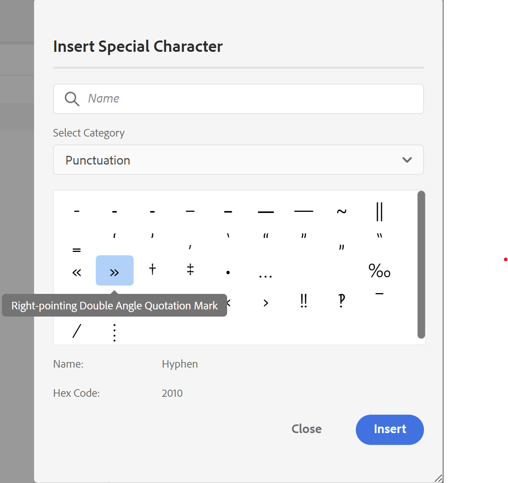


   * **開始番号**：番号付けを特定の番号から開始する場合は、その値を指定します。 この例では、デフォルト値を1のままにします。

   * **インデント**：見出しをインデントする場合は、インデント値を設定する必要があります。 この例では、0 pxに設定します。

     >[!NOTE]
     >
     >値は、px （ピクセル）、pt （ポイント）、rem、em、% （パーセント）、または（インチ）単位で入力できます。

   * **接頭辞の幅**：これは、自動番号形式で占められている領域です。 選択したスタイル形式に簡単に対応できるサイズに自動的に設定されます。 サイズを大きくしたい場合は、デフォルト値を置き換えることができます。

     この値を手動で設定する場合は、幅に影響を与えるその他のプロパティを変更してみてください。 例えば、フォントサイズ、接頭辞（章）または接尾辞（:）を含む形式を変更し、*番号付けの開始* プロパティで最大値を設定し、様々なフォントプロパティで最適なサイズを指定します。

     この例では、デフォルト値をそのままにします。

   * **間隔**：水平方向と垂直方向の間隔を指定します。 この例では、デフォルト値を維持します。

     上記のカスタマイズでは、スタイルは次のようにカスタマイズされます。

     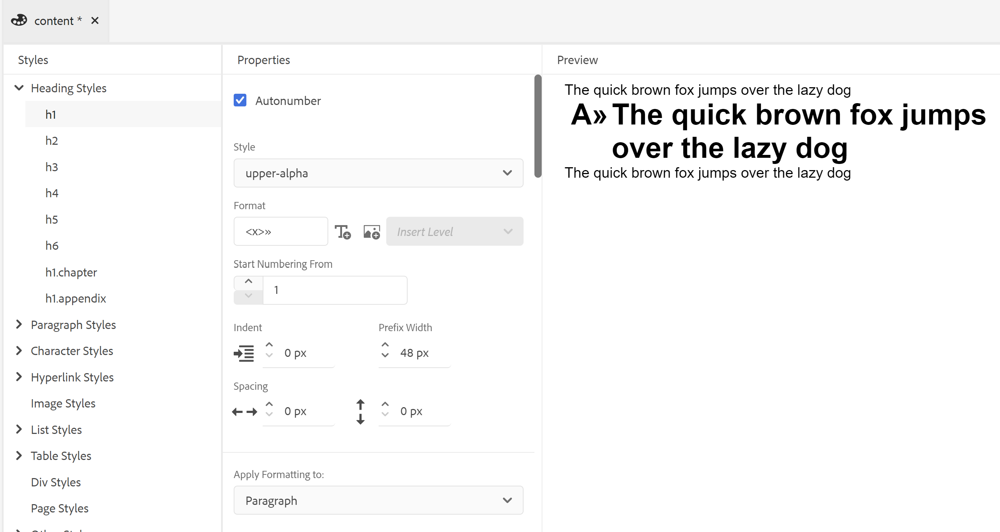

   * **書式を適用**：自動番号カテゴリのプロパティは、番号付けスタイルの定義に役立ちます。 番号付けスタイルまたは見出し形式の内容をさらにカスタマイズするには、このフィールドで「番号付け」または「段落」を選択します。 「番号付け」を選択すると、フォント、境界線、レイアウトなどのカテゴリの変更は、見出しの番号付けスタイルにのみ適用されます。 ただし、「段落」を選択すると、番号付けスタイルではなく、見出しコンテンツに変更が適用されます。

   次のスクリーンショットに示す出力を生成するには、次の設定を使用します。

   | **見出しスタイル** | **プロパティ** | **値** | **追加コメント** |
   | :- | :- | :- | :- |
   | h1 | スタイル | 小数 | これらのプロパティは、自動番号カテゴリの下にあります |
   |  | 形式 | `Capter <x>:` |  |
   |  | 接頭辞の幅 | 160 px |  |
   |  | フォント/テキストの整列 | 左 | 「書式設定を適用」が「番号付け」に設定されていることを確認します |
   | h2 | スタイル | 小数 | これらのプロパティは、自動番号カテゴリの下にあります |
   |  | 形式 | `Section <x>:` |  |
   |  | 接頭辞の幅 | 125 px |  |
   |  | フォント/テキストの整列 | 左 | 「書式設定を適用」が「番号付け」に設定されていることを確認します |
   | h3 | スタイル | 小数 | これらのプロパティは、自動番号カテゴリの下にあります |
   |  | レベルを挿入 | 2 |  |
   |  | 形式 | `Section <2>.<x>:` |  |
   |  | 接頭辞の幅 | 125 px |  |
   |  | フォント/テキストの整列 | 左 | 「書式設定を適用」が「番号付け」に設定されていることを確認します |

   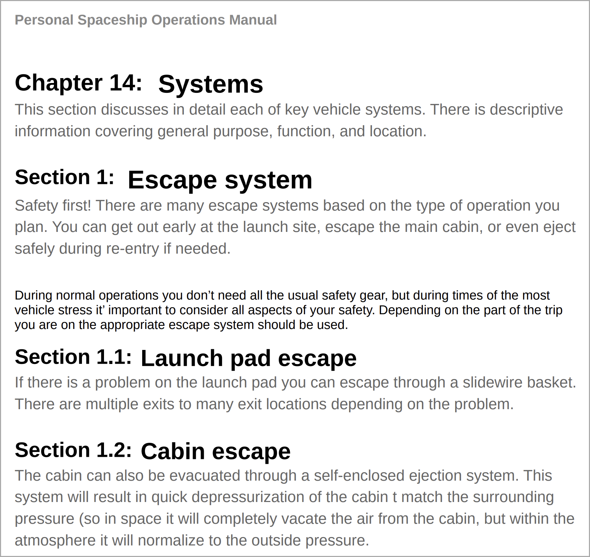

## 段落スタイルの操作 {#paragraph-style}

段落スタイルを作成して、段落全体に特殊な書式設定を適用することができます。 ただし、疑似クラスを使用すると、テキストの特定の部分にのみスタイルを適用できます。 次の例では、ドロップキャップスタイルを使用する段落スタイルを作成します。

### ドロップキャップのスタイルの作成 {#drop-cap-style}

ドロップキャップ（またはドロップキャピタル）スタイルは雑誌で使用され、段落またはセクションの最初の文字に特別なスタイルが設定されている文学文書です。 PDFのネイティブ公開機能を使用すると、同じ効果を得ることができます。

次の例では、ドロップキャップのスタイルを作成します。

1. 編集に必要なスタイルシートを開きます。

   >[!NOTE]
   >
   >カスタマイズまたは編集のためにスタイルシートを開くには、[定義済みまたは新しいスタイルのカスタマイズ &#x200B;](components-pdf-template.md#customize-style) セクションを参照してください。

1. **スタイル** リストで、**段落スタイル**&#x200B;を展開します。

1. **段落スタイル**&#x200B;を右クリックし、**新しいスタイル**&#x200B;を選択します。

1. *スタイルを追加* ダイアログで、**タグ**&#x200B;の名前をpのままにし、**擬似** **クラス** フィールドで、`::first-letter`を選択します。

1. 「**完了**」をクリックします。

   `::first-letter`という名前の新しい段落スタイルが作成され、**段落スタイル** リストの下に追加されます。

1. p スタイルの下の`::first-letter`を選択し、次のプロパティを設定します。

   * **フォント**：段落の最初の文字に使用するフォントを設定します。 この例では、フォントファミリーを筆記体、フォントウエイトを500、フォントサイズを30 ptに設定し、フォントカラーを選択します。

   * **レイアウト**: ドロップキャップのスタイルを囲むように、テキストの垂直方向の配置を設定します。 この例では、「垂直方向の整列」を「下」に設定します。

`p` タグはDITAの`<p>`要素にマッピングされているため、outputclass属性を使用してこのスタイルを明示的に追加する必要はありません。 コンテンツ内で`<p>`要素が使用されている場合は、ドロップキャップのスタイルが自動的に適用されます。 次のスクリーンショットでは、章タイトル、短い説明、定義リストの要素がドロップキャップのスタイルでフォーマットされていません。 段落スタイルのみが、ドロップキャップのスタイルで書式設定されます。

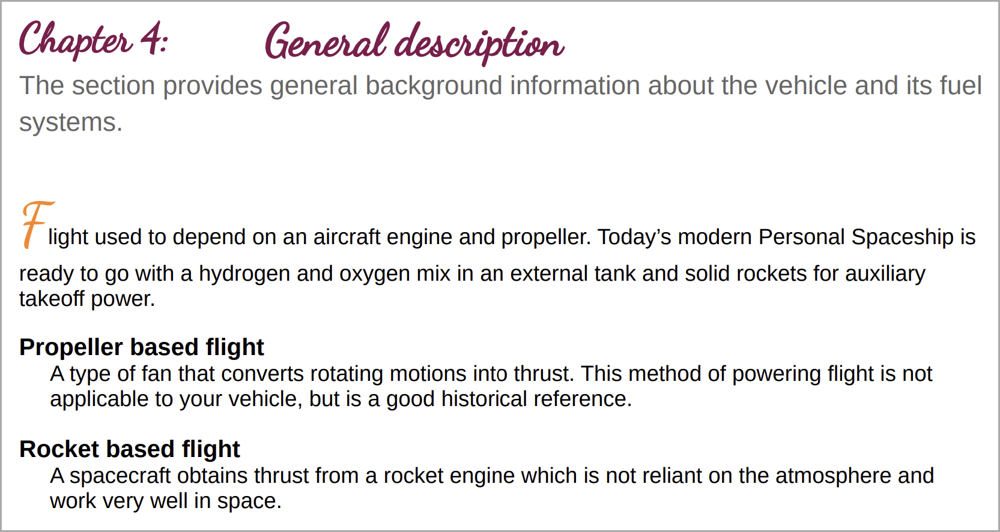

## 文字スタイルの操作 {#char-style}

文字スタイルを使用すると、コンテンツ内の文字または単語の書式設定スタイルを作成できます。 例えば、インラインコードまたはファイル名に対して文字スタイルを作成したり、選択したコンテンツに対して複数のスタイル形式を使用するスタイルを作成したりできます。

### インライン文字スタイルの作成 {#inline-char-style}

段落のインライン文字や単語の書式設定は、非常に一般的なスタイルです。 インラインスタイルを作成するには、まずスタイルシートで新しいスタイルを作成し、次に`outputclass`属性を使用してコンテンツにスタイルを適用するという2つのタスクが必要です。

次の例では、インライン文字スタイルを作成します。

1. 編集に必要なスタイルシートを開きます。

   >[!NOTE]
   >
   >カスタマイズまたは編集のためにスタイルシートを開くには、[定義済みまたは新しいスタイルのカスタマイズ &#x200B;](components-pdf-template.md#customize-style) セクションを参照してください。

1. **スタイル** リストで、**文字スタイル**&#x200B;を展開します。

1. **文字スタイル**&#x200B;を右クリックし、**新しいスタイル**&#x200B;を選択します。

1. スタイルを追加ダイアログで、**タグ**&#x200B;の名前をスパンとして保持し、`BoldItalic` クラス **の名前フィールドに**&#x200B;と入力します。

   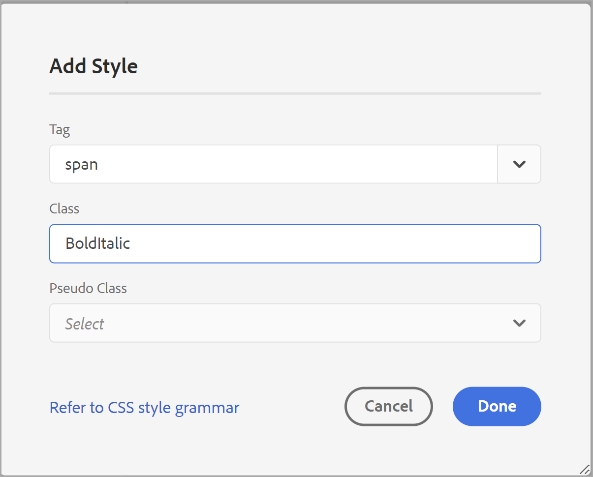

1. 「**完了**」をクリックします。

   コードという名前の新しい文字スタイルが作成され、文字スタイルリストの下に追加されます。

1. `span.BoldItalic`文字スタイル **リストから**&#x200B;を選択し、次のプロパティを設定します。

   * **フォント**: フォントに関連するすべてのプロパティは、このセクションからカスタマイズできます。 デフォルトでは、製品にバンドルされているフォントがいくつかあります。 文字スタイルに適したフォントを選択できます。 この例では、フォントファミリーを&#x200B;*Serif,*&#x200B;に設定し、「フォントスタイル」プロパティで「*Bold*」と「*Italic*」を選択します。 また、フォントの太さ（太字、明るさなど）、テキストの装飾（下線、オーバーラインなど）、フォントサイズ、フォントカラー、テキストの整列など、その他のフォントプロパティをカスタマイズすることもできます。

     >[!NOTE]
     >
     >テンプレートにフォントを追加して、テンプレートの「リソース」セクションに保存することもできます。 フォントの追加とリソースの操作について詳しくは、[&#x200B; リソースの操作](components-pdf-template.md#work-with-resources)を参照してください。

   * **レイアウト**：高さと幅、余白、パディング、整列など、レイアウト関連のプロパティを設定できます。

   * **背景**：背景プロパティを使用すると、特定のスタイルの背景色を書式設定できます。 任意のスタイルの背景色または画像を定義できます。

インライン文字スタイルを作成したら、それをコンテンツに適用する必要があります。 インラインコードスタイルを適用するには、ソースビューに移動し、目的のコンテンツに`outputclass`属性を追加します。

`outputclass="BoldItalic"`

次の例は、実行中のテキストの別の場所に太字の斜体を適用する方法を示しています。

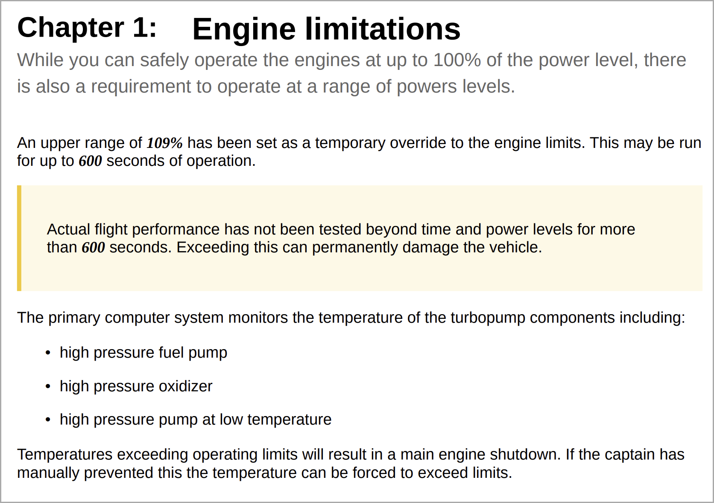

## リストスタイルのカスタマイズ {#custom-list-style}

リストスタイルには、順序付きリストと順序付きリストのデフォルトのスタイル設定が含まれています。 これらのリストスタイルは、ドキュメント要件に合わせて簡単にカスタマイズできます。

次の例では、番号付きリストまたは順序付きリストのスタイルをカスタマイズします。

1. 編集に必要なスタイルシートを開きます。

   >[!NOTE]
   >
   >カスタマイズまたは編集のためにスタイルシートを開くには、[定義済みまたは新しいスタイルのカスタマイズ &#x200B;](components-pdf-template.md#customize-style) セクションを参照してください。

1. **スタイル**&#x200B;のリストで、**リストスタイル**&#x200B;を展開します。

1. リストから&#x200B;**ol** スタイルを選択します。

   古いスタイルのプロパティは、プロパティパネルにプレビューと共に表示されます。

   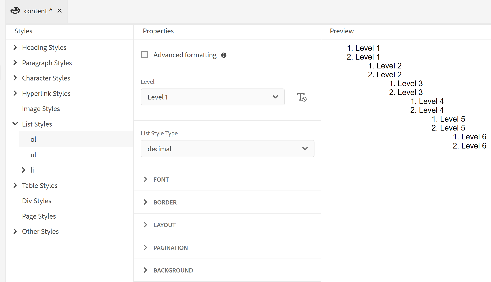

1. 「**詳細フォーマット**」オプションを選択します。

   確認メッセージが表示されます。

1. 「**確認**」メッセージの「*はい*」をクリックして、**詳細フォーマット** プロパティを開きます。

   デフォルトでは、次のプロパティを使用できます。

   * **レベル**：既定では、番号付きリストには6つのレベルがあります。 このドロップダウンで選択したレベルは、選択したレベルとその後のすべてのレベルでスタイルの変更を制御します。 例えば、レベル 4を選択した場合、適用するすべてのスタイル変更はレベル 4、5、6に設定されます。

   * **リストスタイルタイプ**：選択できるリスト番号付けスタイルは多数あります。 リストには、番号付きリストの作成に使用される、ロケール固有および汎用的な番号付けスタイルが含まれています。 リストスタイルの種類には、アラビア語、カンボジア語、デバナガリ語、エチオピア語、ハングル語、ヘブライ語、日本語、韓国語、簡体中国語、ウルドゥー語などがあります。

   さらに、次の詳細な書式設定プロパティを使用できます。

   * **番号形式**: デフォルトの形式は`<x>`に設定され、`x`値はリストスタイルタイププロパティで選択した番号付けスタイルに置き換えられます。 例えば、`decimal` （1） スタイルを選択した場合、`x`の値は、リスト要素の各インスタンスに対して自動的に増分され、2、3などに設定されます。 フィールドにカスタムテキストを追加して、リストスタイルを書式設定することもできます。 例えば、すべての第1 レベルのリストスタイルにサフィックス「`)`」を付ける場合、このフィールドを第1 レベルのリストスタイルに「`<x>)`」に設定する必要があります。

   * **文字を挿入**：数値形式に特殊文字を追加する場合は、文字を挿入（）アイコン。 スタイル形式で追加する目的の文字を選択し、「挿入」をクリックします。 「カテゴリを選択」ドロップダウンリストから選択できる特殊文字にはさまざまな種類があります。

   * **レベルを挿入**：前のレベルの任意のレベルの番号を番号形式に含めることができます。 例えば、第6 レベルの番号書式に第5 レベルの番号書式を含める場合は、「レベルを挿入」ドロップダウンリストで「5」を選択します。 「レベルを挿入」ドロップダウンには、前のレベルの数値のみが表示され、次のレベルの数値は表示されないことに注意してください。 例えば、レベル 3の場合、レベルを挿入リストにはレベル 1と2のみが表示されます。

     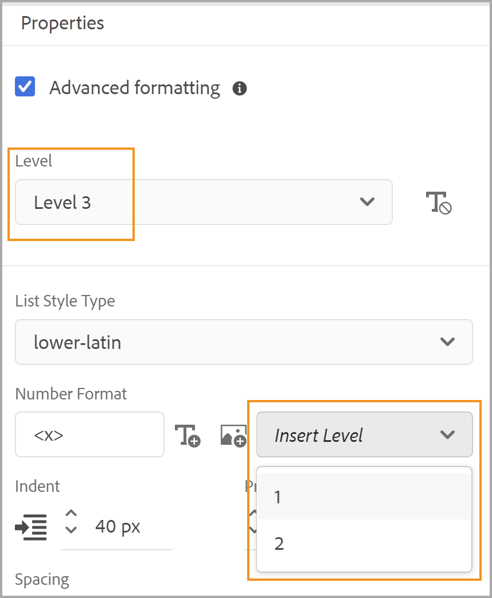

     必要に応じてリストの値を表示するように、数値形式を変更することもできます。 例えば、レベル 3にネストされた番号付けスタイルを使用している場合、それを「`<2>.<x>))`」として書式設定できます。 これにより、リスト番号2が表示され、次にピリオド、次にリスト番号3が表示され、次に`2.3))`という2つの角かっこが表示されます。

   * **インデント**: リストをインデントする場合は、インデント値を設定する必要があります。 インデントの変更は、プレビューパネルで確認して調整できます。

     >[!NOTE]
     >
     >値は、px （ピクセル）、pt （ポイント）、rem、em、% （パーセント）、または（インチ）単位で入力できます。

   * **接頭辞の幅**：これは、数値形式で占められている領域です。 選択した形式に簡単に対応できるサイズに自動的に設定されます。 サイズを大きくしたい場合は、デフォルト値を置き換えることができます。

     この値を手動で設定する場合は、幅に影響を与えるその他のプロパティを変更してみてください。 例えば、フォントサイズ、接頭辞または接尾辞を含む形式、および様々なフォントプロパティを変更して、最適なサイズを指定します。

   * **間隔**: リスト番号の形式とコンテンツの間の水平間隔を指定します。 垂直方向の間隔は、2つのリスト項目間の間隔を制御します。

     次のスクリーンショットは、各レベルのカスタマイズされた順序付きリストを示しています。

     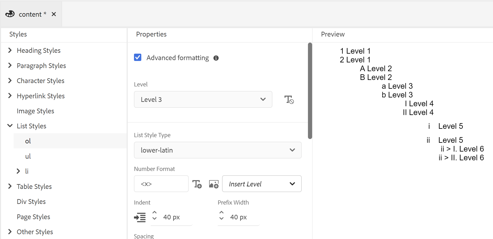

## 表スタイルの操作 {#table-styles}

スタイルシートを使用すると、*n*&#x200B;個のテーブルスタイルをデザインできます。 表スタイルを使用すると、表全体、特定の行または列の方法をデザインできます。 セルレベルのスタイル設定をコントロールすることで、表形式のスタイルを作成できます。

次の例では、表スタイルの作成方法と、カスタマイズ可能な様々な表スタイル設定オプションについて説明します。

1. 編集に必要なスタイルシートを開きます。

   >[!NOTE]
   >
   >カスタマイズまたは編集のためにスタイルシートを開くには、[定義済みまたは新しいスタイルのカスタマイズ &#x200B;](components-pdf-template.md#customize-style) セクションを参照してください。

1. **スタイル** リストで、**表スタイル**&#x200B;を右クリックし、**新しいスタイル**&#x200B;を選択します。

1. *スタイルを追加* ダイアログで、**タグ**&#x200B;の名前を`table`のままにし、`double-border` クラス **の名前フィールドに**&#x200B;と入力します。

1. 「**完了**」をクリックします。

   `table.double-border`という名前の新しいテーブル スタイルが作成され、テーブル スタイル リストの下に追加されます。

1. `table.double-border`表スタイル **リストから**&#x200B;を選択し、次のプロパティを設定します。

   * **書式設定の適用先**: テーブル全体、奇数/偶数の行または列、最初/最後の行または列にスタイルの書式設定を適用できます。

     >[!NOTE]
     >
     >次の設定は、**書式を適用**&#x200B;が&#x200B;**テーブル全体**&#x200B;に設定されている場合、**一般** セクションで使用できます。

   * **テキストの回り込み**：表の周りにテキストを回り込む方法を選択します。 これは、テーブルが別のブロックレベル要素内にあり、テーブルがブロック要素内の他のコンテンツと共にレンダリングされる必要がある場合に便利です。 折り返しオプションは、*left*&#x200B;または&#x200B;*right*&#x200B;揃え、または&#x200B;*none*&#x200B;です。

   * **境界線の折りたたみ**: テーブルの境界線の外観を選択します。 「折りたたむ」を選択すると、表のセルの間に境界線が1本だけ表示されます。 ただし、個別のスタイルの場合、余白を追加して各セルの周囲に境界線が表示されます。

     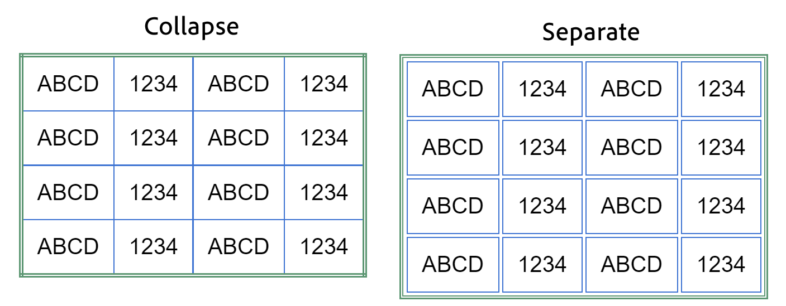

   * **Border Spacing**：この設定は、「Border Collapse」が「Separate」に設定されている場合にのみ使用できます。 この設定を使用すると、セルの境界線の間の垂直方向と水平方向の間隔を指定できます。

     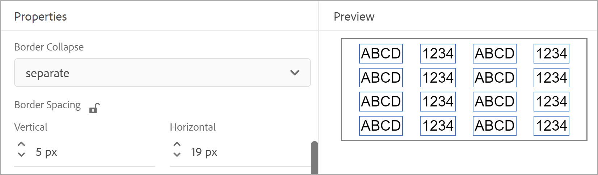

     >[!NOTE]
     >
     >**書式を適用**&#x200B;が&#x200B;**テーブル全体**&#x200B;に設定されている場合、**セル** セクションで次の設定を使用できます。

   * **パディング**：表のセル間のパディングを指定します。 上下左右に異なるパディング値を指定できます。

   * **垂直方向の整列**: セルの内容の垂直方向の整列を指定します。 使用可能なオプションは、トップ、ミドル、ボトムです。

   * **境界線、スタイル、色、幅、半径：**&#x200B;境界線に関連するプロパティを指定します。 左または右など、特定の辺にのみ境界線を設定できます。 境界線スタイルには、実線、破線、二重線など、使用可能な境界線スタイルが一覧表示されます。 カラーパレットを使用して境界線のカラーを指定します。 境界線の幅は、px、pt、rem、em、%および単位で指定できます。 半径は、円形の角を作成するための曲線を定義します。

   フォント、境界線、レイアウト、ページネーション、および背景の下の他のプロパティについては、このトピックの他の例で説明します。 「**書式を適用**」プロパティで選択した内容に応じて、これらの値をテーブル全体または選択した行または列に適用できます。

   異なる行が別の方法でフォーマットされたサンプルテーブルのプレビューを次に示します。

   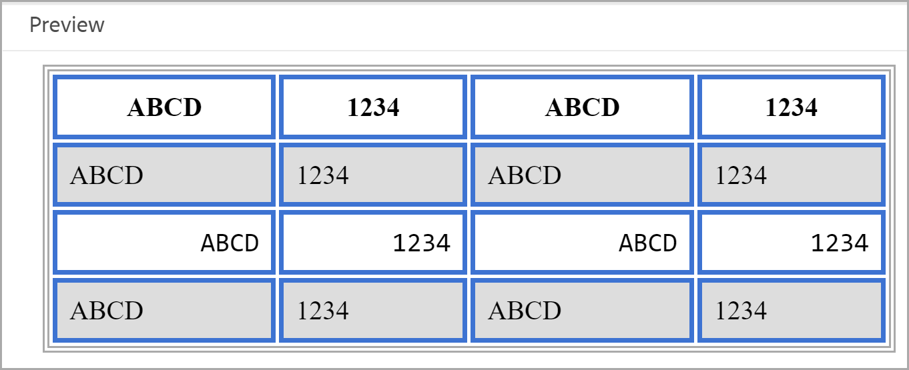

## 他のスタイルの操作 {#other-styles}

構造化（DITA）コンテンツを使用している場合は、ほぼすべてのDITA要素がデフォルトのスタイルシートにスタイルマッピングされていることに気付くでしょう。 例えば、`<shortdesc>`要素のスタイルは、**その他のスタイル** > **.shortdesc** スタイル定義で定義されています。 これらのスタイルは、構造化されたコンテンツから生成されたPDF出力に自動的に適用されます。 つまり、他のカスタムスタイルとは異なり、これらのスタイルのコンテンツに`outputclass`属性を追加する必要はありません。

デフォルトで使用できない要素のスタイル定義を作成する場合や、カスタム要素がある場合は、スタイルシートで簡単に作成できます。 考慮すべき点は、構造化要素の名前と同じ名前でスタイルを作成することだけです。

次の例では、新しいウィンドウのタイトル（`wintitle`）のスタイルを作成します。

1. 編集に必要なスタイルシートを開きます。

   >[!NOTE]
   >
   >カスタマイズまたは編集のためにスタイルシートを開くには、[定義済みまたは新しいスタイルのカスタマイズ &#x200B;](components-pdf-template.md#customize-style) セクションを参照してください。

1. **スタイル**&#x200B;のリストで、**その他のスタイル**&#x200B;を展開します。

1. **その他のスタイル**&#x200B;を右クリックし、**新しいスタイル**&#x200B;を選択します。

1. *スタイルを追加* ダイアログで、**タグ**&#x200B;の名前を&#x200B;*空白*&#x200B;のままにし、`wintitle` クラス **の名前フィールドに**&#x200B;と入力します。

   `wintitle`は認識されたDITA要素名であるため、そのスタイル定義はソース内の`<wintitle>`要素に自動的にマッピングされます。

1. 「**完了**」をクリックします。

   `.wintitle`という名前の新しいスタイルが作成され、**その他のスタイル** リストの下に追加されます。

1. 「**その他のスタイル**」リストから「.wintitle」を選択し、必要に応じてプロパティを設定します。

次のスクリーンショットは、「プライマリコントロール」というテキストに適用されるwintitle スタイルを示しています。

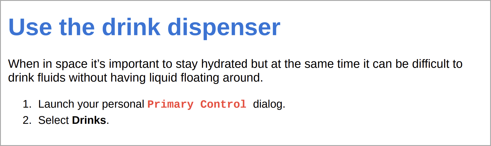


## 単一ページレイアウトに独自のスタイルを定義する

ネイティブPDF出力を公開する際には、すべてのスタイルが最終的なPDFで結合されます。CSS内の各テンプレートに一意のスタイルを割り当てることが重要です。
PDFの様々なセクションに特定のフォントやスタイルを適用するには、個別のCSS スタイル名を使用します。 例えば、次のCSSを使用して、表紙の目的のフォントを定義できます。

```css
...
[data-page-layout="Front"] * { 
    font-size: 18pt; 
}  
...
```


ドキュメントの残りの部分では、`content.css`または`layout.css`のボディタグに指定したデフォルトのフォントが使用されます。 これにより、スタイルが結合されず、各セクションが意図したデザインを保持します。 フォントサイズを変更する場合は、そのフォントサイズに合わせて特定のスタイルを作成します。

例えば、次のスタイルを定義して、表紙ページの段落にフォントサイズ 18、裏表紙ページにフォントサイズ 11 ptを定義できます。

```css
[data-page-layout="Front"] p { //For all paragraphs inside Front page
  font-size: 18pt; 
} 
  
[data-page-layout="Back"] p { //For all paragraphs inside Back page
  font-size: 11pt; 
}
```

>[!NOTE]
>
> 前の例では、「前面」と「背面」は、テンプレートで使用できるレイアウトファイルのサンプル名です。


## 接頭辞と接尾辞のコンテンツにカスタム CSS スタイルを定義する

カスタム CSS スタイルを定義すると、ネイティブ PDF出力の生成時に最初の優先が与えられます。
次のデフォルトのCSS スタイルでは、接頭辞と接尾辞の両方のコンテンツが非表示になります。

```css
...
.prefix-content, .suffix-content{
    display: none;
} 
...
```

`<note>`要素内でこれらのプレフィックスを許可するには、`content.css`に次のCSSを含めます。

```css
...
.prefix-content{
    display: inline !important;
}
...
```

`<note>`要素は、type属性に対応するクラスのprefix-contentを持つ追加の`<span>`を生成します。 このCSS ルールは、`.prefix-content`要素の`<note>` クラスをtype属性でターゲットとし、必要に応じてプレフィックスコンテンツをスタイル設定または操作できるようにします。

