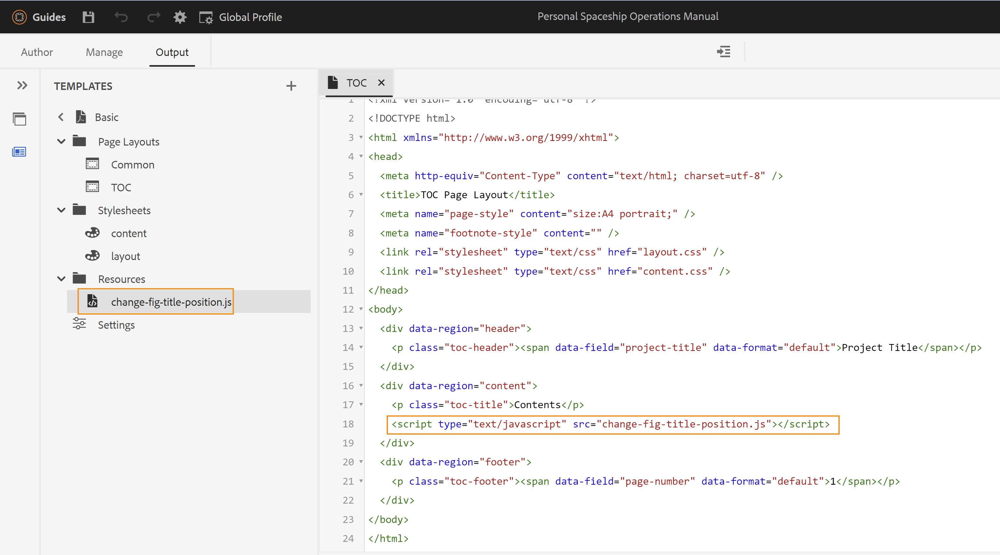

# JavaScriptを使用してコンテンツやスタイルを操作する

ネイティブPDFの公開機能を使用すると、最終的なPDFが生成される前に、JavaScriptを実行して、コンテンツまたはコンテンツに適用されたスタイルを操作できます。 この機能により、最終的な出力の生成方法を完全に制御できます。 例えば、別のPDFにあるPDF出力に法的注意事項を追加することができます。 JavaScriptを使用すると、ベースコンテンツのPDFを作成した後、最終的なPDFが生成される前に、法的通知情報を追加できます。\
JavaScriptの実行をサポートするために、ネイティブPDF公開機能には次のコールバック関数が用意されています。

* `window.pdfLayout.onBeforeCreateTOC(callback)`：このコールバック関数は、目次が生成される前に実行されます。
* `window.pdfLayout.onBeforePagination(callback)`：このコールバック関数は、目次が生成された後、PDFに改ページが追加される前に実行されます。
* `window.pdfLayout.onAfterPagination(callback)`：このコールバック関数は、目次と改ページがPDFに追加された後に実行されます。

>[!NOTE]
>
>内部的には、これらのコールアウト関数の実行シーケンスが維持されます。 まず、onBeforeCreateTOC が実行され、次に onBeforePagination が実行され、最後に onAfterPagination が実行されます。

実行するコンテンツのタイプやスタイルの変更に基づいて、使用するコールバック関数を選択できます。 例えば、コンテンツを追加する場合は、目次が生成される前に行うことをお勧めします。 同様に、スタイル設定の更新を行う場合は、ページネーションの前または後に行うことができます。

次の例では、図のタイトルの位置をイメージの上からイメージの下に変更します。 その場合、プリセットで「JavaScript実行」オプションを有効にする必要があります。 これを行うには、次の手順を実行します。

1. 編集するプリセットを開きます。
1. 「**詳細**」タブに移動します。
1. 「**JavaScriptを有効にする**」オプションを選択します。
1. プリセットを保存して閉じます。

次に、以下のコードでJavaScript ファイルを作成して、テンプレートの Resources フォルダー内に保存します。

```css
...
/*
* DITA only allows the figure title to be placed above images 
* This JavaScript code is used to move the figure title below the image
* */
window.addEventListener('DOMContentLoaded', function () {
    window.pdfLayout.onBeforeCreateTOC(function() {
        var titleNodes = document.querySelectorAll('.fig > .title')
        for (var i = 0; i < titleNodes.length; i++) {
            var titleNode = titleNodes[i]
            var figNode = titleNode.parentNode
            var imageNode = figNode.querySelector('.image')
            if(imageNode && imageNode.parentNode !== figNode) {
              imageNode = imageNode.parentNode
            }
            if (figNode && imageNode && imageNode.parentNode === figNode) {
                figNode.insertBefore(imageNode, titleNode)
            }
        }
    })
});
...
```

>[!NOTE]
>
>コールバック関数を使用する前に、`window.addEventListener('DOMContentLoaded', function ()` 関数を呼び出す必要があります。

次に、このスクリプトは、PDF出力の生成に使用されるテンプレートファイルから呼び出す必要があります。 この例では、目次テンプレートに追加します。 `<script>` タグが、`<body>` タグ内の事前定義済みの `<div>` タグに追加されていることを確認します。 `<head>` タグ内または `<body>` タグ外に追加した場合、スクリプトは実行されません。



このコードを使用して生成された出力とテンプレートでは、画像の下に図のタイトルが表示されます。


## 下書き文書のPDF出力に透かしを追加する {#watermark-draft-document}

JavaScriptを使用して、条件付き透かしを追加することもできます。 これらの透かしは、定義された条件が満たされると、ドキュメントに追加されます。\
例えば、次のコードを使用してJavaScript ファイルを作成し、まだ承認されていないドキュメントのPDF出力に透かしを作成することができます。 この透かしは、「承認済み」ドキュメント状態のドキュメントのPDFを生成した場合には表示されません。

```css
...
/*
* This file can be used to add a watermark to the PDF output
* */

window.addEventListener('DOMContentLoaded', function () {
    var watermark = 'Draft'
    var metaTag = document.getElementsByTagName('meta')
    css = "@page {\n  @left-middle {\n    content: \"".concat(watermark, "\";\n    z-index: 100;\n    font-family: sans-serif;\n    font-size: 80pt;\n    font-weight: bold;\n    color: gray(0, 0.3);\n    text-align: center;\n    transform: rotate(-54.7deg);\n    position: absolute;\n    left: 0;\n    top: 0;\n    width: 100%;\n    height: 100%;\n  }\n}")
    head = document.head || document.getElementsByTagName('head')[0], style = document.createElement('style');
    style.appendChild(document.createTextNode(css));
    window.pdfLayout.onBeforePagination(function () {
        for (let i = 0; i < metaTag.length; i++) {
            if (metaTag[i].getAttribute('name') === 'docstate' && metaTag[i].getAttribute('value') !== 'Approved') {
                head.appendChild(style);
            }
        }
    })
});
...
```

このコードを使用して生成されたPDF出力では、文書の表紙に透かし *ドラフト* が表示されます。


