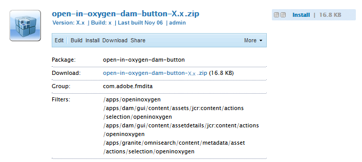
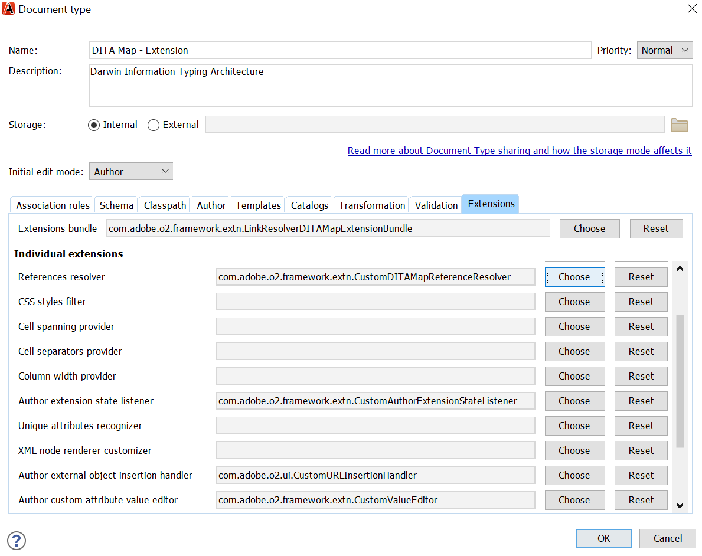
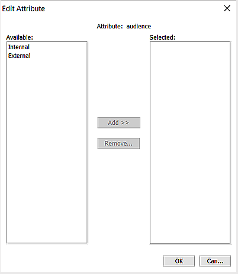

# Adobe Experience Manager Guides用Oxygen プラグイン {#id1645H6010Q5}

Adobe Experience Manager Guides用Oxygen プラグイン \（後でAEM Guides用Oxygen プラグインと呼ばれます）を使用すると、Oxygen XML AuthorをAdobe Experience Manager \（AEM\） リポジトリに接続して、コンテンツをオーサリングおよび管理できます。 プラグインを使用して、ファイルを参照、検索、開いたり、ファイルをチェックアウトしてチェックインしたり、AEM リポジトリにフォルダーやファイルをアップロードしたりできます。 デスクトップアプリケーションのAEM Guides パネルを使用すると、目的のフォルダー\（AEM リポジトリから\）をお気に入りのフォルダーリストにマークして、すばやくアクセスできます。 さらに、AEM web インターフェイスにパッケージをインストールし、AEM web インターフェイスから直接Oxygen XML AuthorでDITA ファイルを開くことができます。

## ダウンロードとインストール {#id1826M0L0PUI}

AEM Guides用のOxygen プラグインは、Adobe ソフトウェア配布ポータルから入手できます。 「Experience Manager」タブで「oxygen」を検索し、[Adobe Software Distribution Portal](https://experience.adobe.com/#/downloads/content/software-distribution/jp/general.html)からプラグインインストーラーをダウンロードします。

>[!NOTE]
>
>Oxygen Connectorのバージョンの互換性については、特定のAdobe Experience Manager Guidesのリリースノートを参照してください。

インストーラーが用意できたら、Oxygen XML Authorがインストールされているローカルマシンにインストールします。 インストールプロセスを開始する前に、お使いのシステムがOxygen Plugin for AEM Guidesをインストールするための技術要件を満たしていることを確認する必要があります。

### 技術要件

- Oxygen XML Author バージョン 26.1

- Adobe Experience Manager Guides バージョン 4.6以降

- サービスパック 21、20および19を含むAdobe Experience Manager バージョン 6.5

- Oxygen XML Author バージョン 26.1でサポートされているオペレーティングシステム

- Java開発キット
   - Oracle SE 8 JRE 1.8

### Windowsでのプラグインのインストール

>[!IMPORTANT]
>
>古いバージョンのプラグインがシステムにインストールされている場合は、インストールプロセスを開始する前に必ずアンインストールしてください。 アンインストール手順については、[&#x200B; パッケージの操作方法](https://helpx.adobe.com/jp/experience-manager/6-4/sites/administering/using/package-manager.html)の記事の「**パッケージのアンインストール**」の節を参照してください。

Oxygen XML Authorがインストールされているシステムで、次の手順を実行します。

1. インストーラーの`.exe` ファイルを起動します。

   インストールウィザードのようこそ画面が表示されます。

1. 「**次へ**」をクリックし、Oxygen XML Author の.exe ファイルが使用可能な場所を参照します。

1. ファイルを選択し、**開く**&#x200B;をクリックします。

   選択したファイルの場所がインストールウィザードに追加されます。

1. 「**次へ**」をクリックします。

1. 「**インストール**」をクリックします。

1. 「**完了**」をクリックして、インストールウィザードを閉じます。
1. Oxygen XML Authorを起動します。

   AEM Guides パネルがOxygen XML オーサーに表示されます。

   {width="800"}

   >[!NOTE]
   >
   >AEM Guides パネルが表示されない場合は、トラブルシューティングの節「[AEM Guides パネルが見つかりません](#id192BH200ZAX)」の回避策を参照してください。


### Macへのプラグインのインストール

>[!IMPORTANT]
>
>古いバージョンのプラグインがシステムにインストールされている場合は、インストールプロセスを開始する前に必ずアンインストールしてください。 パッケージのアンインストール手順については、[&#x200B; パッケージの操作方法](https://helpx.adobe.com/jp/experience-manager/6-4/sites/administering/using/package-manager.html)の記事の「**パッケージのアンインストール**」の節を参照してください。

Oxygen XML Authorがインストールされているシステムで、次の手順を実行します。

1. システム上でプラグインの.dmg ファイルを探します。

1. .dmg ファイルをダブルクリックして、ファイルの内容を開きます。

   .dmg ファイルには、aem-connector-x.x フォルダーとaem-connector-x.x-setup ファイルが含まれています。

   >[!NOTE]
   >
   >ファイル名のx.xは、プラグインのバージョン番号です。

1. Oxygen XML Authorのplugins フォルダーにaem-connector-x.x フォルダーをコピーします。
1. aem-connector-x.x-setup ファイルをダブルクリックして、インストーラーを起動します。

1. Oxygen XML Authorを起動します。

   AEM Guides パネルがOxygen XML オーサーに表示されます。

    {width="800"}

   >[!NOTE]
   >
   >AEM Guides パネルが表示されない場合は、トラブルシューティングの節「[AEM Guides パネルが見つかりません](#id192BH200ZAX)」の回避策を参照してください。


### AEM web インターフェイスからドキュメント編集機能を有効にするパッケージをインストールします {#id182CE0Q0TY4}

作成者は、AEM web インターフェイスから直接Oxygen XML AuthorでDITA マップまたはトピックを開いて編集できます。 AEM web インターフェイスでこの機能を有効にするには、AEM管理者がAEM オーサリングインスタンスにパッケージをインストールする必要があります。

AEM管理者は、次の手順に従ってパッケージをインストールします。

1. IT チームからパッケージの.zip ファイルを取得します。
1. AEM インスタンス *\（管理者\）*&#x200B;にログインし、CRX Package Managerに移動します。 パッケージマネージャーにアクセスするためのデフォルトのURLは

   `http://<server name>:<port>/crx/packmgr/index.jsp`

   パッケージマネージャーは、ローカルのAEM インストール上のパッケージを管理します。 パッケージマネージャーの操作について詳しくは、AEM ドキュメントの[&#x200B; パッケージの操作方法](https://experienceleague.adobe.com/docs/experience-manager-cloud-service/content/implementing/developer-tools/package-manager.html?lang=ja)を参照してください。

    {width="650"}

1. Oxygen パッケージをアップロードするには、「**パッケージをアップロード**」をクリックします。
1. アップロードパッケージダイアログで、手順1でダウンロードしたOxygen パッケージファイルに移動し、「OK」をクリックします。

   パッケージがAEM インスタンスにアップロードされます。

1. インストールプロセスを開始するには、**インストール**&#x200B;をクリックします。

   {width="650"}

1. パッケージをインストール ダイアログで、**Install**&#x200B;をクリックします。
1. インストールが完了したら、CRX Package Managerの左上隅にある「ホーム」ボタンをクリックします。
1. アセットフォルダーでDITA ファイルを選択します。

   **酸素で編集** オプションはツールバーで使用できます。 このオプションの使用について詳しくは、「[AEM web インターフェイスからOxygen XML オーサーでDITA トピックを開く](#id182CE0I905Z)」を参照してください。

   >[!NOTE]
   >
   >1つのDITA トピックを選択すると、「**酸素で編集**」オプションが表示されます。 複数のトピックを選択した場合、このオプションは表示されません。


## AEM Guides用Oxygen プラグインの設定 {#id1826KF00AHS}

プラグインをダウンロードしてインストールした後、プラグインを操作するには次の設定が必要です。

- **Web認証設定**: AEM Guides用プラグインのSSO認証設定。
- **一般設定**: AEM サーバーのURL、ログインの詳細など、プラグインの接続設定。
- **相互参照におけるプロファイル属性のカスタマイズおよびファイル名の優先**：この設定は、ドキュメントセットのプロファイル属性スキームに必要です。

### Web認証設定

JxBrowserは、Oxygen コネクタプラグインによるSSO認証に使用されます。 Chromium ベースのブラウザーです。 Java 9以降の場合は、パブリック API以外へのアクセスが必要であり、このアクセス権をJxBrowserに明示的に付与する必要があります。 詳しくは、[JxBrowserのトラブルシューティング &#x200B;](https://jxbrowser-support.teamdev.com/docs/guides/troubleshooting/issues.html)を参照してください。

指定されたファイルを更新して、AEM Guides用Oxygen プラグインのweb認証設定を設定します。

>[!NOTE]
>
>更新する前に、ファイルのバックアップを取ります。

**MacとOxygen 26.1**&#x200B;の場合

env.shに次の行を追加します。

```java
--illegal-access=permit\
--add-opens=java.desktop/javax.swing.plaf.basic=ALL-UNNAMED\
--add-exports=javafx.controls/com.sun.javafx.scene.control=ALL-UNNAMED\
--add-exports=javafx.graphics/com.sun.javafx.stage=ALL-UNNAMED\
--add-exports=javafx.graphics/com.sun.javafx.scene=ALL-UNNAMED\
--add-exports=javafx.graphics/com.sun.javafx.scene.traversal=ALL-UNNAMED\
--add-exports=javafx.graphics/com.sun.javafx.tk=ALL-UNNAMED\
--add-exports=javafx.graphics/com.sun.glass.ui=ALL-UNNAMED\
--add-opens=javafx.graphics/com.sun.glass.ui=ALL-UNNAMED\
--add-opens=javafx.graphics/javafx.stage=ALL-UNNAMED\
--add-opens=javafx.graphics/com.sun.javafx.tk.quantum=ALL-UNNAMED\
--add-exports=java.desktop/sun.awt=ALL-UNNAMED\
--add-opens javafx.swing/javafx.embed.swing=ALL-UNNAMED
```

oxygenAuthor.shに次の行を追加します

```java
-Djdk.module.illegalAccess=permit\-Djava.ipc.external=true\
```

**WindowsおよびOxygen 26.1**&#x200B;の場合

env.batに次の行を追加します。

```java
--illegal-access=permit --add-opens=java.desktop/javax.swing.plaf.basic=ALL-UNNAMED --add-exports=javafx.controls/com.sun.javafx.scene.control=ALL-UNNAMED --add-exports=javafx.graphics/com.sun.javafx.stage=ALL-UNNAMED --add-exports=javafx.graphics/com.sun.javafx.scene=ALL-UNNAMED --add-exports=javafx.graphics/com.sun.javafx.scene.traversal=ALL-UNNAMED --add-exports=javafx.graphics/com.sun.javafx.tk=ALL-UNNAMED --add-exports=javafx.graphics/com.sun.glass.ui=ALL-UNNAMED --add-opens=javafx.graphics/com.sun.glass.ui=ALL-UNNAMED --add-opens=javafx.graphics/javafx.stage=ALL-UNNAMED --add-opens=javafx.graphics/com.sun.javafx.tk.quantum=ALL-UNNAMED --add-exports=java.desktop/sun.awt=ALL-UNNAMED --add-opens javafx.swing/javafx.embed.swing=ALL-UNNAMED
```

oxygenAuthor.batに次の行を追加します

```java
-Djdk.module.illegalAccess=permit -Djava.ipc.external=true
```

>[!NOTE]
>
>Macの場合はoxygenAuthor.sh、Windowsの場合はoxygenAuthor.batから実行する必要があります。

### 一般設定

次の手順を実行して、Oxygen Plugin for Adobe Experience Manager Guidesの接続設定を行います。

1. AEM Guides パネルで、設定アイコンをクリックし、**設定**&#x200B;を選択します。

   {width="800"}

1. 次の詳細を指定します。
   - **サーバーURL**:AEM サーバーのURL （例：）

     ```http
     http[s]://<host>:<port>
     ```

     上記のURLで、AEM サーバーがデプロイされるサーバーのホスト名とポートを指定します。

     >[!IMPORTANT]
     >
     >AEM サーバーがポート 80または443にデプロイされている場合は、URLに指定する必要はありません。

   - **認証：** **基本\（ユーザー名/パスワード\）**&#x200B;または&#x200B;**Web認証**&#x200B;から選択します。 **Basic**&#x200B;認証を選択した場合、環境設定ダイアログに&#x200B;**ユーザー名**&#x200B;と&#x200B;**パスワード**&#x200B;を入力する必要があります。

     「Web認証」を選択すると、AEM ログイン画面が表示されます。 ログイン資格情報を入力し、「**ログイン**」ボタンをクリックします。 ログインが成功すると、AEM ログイン画面が閉じ、AEM Guides パネルにAEM サーバーのファイルリストが表示されます。

   - **接続タイムアウト**: クライアントがAEM サーバーからの応答を待つ時間を秒単位で指定します。 指定された時間内にサーバーからの応答が受信されない場合、リクエストは終了します。 デフォルト値は 20 秒です。

   - **ローカルフォルダー**：チェックアウト後にAEM リポジトリのファイルが保存されるローカルマシン上の場所。 ドライブに存在しない場所を指定すると、プラグインはその場所を作成します。
   - **チェックアウト時にファイルを開く**：選択すると、チェックアウト時にファイルが開きます。
   - **チェックイン時にファイルを閉じる**：選択した場合、チェックイン時にファイルを閉じます。 ファイルを閉じる前に、バージョンコメントを指定できるポップアップが表示されます。
   - **ファイルを閉じる際にチェックインダイアログを表示**：選択すると、ファイルを閉じる際にポップアップが表示されます。 ポップアップから、ファイルをチェックインするか、チェックインせずにファイルを閉じるかを選択できます。
   - **開いたときにファイルを自動チェックアウト**：選択した場合、ファイルをダブルクリックすると、自動的にチェックアウトされ、編集用に開かれます。 ファイルが既にチェックアウトされている場合は、編集のために開かれるだけです。 このオプションが選択されていない場合は、ロックのないファイルを開くと、読み取り専用モードで開きます。
1. 「**OK**」をクリックします。

### 相互参照でのプロファイル属性のカスタマイズとファイル名の設定 {#id1827K0D0OHT}

Oxygen XML Authorの環境設定を設定して、AEM リポジトリのDITA トピックに関連付けられているプロファイリング属性を使用する必要があります。 また、相互参照でGUIDの代わりにファイル名を表示するように、環境設定を設定する必要があります。

プロファイリング属性と相互参照を設定するには、次の手順を実行します。

1. Oxygen XML オーサーで、**オプション** \> **環境設定**&#x200B;をクリックします。
1. 「**ドキュメントタイプの関連付け**」タブで、**DITA**&#x200B;を選択し、**拡張**&#x200B;をクリックします。

   {width="650"}

1. 「**クラスパス**」タブで、**ID** ドロップダウンの「 プラグインから親クラスローダーを使用」で「`com.adobe.o2.connector`」を選択します。

   {width="650"}

1. 「**拡張機能**」タブで、次の変更を行います。

   - **拡張機能バンドル**&#x200B;の横にある&#x200B;**選択**&#x200B;をクリックし、**クラス**&#x200B;のリストから`LinkResolverExtensionBundle - com.adobe.o2.framework.extn`を選択します。 「**OK**」をクリックします。
      {width="650"}
   - **個別の拡張機能**&#x200B;の下の&#x200B;**オーサー拡張機能の状態リスナー**&#x200B;の横にある&#x200B;**選択**&#x200B;をクリックし、**クラス**&#x200B;のリストから`CustomAuthorExtensionStateListener - com.adobe.o2.framework.extn`を選択します。 「**OK**」をクリックします。
   - **個人用拡張機能**&#x200B;の&#x200B;**オーサーカスタム属性値エディター**&#x200B;の横にある&#x200B;**選択**&#x200B;をクリックし、**クラス** リストの`CustomValueEditor - com.adobe.o2.framework.extn`を選択します。 「**OK**」をクリックします。
   - **個人用拡張機能**&#x200B;の&#x200B;**オーサー外部オブジェクト挿入ハンドラー**&#x200B;の横にある&#x200B;**選択**&#x200B;をクリックし、**クラス**&#x200B;のリストから`CustomURLInsertionHandler - com.adobe.o2.ui `を選択します。 「**OK**」をクリックします。


   次のスクリーンショットは、DITA トピック用に設定された&#x200B;**拡張機能** タブを示しています。
   
1. すべてのダイアログボックスで「**OK**」をクリックして、変更を保存します。

### DITA マップ拡張機能の設定

Oxygen XML AuthorでマップファイルをAEM web インターフェイスから直接開くには、DITA マップ拡張機能の設定が必要です。 これらの設定は、前の手順で行ったプロファイル属性の設定と似ています。

DITA マップ拡張機能を設定するには、次の手順を実行します。

1. Oxygen XML オーサーで、**オプション** \> **環境設定**&#x200B;をクリックします。
1. 「**ドキュメントタイプの関連付け**」タブで、**DITA マップ**&#x200B;を選択し、**拡張**&#x200B;をクリックします。
1. 「**クラスパス**」タブで、**ID** ドロップダウンを持つプラグインから親クラスローダーを使用する」で「com.adobe.o2.connector」を選択します。
1. 「**拡張機能**」タブで、次の変更を行います。
   - **拡張機能バンドル**&#x200B;の横にある&#x200B;**選択**&#x200B;をクリックし、**クラス**&#x200B;のリストから`com.adobe.o2.framework.extn.LinkResolverDITAMapExtensionBundle`を選択します。 「**OK**」をクリックします。

   - **個別の拡張機能**&#x200B;の下の&#x200B;**オーサー拡張機能の状態リスナー**&#x200B;の横にある&#x200B;**選択**&#x200B;をクリックし、**クラス**&#x200B;のリストから`CustomDITAMapAuthorExtensionStateListener - com.adobe.o2.framework.extn`を選択します。 「**OK**」をクリックします。

   - **個人用拡張機能**&#x200B;の&#x200B;**オーサー外部オブジェクト挿入ハンドラー**&#x200B;の横にある&#x200B;**選択**&#x200B;をクリックし、**クラス**&#x200B;のリストから`CustomURLInsertionHandler - com.adobe.o2.ui `を選択します。 「**OK**」をクリックします。

   - **個人用拡張機能**&#x200B;の&#x200B;**オーサーカスタム属性値エディター**&#x200B;の横にある&#x200B;**選択**&#x200B;をクリックし、**クラス** リストの`CustomValueEditor - com.adobe.o2.framework.extn`を選択します。 「**OK**」をクリックします。

   - **個人用拡張機能**&#x200B;の&#x200B;**参照リゾルバー**&#x200B;の横にある&#x200B;**選択**&#x200B;をクリックし、**クラス**&#x200B;のリストから`CustomDITAMapReferenceResolver - com.adobe.o2`を選択します。 「**OK**」をクリックします。
   - *\（Optional\）* マップファイルを開く際に参照を解決しない場合は、次の追加設定を実行する必要があります。

   次のスクリーンショットは、設定済みの&#x200B;**拡張機能** タブを示しています。
   

1. すべてのダイアログボックスで「**OK**」をクリックして、変更を保存します。

## AEM Guides用Oxygen プラグインの使用 {#id1826JG00WY4}

### AEM Guides パネル

次の画面は、AEM Guides パネルを示しています。

{width="550"}

**A**\）検索バーを表示します。

**B**\）お気に入りフォルダーを表示します。 デフォルトでは、空です。 AEM リポジトリのフォルダーをお気に入りに追加すると、お気に入りのフォルダーがここに表示されます。

**C**\） DAM フォルダーにAEM リポジトリが表示されます。 フォルダービューを展開したり折りたたんだりできます。

**D**\）次のオプションを含む設定\（gear\）アイコン：

- **Connect**:AEM サーバーに接続するには、このオプションを選択します。 Oxygen XML AuthorがAEM Serverに接続されている場合、このオプションは無効になります。
- **更新**:AEM リポジトリからファイルとフォルダーの最新のステータスを取得するには、このオプションを選択します。

  >[!NOTE]
  >
  >更新する前に、必ずファイルを保存してください。 「**更新**」オプションを選択すると、ファイルを更新する前にファイルを保存するように警告が表示されます。 ファイルを保存していない場合は、**キャンセル**&#x200B;をクリックして保存できます。

- **設定**：このオプションを使用して、プラグインの一般的な環境設定ダイアログを開くことができます。
- **ログアウト**：このオプションを選択すると、AEM サーバー接続が閉じます。 このオプションは、Web認証モードを使用している場合にのみ使用できます。

### コンテキストメニュー関数

AEM Guides用Oxygen プラグインの機能は、AEM リポジトリ内のフォルダーまたはファイルを右クリックすると利用できます。 フォルダーで使用できる関数は、ファイルとは異なります。 AEM Guides用Oxygen プラグインのコンテキストメニューの機能の一覧を以下に示します。

- **開く**：選択したファイルを開くか、選択したフォルダーを展開します。
- **で開く**：選択したファイルをAEM GuidesのWeb エディターまたはマップダッシュボードまたはマップエディターで開くことができます。 これらのオプションについて詳しくは、[AEM Guides エディターでファイルを開く](#id195GH0V30KX)を参照してください。
- **チェックアウト**: AEM リポジトリからファイルをチェックアウトします。 詳しくは、[&#x200B; ファイルのチェックアウト &#x200B;](#id195HC020TS4)を参照してください。
- **扶養家族とのチェックアウト**：直接参照を含むファイルをチェックアウトします。 詳しくは、[&#x200B; ファイルのチェックアウト &#x200B;](#id195HC020TS4)を参照してください。
- **読み取り専用の依存関係を持つチェックアウト**：選択したファイルとその依存関係をチェックアウトします。 依存ファイルは変更できません。 詳しくは、[&#x200B; ファイルのチェックアウト &#x200B;](#id195HC020TS4)を参照してください。
- **チェックアウトのキャンセル**：チェックアウト済みファイルをキャンセルし、エディターからファイルを閉じて、サーバーに保存されたファイルの最後のバージョンに変更を元に戻します。
- **更新**: ファイルの場合、AEM リポジトリからファイルの最新コピーを取得します。 フォルダーの場合は、フォルダー構造とファイルのステータスを取得します。 つまり、ファイルが追加され、AEM Guides ビューに表示されます。 また、ファイルがAEM サーバーでチェックアウトされている場合、Oxygen オーサーで更新を実行すると、チェックアウトされたファイルが表示されます。 ただし、AEM Guides *ビューの* ファイル チェックアウトのファイル リストは、更新されません。
- **チェックアウト済みファイルを更新**: AEM Guides *ビューの* チェックアウト済みファイルのリストを更新します。 ファイルがAEM サーバーでチェックアウトされている場合、更新を実行すると、AEM Guides *ビューの* ファイルのチェックアウト済みファイルのリストが更新されます。 ただし、新しいファイルが追加されたり、ファイルのステータスが変更されたりした場合は、AEM Guidesのツリービューでは更新されません。 AEMでファイルのステータスを更新するには、更新を実行する必要があります。
- **チェックイン**：チェックアウトしたファイルをチェックインします。 詳しくは、[&#x200B; ファイルのチェックイン &#x200B;](#id182CF0J0FHS)を参照してください。
- **扶養家族とのチェックイン**：扶養家族を持つファイルをチェックアウトした場合、このオプションはメインファイルとその扶養家族をチェックインします。 詳しくは、[&#x200B; ファイルのチェックイン &#x200B;](#id182CF0J0FHS)を参照してください。
- **Create Folder**: AEM リポジトリにフォルダーを作成します。 このオプションは、フォルダーレベルでのみ使用できます。
- **ファイルをアップロード\（s\）**：単一または複数のファイルをアップロードします。 詳しくは、[&#x200B; ファイルとフォルダーのアップロード &#x200B;](#id195HC03F03J)を参照してください。
- **依存関係を持つアップロード**：依存関係を持つDITA ファイル \（XML、DITA、ブックマップ、またはDITA マップ\）をアップロードします。 詳しくは、[&#x200B; ファイルとフォルダーのアップロード &#x200B;](#id195HC03F03J)を参照してください。
- **フォルダーをアップロード**: AEM リポジトリにフォルダーをアップロードします。 詳しくは、[&#x200B; ファイルとフォルダーのアップロード &#x200B;](#id195HC03F03J)を参照してください。
- **お気に入りに追加**: AEM Guides パネルの&#x200B;*お気に入り* フォルダーにフォルダーを追加します。 ここで作業フォルダーを追加することをお勧めします。これにより、AEMからファイルとファイルのステータスを簡単に同期できます。
- **お気に入りから削除**: フォルダーを&#x200B;*お気に入り*&#x200B;から削除します。 詳しくは、[お気に入りを追加または削除](#id195HC04405P)を参照してください。
- **メタデータを表示**: DITA クラス、ドキュメントのタイトル、種類、UUID、およびファイルに関連付けられたその他の情報などのメタデータを表示します。 詳しくは、[&#x200B; ファイルのメタデータの表示](#id195GHN0H05C)を参照してください。
- **バージョンを表示**: ファイルのバージョン履歴を表示します。 詳しくは、[&#x200B; ファイルのバージョン履歴の表示](#id195GI000D5Q)を参照してください。

### Oxygen XML Authorでファイルを開く {#id195GHJ0A0UB}

AEM リポジトリに接続したら、Oxygen XML Authorで編集用のファイルを開くことができます。 Oxygen XML Authorで編集用のファイルを開くには、次の手順を実行します。

1. 開いて編集するAEM Guides パネルのファイルを右クリックします。

1. コンテキストメニューから「**開く**」を選択します。 ファイルをダブルクリックして開くこともできます。

   ファイルはOxygen XML作成者のエディターで開きます。

   ファイル タブの {width="800"}

   ファイルのタブにマウスポインターを置くと、サーバーパスとそのUUIDが表示されます。 上のスクリーンショットでは、ドキュメントのUUIDが強調表示されています。

>[!NOTE]
>
>Oxygen XML作成者のエディターでトピック内の画像またはビデオにカーソルを合わせると、選択した項目のUUIDのみが表示されます。 リポジトリ内で検索するには、表示されている画像またはオブジェクトタグ（ビデオ、オーディオ、その他のメディアファイルの場合のみ）を右クリックし、**リポジトリで表示**&#x200B;を選択します。


「**自動チェックアウトファイルを開いたときに**」オプション \（環境設定ダイアログ\）を選択した場合、ファイルを開くと、ファイルは自動的にチェックアウトされ、編集可能になります。 ファイルを開くには、ファイル名をダブルクリックするか、ファイル名を右クリックして、コンテキストメニューから「**開く**」を選択します。 このオプションを選択しない場合、ファイルは読み取り専用モードで開きます。


### AEM Guidesのエディターでファイルを開く {#id195GH0V30KX}

AEM Guidesで使用可能なエディターを使用する場合は、コンテキストメニューから必要なオプションを選択します。 Oxygen XML Authorのエディターの代わりにAEM Guidesのエディターを使用するには、次の手順を実行します。

1. 開いて編集するAEM Guides パネルのファイルを右クリックします。

1. コンテキストメニューから「**In**&#x200B;で開く」を選択し、次のオプションから選択します。

   - **Web トピック エディター**：開いているファイルが.xmlまたは.dita ファイルの場合、Web エディターで編集するために開くことができます。 「**Web トピックエディター**」オプションを選択して、選択したファイルをWeb エディターで編集用に開きます。

   - **マップダッシュボード**: マップダッシュボードで.ditamap ファイルを編集することを選択できます。このダッシュボードでは、マップファイルに対して様々な操作を実行できます。 これらの操作は、自分が属している役割/グループによって異なります。

   - **Web DITA マップエディター**: マップエディターで編集するために.ditamap ファイルを開く場合は、このオプションを選択します。 DITA マップエディターオプションを使用すると、トピックの追加または削除、関係テーブルの追加、その他の操作をマップ上で実行できます。


### ファイルをチェックアウト {#id195HC020TS4}

ファイルをチェックアウトすると、そのファイルはローカルのシステムに保存され、AEM リポジトリで編集するためにロックされます。 ファイルをチェックアウトするには、次の手順を実行します。

1. 次のいずれかの方法でファイルをチェックアウトできます。
   - AEM Guides パネルでファイルを右クリックします。
   - DITA マップマネージャーパネルの「マップ」タブを右クリックします。
   - DITA マップマネージャーパネルでファイルを右クリックします。
   - エディターでマップまたはトピックを開くときに、「ファイル」タブを右クリックします。

1. 次のいずれかのオプションを選択します。
   - **チェックアウト：** AEM リポジトリからファイルをチェックアウトし、編集可能にします。
   - **扶養家族とのチェックアウト**：直接参照を含むファイルをチェックアウトします。 このオプションを使用すると、親ページと子ページを変更できます。 Oxygen Plugin for AEM Guidesは、1 レベルの扶養家族のチェックアウトをサポートしています。 例えば、マップ Aはトピック Aを参照し、トピック Aはトピック Bを参照します。マップ Aをチェックアウトすると、TOC階層のレベルに関係なく、トピック Aがチェックアウトされます。 ただし、マップ Aから直接リンクされていないため、トピック Bはチェックアウトされません。
   - **読み取り専用の依存関係を持つチェックアウト**: ファイルをチェックアウトし、その依存関係を読み取り専用コピーとしてローカルマシンにダウンロードします。 依存ファイルは変更できません。

「**チェックアウト時にファイルを開く**」オプション \（環境設定ダイアログ\）を選択した場合、ファイルをチェックアウトすると、ファイルが自動的に開いて編集されます。

「**自動チェックアウトファイルを開いたときに**」オプション \（環境設定ダイアログ\）を選択した場合、ファイルを開くと、ファイルは自動的にチェックアウトされ、編集可能になります。 ファイルを開くには、ファイル名をダブルクリックするか、ファイル名を右クリックして、コンテキストメニューから「**開く**」を選択します。

ファイルがチェックアウトされると、ファイルのアイコンが変更され、ロック済みステータスが表示されます。

{width="650"}

上のスクリーンショットでは、他のユーザーがチェックアウトしたファイルに、黒い色のロックアイコン \（A\）が表示されています。 現在のユーザーがチェックアウトしたファイルには、緑色のロック \（B\）が表示されます。

>[!NOTE]
>
>チェックアウトしたファイルが削除されたり、AEMの他のフォルダーに移動したりすると、ファイルをチェックインするときにエラーメッセージが表示されます。 チェックアウトしたファイルが、AEM web インターフェイスを使用して移動または削除されていないことを確認します。

### ファイルのチェックイン {#id182CF0J0FHS}

ファイルをチェックインすると、システムのローカルコピーがAEM リポジトリに保存され、ファイルのロックが削除されます。 ファイルをチェックインするには、次の手順を実行します。

1. **ファイル** \> **保存**&#x200B;をクリックしてファイルを保存します。

1. チェックアウトしたファイルまたはマップを右クリックして、次のいずれかの場所に移動します。
   - AEM Guides パネル
   - DITA マップマネージャーパネル
   - エディターでマップまたはトピックを開いたときの「ファイル」タブ。
   - DITA マップマネージャーパネルの「マップ」タブ。

1. 次の2つのオプションから選択します。

   - **チェックイン**：選択したファイルをローカルシステムからAEM リポジトリにチェックインします。
   - **扶養家族とのチェックイン：** ファイルとその扶養家族をチェックアウトした場合、このオプションを使用して、1回の操作ですべての依存ファイルをチェックインします。 このオプションを選択すると、すべての依存ファイルを含むチェックインダイアログが表示されます。 「OK」をクリックして、すべてのファイルを一度にチェックインします。

   依存ファイルをチェックアウトしていない場合、このオプションを選択すると、\（別に\）チェックアウトした依存ファイルのみがチェックインされます。 チェックインできなかったファイルのリストが表示されます。

   {width="800"}

   チェックアウトされたファイルを移動しないことを強くお勧めします。 ただし、チェックアウトしたファイルが別の場所に移動された場合は、そのファイルのチェックアウトをキャンセルする必要があります。 そのファイルを更新する場合は、ファイルをもう一度チェックアウトし、変更してから再びチェックインします。 元の場所から移動されたファイルをチェックインしようとすると、エラーが発生します。

   AEMで依存ファイルをチェックアウトした場合、依存ファイルを使用したチェックインでは、チェックインダイアログに依存ファイルが表示されません。 AEMでチェックアウトされている依存ファイルのリストを取得するには、フォルダーを更新する必要があります。

   同様に、AEMを通じて依存ファイルをチェックインした場合、フォルダーの更新とチェックアウト済みファイルの更新を実行するまで、Oxygen オーサーでファイルリストは更新されません。 AEMを通じてチェックインされた一部のファイルを含む扶養家族でチェックインを行うと、チェックインできなかったファイルを一覧表示するエラーが発生します。

1. \（オプション\） **チェックイン**&#x200B;または&#x200B;**扶養家族とのチェックイン** ダイアログで、**バージョンコメント** テキストボックスにコメントを追加します。

   >[!NOTE]
   >
   >このコメントは、ファイルのAEM バージョン履歴に表示されます。

1. **チェックイン**&#x200B;または&#x200B;**扶養家族とのチェックイン** ダイアログの&#x200B;**ラベル** テキストボックスにラベルを追加します。 ラベルを入力し、Enter キーを押します。 例えば、*2307 リリース*&#x200B;とします。

   管理者がラベルのリストを事前に定義し、`label.json` ファイルにアップロードした場合、それらのラベルはドロップダウンとして表示されます。 ドロップダウンから1つ以上のラベルを選択できます。

   {width="550"}

   トピックの同じバージョンに複数のラベル（コンマで区切る）を追加できます。  例：*Adobe*、*AEM*、*ガイド*。
ただし、トピックの異なるバージョンに同じラベルを追加することはできません。 既に以前のバージョンに追加したラベルを追加すると、そのラベルは最新バージョンに追加され、以前のバージョンから削除されます。

   >[!NOTE]
   > 
   > これらのラベルは、ファイルのAEM バージョン履歴に表示されます。


1. 「**OK**」をクリックします。

>[!NOTE]
>
>チェックアウトしたファイルが削除されたり、AEMの他のフォルダーに移動したりすると、ファイルをチェックインするときにエラーメッセージが表示されます。 チェックアウトしたファイルが、AEM web インターフェイスを使用して移動または削除されていないことを確認します。

### AEM Guides ビューでのファイルのチェックアウト

複数のフォルダーにある場合、1つのビューでチェックアウトされているファイルの数を確認するのは簡単ではありません。 AEM Guidesでは、現在チェックアウトされているファイルの完全なスナップショットを1つ提供するAEM Guides ビューでチェックアウトされたファイルが提供されます。 このビューを使用すると、AEM Guidesを使用してAEM リポジトリで確認したファイルを簡単に見つけることができます。 このビューにアクセスして操作するには、次の手順を実行します。

1. **ウィンドウ** \> **表示** \> **ファイルのチェックアウトをAEM Guides**&#x200B;でクリックします。

   AEM Guides ビューのファイルのチェックアウトが表示されます。

   {width="550"}

1. このビューでファイルを右クリックすると、次のオプションが表示されます。

   - [次を開きます：](#id195GH0V30KX)
   - [で開く](#id195GH0V30KX)
   - チェックアウトをキャンセル
   - [チェックイン](#id182CF0J0FHS)
   - [扶養家族とのチェックイン](#id182CF0J0FHS)
   - [メタデータの表示](#id195GHN0H05C)
   - [バージョンを表示](#id195GI000D5Q)

**AEM Guides ビューでチェックアウトされたファイルに関するメモ：**

- AEM Guides *ビューの* ファイル チェックアウトでは、ユーザーのセッションが維持されます。 つまり、現在のユーザーがチェックアウトしたファイルは、同じユーザーのセッション \（またはキャッシュ\）のビューに保存され、維持されます。

- ユーザーがログイン資格情報またはAEM サーバーを変更した場合、ビュー内のチェックアウトファイルのデータ \（またはキャッシュ\）がリセットされます。 ユーザーは、ファイルが以前にチェックアウトされた場所の各フォルダーで、*チェックアウト済みファイルを更新* コマンドを手動で実行する必要があります。 これを簡単にするために、作業フォルダーを&#x200B;*お気に入り*&#x200B;に追加することをお勧めします。ここから、フォルダーの更新をすばやく実行できます。

- ファイル名、タイトル、またはパスに基づいて、ファイルリストを並べ替えることができます。 新しいファイルをチェックアウトすると、ファイルがビューに並べ替えられた順序で表示されます。


### ファイルとフォルダーのアップロード {#id195HC03F03J}

ファイルまたはフォルダーをアップロードするには、次の手順を実行します。

1. AEM Guides パネルでフォルダーを右クリックします。
1. 次のいずれかのオプションを選択します。
   - **ファイルをアップロード\（s\）**：このオプションを選択すると、1つまたは複数のファイルがAEM リポジトリの選択したフォルダーにアップロードされます。 アップロードするファイルを選択ダイアログで、ファイルを選択し、**開く**&#x200B;をクリックします。
   - **扶養家族と共にアップロード**：このオプションを選択すると、DITA ファイルとその扶養家族をアップロードできます。 アップロードするファイルを選択ダイアログで、ファイルを選択し、**開く**&#x200B;をクリックします。
   - **フォルダーをアップロード**: AEM リポジトリにフォルダーをアップロードするには、このオプションを選択します。 選択ダイアログで、フォルダーを選択し、**選択**&#x200B;をクリックします。

**UUID ベースのファイルの操作に関するその他の注意事項**:

ローカルシステムからAEM リポジトリにコンテンツを移動またはコピーする際には、次の点を考慮する必要があります。

- 1つ以上のファイルをアップロードすると、UUIDのないファイルに対して新しいUUIDが生成されます。 このUUIDは、DITA ファイルの`topic id`に追加されます。

- フォルダーをコピーすると、そのフォルダー内のファイルを参照するすべてのDITA マップで、（フォルダー内の）ファイルへの参照が自動的に更新されます。

- DITA マップファイルをコピーする場合、マップファイル内のUUID参照は変更されません。

- ファイルまたはフォルダーに競合がある場合、または重複がある場合は、コピーまたは移動される新しいファイルに一意のファイル名が生成されます。

- 2つのファイルが同じUUIDを持つことはできません。 一意のUUIDがすべての新しいファイルに割り当てられます。

- ファイルが2人の異なるユーザーによって同時にアップロードされている場合、後で処理されるファイルは前のファイルを上書きします。 しかし、そのような行為は避けるべきです。

- AEM リポジトリからコンテンツをチェックアウトし、ローカルシステムで変更を行う場合は、ファイルのアップロード時にファイル名が変更されないようにします。

- DITA マップマネージャーまたはエディターに参照を挿入すると、UUIDではなくファイルのタイトルが表示されます。 タイトルがない場合は、ファイル名が表示されます。

### お気に入りを追加または削除 {#id195HC04405P}

AEM Guides パネルのお気に入りフォルダーにフォルダーを追加または削除するには、次の手順を実行します。

- フォルダーを右クリックし、**お気に入りに追加**&#x200B;を選択します。 お気に入りにない場合は、お気に入りにフォルダーを追加できます。
- お気に入りからフォルダーを削除するには、次の方法があります。
   - **お気に入り** フォルダー内のフォルダーを右クリックし、**お気に入りから削除**&#x200B;を選択します。
   - お気に入りとして既に追加されている&#x200B;**DAM** フォルダーの下にあるAEM リポジトリー内のフォルダーを右クリックし、**お気に入りから削除**&#x200B;を選択します。

### ファイルのバージョン履歴の表示 {#id195GI000D5Q}

ファイルのバージョン履歴を表示するには、次の手順を実行します。

1. AEM Guides パネルでファイルを右クリックします。

1. コンテキストメニューから「**バージョンを表示**」を選択します。

   ファイルのバージョン履歴がバージョンダイアログに表示されます。

   {width="550"}


### ファイルのメタデータの表示 {#id195GHN0H05C}

ファイルのメタデータを表示するには、次の手順を実行します。

1. AEM Guides パネルでファイルを右クリックします。

1. コンテキストメニューから「**メタデータを表示**」を選択します。

   DITA クラス、ドキュメントの状態、変更日、サイズ、タイトル、UUIDなどのファイルのメタデータがメタデータダイアログに表示されます。

   {width="550"}


## AEM リポジトリでのトピックの検索 {#id1826J20405Z}

AEM Guides パネルの検索バーを使用して、AEM リポジトリ内のトピックを検索できます。 DAM フォルダー全体を検索するか、フォルダーを選択してから、そのフォルダー内のトピックを検索できます。 検索結果には、検索クエリと一致するテキストを持つトピックが表示されます。

トピックを検索するには、次の手順を実行します。

1. AEM リポジトリで、トピックを検索するフォルダーを選択します。
1. AEM Guides用Oxygen プラグインの検索バーに検索クエリ \（例：`introduction`\）を入力します。
1. 検索ボタンをクリックするか、Enter キーを押します。

   結果は、「検索結果」タブにファイルパスを含むリストとして表示されます。 検索クエリに一致する結果がない場合は、&lt;選択したフォルダーのパス > メッセージに結果が見つかりません。

   {width="550"}

1. \（オプション\）検索結果のファイルをダブルクリックして、Oxygen XML Authorで開きます。
1. AEM リポジトリビューに戻るには、次のいずれかの操作を行います。
   - 検索結果をクリアせずにAEM リポジトリビューを表示するには、「**参照**」タブをクリックします。
   - 検索結果をクリアしてAEM リポジトリを表示するには、「検索を削除」アイコンをクリックします。

## AEM web インターフェイスからOxygen XML オーサーでDITA トピックを開く {#id182CE0I905Z}

Oxygen XML AuthorでDITA トピックを開き、AEM web インターフェイスから編集できます。 このオプションを有効にするには、AEMにパッケージをインストールする必要があります。 パッケージのインストールについて詳しくは、[AEM web インターフェイスからドキュメント編集機能を有効にするためのパッケージのインストール &#x200B;](#id182CE0Q0TY4)を参照してください。

>[!NOTE]
>
>「**Oxygenで編集**」オプションは、AEMのさまざまな場所（トピックが選択されている場合、トピックがプレビューされている場合、またはDITA マップコンソールの「トピックとレポート」タブ）からアクセスできます。 複数のトピックを選択した場合、このオプションはツールバーに表示されません。

**DITA トピックを開く**

Oxygen XML AuthorでDITA トピックを開くには、次の手順を実行します。

1. アセットでトピックを選択し、ツールバーの「**Oxygenで編集**」オプションをクリックします。

   >[!NOTE]
   >
   >トピックがチェックアウトされていない場合は、最初にチェックアウトされ、次にOxygenで編集モードで開きます。

1. 「**アプリケーションを起動**」メッセージボックスで「Oxygen XML Author *&lt; バージョン\>*」を選択します。 「**AEMのリンクに関する自分の選択を記憶する**」オプションを選択して、環境設定を保存できます。

**DITA トピックの編集**

Oxygen XML AuthorでDITA トピックを編集するには、次の手順を実行します。

1. アセット内のトピックを選択してチェックアウトします。
1. ツールバーの「**Oxygenで編集**」オプションをクリックします。

   >[!NOTE]
   >
   >トピックがチェックアウトされていない場合は、最初にチェックアウトされ、次にOxygenで編集モードで開きます。

1. 「**アプリケーションを起動**」メッセージボックスで「Oxygen XML Author *&lt; バージョン\>*」を選択します。 「**AEMのリンクに関する自分の選択を記憶する**」オプションを選択して、環境設定を保存できます。
1. Oxygen XML Authorでトピックを編集します。
1. Oxygen Plugin for AEM Guidesからトピックをチェックインします。

   AEM Guides用Oxygen プラグインを使用したトピックのチェックインについて詳しくは、[&#x200B; ファイルのチェックイン &#x200B;](#id182CF0J0FHS)を参照してください。

   >[!NOTE]
   >
   >AEM Guides用Oxygen Pluginを使用してトピックをチェックインしていることを確認します。AEM web インターフェイスからチェックインする場合、Oxygen XML Authorで行った変更は、チェックインしたトピックのバージョンに保存されません。

**Experience Manager Guides リポジトリからトピックへの参照を挿入**

トピックをドラッグ&amp;ドロップして、トピックまたはDITA マップに参照を挿入することもできます。
>[!NOTE]
>
> 参照を追加する前に、ファイルをチェックアウトする必要があります。

参照のタイプに基づいて、次の要素が追加されます。

開いているトピックでエディターにドロップした場合：
- 画像の`<image>`要素に参照が追加されました。
- ビデオまたはオーディオに対してオブジェクト要素が追加されます。
- トピック、マップ、DITAVAL、PDF、ZIP、XMLなど、その他すべての参照に`<xref>`要素が追加されます。

マップを開いてエディターまたはDITA マップマネージャーにドロップした場合：
- DITA マップ、ブックマップ、または件名スキームを含むマップ参照に、`<mapref>`要素が追加されます。
- トピック、マップ、DITAVAL、PDF、ZIP、XMLなど、その他すべての参照に`<topicref>`要素が追加されます。


## 属性プロファイルの操作 {#id1827JA002YK}

AEM Guidesでは、関連するDITA属性を使用して、条件付き属性を簡単に作成および関連付けることができます。 コンディショナル属性は、グローバルレベルまたはフォルダーレベルで定義できます。 グローバルに定義された条件は、すべてのプロジェクトで表示され、フォルダーレベルの条件は、指定されたフォルダー内で作成されたプロジェクトでのみ表示されます。 コンテンツ作成者は、これらの条件付き属性を使用して、作成または使用するDITA トピックやマップ内のコンテンツを条件付けできます。 AEM Guidesを使用してAEMで条件付き属性を作成する方法について詳しくは、「Adobe Experience Manager Guidesのインストールと設定」の「*グローバルレベルまたはフォルダーレベルのプロファイルの条件付き属性の設定*」セクションを参照してください。

>[!NOTE]
>
>AEMに条件付き属性を追加し、条件付き属性をコンテンツに追加する前に、[&#x200B; プロファイル属性カスタマイズの環境設定](#id1827K0D0OHT)を設定していることを確認してください。

Oxygen XML Authorでコンテンツに条件付き属性を追加するには、次の手順を実行します。

1. AEM Guides用&#x200B;*Oxygen プラグインのトピックをチェックアウトして開きます*。
1. 条件付き属性を適用するコンテンツの部分を選択します。
1. Oxygen XML作成者の属性パネルで、条件付き属性をダブルクリックします。

   {width="300"}

1. 属性を編集ダイアログの&#x200B;**使用可能**&#x200B;列で、属性\（s\）を選択し、**追加**&#x200B;をクリックします。

   次の画面は、`audience`属性を示しています。

   {width="550"}

1. 「**OK**」をクリックします。

   属性がコンテンツに追加されます。


## よくある問題のトラブルシューティング {#id188ABC00RY4}

このトピックでは、プラグインの操作中に直面する可能性のある最も一般的な問題とその解決策について説明します。

### AEM Guides パネルがありません {#id192BH200ZAX}

**問題** - Oxygen XML オーサーにAEM Guides パネルが表示されない場合は、次の解決策を試してください。

解決策1:

1. Oxygen XML Authorで、プラグインを有効にします。

   **Options** \> **Preferences** \> **Plugins**&#x200B;をクリックし、「**Oxygen Plugin for Adobe Experience Manager Guides」を選択します。**

1. Oxygen XML Authorを再起動します。


解決策2:

1. それでもAEM Guides パネルが表示されない場合は、AEM Guides ウィンドウを有効にします。

   Oxygen XML オーサーで、**ウィンドウ** \> **ビューを表示** \> **AEM Guides**&#x200B;をクリックします。

解決策3:

1. Oxygen Plugin for Adobe Experience Manager Guidesをアンインストールして再インストールします。

   - Windowsの場合、**プログラムの追加または削除** リストからプラグインをアンインストールします。 次に、プラグインを再インストールします。

   - Macで、Oxygen XML Authorのplugins フォルダーにあるaem-connector-x.x フォルダーにアクセスし、**Trash**&#x200B;に移動します。 次に、**ゴミ箱** フォルダーを空にします。


### DITA-OT変換用ポートの設定

**問題** - プラグインで処理されるファイルに対してDITA-OT変換を実行すると、変換は次のエラーで失敗します。

{width="800"}

**解決策** – この問題は、DITA-OTとプラグインの間にプロキシ サーバーを追加することで修正されました。 このプロキシサーバーは、DITA-OTが変換のために要求したすべてのファイルを処理および共有します。 このサーバーが設定されている既定のポートは`5972`です。 このポートを他のサーバーに使用している場合は、プロキシサーバーに別のポートを指定できます。

プロキシサーバーのデフォルトポートを変更するには、次の手順を実行します。

1. 「\（ユーザーの\）」ホームディレクトリを参照します。
1. aem\_connector\_proxyという名前のファイルを作成します。
1. 任意のテキストエディターでファイルを開き、ファイルの最初の行に使用可能なポート番号を追加します。
1. ファイルを保存して閉じます。
1. Oxygen XML オーサーを再起動し、DITA-OT変換を実行します。


### AEM Guides パネルで、開いたファイルの場所が参照されない

問題：AEM サーバーからOxygen XML オーサーで編集用のファイルを開くと、Oxygen XML オーサーで編集用にファイルが開きます。 ただし、AEM Guides パネルには、ナビゲーションツリー内のファイルの場所は表示されません。

解決策：この問題は、ファイルパスに/content/damが2回含まれているシナリオで発生しています。 デフォルトでは、AEM内のすべてのアセットは/content/dam フォルダーに保存されます。 /content/damを含むフォルダー構造をアップロードまたは作成すると、この問題が発生します。 このようなファイルに対してすべての通常の操作を実行できますが、ナビゲーションツリー内の場所はデフォルトでは表示されません。 ナビゲーションツリーでこのようなファイルにアクセスするには、ファイルの場所を手動で参照する必要があります。 ナビゲーションツリーでは、重複する/content/dam パスが/content/assetsに置き換えられます。

### ロギングの設定

問題：デフォルトでは、AEM Guides用のOxygen プラグインはログを生成しないため、エラーシナリオのデバッグが困難です。

解決策：次の手順を実行して、OXygenとJxBrowserのロガーを設定します。

1. Oxygen XML オーサーを閉じる

1. 次の内容の`logback.xml`という名前のファイルを作成します。

   ```xml
   <configuration>
       <appender name="R2" class="ch.qos.logback.core.rolling.RollingFileAppender">
           <file>${user.home}/Desktop/oxygenLog/oxygen.log</file>
           <rollingPolicy class="ch.qos.logback.core.rolling.FixedWindowRollingPolicy">
               <fileNamePattern>${user.home}/Desktop/oxygenLog/oxygen%i.log.gz</fileNamePattern>
               <minIndex>1</minIndex>
               <maxIndex>20</maxIndex>
           </rollingPolicy>
           <triggeringPolicy class="ch.qos.logback.core.rolling.SizeBasedTriggeringPolicy">
               <maxFileSize>100MB</maxFileSize>
           </triggeringPolicy>
           <encoder>
               <pattern>%r %marker %p [ %t ] %c - %m%n</pattern>
           </encoder>
       </appender> 
   
       <root level="debug">
           <appender-ref ref="R2" />
       </root>
   </configuration>   
   ```

1. ファイルを`Oxygen Author 26` ディレクトリに保存します。 （例えば、パスは`C:\Program Files\Oxygen XML Author 26\logback.xml`になります）

1. ファイルを閉じます。 これにより、次のパスで利用できるXygen ログが有効になります：`${user.home}/Desktop/oxygenLog/oxygen.log`
1. テキストエディターで`oxygenAuthor.bat` ファイルを開きます。
1. パラメーターを追加してJxBrowser関連のログを設定します
   `-Denable.aem.jx.log=true`. これにより、JxBrowser関連のログが有効になり、次のパスで表示できます：`${user.home}\AppData\Local\Temp\Oxygen_Plugin_Javax_Log.log`:


   ```java
   SET OXYGEN_JAVA=java.exe
   if exist "%JAVA_HOME%\bin\java.exe" set OXYGEN_JAVA="%JAVA_HOME%\bin\java.exe"
   if exist "%~dp0\jre\bin\java.exe" SET OXYGEN_JAVA="%~dp0\jre\bin\java.exe"
   rem Set environment variables
   call "%~dp0\env.bat"
   %OXYGEN_JAVA% -XX:-OmitStackTraceInFastThrow -XX:SoftRefLRUPolicyMSPerMB=10 -Djdk.module.illegalAccess=permit -Djava.ipc.external=true 
   -Denable.aem.jx.log=true -Dsun.java2d.noddraw=true -Dsun.awt.nopixfmt=true -Dsun.java2d.dpiaware=true -Dsun.io.useCanonCaches=true -Dsun.io.useCanonPrefixCache=true 
   -Dsun.awt.keepWorkingSetOnMinimize=true -Dcom.oxygenxml.app.descriptor=ro.sync.exml.AuthorFrameDescriptor
    -Dcom.oxygenxml.ApplicationDataFolder="%APPDATA%" -cp %CP% ro.sync.exml.Oxygen %*
   ```


前の手順では、ログが有効になり、それらを使用して問題をデバッグできます。
