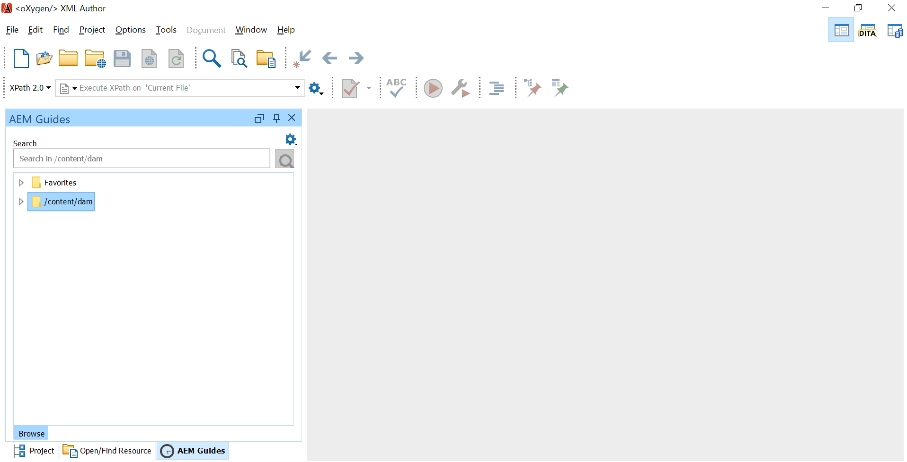
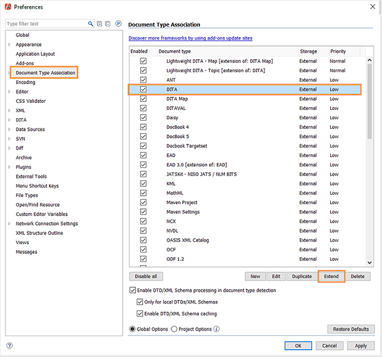

# Adobe Experience Manager Guides用 Oxygen プラグイン {#id1645H6010Q5}

Adobe Experience Manager Guides用の Oxygen プラグイン \（後でガイドでAEM Guides用の Oxygen プラグインと呼びます\）を使用すると、Oxygen XML オーサーをAdobe Experience Manager \（AEM\） リポジトリに接続して、コンテンツのオーサリングと管理を行うことができます。 プラグインを使用して、ファイルの参照、検索、開く、ファイルのチェックアウトとチェックイン、AEM リポジトリへのフォルダーとファイルのアップロードを行うことができます。 デスクトップアプリケーションのAEM Guides パネルを使用すると、目的のフォルダー（AEM リポジトリーから）をお気に入りフォルダーのリストにマークして、素早くアクセスできるようになります。 さらに、AEM Web インターフェイスにパッケージをインストールし、AEM Web インターフェイスから直接 Oxygen XML Author で DITA ファイルを開くことができます。

## ダウンロードとインストール {#id1826M0L0PUI}

AEM Guides用 Oxygen プラグインは、Adobeソフトウェア配布ポータルを通じて入手できます。 [Experience Manager] タブで [Oxygen] を検索し、[Adobe ソフトウェア配布ポータル ](https://experience.adobe.com/#/downloads/content/software-distribution/jp/general.html) からプラグイン インストーラーをダウンロードします。

>[!NOTE]
>
>特定のAdobe Experience Manager Guidesのリリースノートから、Oxygen Connector のバージョンの互換性を確認します。

インストーラーを入手したら、Oxygen XML オーサーがインストールされているローカルマシンにインストールします。 インストールプロセスを開始する前に、お使いのシステムがAEM Guides用の Oxygen プラグインをインストールするための技術要件を満たしていることを確認する必要があります。

### 技術的要件

- Oxygen XML オーサーバージョン 25.1

- Adobe Experience Manager Guides バージョン 4.3 以降

- Adobe Experience Manager バージョン 6.5 （サービスパック 14、15、16、17）

- Oxygen XML オーサーバージョン 25.1 でサポートされているオペレーティングシステム

- Java 開発キット
   - Oracle SE 8 JRE 1.8

### Windows へのプラグインのインストール

>[!IMPORTANT]
>
>古いバージョンのプラグインがシステムにインストールされている場合は、必ずアンインストールしてからインストール処理を開始してください。 アンインストール手順については、[ パッケージの操作方法 **の記事の** パッケージのアンインストール ](https://helpx.adobe.com/experience-manager/6-4/sites/administering/using/package-manager.html) の節を参照してください。

Oxygen XML Author がインストールされているシステムで、次の手順を実行します。

1. インストーラーの `.exe` ファイルを起動します。

   インストールウィザードのスタートアップスクリーンが表示されます。

1. **次へ** をクリックして、Oxygen XML Author の.exe ファイルが存在する場所を参照します。

1. ファイルを選択し、「**開く** をクリックします。

   選択したファイルの場所がインストールウィザードに追加されます。

1. 「**次へ**」をクリックします。

1. 「**インストール**」をクリックします。

1. **完了** をクリックして、インストールウィザードを閉じます。
1. Oxygen XML オーサーを起動します。

   AEM Guides パネルが Oxygen XML オーサーに表示されます。

   {width="800" align="left"}

   >[!NOTE]
   >
   >AEM Guides パネルが表示されない場合は、トラブルシューティングの節 [AEM Guides パネルがない場合 ](#id192BH200ZAX) の回避策を参照してください。


### Macへのプラグインのインストール

>[!IMPORTANT]
>
>古いバージョンのプラグインがシステムにインストールされている場合は、必ずアンインストールしてからインストール処理を開始してください。 [ パッケージの操作方法 **記事アンインストール手順の** パッケージのアンインストール ](https://helpx.adobe.com/experience-manager/6-4/sites/administering/using/package-manager.html) の節を参照してください。

Oxygen XML Author がインストールされているシステムで、次の手順を実行します。

1. システム上でプラグインの.dmg ファイルを見つけます。

1. .dmg ファイルをダブルクリックして、ファイルの内容を開きます。

   この.dmg ファイルには、aem-connector-x.x フォルダーと aem-connector-x.x-setup ファイルが含まれています。

   >[!NOTE]
   >
   >ファイル名の x.x は、プラグインのバージョン番号です。

1. Oxygen XML Author の plugins フォルダーに aem-connector-x.x フォルダーをコピーします。
1. aem-connector-x.x-setup ファイルをダブルクリックして、インストーラーを起動します。

1. Oxygen XML オーサーを起動します。

   AEM Guides パネルが Oxygen XML オーサーに表示されます。

    {width="800" align="left"}

   >[!NOTE]
   >
   >AEM Guides パネルが表示されない場合は、トラブルシューティングの節 [AEM Guides パネルがない場合 ](#id192BH200ZAX) の回避策を参照してください。


### AEM web インターフェイスからドキュメント編集機能を有効にするためのパッケージをインストールします {#id182CE0Q0TY4}

作成者は、AEM Web インタフェースから直接、Oxygen XML オーサーで DITA マップまたはトピックを開いて編集できます。 AEM Web インターフェイスでこの機能を有効にするには、AEM管理者がAEM オーサリングインスタンスにパッケージをインストールする必要があります。

AEM管理者は、次の手順を実行してパッケージをインストールします。

1. IT チームからパッケージの.zip ファイルを入手します。
1. AEM インスタンス *\（管理者として\）にログインし* CRX パッケージマネージャーに移動します。 パッケージマネージャーにアクセスするデフォルトの URL はです。

   `http://<server name>:<port>/crx/packmgr/index.jsp`

   パッケージマネージャーは、ローカル AEM インストール上のパッケージを管理します。 パッケージマネージャーの操作について詳しくは、AEM ドキュメントの [ パッケージの操作方法 ](https://experienceleague.adobe.com/docs/experience-manager-cloud-service/content/implementing/developer-tools/package-manager.html?lang=en) を参照してください。

    {width="650" align="left"}

1. Oxygen パッケージをアップロードするには、**パッケージをアップロード** をクリックします。
1. パッケージをアップロード ダイアログで、手順 1 でダウンロードした Oxygen パッケージファイルに移動し、「OK」をクリックします。

   パッケージがAEM インスタンスにアップロードされます。

1. インストールプロセスを開始するには、「**インストール**」をクリックします。

   {width="650" align="left"}

1. パッケージをインストール ダイアログで、「**インストール**」をクリックします。
1. インストールが完了したら、CRX Package Manager の左上隅にある「ホーム」ボタンをクリックします。
1. アセットフォルダー内の DITA ファイルを選択します。

   **酸素内で編集** オプションはツールバーにあります。 このオプションの使用方法については、「[AEM Web インタフェースから Oxygen XML オーサーで DITA トピックを開く ](#id182CE0I905Z)」を参照してください。

   >[!NOTE]
   >
   >**Edit in Oxygen** オプションは、1 つの DITA トピックを選択すると表示されます。 複数のトピックを選択した場合、オプションは表示されません。


## AEM Guides用の Oxygen プラグインの設定 {#id1826KF00AHS}

プラグインをダウンロードしてインストールした後、プラグインを使用するには以下を設定する必要があります。

- **Web 認証設定**:AEM Guidesのプラグインでの SSO 認証の設定。
- **一般設定**:AEM サーバーの URL、ログインの詳細など、プラグインの接続設定です。
- **相互参照のプロファイル属性のカスタマイズとファイル名の設定**：この構成は、ドキュメントセットのプロファイル属性スキームに必要です。

### Web 認証設定

JxBrowser は、酸素コネクタプラグインによる SSO 認証に使用されます。 Chromium ベースのブラウザーです。 Java 9 以降で非公開 API へのアクセスを行うには必須であり、このアクセスを明示的に JxBrowser に付与する必要があります。 詳しくは、「[JxBrowser のトラブルシューティング ](https://jxbrowser-support.teamdev.com/docs/guides/troubleshooting/issues.html)」を参照してください。

指定されたファイルを更新して、AEM Guidesの Oxygen プラグインの web 認証設定を指定します。

>[!NOTE]
>
>ファイルを更新する前に、ファイルのバックアップを取ります。

**Macおよび Oxygen 25.1 の場合**

env.sh に次の行を追加します。

```java
--illegal-access=permit\
--add-opens=java.desktop/javax.swing.plaf.basic=ALL-UNNAMED\
--add-exports=javafx.controls/com.sun.javafx.scene.control=ALL-UNNAMED\
--add-exports=javafx.graphics/com.sun.javafx.stage=ALL-UNNAMED\
--add-exports=javafx.graphics/com.sun.javafx.scene=ALL-UNNAMED\
--add-exports=javafx.graphics/com.sun.javafx.scene.traversal=ALL-UNNAMED\
--add-exports=javafx.graphics/com.sun.javafx.tk=ALL-UNNAMED\
--add-exports=javafx.graphics/com.sun.glass.ui=ALL-UNNAMED\
--add-opens=javafx.graphics/com.sun.glass.ui=ALL-UNNAMED\
--add-opens=javafx.graphics/javafx.stage=ALL-UNNAMED\
--add-opens=javafx.graphics/com.sun.javafx.tk.quantum=ALL-UNNAMED\
--add-exports=java.desktop/sun.awt=ALL-UNNAMED\
--add-opens javafx.swing/javafx.embed.swing=ALL-UNNAMED
```

oxynoauthor.sh に次の行を追加します。

```java
-Djdk.module.illegalAccess=permit\-Djava.ipc.external=true\
```

**Windows および Oxygen 25.1 の場合**

env.bat に次の行を追加します。

```java
--illegal-access=permit --add-opens=java.desktop/javax.swing.plaf.basic=ALL-UNNAMED --add-exports=javafx.controls/com.sun.javafx.scene.control=ALL-UNNAMED --add-exports=javafx.graphics/com.sun.javafx.stage=ALL-UNNAMED --add-exports=javafx.graphics/com.sun.javafx.scene=ALL-UNNAMED --add-exports=javafx.graphics/com.sun.javafx.scene.traversal=ALL-UNNAMED --add-exports=javafx.graphics/com.sun.javafx.tk=ALL-UNNAMED --add-exports=javafx.graphics/com.sun.glass.ui=ALL-UNNAMED --add-opens=javafx.graphics/com.sun.glass.ui=ALL-UNNAMED --add-opens=javafx.graphics/javafx.stage=ALL-UNNAMED --add-opens=javafx.graphics/com.sun.javafx.tk.quantum=ALL-UNNAMED --add-exports=java.desktop/sun.awt=ALL-UNNAMED --add-opens javafx.swing/javafx.embed.swing=ALL-UNNAMED
```

oxynoauthor.bat に次の行を追加します

```java
-Djdk.module.illegalAccess=permit -Djava.ipc.external=true
```

>[!NOTE]
>
>Macの場合は oxygenAuthor.sh から、Windows の場合は oxygenAuthor.bat から管理者として Oxygen を実行する必要があります。

### 一般設定

Adobe Experience Manager Guides用の Oxygen プラグインでコネクションを設定するには、以下の手順を実行します。

1. AEM Guides パネルで、「設定」アイコンをクリックし、「**設定**」を選択します。

   {width="800" align="left"}

1. 次の詳細を指定します。
   - **Server URL**:AEM サーバーの URL。例：

     ```http
     http[s]://<host>:<port>
     ```

     上記の URL で、AEM Server がデプロイされているサーバーのホスト名とポートを指定します。

     >[!IMPORTANT]
     >
     >AEM サーバーがポート 80 または 443 にデプロイされている場合は、URL で指定する必要はありません。

   - **認証：** **基本\（ユーザー名/パスワード\）** または **Web 認証** から選択します。 **基本** 認証を選択した場合は、環境設定ダイアログで **ユーザー名** と **パスワード** を入力する必要があります。

     「Web 認証」を選択すると、AEM ログイン画面が表示されます。 ログイン資格情報を入力し、「**ログイン**」ボタンをクリックします。 ログインに成功すると、AEM ログイン画面が閉じ、AEM Guides パネルにAEM サーバーのファイルリストが表示されます。

   - **Connection Timeout**：クライアントがAEM サーバーからの応答を待機する時間（秒単位）を指定します。 指定された時間内にサーバーからの応答が受信されなかった場合、リクエストは終了されます。 デフォルト値は 20 秒です。

   - **ローカルフォルダー**:AEM リポジトリのファイルがチェックアウト後に保存される、ローカルマシン上の場所。 ドライブに存在しない場所を指定した場合は、プラグインがその場所を作成します。
   - **チェックアウト時にファイルを開く**：選択すると、チェックアウト時にファイルが開きます。
   - **チェックイン時にファイルを閉じる**：選択すると、チェックイン時にファイルが閉じられます。 ファイルを閉じる前に、バージョンのコメントを指定できるポップアップが表示されます。
   - **ファイルを閉じるときにチェックインダイアログを表示**：選択すると、ファイルを閉じるときにポップアップが表示されます。 ポップアップから、ファイルをチェックインするか、チェックインせずにファイルを閉じるかを選択できます。
   - **開いたときにファイルを自動チェックアウト**：選択した場合、ファイルをダブルクリックするとファイルが自動的にチェックアウトされ、編集用に開かれます。 ファイルが既にチェックアウトされている場合は、編集用に開くだけです。 このオプションを選択していない場合、ロックされていないファイルを開くと、ファイルは読み取り専用モードで開かれます。
1. 「**OK**」をクリックします。

### 相互参照で属性のカスタマイズとファイル名をプロファイルする場合の環境設定 {#id1827K0D0OHT}

AEM リポジトリ内の DITA トピックに関連付けられたプロファイル属性を使用するには、Oxygen XML Author でプリファレンスを設定する必要があります。 また、クロスリファレンスで GUID の代わりにファイル名を表示するように環境設定を設定する必要もあります。

プロファイル属性と相互参照を構成するには、次の手順を実行します。

1. Oxygen XML Author で、**Options** \> **Preferences** をクリックします。
1. 「**文書型関連**」タブで「**DITA**」を選択し、「**拡張**」をクリックします。

   {width="650" align="left"}

1. 「**クラスパス**」タブの「**ID を持つプラグインの親クラスローダーを使用**」ドロップダウンで「`com.adobe.o2.connector`」を選択します。

   {width="650" align="left"}

1. 「**拡張機能**」タブで、次の変更を行います。

   - **拡張機能バンドル** の横にある「**選択**」をクリックして選択します。   **クラス** リストに `LinkResolverExtensionBundle - com.adobe.o2.framework.extn` ります。 「**OK**」をクリックします。
      {width="650" align="left"}
   - **個々の拡張機能** の下にある **オーサー拡張機能状態リスナー** の横にある **選択** をクリックし、**クラス** リストで `CustomAuthorExtensionStateListener - com.adobe.o2.framework.extn` を選択します。 「**OK**」をクリックします。
   - **個々の拡張機能** の下の **カスタム属性値エディターの作成** の横にある **選択** をクリックし、**クラス** リストで `CustomValueEditor - com.adobe.o2.framework.extn` を選択します。 「**OK**」をクリックします。
   - **個別の拡張機能** の下にある **オーサー外部オブジェクト挿入ハンドラー** の横の **選択** をクリックし、**クラス** リストで `CustomURLInsertionHandler - com.adobe.o2.ui ` を選択します。 「**OK**」をクリックします。


   次のスクリーンショットは、DITA トピック用に設定された **Extension** タブを示しています。
   
1. すべてのダイアログボックスで **OK** をクリックして、変更を保存します。

### DITA マップ拡張機能の設定

AEM Web インタフェースから直接 Oxygen XML Author でマップファイルを開くには、DITA Map Extension Configuration が必要です。 これらの設定は、前の手順で行ったプロファイル属性の設定と同様です。

次の手順を実行して、DITA マップ拡張機能を設定します。

1. Oxygen XML Author で、**Options** \> **Preferences** をクリックします。
1. 「**文書型関連**」タブで「**DITA Map**」を選択し、「**拡張**」をクリックします。
1. 「**クラスパス**」タブの「**ID を持つプラグインの親クラスローダーを使用**」ドロップダウンで、「com.adobe.o2.connector」を選択します。
1. 「**拡張機能**」タブで、次の変更を行います。
   - **拡張機能バンドル** の横にある「**選択**」をクリックして選択します。   **クラス** リストに `com.adobe.o2.framework.extn.LinkResolverDITAMapExtensionBundle` ります。 「**OK**」をクリックします。

   - **個々の拡張機能** の下にある **オーサー拡張機能状態リスナー** の横にある **選択** をクリックし、**クラス** リストで `CustomDITAMapAuthorExtensionStateListener - com.adobe.o2.framework.extn` を選択します。 「**OK**」をクリックします。

   - **個別の拡張機能** の下にある **オーサー外部オブジェクト挿入ハンドラー** の横の **選択** をクリックし、**クラス** リストで `CustomURLInsertionHandler - com.adobe.o2.ui ` を選択します。 「**OK**」をクリックします。

   - **個々の拡張機能** の下の **カスタム属性値エディターの作成** の横にある **選択** をクリックし、**クラス** リストで `CustomValueEditor - com.adobe.o2.framework.extn` を選択します。 「**OK**」をクリックします。

   - 「**個々の拡張機能**」の下の「**参照リゾルバー** の横にある「選択 **をクリックし、** クラス **リストで `CustomDITAMapReferenceResolver - com.adobe.o2`** を選択します。 「**OK**」をクリックします。
   - *\（オプション\）* マップファイルを開くときに参照を解決しない場合は、次の追加設定を実行する必要があります。

   次のスクリーンショットは、設定済みの **拡張機能** タブを示しています。
   

1. すべてのダイアログボックスで **OK** をクリックして、変更を保存します。

## AEM Guides用 Oxygen プラグインの操作 {#id1826JG00WY4}

### AEM Guidesパネル

次の画面は、AEM Guides パネルを示しています。

{width="550" align="left"}

**A**\）は検索バーを表示します。

**B**\）お気に入りフォルダーを表示します。 デフォルトでは空です。 AEM リポジトリからフォルダーをお気に入りとして追加できます。お気に入りフォルダーがここに表示されます。

**C**\） DAM フォルダーにAEM リポジトリが表示されます。 フォルダービューは展開したり折りたたんだりできます。

**D**\）設定\（歯車\）アイコンと次のオプション：

- **接続**:AEM サーバーに接続する場合は、このオプションを選択します。 Oxygen XML オーサーがAEM サーバーに接続されている場合、このオプションは無効になります。
- **更新**:AEM リポジトリからファイルとフォルダーの最新のステータスを取得するには、このオプションを選択します。

  >[!NOTE]
  >
  >ファイルを更新する前に、必ずファイルを保存してください。 「**更新**」オプションを選択すると、ファイルを更新する前にファイルを保存するよう警告が表示されます。 ファイルをまだ保存していない場合は、「**キャンセル**」をクリックして保存できます。

- **設定**：このオプションを使用して、プラグインの一般的な環境設定ダイアログを開くことができます。
- **ログアウト**:AEM サーバー接続を閉じる場合は、このオプションを選択します。 このオプションは、Web 認証モードを使用している場合にのみ使用できます。

### コンテキストメニューの関数

AEM Guides用 Oxygen プラグインの機能は、AEM リポジトリ内のフォルダーまたはファイルを右クリックすると使用できます。 フォルダーで使用できる関数は、ファイルとは異なります。 以下に、AEM Guidesの Oxygen プラグインのコンテキストメニューに表示される関数の一覧を示します。

- **開く**：選択したファイルを開くか、選択したフォルダーを展開します。
- **次のウィンドウで開く**：選択したファイルをAEM Guidesの Web Editor、Map Dashboard、または Map Editor で開くことができます。 これらのオプションについて詳しくは、[AEM Guidesのエディターでファイルを開く ](#id195GH0V30KX) を参照してください。
- **チェックアウト**:AEM リポジトリからファイルをチェックアウトします。 詳しくは、「ファイルのチェックアウト [ を参照してください ](#id195HC020TS4)。
- **扶養家族と一緒にチェックアウト**：直接参照を含むファイルをチェックアウトします。 詳しくは、「ファイルのチェックアウト [ を参照してください ](#id195HC020TS4)。
- **読み取り専用依存ファイルのチェックアウト**：選択したファイルとその依存ファイルをチェックアウトします。 依存ファイルは変更できません。 詳しくは、「ファイルのチェックアウト [ を参照してください ](#id195HC020TS4)。
- **チェックアウトをキャンセル**: チェックアウトされたファイルをキャンセルし、エディターからファイルを閉じて、サーバーに保存されている最後のバージョンのファイルに変更を戻します。
- **更新**：ファイルが場合、はAEM リポジトリからファイルの最新のコピーを取得します。 フォルダーの場合は、フォルダー構造とファイルのステータスを取得します。 つまり、ファイルが追加されると、そのファイルはAEM Guides ビューに表示されます。 また、ファイルがAEM サーバーでチェックアウトされている場合、Oxygen オーサーで更新を行うと、ファイルがチェックアウト済みと表示されます。 ただし、「AEM Guidesでチェックアウトされたファイル *ビューのファイルリストは更新され* せん。
- **チェックアウトされたファイルを更新**: *AEM Guidesでチェックアウトされたファイル* ビューのチェックアウトされたファイルのリストを更新します。 ファイルがAEM サーバーでチェックアウトされている場合、更新を行うと、チェックアウトされたファイルの一覧が *AEM Guidesでチェックアウト済みファイル* ビューで更新されます。 ただし、新しいファイルが追加された場合やファイルのステータスが変更された場合は、AEM Guides ツリービューでは更新されません。 AEM上のファイルのステータスを更新するには、更新を行う必要があります。
- **チェックイン**：チェックアウトしたファイルをチェックインします。 詳しくは、「[ ファイルのチェックイン ](#id182CF0J0FHS)」を参照してください。
- **依存ファイルのチェックイン**：依存ファイルをチェックアウトした場合、このオプションは依存ファイルとともにメインファイルをチェックインします。 詳しくは、「[ ファイルのチェックイン ](#id182CF0J0FHS)」を参照してください。
- **フォルダーを作成**:AEM リポジトリにフォルダーを作成します。 このオプションは、フォルダーレベルでのみ使用できます。
- **ファイルをアップロード\（s\）**:1 つまたは複数のファイルをアップロードします。 詳しくは、[ ファイルとフォルダーのアップロード ](#id195HC03F03J) を参照してください。
- **扶養家族と共にアップロード**：扶養家族と共に DITA ファイル \（XML、DITA、Book map、または DITA map\）をアップロードします。 詳しくは、[ ファイルとフォルダーのアップロード ](#id195HC03F03J) を参照してください。
- **フォルダーをアップロード**:AEM リポジトリにフォルダーをアップロードします。 詳しくは、[ ファイルとフォルダーのアップロード ](#id195HC03F03J) を参照してください。
- **お気に入りに追加**:AEM Guidesパネルの *お気に入り* フォルダーにフォルダーを追加します。 作業フォルダーをここに追加することをお勧めします。これにより、AEMからのファイルとファイルのステータスの同期が容易になります。
- **お気に入りから削除**: *お気に入り* からフォルダーを削除します。 詳しくは、[ お気に入りの追加または削除 ](#id195HC04405P) を参照してください。
- **メタデータを表示**: DITA クラス、文書のタイトル、タイプ、UUID、およびファイルに関連付けられたその他の情報などのメタデータを表示します。 詳しくは、[ ファイルのメタデータの表示 ](#id195GHN0H05C) を参照してください。
- **バージョンを表示**：ファイルのバージョン履歴を表示します。 詳しくは、「[ ファイルのバージョン履歴の表示 ](#id195GI000D5Q)」を参照してください。

### Oxygen XML オーサーでファイルを開く {#id195GHJ0A0UB}

AEM リポジトリに接続したら、ファイルを開いて Oxygen XML オーサーで編集できます。 次の手順を実行して、Oxygen XML オーサーで編集用のファイルを開きます。

1. AEM Guidesパネルで、編集用に開くファイルを右クリックします。

1. コンテキストメニューから **開く** を選択します。

   ファイルが Oxygen XML オーサーのエディターで開かれます。

   ![[ ファイル ] タブの GUID](images/guid-in-file-tab.png) {width="800" align="left"}

   ファイルのタブの上にマウスポインターを置くと、UUID と共にサーバーパスが表示されます。 上のスクリーンショットでは、ドキュメントの UUID がハイライト表示されています。


**Auto-Checkout File when Opened**」オプション\（環境設定ダイアログ\）を選択した場合、ファイルを開くと、ファイルは自動的にチェックアウトされ、編集できるようになります。 ファイルを開くには、ファイル名をダブルクリックするか、ファイル名を右クリックしてコンテキスト メニューから **開く** を選択します。 このオプションを選択しない場合、ファイルは読み取り専用モードで開かれます。

>[!NOTE]
>
>ファイルをダブルクリックして開くこともできます。

### AEM Guides エディターでファイルを開く {#id195GH0V30KX}

AEM Guidesで使用可能なエディターを使用する場合は、コンテキストメニューから必要なオプションを選択します。 Oxygen XML オーサーのエディターの代わりにAEM Guidesのエディターを使用するには、次の手順を実行します。

1. AEM Guidesパネルで、編集用に開くファイルを右クリックします。

1. コンテキストメニューから **次のウィンドウで開く** を選択し、次のオプションから選択します。

   - **Web トピック エディタ**：開こうとしているファイルが.xml ファイルまたは.dita ファイルの場合は、Web エディタで開いて編集できます。 「**Web トピックエディター**」オプションを選択して、選択したファイルを Web エディターで開いて編集します。

   - **マップダッシュボード**: マップダッシュボードで.ditamap ファイルの編集を選択できます。この編集では、マップファイルに対して様々な操作を実行できます。 これらの操作は、属する役割/グループによって異なります。

   - **Web DITA マップエディタ**: .ditamap ファイルを開いてマップエディタで編集する場合は、このオプションを選択します。 DITA マップエディタオプションを使用すると、トピックの追加または削除、関連表の追加、およびマップに対するその他の操作を実行できます。


### ファイルのチェックアウト {#id195HC020TS4}

ファイルをチェックアウトすると、そのファイルはローカルのシステムに保存され、AEM リポジトリでロックされて編集できなくなります。 ファイルをチェックアウトするには、次の手順を実行します。

1. 次のいずれかの方法でファイルをチェックアウトできます。
   - AEM Guides パネルでファイルを右クリックします。
   - [DITA マップ マネージャ ] パネルの [ マップ ] タブを右クリックします。
   - DITA マップマネージャ パネルでファイルを右クリックします。
   - エディタでマップまたはトピックを開いたときに、ファイル タブを右クリックします。

1. 次のいずれかのオプションを選択します。
   - **チェックアウト：** AEM リポジトリからファイルをチェックアウトし、編集できるようにします。
   - **扶養家族と一緒にチェックアウト**：直接参照を含むファイルをチェックアウトします。 このオプションを使用して、親ページと子ページに変更を加えることができます。 AEM Guides用の Oxygen プラグインは、1 レベルの扶養家族のチェックアウトをサポートします。 たとえば、Map A references Topic A と Topic A references Topic B のように指定します。Map A をチェックアウトすると、目次の階層のレベルに関係なく、Topic A がチェックアウトされます。 ただし、マップ A から直接リンクされていないため、トピック B はチェックアウトされません。
   - **読み取り専用依存を使用したチェックアウト**: ファイルをチェックアウトし、その依存を読み取り専用コピーとしてローカルマシンにダウンロードします。 依存ファイルは変更できません。

**チェックアウト時にファイルを開く** オプション \（環境設定ダイアログ\）を選択した場合、ファイルのチェックアウト時に、ファイルは自動的に編集用に開かれます。

**Auto-Checkout File when Opened**」オプション\（環境設定ダイアログ\）を選択した場合、ファイルを開くと、ファイルは自動的にチェックアウトされ、編集できるようになります。 ファイルを開くには、ファイル名をダブルクリックするか、ファイル名を右クリックしてコンテキスト メニューから **開く** を選択します。

ファイルがチェックアウトされると、ファイルのアイコンが変わり、ファイルのロック状態が表示されます。

{width="650" align="left"}

上のスクリーンショットでは、他のユーザーがチェックアウトしたファイルが黒い色のロックアイコン\（A\）で表示されます。 現在のユーザーによってチェックアウトされているファイルは、緑色のロック \（B\）付きで表示されます。

>[!NOTE]
>
>チェックアウトしたファイルが削除されたり、AEM内の他のフォルダーに移動されたりすると、ファイルをチェックインしたときにエラーメッセージが表示されます。 チェックアウトしたファイルが、AEM web インターフェイスを使用して移動または削除されていないことを確認します。

### ファイルのチェックイン {#id182CF0J0FHS}

ファイルをチェックインすると、システムのローカルコピーがAEM リポジトリに保存され、ファイルのロックが削除されます。 ファイルをチェックインするには、次の手順を実行します。

1. **ファイル** \> **保存** をクリックして、ファイルを保存します。

1. 次のいずれかの場所にあるチェックアウト済みのファイルまたはマップを右クリックします。
   - AEM Guidesパネル
   - DITA マップマネージャ パネル
   - エディタでマップまたはトピックを開いたときに表示される [ ファイル ] タブ。
   - DITA マップマネージャ パネルの「マップ」タブ

1. 次の 2 つのオプションから選択します。

   - **チェックイン**：選択したファイルをローカルシステムからAEM リポジトリにチェックインします。
   - **依存ファイルのチェックイン：** ファイルとその依存ファイルをチェックアウトした場合、このオプションを使用して 1 回の操作ですべての依存ファイルをチェックインします。 このオプションを選択すると、すべての依存ファイルを含むチェックインダイアログが表示されます。 「OK」をクリックして、すべてのファイルを一度にチェックインします。

   依存ファイルをチェックアウトしていない場合、このオプションを選択すると、\（別々に\）チェックアウトした依存ファイルだけがチェックインされます。 チェックインできなかったファイルのリストが表示されます。

   {width="800" align="left"}

   チェックアウトしたファイルは移動しないことを強くお勧めします。 ただし、チェックアウトしたファイルを別の場所に移動する場合は、そのファイルのチェックアウトをキャンセルする必要があります。 そのファイルを更新する場合は、ファイルを再度チェックアウトし、変更を加えてから、再度チェックインします。 元の場所から移動されたファイルをチェックインしようとすると、エラーが発生します。

   依存ファイルがAEMでチェックアウトされている場合、「依存を使用してチェックイン」では「チェックイン」 ダイアログに依存ファイルが表示されません。 AEMでチェックアウトされた依存ファイルのリストを取得するには、フォルダーを更新する必要があります。

   同様に、AEMを使用して依存ファイルをチェックインした場合、フォルダの更新およびチェックアウトされたファイルの更新を実行するまで、ファイル リストは Oxygen Author で更新されません。 AEMを通じて一部のファイルをチェックインした状態で「扶養家族」を使用してチェックインを行うと、チェックインできなかったファイルを一覧表示するエラーが発生します。

1. \（オプション\） **チェックイン** または **扶養家族と一緒にチェックイン** ダイアログで、**バージョンコメント** テキストボックスにコメントを追加します。

   >[!NOTE]
   >
   >このコメントは、ファイルのAEM バージョン履歴に表示されます。

1. 複数のラベルを「**チェックイン**」または **扶養家族と共にチェックイン** ダイアログの「**ラベル**」テキストボックスに追加します。 ラベルを入力し、[Enter] を押します。 例えば、*2307 リリース* などです。

   管理者がラベルのリストを事前定義し、`label.json` ファイルにアップロードすると、これらのラベルはドロップダウンとして表示されます。 ドロップダウンから 1 つ以上のラベルを選択できます。

   {width="550" align="left"}

   同じバージョンのトピックに複数のラベル（コンマ区切り）を追加できます。  例：*Adobe*、*AEM*、{ ガイド **。
ただし、同じラベルをトピックの異なるバージョンに追加することはできません。 以前のバージョンに既に追加したラベルを追加すると、そのラベルは最新のバージョンに追加され、以前のバージョンから削除されます。

   >[!NOTE]
   > 
   > これらのラベルは、ファイルのAEM バージョン履歴に表示されます。


1. 「**OK**」をクリックします。

>[!NOTE]
>
>チェックアウトしたファイルが削除されたり、AEM内の他のフォルダーに移動されたりすると、ファイルをチェックインしたときにエラーメッセージが表示されます。 チェックアウトしたファイルが、AEM web インターフェイスを使用して移動または削除されていないことを確認します。

### AEM Guides ビューでチェックアウトされたファイル

が複数のフォルダーにある場合、1 つのビューでチェックアウトされているファイルの数を確認するのは簡単ではありません。 AEM Guidesの「AEM Guidesでチェックアウトされたファイル」ビューには、現在チェックアウトされているファイルの完全なスナップショットが 1 つ表示されます。 このビューを使用すると、AEM Guidesを使用してAEM リポジトリでチェックされているファイルを簡単に見つけることができます。 このビューにアクセスして操作するには、次の手順を実行します。

1. **ウィンドウ** \> **ビューを表示** \> **AEM Guidesでチェックアウトされたファイル** をクリックします。

   AEM Guidesでチェックアウトされたファイル ビューが表示されます。

   {width="550" align="left"}

1. このビューのファイルを右クリックすると、次のオプションが表示されます。

   - [次を開きます：](#id195GH0V30KX)
   - [次で開く](#id195GH0V30KX)
   - チェックアウトのキャンセル
   - [チェックイン](#id182CF0J0FHS)
   - [扶養家族とのチェックイン](#id182CF0J0FHS)
   - [メタデータの表示](#id195GHN0H05C)
   - [バージョンの表示](#id195GI000D5Q)

**AEM Guides ビューでチェックアウトされたファイルに関するメモ：**

- *AEM Guidesでチェックアウトされたファイル* ビューは、ユーザーのセッションを管理します。 つまり、現在のユーザーによってチェックアウトされたファイルは、同じユーザーのセッション \（または cache\）をまたいでビューに保存され、維持されます。

- ユーザーがログイン資格情報またはAEM サーバーを変更すると、チェックアウトされたファイルのビュー内のデータ \（またはキャッシュ\）がリセットされます。 ユーザーは、ファイルが以前にチェックアウトされた各フォルダに対して、手動で *チェックアウトされたファイルを更新* コマンドを実行する必要があります。 これを簡単にするために、作業フォルダーを *お気に入り* に追加して、フォルダーをすばやく更新できるようにすることをお勧めします。

- ファイル名、タイトル、またはパスに基づいて、ファイルリストを並べ替えることができます。 新しいファイルがチェックアウトされると、そのファイルは並べ替えられた順序でビューに表示されます。


### ファイルおよびフォルダーのアップロード {#id195HC03F03J}

ファイルまたはフォルダーをアップロードするには、次の手順を実行します。

1. AEM Guidesパネルでフォルダーを右クリックします。
1. 次のいずれかのオプションを選択します。
   - **ファイルをアップロード\（s\）**:1 つまたは複数のファイルをAEM リポジトリの選択したフォルダーにアップロードします。 アップロードするファイルを選択\（s\）ダイアログで、ファイルを選択して **開く** をクリックします。
   - **扶養家族と共にアップロード**：扶養家族を持つ DITA ファイルをアップロードする場合は、このオプションを選択します。 アップロードするファイルを選択ダイアログで、ファイルを選択して **開く** をクリックします。
   - **フォルダーをアップロード**:AEM リポジトリにフォルダーをアップロードする場合は、このオプションを選択します。 選択ダイアログで、フォルダーを選択し、「**選択**」をクリックします。

**UUID ベースのファイルの操作に関するその他の注意事項**:

ローカルシステムからAEM リポジトリにコンテンツを移動またはコピーする際は、次の点を考慮する必要があります。

- 1 つ以上のファイルをアップロードする場合、UUID がないファイルに対して新しい UUID が生成されます。 この UUID は、DITA ファイルの `topic id` に追加されます。

- フォルダをコピーすると、そのフォルダ内のファイルを参照するすべての DITA マップで、ファイル \（フォルダ内）への参照が自動的に更新されます。

- DITA マップファイルをコピーしても、マップファイル内の UUID 参照は変更されません。

- ファイルまたはフォルダに競合がある、または重複がある場合は、コピーまたは移動する新しいファイルに対して一意のファイル名が生成されます。

- 2 つのファイルが同じ UUID を持つことはできません。 一意の UUID がすべての新しいファイルに割り当てられます。

- 2 人の異なるユーザーが同時にファイルをアップロードした場合、後で処理されるファイルが以前のファイルを上書きします。 しかし、そのような行為は避けるべきである。

- AEM リポジトリからコンテンツをチェックアウトし、ローカルシステムで変更を行う場合は、ファイルをアップロードするときにファイル名が変更されていないことを確認します。

- DITA マップマネージャまたはエディタに参照を挿入すると、UUID ではなくファイルのタイトルが表示されます。 タイトルがない場合は、ファイル名が表示されます。

### お気に入りの追加または削除 {#id195HC04405P}

AEM Guidesパネルのお気に入りフォルダーにフォルダーを追加または削除するには、次の手順を実行します。

- フォルダーを右クリックして、「**お気に入りに追加**」を選択します。 フォルダーがお気に入りに含まれていない場合は、お気に入りに追加できます。
- お気に入りからフォルダーを削除するには、次の方法があります。
   - **お気に入り** フォルダーのフォルダーを右クリックし、**お気に入りから削除** を選択します。
   - 既にお気に入りとして追加されている **DAM** フォルダーの下のAEM リポジトリ内のフォルダーを右クリックし、**お気に入りから削除** を選択します。

### ファイルのバージョン履歴の表示 {#id195GI000D5Q}

ファイルのバージョン履歴を表示するには、次の手順を実行します。

1. AEM Guides パネルでファイルを右クリックします。

1. コンテキストメニューから「**バージョンを表示**」を選択します。

   ファイルのバージョン履歴は、[ バージョン ] ダイアログに表示されます。

   {width="550" align="left"}


### ファイルのメタデータの表示 {#id195GHN0H05C}

ファイルのメタデータを表示するには、次の手順を実行します。

1. AEM Guides パネルでファイルを右クリックします。

1. コンテキストメニューから **メタデータを表示** を選択します。

   DITA クラス、文書状態、変更日、サイズ、タイトル、UUID などのファイルのメタデータが「メタデータ」ダイアログに表示されます。

   {width="550" align="left"}


## AEM リポジトリー内のトピックの検索 {#id1826J20405Z}

AEM Guides パネルの検索バーを使用して、AEM リポジトリ内のトピックを検索できます。 DAM フォルダー全体を検索することも、フォルダーを選択してそのフォルダー内のトピックを検索することもできます。 検索結果には、検索クエリと一致するテキストを持つトピックが表示されます。

トピックを検索するには、次の手順を実行します。

1. AEM リポジトリ内で、トピックを検索するフォルダーを選択します。
1. AEM Guides用の Oxygen プラグインの検索バーに、検索クエリ「\」（例：`introduction`\）を入力します。
1. 検索ボタンをクリックするか、Enter キーを押します。

   結果は、[ 検索結果 ] タブにファイル パスとともにリストとして表示されます。 検索クエリに一致する結果がない場合、「&lt; 選択されたフォルダーのパス\> で結果が見つかりませんでした」というメッセージが表示されます。

   {width="550" align="left"}

1. \（オプション\）検索結果内のファイルをダブルクリックして、Oxygen XML オーサーで開きます。
1. AEM リポジトリビューに戻るには、次のいずれかの操作を行います。
   - 検索結果を消去せずにAEM リポジトリ表示を表示するには、「**参照**」タブをクリックします。
   - 検索結果をクリアしてAEM リポジトリを表示するには、検索アイコンを削除をクリックします。

## AEM Web インタフェースから Oxygen XML Author で DITA トピックを開く {#id182CE0I905Z}

AEM Web インタフェースから、Oxygen XML Author で DITA トピックを開いて編集できます。 このオプションを有効にするには、AEMにパッケージをインストールする必要があります。 パッケージインストールについて詳しくは、[AEM web インターフェイスからドキュメント編集機能を有効にするためのパッケージをインストールする ](#id182CE0Q0TY4) を参照してください。

>[!NOTE]
>
>「**Edit in Oxygen**」オプションには、AEMの様々な場所からアクセスできます。トピックの選択時、トピックのプレビュー時、または DITA マップコンソールの「トピックとレポート」タブからアクセスできます。 複数のトピックを選択した場合、そのオプションはツールバーに表示されません。

**DITA トピックを開く**

Oxygen XML オーサーで DITA トピックを開くには、次の手順を実行します。

1. アセット内のトピックを選択し、ツールバーの **Oxygen で編集** オプションをクリックします。

   >[!NOTE]
   >
   >トピックがチェックアウトされていない場合、最初にチェックアウトされ、編集モードで Oxygen で開かれます。

1. **アプリケーションの起動** メッセージボックスで「Oxygen XML オーサー *&lt;version\>*」を選択します。 「AEM リンクの選択を保存 **オプションを選択して** 環境設定を保存できます。

**DITA トピックの編集**

Oxygen XML Author で DITA トピックを編集するには、次の手順を実行します。

1. アセット内のトピックを選択してチェックアウトします。
1. ツールバーの **Oxygen で編集** オプションをクリックします。

   >[!NOTE]
   >
   >トピックがチェックアウトされていない場合、最初にチェックアウトされ、編集モードで Oxygen で開かれます。

1. **アプリケーションの起動** メッセージボックスで「Oxygen XML オーサー *&lt;version\>*」を選択します。 「AEM リンクの選択を保存 **オプションを選択して** 環境設定を保存できます。
1. Oxygen XML Author でトピックを編集します。
1. AEM Guides用の Oxygen プラグインからトピックをチェックインします。

   AEM Guides用 Oxygen プラグインを使用したトピックのチェックインの詳細については、「[ ファイルのチェックイン ](#id182CF0J0FHS)」を参照してください。

   >[!NOTE]
   >
   >AEM Guides用の Oxygen プラグインを使用してトピックをチェックインする場合、AEM Web インターフェイスからチェックインすると、Oxygen XML オーサーで行った変更は、チェックインされたバージョンのトピックには保存されません。

**Experience Manager Guides リポジトリからトピックへの参照を挿入する**

トピックをドラッグ&amp;ドロップして、トピックまたは DITA マップに参照を挿入することもできます。
>[!NOTE]
>
> ファイルに参照を追加する前に、ファイルをチェックアウトする必要があります。

参照のタイプに基づいて、次の要素が追加されます。

開いているトピックを使用してエディターにドロップする場合：
- 画像の要素と共 `<image>` 参照が追加されます。
- ビデオまたはオーディオ用にオブジェクト要素が追加されます。
- トピック、マップ、DITAVAL、PDF、ZIP、XML など、その他すべての参照に対して `<xref>` 要素が追加されます。

マップを開いた状態でエディタまたは DITA マップマネージャにドロップする場合：
- `<mapref>` 要素は、DITA マップ、ブックマップ、またはサブジェクトスキームを含むマップ参照に追加されます。
- トピック、マップ、DITAVAL、PDF、ZIP、XML など、その他すべての参照に対して `<topicref>` 要素が追加されます。


## 属性プロファイルの操作 {#id1827JA002YK}

AEM Guidesでは、関連する DITA 属性を使用して、条件属性を簡単に作成し、関連付けることができます。 条件属性は、グローバルレベルまたはフォルダーレベルで定義できます。 グローバルに定義された条件は、すべてのプロジェクトで表示され、フォルダーレベルの条件は、指定したフォルダー内で作成されたプロジェクトでのみ表示されます。 コンテンツ作成者は、これらの条件付き属性を使用して、作成または使用する DITA トピックまたはマップのコンテンツに条件を付けることができます。 Adobe Experience Manager Guidesを使用してAEMで条件属性を作成する方法について詳しくは、AEM Guidesのインストールと設定の *グローバルプロファイルまたはフォルダーレベルのプロファイルの条件属性の設定* を参照してください。

>[!NOTE]
>
>条件付き属性をAEMに追加し、条件付き属性をコンテンツに追加する前に、[ プロファイル属性のカスタマイズの環境設定 ](#id1827K0D0OHT) を設定していることを確認してください。

次の手順を実行して、Oxygen XML オーサーのコンテンツに条件付き属性を追加します。

1. *AEM Guides用 Oxygen プラグイン* からトピックをチェックアウトして開きます。
1. 条件付き属性を適用するコンテンツの部分を選択します。
1. Oxygen XML オーサーの属性パネルで、条件属性をダブルクリックします。

   {width="300" align="left"}

1. 属性を編集ダイアログの **使用可能** 列で、属性を選択して **追加** をクリックします。

   次の画面に、`audience` 属性を示します。

   {width="550" align="left"}

1. 「**OK**」をクリックします。

   属性がコンテンツに追加されます。


## 一般的な問題のトラブルシューティング {#id188ABC00RY4}

このトピックでは、プラグインの操作中に発生する可能性のある最も一般的な問題のいくつかを、その解決策とともに説明します。

### AEM Guides パネルがない {#id192BH200ZAX}

**問題** - Oxygen XML オーサーにAEM Guides パネルが表示されない場合は、次の解決策を試してください。

解決策 1:

1. Oxygen XML Author で、プラグインを有効にします。

   **Options** \> **Preferences** \> **Plugins** をクリックし、**Oxygen Plugin for Adobe Experience Manager Guides** を選択します。

1. Oxygen XML オーサーを再起動します。


解決策 2:

1. それでもAEM Guides パネルが表示されない場合は、AEM Guides ウィンドウを有効にします。

   [Oxygen XML Author] で、[**Window**] \> **Show View** \> **AEM Guides** をクリックします。

解決策 3:

1. Adobe Experience Manager Guides用 Oxygen プラグインをアンインストールして再インストールします。

   - Windows の場合、「プログラムの追加と削除 **リストからプラグインをアンインストール** ます。 次に、プラグインを再インストールします。

   - Macで、Oxygen XML オーサーの plugins フォルダーにある aem-connector-x.x フォルダーにアクセスし、**ごみ箱** に移動します。 次に、**ごみ箱** フォルダーを空にします。


### DITA-OT 変換用のポートの設定

**問題** - プラグインによって処理されるファイルに対して DITA-OT 変換を実行すると、次のエラーで変換が失敗します。

{width="800" align="left"}

**解決策** – この問題は、DITA-OT とプラグインの間にプロキシサーバーを追加することで修正されました。 このプロキシサーバーは、DITA-OT が変換のために要求したすべてのファイルを処理および共有します。 このサーバーが構成されている既定のポートは `5972` です。 他のサーバーでこのポートを使用している場合は、プロキシサーバーに別のポートを指定できます。

プロキシサーバーのデフォルトポートを変更するには、次の手順を実行します。

1. \（ユーザーの\） ホームディレクトリを参照します。
1. aem\_connector\_proxy という名前のファイルを作成します。
1. 任意のテキストエディターでファイルを開き、ファイルの最初の行に使用可能なポート番号を追加します。
1. ファイルを保存して閉じます。
1. Oxygen XML Author を再起動し、DITA-OT 変換を実行します。


### AEM Guides パネルが、開いたファイルの場所を参照しない

問題：AEM サーバーから Oxygen XML オーサーで編集用にファイルを開こうとすると、Oxygen XML オーサーで編集用にファイルが開きます。 ただし、AEM Guides パネルには、ナビゲーションツリー内のファイルの場所は表示されません。

解決策：この問題は、ファイルパスに/content/dam が 2 回含まれているシナリオで発生しています。 デフォルトでは、AEM内のすべてのアセットは、/content/dam フォルダーに保存されます。 /content/dam を含むフォルダー構造をアップロードまたは作成すると、この問題が発生します。 このようなファイルに対する通常の操作はすべて実行できますが、ナビゲーションツリー内の場所はデフォルトでは表示されません。 ナビゲーションツリーでこのようなファイルにアクセスするには、ファイルの場所を手動で参照する必要があります。 ナビゲーションツリーで、重複した/content/dam パスは/content/assets に置き換えられます。

### ログの設定

問題：デフォルトでは、AEM Guides用の Oxygen プラグインはログを生成しないので、エラーシナリオのデバッグが難しくなります。

解決策：次の手順を実行して、Xygen および JxBrowser のロガーを設定します。

1. Oxygen XML オーサーを閉じる

1. 次の内容の `logback.xml` という名前のファイルを作成します。

   ```xml
   <configuration>
       <appender name="R2" class="ch.qos.logback.core.rolling.RollingFileAppender">
           <file>${user.home}/Desktop/oxygenLog/oxygen.log</file>
           <rollingPolicy class="ch.qos.logback.core.rolling.FixedWindowRollingPolicy">
               <fileNamePattern>${user.home}/Desktop/oxygenLog/oxygen%i.log.gz</fileNamePattern>
               <minIndex>1</minIndex>
               <maxIndex>20</maxIndex>
           </rollingPolicy>
           <triggeringPolicy class="ch.qos.logback.core.rolling.SizeBasedTriggeringPolicy">
               <maxFileSize>100MB</maxFileSize>
           </triggeringPolicy>
           <encoder>
               <pattern>%r %marker %p [ %t ] %c - %m%n</pattern>
           </encoder>
       </appender> 
   
       <root level="debug">
           <appender-ref ref="R2" />
       </root>
   </configuration>   
   ```

1. ファイルを `Oxygen Author 25` ディレクトリに保存します。 （例えば、パスは `C:\Program Files\Oxygen XML Author 25\logback.xml` のようになります）。

1. ファイルを閉じます。 これにより、次のパスで利用できる oXygen ログが有効になります：`${user.home}/Desktop/oxygenLog/oxygen.log`
1. `oxygenAuthor.bat` ファイルをテキストエディターで開きます。
1. パラメーターを追加して、JxBrowser 関連のログを設定します
   `-Denable.aem.jx.log=true`といったアドバイスを耳にしたことがある方もいるでしょう。これにより、次のパスで表示できる JxBrowser 関連のログが有効になります。`${user.home}\AppData\Local\Temp\Oxygen_Plugin_Javax_Log.log`


   ```java
   SET OXYGEN_JAVA=java.exe
   if exist "%JAVA_HOME%\bin\java.exe" set OXYGEN_JAVA="%JAVA_HOME%\bin\java.exe"
   if exist "%~dp0\jre\bin\java.exe" SET OXYGEN_JAVA="%~dp0\jre\bin\java.exe"
   rem Set environment variables
   call "%~dp0\env.bat"
   %OXYGEN_JAVA% -XX:-OmitStackTraceInFastThrow -XX:SoftRefLRUPolicyMSPerMB=10 -Djdk.module.illegalAccess=permit -Djava.ipc.external=true 
   -Denable.aem.jx.log=true -Dsun.java2d.noddraw=true -Dsun.awt.nopixfmt=true -Dsun.java2d.dpiaware=true -Dsun.io.useCanonCaches=true -Dsun.io.useCanonPrefixCache=true 
   -Dsun.awt.keepWorkingSetOnMinimize=true -Dcom.oxygenxml.app.descriptor=ro.sync.exml.AuthorFrameDescriptor
    -Dcom.oxygenxml.ApplicationDataFolder="%APPDATA%" -cp %CP% ro.sync.exml.Oxygen %*
   ```


前の手順では、ログが有効になり、問題のデバッグに使用できるようになりました。
