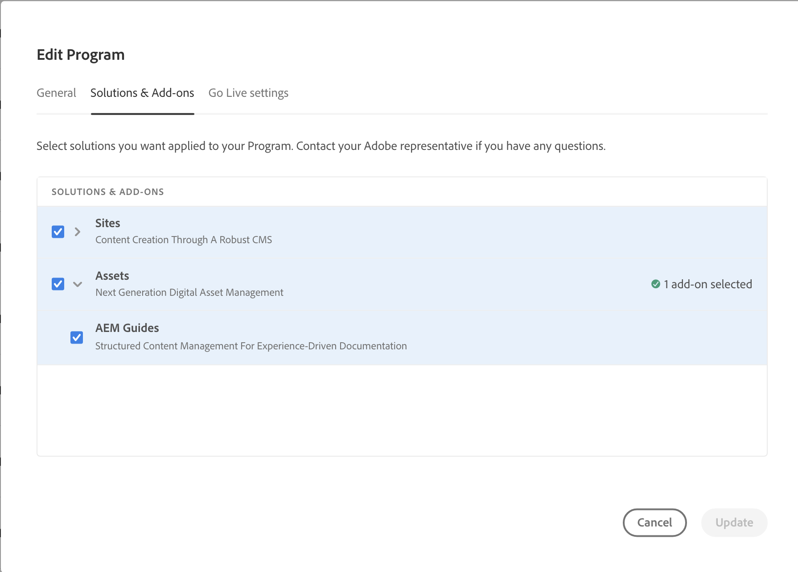

# [!DNL Adobe Experience Manager Guides] のas a Cloud Serviceな導入

[!DNL Experience Manager as a Cloud Service] 環境に [!DNL Experience Manager Guides] を追加する方法を説明します。

>[!NOTE]
>
> 2024.2.0 リリース以降、Experience Manager Guidesは、Experience Manageras a Cloud Service向けの自動アドオンとしてのみ使用できます。 Experience Manager Guidesの手動デプロイメントを使用する場合は、プログラムに対してExperience Manager Guidesを有効にする前に、cloud manage git コードベースの行 `<module>dox.installer</module> from file dox/pom.xml` を削除してください。

1. [!UICONTROL Cloud Manager] にログインします。

1. [!DNL Experience Manager Guides] を設定するプログラムを編集します。

1. 「**[!UICONTROL ソリューションとアドオン]**」タブに切り替えます。

1. **[!UICONTROL ソリューションとアドオン]** テーブルで、**[!UICONTROL Assets]** をクリックします。

1. 「**[!UICONTROL ガイド]**」を選択し、「**[!UICONTROL 保存]**」を選択します。

Experience Manager Guides ソリューションの自動プロビジョニング用のプログラムが正常に設定されました。

>[!NOTE]
>
>統合プログラムの下の任意の環境に [!DNL Experience Manager Guides] をインストールするには、環境に関連付けられたパイプラインを実行する必要があります。 [!DNL Experience Manager Guides] をインストールするために、CM Git コードベースで追加の設定は必要ありません。
