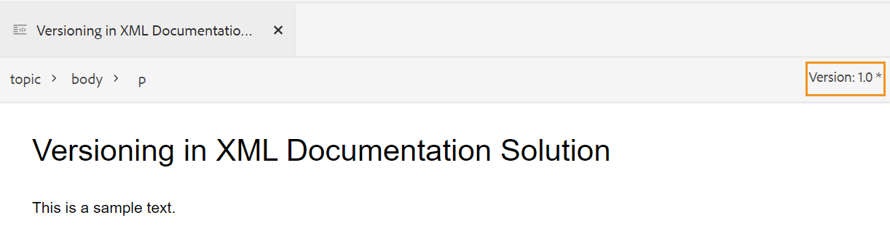
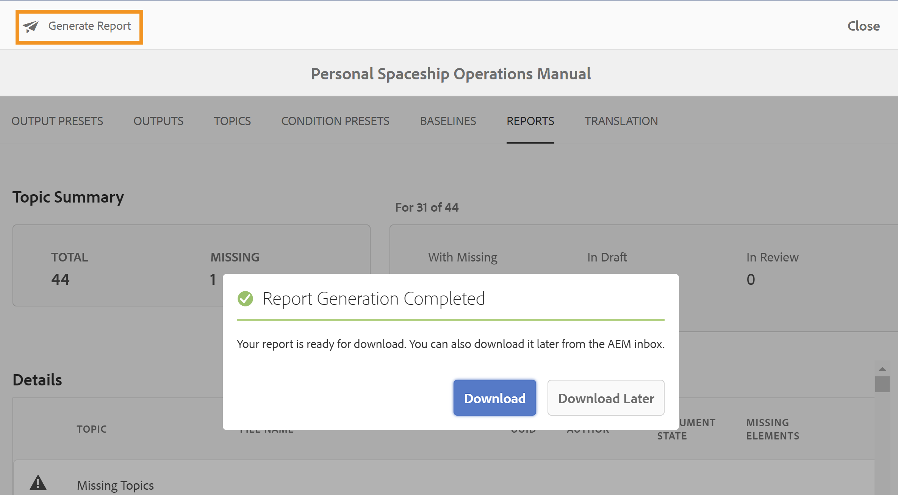

# [!DNL Adobe Experience Manager Guides] as a Cloud Serviceの 1 月リリース

## 1 月リリースへのアップグレード

次の手順を実行して、現在の [!DNL Adobe Experience Manager Guides] as a Cloud Service（後でas a Cloud Service[!DNL AEM Guides] 呼びます）のセットアップをアップグレードします。
1. Cloud Services の Git コードをチェックアウトし、アップグレードする環境に対応する、Cloud Services パイプラインで設定されたブランチに切り替えます。
1. Cloud Services Git コ `<dox.version>` ド `/dox/dox.installer/pom.xml` ファイルのプロパティを 2022.1.78 に更新します。
1. 変更内容をコミットし、Cloud Services パイプラインを実行して、1 月リリースの [!DNL AEM Guides] as a Cloud Serviceにアップグレードします。

## 互換性マトリックス

この節では、2022 年 1 月のas a Cloud Service リリースでサポートされているソフトウェアアプリケーション [!DNL AEM Guides] 互換性マトリックスを示します。

### FrameMakerとFrameMaker Publishing Server

| FMPS | FrameMaker |
| --- | --- |
| 互換性がありません | 2020 年の更新 4 以降 |
| | |

### 酸素コネクタ

| [!DNL AEM Guides] Cloud リリース | 酸素コネクタウィンドウ | 酸素コネクタMac | 酸素ウィンドウで編集 | Oxygen Macで編集 |
| --- | --- | --- | --- | --- |
| 2022.1.0 | 2.4.0 | 2.4.0 | 2.2 | 2.2 |
|  |  |  |  |  |  |

## 新機能と機能強化

### 記事ベースの公開

1 月のリリースで、web エディター内に統合された記事ベースの公開機能が導入されました。 記事ベースの公開機能を使用すると、1 つ以上のトピックの出力を増分的に生成したり、コンテンツをナレッジベースプラットフォームに公開したりできます。

この機能を使用すると、ユーザーは追加的に DITA マップを作成し、トピックの準備が整ったときにそのトピックを公開できます。 マップを公開したら、記事ベースの公開機能を使用して、更新された記事のみを増分公開します。

AEMに加えて、この独自の機能を使用して、Salesforceなどのナレッジベースポータルに記事を公開できます。 また、この機能は、AEM コアコンポーネント上に構築された OOTB コンテンツテンプレートも付属しており、技術コンテンツのナレッジベースのリポジトリを作成できます。 このテンプレートの優れた点は、組織の要件に合わせて完全にカスタマイズでき、企業のイントラネットポータルなどのユースケースもサポートできる点です。
ドキュメントの状態と変更時間に基づいて記事をフィルタリングすることもできます。

この必要に応じた記事の公開により、コンテンツの公開を完全に制御できるだけでなく、更新されたコンテンツを公開するための全体的な時間を短縮することもできます。
このテンプレートを使用して記事を公開する際に、公開済みページにメタデータを渡すこともできます。
詳細については、『ユーザーガイド』の *Web エディターからの記事ベースの公開* を参照してください。

### Web エディターの改善

Web エディターには、多くの機能強化と新機能が導入されています。

* Web エディターで件名スキームのサポートも追加されました。 件名スキーム パネルを使用して、件名スキームを作成および使用できるようになりました。 件名スキームの追加により、独自の企業メタデータと分類を使用できるようになりました。

* このバージョンでは、用語集を一括管理するための新しい用語集ホットスポットツールが導入されました。 このツールを使用すると、選択したマップや開いているトピックのテキストを用語集や用語集にすばやく変換できます。

* 参照ファイル内の再利用可能なコンテンツをすばやく更新できる、再利用可能なコンテンツ パネルに更新機能が追加されました。
* 新しい作業用コピーインジケータは、ファイルの現在の（作業用コピー）が保存されたバージョンと同期しているかどうかを示します。

* リポジトリパネルとファイル参照ダイアログの検索フィルターが強化され、より多くのフィルタリングオプションが提供されるようになり、さらにカスタマイズできるようになりました。

* Web エディターから.docx ファイルをアップロードできるようになりました。

### FrameMakerを使用したオーサリング

これで、FrameMakerでドキュメントを作成して公開できます。 FrameMakerには、Adobe Experience Managerに対する標準のコネクタが付属しています。 FrameMakerには、ドキュメントのバージョンを分散した共同作業環境で管理できる、使いやすいインターフェイスが用意されています。

コンテンツを作成したら、FrameMakerで様々なフォーマット（PDF、HTML5、EPUB、DITA）で文書を公開できます。 また、チェックアウト、扶養家族とのチェックアウト、チェックイン、更新など、様々なファイル管理操作を実行できます。
FrameMakerを使用してas a Cloud Serviceでオーサリング [!DNL AEM Guides] るには、FrameMaker バージョン 2020.4 以降を使用します。

### 新しい翻訳ダッシュボード

Web エディターに新しい翻訳ダッシュボードが導入され、次の機能が追加されました。

* トピックリストの並べ替え、検索、フィルタリング。
* 参照タイプ （直接参照または間接参照）でコンテンツをフィルタリングします。
* 翻訳リクエストの開始時に既存のプロジェクトを見つけるための簡単なナビゲーション。
* 複数の言語に対する翻訳リクエストが開始された際に、各言語に対して複数のプロジェクトが作成されるのを回避するための多言語翻訳メカニズムが導入されました。
* マップダッシュボードで「翻訳」タブを非表示にする設定が導入されました。 デフォルトでは表示されています。 マップダッシュボードまたは web エディターを使用してコンテンツを翻訳するように選択できます。

### 公開機能の強化

* 作成者は、マップおよびトピックレベルのメタデータを DITA-OT パブリッシングに渡すことができるようになりました。 これは、カスタム PDF テンプレートが、タグ、作成者、ドキュメントの状態などのファイルメタデータプロパティを使用するように設計されている場合に役立ちます。

* AEM サイトの出力生成で「**削除して作成**」オプションを使用した場合に、削除されるトピックのバージョンを保持または削除できる新しい設定が追加されました。

### ファイル処理の向上

AEM Assetsでファイルを使用する際に、次の改善が見られるようになりました。
* 新しいファイルのアップロード機能と、競合解決方法を選択するための新しいダイアログが導入されました。

* チェックアウトされたファイルの上書きを防ぐ機能を備えた、アップロードされたファイルの新しいバージョンを作成する機能。
* バージョン履歴ビューから画像のプレビューを直接確認できるようになりました。 また、DITA ファイルと非 DITA ファイルの場合、バージョン履歴には現在のバージョン情報が別々に表示されます。

* ユーザーが DITA ファイルを作成するたびに、デフォルトのファイル名が小さな大文字と小文字で表示され、Native AEMのフォルダー作成シナリオに合わせてインラインで表示されます。

### 新しいレポートエクスポート機能

レポートは、コンテンツの正常性を識別するのに非常に役立ちます。 as a Cloud Service[!DNL AEM Guides] は、コンテンツを制御するための様々なレポートが用意されています。 レポートを表示できるだけでなく、レポートデータを CSV ファイルで書き出して、より大きなチームで表示および共有できるようになりました。 レポートデータを使用すると、壊れたリンクや欠落している画像をすばやく確認できます。

### 酸素 DAM の更新エクスペリエンスの向上

Oxygen でAEM Server からファイルを更新すると、現在の Oxygen セッションに未保存のファイルがある場合は、警告メッセージが表示されます。 更新操作をキャンセルして、未保存のファイルを保存することもできます。 この機能を使用しない場合、ユーザーはドキュメント内の未保存の情報を失うことになります。

### その他の機能強化

* **/apps/projects/templates** パスの下に新しい **Dita Project** テンプレートを作成できるようになりました。
* 次に、フォルダープロファイルからデフォルトの **ui_config.json** ファイルをダウンロードします。 これは、アップグレード中に既存の **ui_config.json** ファイルからカスタムの変更を結合するために使用できます。
* 新しいバージョンの JS ファイルが存在する場合でも、ブラウザーのキャッシュをクリアする必要はありません。

## 修正された問題

様々な領域で修正されたバグを以下に示します。

### Web エディター

* コンリファレンスは、壊れていなくても赤色で表示されます。 （8239）
* DITAVAL エディタで「すべてのプロパティを追加」が選択されている場合、条件属性の値は自動入力されません。 （8234）
* 作成者が、相対パスを使用してトピックに画像を挿入できません。 （8112）
* ファイル名にスペースが含まれている場合は、タスクページにマルチメディアファイルが表示されないことを確認します。 （8111）
* テーブルセルに追加された ph conref は赤色で表示されます。 （8083）
* レビュー中のファイルが移動されても、レビュータスクのリンクが更新されない。 （8080）
* Web エディターで、スケーリングプロパティが 75% 以上に設定された画像が正しくレンダリングされない。 （8073）
* GIF画像は、web エディターで静的画像としてレンダリングされます。 （8024）
* メモ要素内の conkeyref は、web エディターのプレビューや出力には表示されません。 （8006）
* それ自体が conref である要素への外部参照は、エディタで解決されません。 （7933）
* キーを含むタイトルが、エディターのプレビューとリポジトリーパネルで正しくレンダリングされません。 （7909）
* 特殊文字を含むスニペットが正しく保存されていない。 （7908）
* MathMLの数式を書式設定した後にトピックを保存すると、エラーが発生する。 （7954）
* （tm）を含む keydef がエディターで正しくレンダリングされず、AEM サイト出力に重複した TM シンボルが含まれていました。 （7859）
* スニペットのドラッグ&amp;ドロップは、DTD に従って機能しません。 （7758）
* HTMLは、グラフィックのカスタム定義寸法を無視しています。 （7718）
* ソースファイルを移動しても、conrefend 属性が更新されない。 （7698）
* 参照トピックタイプのドキュメントを使用すると、UI に関するいくつかの問題が発生します。 （7656）
* 作成者がマップに ditavalref を追加すると、DITAVAL ファイルが表示されない。 （7594）
* outputclass 属性を要素に追加すると、空白の `<entry>` 要素に予期しないスペースが見つか `<tgroup>` ます。 （7532）
* マップダッシュボードから開いたトピックに対して、「Source」ボタンが機能しない。 （7465）
* プリティプリントでは、FrameMakerまたは Oxygen でファイルを開いたときに表示される空白行とスペースが挿入されます。 （7408）
* どのトピックにも href=&quot;/&quot;があるマップは、AEM サイトでは公開されません。 （7405）
* ルートマップに多数のキーデバイスがある場合に、エディターで発生するパフォーマンスの問題。 （7400）
* カスタムテンプレートを含むマップのドキュメント状態が、対応する状態プロファイルから継承されません。 （7359）
* 要素 `<tm>` ブロック要素として誤ってレンダリングされます。 （7286）
* 新しいテンプレートが作成されると、重複したテンプレートがエディターテンプレートパネルに表示されます。 （5814）
* ui_config で定義された、追加属性を設定する画像用のテンプレートは、ドラッグ&amp;ドロップケースには適用されません。 （5713）
* menucascade の uicontrol のデフォルトの表示が正しくありません。 （5483）
* トピック/マップのカスタムテンプレートの UI に新しい名前が表示されない。 設定された名前を表示するのではなく、「トピック」/「マップ」として名前が表示されます。 （4958）
* ユーザーの環境設定から rootmap をクリアする機能。 （8534）
* ページを更新しても、新しく作成されたマップコレクションはリストされません。（8603）
* ロックが解除されたトピックは閉じることができません。 （8545）
* ソースモードとオーサーモードを切り替えると、トピックがダーティとマークされ、コンテンツを再度保存する必要があります。（8524）
* 特殊文字 `[` または `*` を検索すると、コンテンツパネルがクラッシュして再利用できます。（8279）
* キーボードショートカットの Alt+Enter キーを使用して要素を挿入ダイアログを開くと、検索バーにカーソルが表示されません。（7912）
* 検索オプションでは、ファイル名のみを検索し、コンテンツは検索しません。 （7784）

### 酸素コネクタ

* 親フォルダーに特殊文字が含まれるファイルを Oxygen に読み込むとエラーが発生する。 （8054）
* 新しく作成したドキュメントを Oxygen で開くと、「GUID が見つかりません」エラーがスローされる。 （7856）
* 「Edit in Oxygen」を使用してAEMからファイルをチェックアウトすると、「チェックイン」オプションが無効になる。 （7471）

### レビュー

* コメントに対してリアルタイム同期が機能しない。 （7661）

### Map ダッシュボード

* マップダッシュボードの「トピック」タブまたは「レポート」タブのトピックのタイトルに conref コンテンツが表示されない。 （8263）
* AEM Sites出力 DITA トピックタイトルを更新しても、生成されたサイトページの| jcr:title が更新されない。 （8131）
* Download MAP では、トピック内で使用されているビデオファイルはダウンロードされません。 （8070）
* Download bookmap API を介してオブジェクトタグが使用されている場合、メディアファイルがダウンロードされません。 （8057）
* タイトルが conref で始まるファイルへの conref があるトピックがある場合、「レポート」タブに誤ったレポートが表示される。 （4698）
* 「ベースライン」タブのラベルを適用ダイアログで、ドロップダウンにラベルが表示されない。 （8455）

### 公開

* 「バージョン管理を有効にする」が選択されていると、PDFの作成が初めて失敗します。 （8053、8294）
* AEM Site 出力で「tm;」タグの後に空白文字が自動的に追加される。 （7964）
* AEM Site 出力でYouTube ビデオを表示できない。 （7401）
* ユーザーがマップダッシュボードの「ベースライン」タブで「すべてのトピックを参照」をクリックすると、参照されたコンテンツのラベルによるフィルタリングが失敗する。 （7388）
* プロパティ値が SM または reg の要素 `<tm>` を持つ公開トピックが、生成された出力で正しく表示されません。 （7239）
* 画像を使用したベースライン公開で、公開済み出力に画像の最新バージョンが選択されない。 （7231）
* 参照可能な参照トピックは、「ベースライン」タブに表示されます。 （5424）
* タイトルに conkeyref が含まれるトピックの増分公開が期待どおりに動作しない。 （4474）
* この設定をオンにした場合でも、出力 URL の生成にページタイトルが使用されない。 （8257）
* ベースライン公開では、フリーズされたノードの代わりに現在のバージョンの画像が選択されます。 これは、画像のファイル名にスペースや特殊文字が含まれている場合にも発生します。 （8274、8322）
* mapref を持つタイプのサブジェクト スキームを持つ DITA マップの増分公開が失敗します。 （8218）
* Null は、マップが一括公開ダッシュボードに追加されるたびに追加されます。 （8695）
* トピックで画像を conref としてベースライン公開を使用すると、画像が出力で公開されません。 （8564）
* AEM サイトの公開で使用されているベースラインが削除されると、公開は例外で失敗します。 （8572）
* トピックの再生成が機能しません。 （8091）
* テーブルに脚注を公開する際に問題が発生する。 （4709）

### AEM Assets

* Assets UI で巨大なコンテンツセットを選択/削除する際に、パフォーマンスの問題が発生しました。 （8238）
* 検索フィルターに DITA 述語が追加されると、保存済みの検索機能（スマートコレクション）が機能しなくなる。 （8048）
* 画像を古いバージョンに戻しても機能しません。 （DXML-7903）
* 「削除」オプションは、削除の権限を持たない作成者にも表示されます。 （7322）
* Assets エディター用の CCMS オーバーレイにより、削除オプションのレンダリングが中断する。 （8093）
* ドキュメントプロファイルが削除されない。 （8604）
* 「すべてを選択」を実行し、マルチメディア/Dita_Content を他のフォルダーに移動すると、参照が中断されます。 （8621）
* アセットを移動すると、ソースで間違った参照が発生する。 （8627）
* 固定リスト表示が読み込まれない。 （8542）

### コンテンツのインポート

* HTMLから DITA への変換 |「tr」に空の「td」エントリがあるテーブルの場合、出力に追加の行が含まれます。 （8132）
* HTMLから DITA への変換 |複数の tbody を持つテーブルを持つHTMLは、次の例外で失敗します。 （7940）
* HTMLから DITA への変換 | ソースHTMLにコメントがある場合、エラーが発生します。 （7937）
* DITA 1.3 DITA ファイルをインポートすると、一部の href が不正なリンクに変換される。 （8019）

## 既知の問題

Adobeでは、2022 年 1 月のas a Cloud Service リリースに関 [!DNL AEM Guides] る次の既知の問題を特定しました。

### 回避策に関する既知の問題

次の既知の問題に対して、指定された回避策を使用します。

* Macの Oxygen コネクタで、web 認証が機能しません。
  **回避策**：現時点では、Windows で酸素コネクタを使用します。

* Firefox ブラウザーでレビューコメントを読み込むには、左右に並べて表示する必要があります。
  **回避策**：今のところ、Chrome ブラウザーを使用します。

* ファイル名にスペースが含まれている画像ファイルやマルチメディアファイルを移動すると、参照が中断される。
  **回避策**：ファイル名を変更し、ファイル名からスペースを削除してから移動します。

* 最新バージョンのChrome ブラウザーでは、マップダッシュボードが断続的に読み込まれません。
  **回避策**：マップ・ダッシュボード・ページをリフレッシュします。

### その他の既知の問題

* Oxygen が Web 認証を使用してソリューション [!DNL AEM Guides] 接続されている場合、ログアウトは失敗します。
* レビュータスクをユーザーに再割り当てすることはできません。
* テキストがゆがみ、「すべてを選択 **機能が正しく動作しないなど、マップの収集 UI に問題が** ります。
