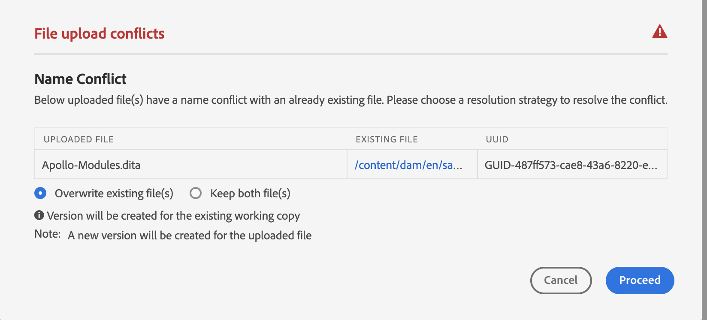
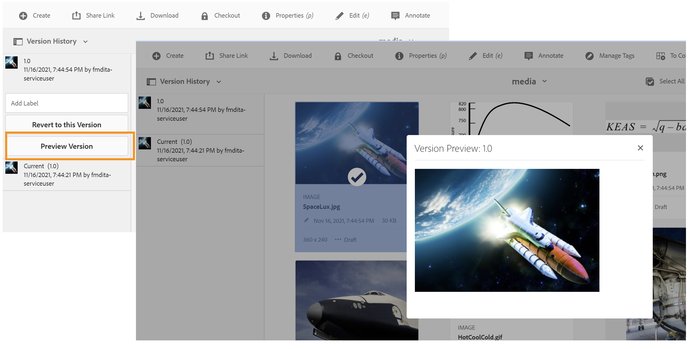
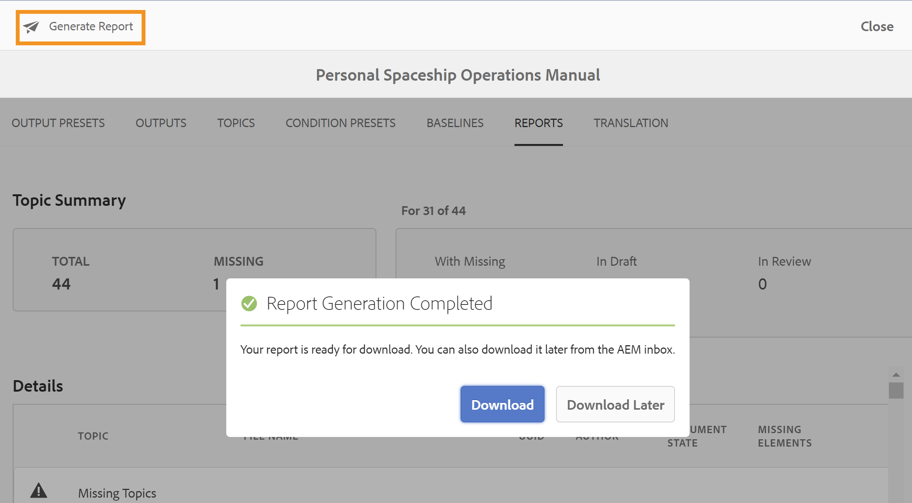

# [!DNL Adobe Experience Manager Guides] as a Cloud Serviceの1月リリース

## 1月リリースへのアップグレード

次の手順を実行して、現在の[!DNL Adobe Experience Manager Guides] as a Cloud Service（後で[!DNL AEM Guides] as a Cloud Service）設定をアップグレードします。
1. Cloud ServicesのGit コードを確認し、アップグレードする環境に対応するCloud Services パイプラインで設定されたブランチに切り替えます。
1. Cloud Services Git コードの`<dox.version>` ファイルの`/dox/dox.installer/pom.xml` プロパティを2022.1.78に更新します。
1. 変更を確定し、Cloud Services パイプラインを実行して、[!DNL AEM Guides] as a Cloud Serviceの1月リリースにアップグレードします。

## 互換性マトリックス

この節では、[!DNL AEM Guides] as a Cloud Service 2022年1月リリースでサポートされているソフトウェアアプリケーションの互換性マトリックスを示します。

### FrameMakerとFrameMaker Publishing Server

| FMPS | FrameMaker |
| --- | --- |
| 互換性がありません | 2020年アップデート 4以降 |
| | |

### Oxygen コネクタ

| [!DNL AEM Guides] クラウドリリース | Oxygen コネクタウィンドウ | Oxygen Connector Mac | Oxygen ウィンドウで編集 | Oxygen Macで編集 |
| --- | --- | --- | --- | --- |
| 2022.1.0 | 2.4.0 | 2.4.0 | 2.2 | 2.2 |

## 新機能と機能強化

### 記事ベースの公開

1月リリースでは、Web エディターに統合された記事ベースの公開機能が導入されました。 記事ベースの公開機能を使用すると、1つ以上のトピックの出力を段階的に生成したり、ナレッジベースプラットフォームにコンテンツを公開したりできます。

この機能を使用すると、ユーザーはDITA マップを追加的に作成し、トピックを準備ができたときに公開できます。 マップを公開したら、記事ベースの公開機能を使用して、更新された記事に対してのみ増分公開を実行します。

AEMに加えて、この一意の機能を使用して、Salesforceなどのナレッジベースポータルに記事を公開できます。 この機能には、AEMのコアコンポーネント上に構築されたOOTB コンテンツテンプレートも付属しています。これにより、テクニカルコンテンツのナレッジベースのリポジトリを構築できます。 このテンプレートの優れた点は、組織の要件に合わせて完全にカスタマイズでき、企業のイントラネットポータルなどのユースケースもサポートできることです。
ドキュメントの状態と変更時間に基づいて記事をフィルタリングすることもできます。

外出先でも必要に応じて記事を公開できるため、コンテンツの公開を完全に制御できるだけでなく、更新されたコンテンツを公開するための全体的な時間を短縮できます。
このテンプレートを使用して記事を公開すると、公開したページにメタデータを渡すこともできます。
詳しくは、ユーザーガイドの「*Web エディターからの記事ベースの公開*」を参照してください。

### Web エディターの向上

Web エディターには多くの機能強化と新機能が導入されています。

* Web エディターに件名スキームのサポートも追加されました。 件名スキームパネルを使用して、件名スキームを作成および使用できるようになりました。 件名スキームの追加により、独自の企業メタデータと分類を使用できるようになりました。

* 新しい用語集ホットスポットツールがこのバージョンに導入され、用語集を一括管理できるようになりました。 このツールを使用すると、選択したマップまたは開いているトピックのテキストを用語集にすばやく変換したり、用語集を用語に一括変換したりできます。

* 再利用可能なコンテンツパネルに更新機能が追加され、参照ファイル内の再利用可能なコンテンツをすばやく更新できるようになりました。
* 新しい作業コピーのインジケーターは、現在の（作業コピー）ファイルが保存済みのバージョンと同期しているかどうかを示します。

* リポジトリパネルとファイル参照ダイアログの検索フィルターが強化され、さらにカスタマイズできるフィルターオプションが追加されました。

* Web エディターから.docx ファイルをアップロードできるようになりました。

### FrameMakerを使用したオーサー

FrameMakerでドキュメントを作成して公開できるようになりました。 FrameMakerには、Adobe Experience Managerへのコネクタが付属しています。 FrameMakerでは、使いやすいインターフェイスを利用して、ドキュメントのバージョンを分散した共同作業に利用できます。

コンテンツを作成したら、FrameMakerを使用して、PDF、HTML5、EPUB、DITAなど、様々な形式でドキュメントを公開できます。 また、チェックアウト、扶養家族とのチェックアウト、チェックイン、更新など、様々なファイル管理操作を実行することもできます。
[!DNL AEM Guides] as a Cloud ServiceでFrameMakerを使用してオーサリングするには、FrameMaker バージョン 2020.4以降を使用します。

### 新しい翻訳ダッシュボード

Web エディターに新しい翻訳ダッシュボードが導入され、次の機能が追加されました。

* トピックリストの並べ替え、検索、フィルタリング。
* 参照タイプ（直接参照または間接参照）でコンテンツをフィルタリングします。
* 翻訳リクエストの開始時に、既存のプロジェクトを簡単に見つけることができます。
* 複数の言語に対して翻訳リクエストを開始する際に、各言語に対して複数のプロジェクトを作成することを避けるための多言語翻訳メカニズムを導入しました。
* マップダッシュボードで「翻訳」タブを非表示にする設定を導入しました。 デフォルトでは表示されます。 マップダッシュボードまたはWeb エディターを使用して、コンテンツを翻訳できます。

### 公開機能の強化

* 作成者は、マップレベルおよびトピックレベルのメタデータをDITA-OT パブリッシングに渡せるようになりました。 これは、カスタム PDF テンプレートが、タグ、作成者、ドキュメントの状態などのファイルメタデータプロパティを使用するように設計されている場合に役立ちます。

* AEM サイトの出力生成で「**削除と作成**」オプションを使用すると、削除されるトピックのバージョンを保持または削除できるように、新しい設定が追加されました。

### ファイル処理の改善

AEM Assetsでファイルを操作する際に、次の改善点が確認できるようになりました。
* 新しいファイルのアップロードエクスペリエンスと、競合解決戦略を選択するための新しいダイアログが導入されました。

* チェックアウトしたファイルの上書きを防ぐ機能を備えた、アップロードされたファイルの新しいバージョンを作成する機能。
* バージョン履歴ビューから画像のプレビューを直接表示できるようになりました。 また、DITA ファイルとDITA以外のファイルの場合、バージョン履歴には現在のバージョン情報が別々に表示されます。

* ユーザーがDITA ファイルを作成するたびに、デフォルトのファイル名は小さなケースで表示され、ネイティブ AEM フォルダー作成シナリオとインラインになります。

### 新しいレポート書き出し機能

レポートは、コンテンツの健全性を特定するのに役立ちます。 [!DNL AEM Guides] as a Cloud Serviceには、コンテンツを制御するための様々なレポートが用意されています。 これにより、レポートを表示するだけでなく、レポートデータをCSV ファイルに書き出して、大規模なチームで表示および共有できるようになります。 レポートデータでは、リンク切れや画像の欠落などを簡単に確認できます。

### Oxygen DAMの更新体験の向上

OxygenでAEM Serverからファイルを更新すると、現在のOxygen セッションに保存されていないファイルがある場合に警告メッセージが表示されます。 更新操作をキャンセルして、保存されていないファイルを保存することができます。 この機能がなければ、ユーザーはドキュメント内の保存されていない情報を失っていました。

### その他の機能の強化

* **/apps/projects/templates** パスの下に新しい&#x200B;**Dita プロジェクト** テンプレートを作成できるようになりました。
* 次に、フォルダープロファイルからデフォルトの&#x200B;**ui_config.json** ファイルをダウンロードします。 これは、アップグレード中に既存の&#x200B;**ui_config.json** ファイルからカスタム変更を結合するために使用できます。
* JS ファイルの新しいバージョンが存在する場合でも、ブラウザーキャッシュをクリアする必要はありません。

## 修正された問題

様々な領域で修正されたバグを以下に示します。

### web エディター

* コンフェクトは、折れていない場合でも赤色で表示されます。 （8239）
* DITAVAL エディターで「すべてのプロパティを追加」が選択されている場合、条件付き属性の値は自動入力されません。 （8234）
* 作成者は、相対パスを使用してトピックに画像を挿入できません。 （8112）
* ファイル名にスペースが含まれている場合に、マルチメディアファイルが表示されないタスクページを確認します。 （8111）
* 表セルに追加されたPh conrefは、赤色で表示されます。 （8083）
* レビュー中のファイルを移動しても、レビュータスク内のリンクは更新されません。 （8080）
* Web エディターで、拡大・縮小プロパティが75%以上に設定されている画像が正しくレンダリングされない。 （8073）
* GIF画像は、Web エディターで静止画像としてレンダリングされます。 （8024）
* ノート要素のconkeyrefは、Web エディターのプレビューまたは出力に表示されません。 （8006）
* 自身がconrefであるエレメントへの外部参照は、エディターで解決されません。 （7933）
* キーを持つタイトルが、エディタープレビューとリポジトリーパネルで正しくレンダリングされない。 （7909）
* 特殊文字を含むスニペットが正しく保存されない。 （7908）
* MathML数式の書式設定後にトピックを保存すると、エラーが発生します。 （7954）
* （tm）を持つkeydefがエディターで適切にレンダリングされず、AEM サイト出力に重複するTM シンボルが含まれていました。 （7859）
* スニペットのドラッグ&amp;ドロップは、DTDに従って機能しません。 （7758）
* HTMLは、グラフィックのカスタム定義された寸法を無視しています。 （7718）
* ソースファイルの移動時にconrefend属性が更新されない。 （7698）
* 参照トピックタイプドキュメントを使用すると、複数のUIの問題が発生します。 （7656）
* 作成者がマップにditavalrefを追加すると、DITAVAL ファイルは表示されません。 （7594）
* outputclass属性が`<entry>`要素に追加されると、空白の`<tgroup>`要素ごとに予期しないスペースが見つかります。 （7532）
* マップダッシュボードで開いたトピックに対して、「Source」ボタンが機能しない。 （7465）
* 「プリティプリント」では、FrameMakerまたはOxygenでファイルを開いたときに表示される空白行とスペースが挿入されます。 （7408）
* どのトピックでもhref=&quot;/&quot;を含むマップは、AEM サイトでは公開されません。 （7405）
* ルートマップに多数のkeydefsがある場合に、エディターでパフォーマンスの問題が見つかりました。 （7400）
* カスタムテンプレートを含むマップのドキュメント状態は、対応する状態プロファイルから継承されません。 （7359）
* `<tm>`要素がブロック要素として正しくレンダリングされません。 （7286）
* 新しいテンプレートを作成すると、重複したテンプレートがエディターテンプレートパネルに表示されます。 （5814）
* 追加の属性を設定するための画像に対してui_configで定義されたテンプレートは、ドラッグ&amp;ドロップケースには適用されません。 （5713）
* Menucascadeでのuicontrolのデフォルトの外観が正しくありません。 （5483）
* トピック/マップのカスタムテンプレートで、UIに新しい名前が表示されない。 設定済みの名前ではなく、「Topic」/「Map」という名前で表示されます。 （4958）
* ユーザー環境設定からロードマップをクリアする機能。 （8534）
* ページを更新した後でも、新しく作成されたマップコレクションは表示されません。（8603）
* ロック解除されたトピックを閉じることはできません。 （8545）
* ソース モードとオーサーモードを切り替えると、トピックがダーティとしてマークされ、コンテンツを再度保存する必要があります。（8524）
* 特殊文字`[`または`*`を検索すると、コンテンツパネルがクラッシュする。（8279）
* キーボードショートカット Alt+Enterを使用してエレメントを挿入ダイアログを開いたときに、検索バーにカーソルが表示されない。（7912）
* 検索オプションは、ファイル名でのみ検索し、コンテンツでは検索しません。 （7784）

### Oxygen コネクタ

* 親フォルダーに特殊文字が含まれるファイルは、Oxygenでの読み込み中にエラーが発生します。 （8054）
* Oxygenで新しく作成されたドキュメントを開くと、「GUIDが見つかりません」エラーがスローされます。 （7856）
* Oxygenで編集を使用してAEMからファイルをチェックアウトすると、チェックインオプションが無効になります。 （7471）

### レビュー

* コメントのリアルタイム同期が機能しない。 （7661）

### マップダッシュボード

* マップダッシュボードの「トピック」タブまたは「レポート」タブのトピックのタイトルにconref コンテンツが表示されない。 （8263）
* AEM Sites出力| DITA トピックタイトルの更新時に、生成されたサイトページのjcr:titleが更新されない。 （8131）
* ダウンロード MAPは、トピック内で使用されるビデオファイルをダウンロードしません。 （8070）
* ダウンロードブックマップ APIを使用してオブジェクトタグを使用すると、メディアファイルがダウンロードされません。 （8057）
* タイトルがconrefで始まるファイルにconrefがあるトピックがある場合、「レポート」タブに正しくないレポートが表示されます。 （4698）
* 「ベースライン」タブの「ラベルを適用」ダイアログでは、ドロップダウンにラベルが表示されません。 （8455）

### 公開

* 「バージョン管理を有効にする」を選択すると、PDFの作成が初めて失敗します。 （8053、8294）
* AEM サイト出力の「tm;」タグの後に、空白の文字が自動的に追加されます。 （7964）
* AEM サイト出力でYouTube ビデオを表示できません。 （7401）
* ユーザーがマップダッシュボードの「ベースライン」タブにあるすべてのトピックを参照をクリックすると、参照コンテンツのラベルによるフィルタリングが失敗します。 （7388）
* プロパティ値SMまたはregを持つ要素`<tm>`を持つトピックを公開すると、生成された出力に正しく表示されません。 （7239）
* 画像を使用したベースラインの公開では、公開済み出力で画像の最新バージョンが選択されません。 （7231）
* 関連参照トピックは、「ベースライン」タブに表示されます。 （5424）
* タイトルにconkeyrefが含まれるトピックの増分公開が期待どおりに機能しません。 （4474）
* この設定がオンになっている場合でも、出力URLの生成にページタイトルは使用されません。 （8257）
* ベースライン公開フリーズされたノードの代わりに、現在のバージョンの画像を選択します。 これは、画像にファイル名にスペースや特殊文字が含まれている場合にも表示されます。 （8274、8322）
* タイプの件名スキームにmaprefが含まれているDITA マップの増分公開が失敗します。 （8218）
* マップが一括公開ダッシュボードに追加されるたびに、Nullが追加されます。 （8695）
* トピックでimageをconrefとして使用したベースライン公開を使用すると、画像は出力に公開されません。 （8564）
* AEM サイト公開で使用されているベースラインが削除された場合、公開は例外で失敗します。 （8572）
* トピックの生成が機能していない。 （8091）
* 表内の脚注の公開に関する問題があります。 （4709）

### AEM Assets

* Assets UIで巨大なコンテンツセットの選択/削除を行う際にパフォーマンスの問題が見つかりました。 （8238）
* DITA述語を検索フィルターに追加すると、保存された検索機能（スマートコレクション）が機能しなくなる。 （8048）
* 画像を古いバージョンに戻すことができません。 （DXML-7903）
* 削除オプションは、削除の権限を持たない作成者にも表示されます。 （7322）
* ASSETS エディターのCCMS オーバーレイで、「削除」オプションのレンダリングが解除される。 （8093）
* ドキュメント プロファイルは削除されません。 （8604）
* 「すべてを選択」を実行し、マルチメディア/Dita_Contentを他のフォルダーに移動すると、参照が無効になります。 （8621）
* アセットを移動すると、ソース内で誤った参照が発生します。 （8627）
* 固定リスト表示が読み込まれない。 （8542）

### コンテンツ読み込み

* HTMLからDITAへの変換| 「tr」が空の「td」エントリを持つテーブルでは、出力に追加の行が発生します。 （8132）
* HTMLからDITAへの変換|複数の本文を持つテーブルを持つHTMLは、例外として失敗します。 （7940）
* HTMLからDITAへのコンバージョン | ソース HTMLにコメントがある場合にエラーが発生する。 （7937）
* DITA 1.3 DITA ファイルを読み込むと、一部のhrefが不正なリンクに変換されます。 （8019）

## 既知の問題

Adobeは、2022年1月リリースの[!DNL AEM Guides] as a Cloud Serviceに関する既知の問題を次のように特定しました。

### 回避策の既知の問題

次の既知の問題に対して、指定された回避策を使用します。

* MacのOxygen コネクタでWeb認証が機能しません。
  **回避策**：今のところ、WindowsでOxygen コネクタを使用してください。

* Firefox ブラウザーでは、横に並べたビューを開かずにレビューコメントを読み込むことはできません。
  **回避策**：今はChrome ブラウザーを使用してください。

* 参照は、ファイル名にスペースを含む画像やマルチメディアファイルを移動すると無効になります。
  **回避策**: ファイル名を変更し、ファイル名からスペースを削除してから移動します。

* 最新バージョンのChrome ブラウザーでは、マップダッシュボードが断続的に読み込まれません。
  **回避策**: マップダッシュボードページを更新します。

### その他の既知の問題

* OxygenがWeb認証を使用して[!DNL AEM Guides] ソリューションに接続されている場合、ログアウトは失敗します。
* レビュータスクをユーザーに再割り当てすることはできません。
* マップ コレクション UIに問題が存在します。例えば、テキストが歪んでおり、**すべてを選択**&#x200B;機能が正しく機能していません。
