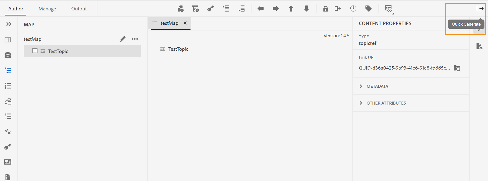

# Adobe Experience Manager Guides as a Cloud Serviceの 10 月リリース

## 10 月リリースへのアップグレード

次の手順を実行して、現在のAdobe Experience Manager Guides as a Cloud Service（後の *AEM Guides as a Cloud Service*）のセットアップをアップグレードします。
1. Cloud Services の Git コードをチェックアウトし、アップグレードする環境に対応する、Cloud Services パイプラインで設定されたブランチに切り替えます。
1. Cloud Services Git コ `<dox.version>` ド `/dox/dox.installer/pom.xml` ファイルのプロパティを 2022.10.183 に更新します。
1. 変更内容をコミットし、Cloud Services パイプラインを実行して、10 月リリースのAEM Guides as a Cloud Serviceにアップグレードします。

## 互換性マトリックス

この節では、2022 年 10 月リリースのAEM Guides as a Cloud Serviceでサポートされているソフトウェアアプリケーションの互換性マトリックスを示します。

### FrameMakerとFrameMaker Publishing Server

| FMPS | FrameMaker |
| --- | --- |
| 互換性がありません | 2020 年の更新 4 以降 |
| | |

*AEMで作成されたベースラインと条件は、2020.2 以降の FMPS リリースでサポートされます。

### 酸素コネクタ

| AEM Guides as a Cloud リリース | 酸素コネクタウィンドウ | 酸素コネクタMac | 酸素ウィンドウで編集 | Oxygen Macで編集 |
| --- | --- | --- | --- | --- |
| 2022.10.0 | 2.7.13 | 2.7.13 | 2.3 | 2.3 |
|  |  |  |  |  |

## 新機能と機能強化

AEM Guides as a Cloud Serviceでは、10 月のリリースで機能強化と新機能が提供されています。

### 「クイック生成」パネル

AEM Guidesに **クイック生成** パネルが追加されました。このパネルを使用すると、DITA マップ用に作成されたプリセットの出力をすばやく生成して表示することができます。

**クイック生成** パネルに、DITA マップ用に作成されたすべての出力プリセットのリストが表示されます。

1 つ以上のプリセットを選択して、出力をすばやく生成します。 また、プリセット用に生成された出力をすばやく確認することもできます。 出力の生成時に成功メッセージが表示されます。 出力の生成に失敗した場合は、エラーメッセージが表示されます。 また、エラーログを表示して、生成プロセスで発生したエラーの詳細を確認することもできます。

## 修正された問題

様々な領域で修正されたバグを以下に示します。

* ネイティブ PDF | PDF出力からリソースのみのトピックが削除されるとエラーが発生します。 （10554）
* ネイティブ PDF |空のキー参照がPDF出力に表示されます。 （10553）
* ネイティブ PDF `navtitle` の| `topichead` は適用されません。 （10509）
* ネイティブ PDF | amd64 JDK フレーバーのサポートが必要です。 （10465）
* ネイティブ PDF |目次から重要なトピックを非表示にできません。 （10355）
* ネイティブ PDF |章レイアウトでページ番号を再度開始すると、前の章の最後から番号がランダムに開始されます。 （10154）
* Chrome ブラウザー UI から要素をドラッグ&amp;ドロップすると、|画面が空白になります。 例えば、条件パネルから条件をドラッグしたとき。 （10524）
* アセットのコピーと貼り付け操作の後に、ノードプロパティが削除される。 （10053）
* 「**閉じる**」をクリックすると、ユーザーはアセットにリダイレクトされていました。ユーザーをAEM ホームページに移動できるように、エクスペリエンスが修正されました。 （9654）
