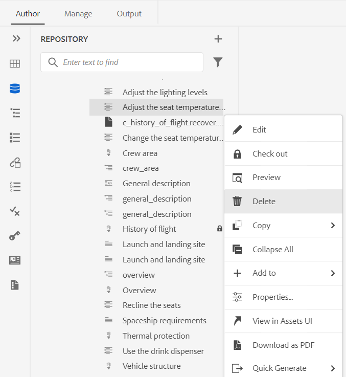
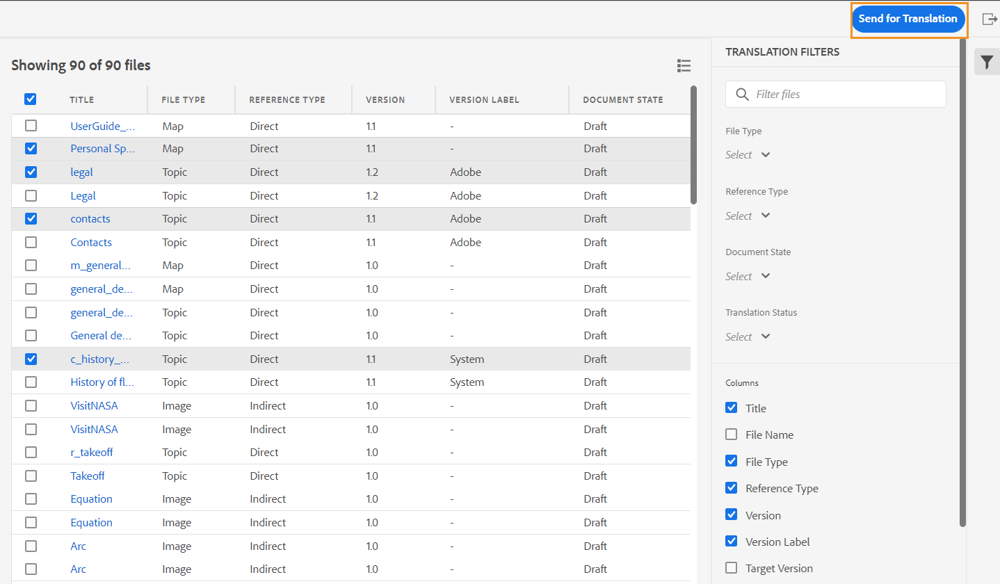

# Adobe Experience Manager Guides as a Cloud Service 11月リリース

## 11月リリースへのアップグレード

次の手順を実行して、現在のAdobe Experience Manager Guides as a Cloud Service（後で&#x200B;*AEM Guides as a Cloud Service*&#x200B;と呼ばれます）の設定をアップグレードします。
1. Cloud ServicesのGit コードを確認し、アップグレードする環境に対応するCloud Services パイプラインで設定されたブランチに切り替えます。
1. Cloud Services Git コードの`/dox/dox.installer/pom.xml` ファイルの`<dox.version>` プロパティを2022.11.198に更新します。
1. 変更を確定し、Cloud Services パイプラインを実行して、AEM Guides as a Cloud Serviceの11月リリースにアップグレードします。

## 既存のコンテンツをインデックス化する手順（AEM Guides as a Cloud Serviceの9月リリース以前のバージョンを使用している場合のみ）

既存のコンテンツのインデックスを作成するには、次の手順を実行し、マップレベルで新しい検索と置換のテキストを使用します。

* サーバーへのPOST リクエストを実行します（正しい認証を使用） - `http://<server:port>/bin/guides/map-find/indexing`。
（オプション：マップの特定のパスを渡してインデックスを作成できます。デフォルトでは、すべてのマップにインデックスが付けられます||例：`https://<Server:port>/bin/guides/map-find/indexing?paths=<map_path_in_repository>`）

* APIはjobIdを返します。 ジョブのステータスを確認するには、ジョブ IDを持つGET リクエストを同じエンドポイントに送信できます。 `http://<server:port>/bin/guides/map-find/indexing?jobId={jobId}`
（例：http://&lt;_localhost:8080_/bin/guides/map-find/indexing?jobId=2022/9/15/7/27/7dfa1271-981e-4617-b5a4-c18379f11c42_678）

* ジョブが完了すると、上記のGET リクエストは成功して応答し、マップが失敗した場合にメンションします。 正常にインデックス化されたマップは、サーバーログから確認できます。

## 互換性マトリックス

この節では、AEM Guides as a Cloud Service 2022年11月リリースでサポートされるソフトウェアアプリケーションの互換性マトリックスを示します。

### FrameMakerとFrameMaker Publishing Server

| FMPS | FrameMaker |
| --- | --- |
| 互換性がありません | 2020年アップデート 4以降 |
| | |

* AEMで作成されたベースラインと条件は、2020.2以降のFMPS リリースでサポートされています。

### Oxygen コネクタ

| AEM Guides as a Cloud リリース | Oxygen コネクタウィンドウ | Oxygen Connector Mac | Oxygen ウィンドウで編集 | Oxygen Macで編集 |
| --- | --- | --- | --- | --- |
| 2022.11.0 | 2.7.13 | 2.7.13 | 2.3 | 2.3 |
|  |  |  |  |  |

## 新機能と機能強化

AEM Guides as a Cloud Serviceには、11月リリースの機能強化と新機能が用意されています。

### リポジトリパネルからのファイルの削除

選択したファイルの&#x200B;**オプション** メニューから、リポジトリパネルからファイル（一度に1つのファイル）を簡単に削除できるようになりました。

ファイルを削除する前に、確認プロンプトが表示されます。 他のファイルから参照されていないファイルは削除され、成功メッセージが表示されます。

選択したファイルがチェックアウトされている場合は、ファイルを削除できません。エラーメッセージが表示されます。 選択したファイルがお気に入りコレクションに追加された場合、または他のファイルから参照された場合、AEM ガイドは確認を確認し、強制的に削除するオプションを提供します。 参照トピックを削除し、編集用の参照を含むファイルを開いた場合、参照ファイルの壊れたリンクが表示されます。

**メモ**：選択したファイルは、キーボードの削除キーを使用して削除することもできます。

### 選択したバージョンのファイルのパージ

コンテンツを作成および管理すると、リポジトリ内のDITA ファイルに対して多くのバージョンが作成される場合があります。 AEM Guidesを使用すると、古いバージョンのDITA ファイルをリポジトリからパージし、ディスク領域を解放できます。

AEM Guidesでは、ファイルの最初のバージョン、ベースラインに含まれているバージョン、またはラベルが適用されているバージョンは削除されません。 パージ操作では、翻訳またはレビューワークフローに含まれているファイルは削除されません。 保持するバージョン数を選択し、定義された日数より古いファイルを削除することもできます。

パージ操作を開始する前に、レポートをプレビューして、パージされるバージョンを確認できます。 その後、パージ操作の開始またはキャンセルを決定できます。

パージ操作が完了したら、パージ レポートを確認して、パージされたファイルを確認できます。

### グローバルおよびフォルダープロファイル出力プリセットの管理

AEM Guidesには、グローバルプロファイルとフォルダープロファイルの出力プリセットを作成および管理する機能が用意されています。 次に、これらの出力プリセットを使用して、そのグローバルプロファイルまたはフォルダープロファイルに関連するすべてのマップの出力を簡単に生成できます。

**注意** フォルダーレベルの管理ユーザーのみが、グローバルおよびフォルダープロファイルのプリセットを作成できます。

これらのグローバルプリセットは、関連するすべてのマップの「**出力**」タブに表示されます。 それらを使用して、関連するすべてのマップの出力を生成できます。 プリセットをデフォルトのPDF プリセットとして選択して、PDF出力を生成できます。 **オプション** メニューから、既存の出力プリセットを&#x200B;**編集**、**名前変更**、**複製**&#x200B;または&#x200B;**削除**&#x200B;することもできます。

### 翻訳ダッシュボードにバージョンラベル列が追加されました

翻訳ダッシュボードには、「バージョンラベル」列もあります。 これにより、ソースファイルの選択したバージョンのラベルが表示されます。 これにより、特定のラベルを持つすべてのファイルを選択し、一括で翻訳できます。

### ネイティブ PDF | PDFの改訂バーにドキュメントのバージョンの違いが表示されている

改訂バーを使用して、2つのバージョン間の内容の違いを示すPDFを作成できるようになりました。 現在のバージョンと以前のバージョンのベースラインを比較するか、選択した2つのベースラインバージョンを比較するかを選択できます。

PDFに変更バーが表示され、変更、挿入、または削除されたコンテンツが示されます。 また、次の操作を行うオプションもあります。
* 挿入したコンテンツを緑色で下線で表示
* 削除されたコンテンツを赤色で表示し、取り消し線でマークします

### ネイティブ PDF |出力パスとPDF ファイル名のバリアブルサポート

次の標準変数を使用して、出力パスとPDF ファイルを定義することもできます。 単一または複数の変数の組み合わせを使用して、次のオプションを定義できます。
* `${map_filename}`
* `${map_title}`
* `${preset_name}`
* `${language_code}`
* `${map_parentpath}` （出力パスのみ）
* `${path_after_langfolder}` （出力パスのみ）

### ネイティブ PDF | DITA マップの目次の生成とページレイアウトの並べ替え

テンプレートの高度なPDF設定を使用して、DITA マップの目次を生成することもできます。 様々なページレイアウトの表示を有効または無効にしたり、その位置を並べ替えたりできます。

## 修正された問題

様々な領域で修正されたバグを以下に示します。

* ネイティブ PDF | `conkeyref`は、生成されたPDF出力で解決されません。 (10564)
* ネイティブ PDF | PDF出力でマップのメタデータにアクセスすると問題が発生します。 (10556)
* ネイティブ PDF | インラインスタイルは、クラス名の代わりにタグを生成するために使用されます。  (10498)
* Web エディターは断続的に空白ページを読み込みます。 (10678)
* 既存のプリセットを複製してプリセットを作成すると、PDFの公開が失敗します。 (10584)
* プリセットに対するPDFの生成が失敗した場合、**ログを表示** ボタンは機能しません。 (10576)
* conrefであるpara タグ内のメモは、プレビューに表示されません。 (10559)
* リスト項目の最後にあるバックスペースを押すと、リスト全体が削除されます。 (10540)
* ネイティブのPDF エクスポートを使用する場合、ネストされた`<indexterm>`はインデックスにネストされません。 (10521)
* ツールバーの「**自動インデント**」ボタンがSource ビューに表示されません。 (10448)
* リストの作成中に、リスト項目の最初の文字が失われます。 (10447)
* DITA アセットのバージョンが変更され、ベースライン編集ウィンドウに保存されると、複数のポップアップが表示されます。 (10399)
* クイック生成パネルからすべての出力プリセットを選択した後、**編集** ボタンをクリックすると、アプリケーションエラーが発生します。 (10388)
* Assets UIからコピー&amp;ペースト操作を実行すると、DITA トピックのカスタムメタデータが保持されません。 (10367)
* アセットがアクティブな翻訳プロジェクトに存在する言語フォルダー全体の後処理がブロックされます。 (10332)
* XML エディターの「テンプレート」タブは、フォルダープロファイル管理者には表示されません。 (10266)
* 4.0 アップグレード後にWeb エディターでナビゲーションの問題が発生します。 (10159)
* SVG ファイルがプレビューモードで表示されない。 (10010)
* エディターの「出力」タブにプリセットが多い場合、プリセットセクションはスクロールできず、すべてのプリセットは表示されません。 (9787)
* 画像の&#x200B;**編集**&#x200B;および&#x200B;**注釈** オプションが列ビューで正しく機能しません。 (8758)
* ピアリンクは解決されず、生成された出力に通常のテキストとして表示されます。 (7774)
