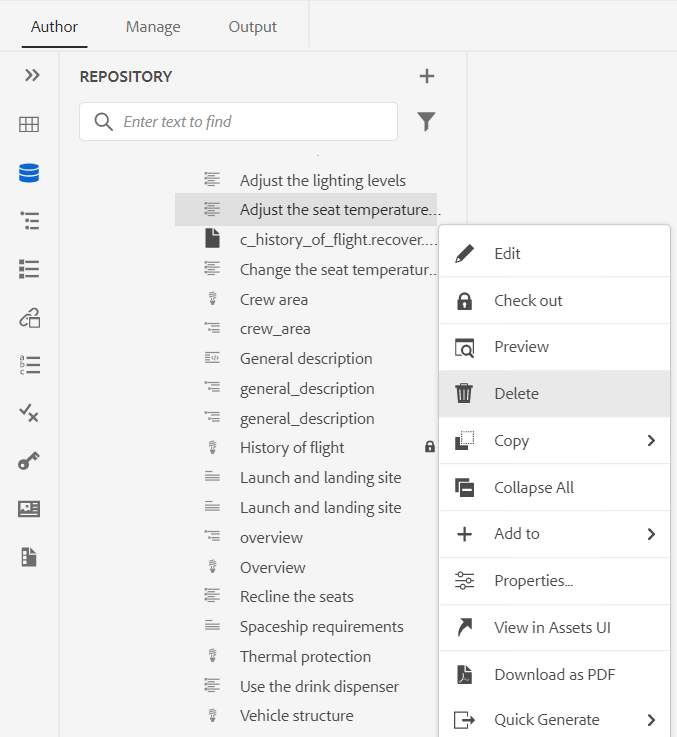

# Adobe Experience Manager Guides as a Cloud Serviceの 11 月リリース

## 11 月のリリースへのアップグレード

次の手順を実行して、現在のAdobe Experience Manager Guides as a Cloud Service（後の *AEM Guides as a Cloud Service*）のセットアップをアップグレードします。
1. Cloud Services の Git コードをチェックアウトし、アップグレードする環境に対応する、Cloud Services パイプラインで設定されたブランチに切り替えます。
1. Cloud Services Git コ `<dox.version>` ド `/dox/dox.installer/pom.xml` ファイルのプロパティを 2022.11.198 に更新します。
1. 変更内容をコミットし、Cloud Services パイプラインを実行して、11 月リリースのAEM Guides as a Cloud Serviceにアップグレードします。

## 既存のコンテンツのインデックスを作成する手順（AEM Guides as a Cloud Serviceの 9 月のリリースより前のバージョンを使用している場合のみ）

既存のコンテンツのインデックスを作成し、新しい検索と置換のテキストをマップレベルで使用するには、次の手順を実行します。

* （正しい認証で） サーバーへの POST リクエストを実行します – `http://<server:port>/bin/guides/map-find/indexing`。
（オプション：マップの特定のパスを渡してインデックスを作成できます。デフォルトでは、すべてのマップにインデックスが作成されます ||例：`https://<Server:port>/bin/guides/map-find/indexing?paths=<map_path_in_repository>`）

* API は jobId を返します。 ジョブのステータスを確認するには、同じエンドポイント `http://<server:port>/bin/guides/map-find/indexing?jobId={jobId}` にジョブ ID を含むGET リクエストを送信します。
（例：http://&lt;_localhost:8080_>/bin/guides/map-find/indexing?jobId=2022/9/15/7/27/7dfa1271-981e-4617-b5a4-c18379f11c42_678）

* ジョブが完了すると、上記のGET リクエストが成功を返し、失敗したマップがあるかどうかを示します。 正常にインデックス化されたマップは、サーバ ログから確認できます。

## 互換性マトリックス

この節では、2022 年 11 月リリースのAEM Guides as a Cloud Serviceでサポートされるソフトウェアアプリケーションの互換性マトリックスを示します。

### FrameMakerとFrameMaker Publishing Server

| FMPS | FrameMaker |
| --- | --- |
| 互換性がありません | 2020 年の更新 4 以降 |
| | |

*AEMで作成されたベースラインと条件は、2020.2 以降の FMPS リリースでサポートされます。

### 酸素コネクタ

| AEM Guides as a Cloud リリース | 酸素コネクタウィンドウ | 酸素コネクタMac | 酸素ウィンドウで編集 | Oxygen Macで編集 |
| --- | --- | --- | --- | --- |
| 2022.11.0 | 2.7.13 | 2.7.13 | 2.3 | 2.3 |
|  |  |  |  |  |

## 新機能と機能強化

AEM Guides as a Cloud Serviceでは、11 月のリリースで機能強化と新機能が提供されています。

### リポジトリーパネルからのファイルの削除

リポジトリパネルで選択したファイルの **オプション** メニューからファイルを（一度に 1 つのファイル）簡単に削除できるようになりました。

ファイルを削除する前に確認プロンプトが表示されます。 ファイルが他のファイルから参照されていない場合、ファイルは削除され、成功メッセージが表示されます。

選択したファイルがチェックアウトされている場合、そのファイルは削除できず、エラーメッセージが表示されます。 選択したファイルがお気に入りのコレクションに追加されている場合、または他のファイルから参照されている場合、AEM ガイドにより、確認が確認され、ファイルを強制的に削除するオプションが表示されます。 参照されているトピックを削除し、編集する参照を含むファイルを開いた場合、参照されているファイルの壊れたリンクが表示されます。

**注意**：キーボードの Delete キーを使用して、選択したファイルを削除することもできます。

### 選択したバージョンのファイルのパージ

コンテンツを作成して管理すると、リポジトリ内の DITA ファイルに対して多数のバージョンが作成される場合があります。 AEM Guidesを使用すると、古いバージョンの DITA ファイルをリポジトリからパージして、ディスク領域を解放できます。

AEM Guidesは、ファイルの最初のバージョン、ベースラインに含まれるバージョン、またはラベルが適用されているバージョンを削除しません。 パージ操作では、翻訳やレビューワークフローに含まれるファイルは削除されません。 保持するバージョンの数を選択し、定義された日数より古いファイルを削除することもできます。

パージ操作を開始する前に、レポートをプレビューして、パージされるバージョンを確認できます。 その後、パージ操作を開始するかキャンセルするかを決定できます。

パージ操作が完了したら、パージレポートをチェックして、パージされたファイルを確認できます。

### グローバルプロファイルおよびフォルダープロファイル出力プリセットの管理

AEM Guidesには、グローバルプロファイルとフォルダープロファイルの出力プリセットを作成および管理する機能が用意されています。 その後、これらの出力プリセットを簡単に使用して、そのグローバルプロファイルまたはフォルダープロファイルに関連するすべてのマップの出力を生成できます。

**注意** グローバルプロファイルプリセットとフォルダープロファイルプリセットを作成できるのは、フォルダーレベルの管理者ユーザーのみです。

これらのグローバルプリセットは、関連するすべてのマップの「**出力**」タブに表示されます。 これらを使用して、関連するすべてのマップの出力を生成できます。 このプリセットをデフォルトのPDF プリセットとして選択すると、PDF出力を生成できます。 **オプション** メニューから、既存の出力プリセットを **編集**、**名前変更**、**複製** または **削除** することもできます。

### 翻訳ダッシュボードに追加されたバージョンラベル列

翻訳ダッシュボードには、「バージョンラベル」列も表示されます。 これにより、ソースファイルの選択したバージョンのラベルが表示されます。 これは、特定のラベルが付いているすべてのファイルを選択し、一度に翻訳するのに役立ちます。

### ネイティブ PDF | ドキュメントバージョン間の違いを示す変更バーを備えたPDF

次に、変更バーを使用して、2 つのバージョン間のコンテンツの違いを示すPDFを作成できます。 現在のバージョンを前のバージョンのベースラインと比較するか、選択した 2 つのベースラインバージョンを比較するかを選択できます。

変更バーがPDFに表示され、変更、挿入または削除されたコンテンツを示します。 次の操作を行うオプションもあります。
* 挿入した内容を緑色で表示し、下線付きで表示します
* 削除されたコンテンツを赤で表示し、取り消し線でマークします

### ネイティブ PDF |出力パスとPDF ファイル名の変数サポート

また、次の標準変数を使用して、出力パスとPDF ファイルを定義することもできます。 これらのオプションは、変数の 1 つまたは組み合わせを使用して定義できます。
* `${map_filename}`
* `${map_title}`
* `${preset_name}`
* `${language_code}`
* `${map_parentpath}` （出力パスの場合のみ）
* `${path_after_langfolder}` （出力パスの場合のみ）

### ネイティブ PDF | DITA マップの目次の生成とページレイアウトの並べ替え

テンプレートの高度なPDF設定を使用して、DITA マップに目次を生成できるようになりました。 様々なページレイアウトの表示を有効または無効にしたり、位置を並べ替えたりすることができます。

## 修正された問題

様々な領域で修正されたバグを以下に示します。

* ネイティブ PDF |生成されたPDF出力で `conkeyref` が解決されません。 （10564）
* ネイティブ PDF | PDF出力内のマップのメタデータにアクセスする際に問題が発生します。 （10556）
* ネイティブ PDF | インラインスタイルは、クラス名の代わりにタグの生成に使用されます。  （10498）
* Web エディターが空白のページを断続的に読み込む。 （10678）
* 既存のプリセットを複製してプリセットを作成すると、PDFの公開が失敗します。 （10584）
* プリセットのPDFの生成に失敗すると、「**ログを表示**」ボタンが機能しない。 （10576）
* conref である para タグ内では、プレビューに表示されないことに注意してください。 （10559）
* リスト項目の最後に backspace を押すと、リスト全体が削除されます。 （10540）
* ネイティブのPDF書き出しを使用する場合、ネストされた `<indexterm>` はインデックスにネストされません。 （10521）
* ツールバーの **自動インデント** ボタンがSource ビューに表示されません。 （10448）
* リストがエディターで作成されている間、リスト項目の最初の文字が失われます。 （10447）
* ベースライン編集ウィンドウで DITA アセットバージョンを変更して保存すると、複数のポップアップが表示されます。 （10399）
* クイック生成パネルからすべての出力プリセットを選択した後、「**編集**」ボタンをクリックすると、アプリケーションエラーが発生する。 （10388）
* Assets UI からコピー貼り付けアクションを実行しても、DITA トピックのカスタムメタデータが保持されない。 （10367）
* アクティブな翻訳プロジェクトにアセットが存在する言語フォルダー全体に対しては、後処理がブロックされます。 （10332）
* XML エディターの「テンプレート」タブが、フォルダープロファイル管理者に表示されない。 （10266）
* 4.0 へのアップグレード後に、web エディターでナビゲーションの問題が発生する。 （10159）
* SVG ファイルがプレビューモードで表示されません。 （10010）
* エディターの「出力」タブにその他のプリセットが含まれている場合は、「プリセット」セクションをスクロールできず、すべてのプリセットが表示されません。 （9787）
* 画像の **編集** および **注釈** オプションが列ビューで正しく機能しない。 （8758）
* ピアリンクが解決されず、生成された出力に通常のテキストとして表示される。 （7774）
