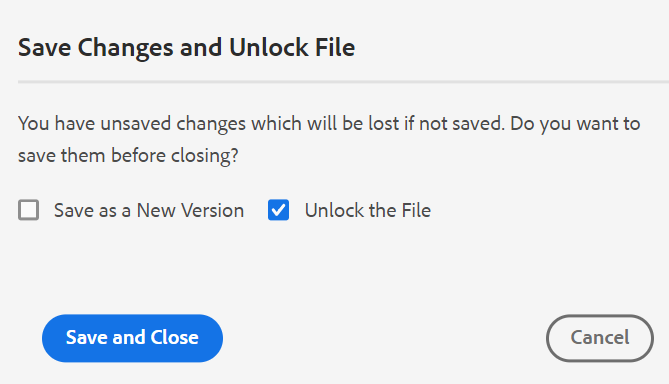

# [!DNL Adobe Experience Manager Guides] as a Cloud Serviceの2月リリース

## 2月リリースへのアップグレード

次の手順を実行して、現在の[!DNL Adobe Experience Manager Guides] as a Cloud Service（後で[!DNL AEM Guides] as a Cloud Service）設定をアップグレードします。
1. Cloud ServicesのGit コードを確認し、アップグレードする環境に対応するCloud Services パイプラインで設定されたブランチに切り替えます。
1. Cloud Services Git コードの`/dox/dox.installer/pom.xml` ファイルの`<dox.version>` プロパティを2022.2.114に更新します。
1. 変更を確定し、Cloud Services パイプラインを実行して、[!DNL AEM Guides] as a Cloud Serviceの2月リリースにアップグレードします。

## 互換性マトリックス

この節では、[!DNL AEM Guides] as a Cloud Service 2022年2月リリースでサポートされているソフトウェアアプリケーションの互換性マトリックスを示します。

### FrameMakerとFrameMaker Publishing Server

| FMPS | FrameMaker |
| --- | --- |
| 互換性がありません | 2020年アップデート 4以降 |
| | |

### Oxygen コネクタ

| [!DNL AEM Guides] クラウドリリース | Oxygen コネクタウィンドウ | Oxygen Connector Mac |
| --- | --- | --- |
| 2022.2.0 | 2.4.0 | 2.4.0 |
|  |  |  |

## 新機能と機能強化

### PDFとのネイティブな連携

ネイティブ PDFの作成に関するサポートは、[!DNL AEM Guides] as a Cloud Serviceの2月リリースでも追加されました。 次の機能を備えた新しい公開エンジンが導入されました。
* CSS テンプレートの作成
* 様々なページテンプレートの作成
* CSSとページテンプレートで構成されるPDF テンプレートのデザイン
* PDF形式のマップとトピックコンテンツの公開

### 記事ベースの公開でのナレッジベースサイトパスのサポート

[!DNL AEM Guides] as a Cloud Serviceには、1つ以上のトピックの出力を段階的に生成したり、コンテンツをナレッジベースプラットフォームに公開したりするための記事ベースの公開機能が用意されています。 2月リリースでは、トピック/マップを公開する必要があるナレッジベースサイトパスを選択する追加オプションがあります。 パスを選択すると、指定したパスで出力が生成されます。

### Web エディターの機能強化

Web エディターに多くの機能強化と新機能が追加されました。

* **ファイルを閉じる際のダイアログが改善されました**

[!DNL AEM Guides] as a Cloud Serviceは、Web エディターで開いているファイルを閉じようとすると、変更内容を保存し、ロックされたファイルのロックを解除するように求めるメッセージを表示します。 プロンプトは、管理者が設定した「**閉じる**&#x200B;でチェックインを依頼する」および「**閉じる**&#x200B;で新しいバージョンを依頼する」に基づいて表示されます。

設定に基づいて、変更を保存し、ドキュメントの新しいバージョンを作成するオプションが表示されます。 または、ファイルをチェックインして、現在のバージョンに変更を保存することもできます。

詳しくは、ユーザーガイドの「*ファイルを閉じてシナリオを保存*」を参照してください。

* 文字パレットに改行しないスペースが追加されました。  **非改行** スペースは、HTML ドキュメント内の特定のポイントで自動改行を防ぎます。 Web エディターは、AEM サイトとHTML5の両方の出力に対して非改行スペースをサポートしています。

* Web エディターから画像をアップロードすると、同じ名前の画像が既に存在する場合、確認ダイアログが表示されます。 既存のファイルと新しいファイルの両方を保存するか、既存のファイルを上書きして新しいファイルのみを保存できます。

* ユーザーが編集用にファイルをロックしている場合、管理者はロックを解除してファイルをチェックインできます。 この機能は、一部のファイルを編集する必要があるものの、ファイルをチェックインできないユーザーによってロックされている場合に役立ちます

### マップダッシュボード

DITA マップのダウンロードを選択すると、リクエストはキューに入れ、マップのダウンロード準備が整うと通知が届きます。 マップファイルをすぐにダウンロードするか、AEM通知の受信トレイに表示されるリンクから後でダウンロードするかを選択できます。

### レビュー

レビュータスクの「説明」フィールドに詳細を記載すると、レビューアーに送信されたメールに表示されます。

## 修正された問題

様々な領域で修正されたバグを以下に示します。

### 記事ベースの公開

* 記事ベースの公開では、選択したベースラインに基づく記事は公開されません。 (8771)
* DITAVAL ファイルは、記事ベースの公開では尊重されません。 (8770)
* レコードタイプがFAQで、記事フィールドコンテンツがQuestionの場合、Salesforce プロファイルに対して記事ベースの公開を行うことができません。 (8448)
* レコードタイプが手動の場合、Salesforce プロファイルに対して記事ベースの公開を実行できません。 (8447)

### web エディター

* 条件をドラッグ&amp;ドロップすると、DITA トピックでは機能しません。 (8761)
* お気に入りビューのドラッグ&amp;ドロップを使用してブックマップに章を追加すると、属性が見つかりません。 (8746)
* 画像のプロパティ（高さ、幅）を編集すると、アプリケーションエラーが発生します。 (8722)
* リンク切れは、ソースビューのアウトライン パネルには表示されません。 (8590)
* XML エディターは、コードブロック内の改行タグを削除します。 (8522)
* Glossentryを作成すると、Glossusageがメモとして表示されます。 (8384)
* 有効な場所でも外部参照を挿入できません。 (8354)
* エレメントのリスト（Alt+Enter）が、暗いテーマまたは暗いテーマでグレー表示されます。 (7913)
* リポジトリーパネルの&#x200B;**作成** オプション（省略記号メニュー）のマップテンプレートのリストが、ユーザー環境設定の&#x200B;**フォルダープロファイル**&#x200B;に従っていません。 (5918)
* メインツールバーの「コンテンツを再利用」機能から追加された要素に対して、要素IDが自動的に生成されません。 (5826)

### ASSETS UI

* クラウドサーバーで画像編集が正常に機能しません。 (8768)
* バージョン履歴パネルでは、現在のバージョンのセクションに誤ったタイムスタンプが表示され、情報によって変更されます。 (8765)
* AEM デスクトップツールを使用すると、クラウドサーバーでのDITAVAL ファイルのアップロードに失敗します。 (8707)
* 2番目の管理者ユーザーを最初の管理者ユーザーとしてフォルダーに追加することはできません。 (8430)
* アセットがコピーおよびペーストされる際に、アセットの一意でないプロパティはコピーされません。 (8241)

### ユーザビリティの変更

* Web エディターのレビューパネルで、ユーザー名が長い場合、承認/却下するアイコンが明確に表示されません。 (8793)
* **検索と置換** パネルで、結果セクションのマウスカーソルに不要なアイコンが表示されます。 (8775)
* カスタムアイコンはプロパティから選択されず、「レポートを生成」ボタンを使用して生成されたレポートには、デフォルトアイコンが表示されます。 (8573)
