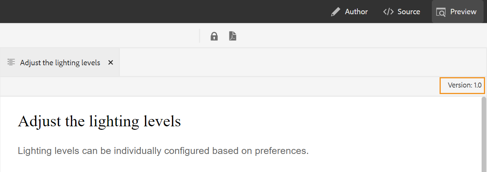

# Adobe Experience Manager Guidesas a Cloud Serviceの 4 月リリース

## 4 月のリリースへのアップグレード

次の手順を実行して、現在の [!DNL Adobe Experience Manager Guides] のas a Cloud Service（後で *[!DNL AEM Guides]のas a Cloud Service*）設定をアップグレードします。
1. Cloud Serviceの Git コードをチェックアウトし、アップグレードする環境に対応する、Cloud Serviceパイプラインで設定されたブランチに切り替えます。
1. Cloud Service`<dox.version>`Git コード `/dox/dox.installer/pom.xml` ファイルのプロパティを 2022.4.133 に更新します。
1. 変更内容をコミットし、Cloud Serviceパイプラインを実行して、as a Cloud Serviceの 4 月のリリースにアップグレード [!DNL AEM Guides] ます。

## 互換性マトリックス

このセクションでは、2022 年 4 月のas a Cloud Serviceリリースでサポートされるソフトウェアアプリケーション [!DNL AEM Guides] 互換表を示します。

### FrameMakerとFrameMaker Publishing Server

| FMPS | FrameMaker |
| --- | --- |
| 互換性がありません | 2020 年の更新 4 以降 |
| | |

### 酸素コネクタ

| AEM Guides Cloud リリース | 酸素コネクタウィンドウ | 酸素コネクタMac |
| --- | --- | --- |
| 2022.4.0 | 2.5.6 | 2.5.6 |
|  |  |  |

*AEMで作成されたベースラインと条件は、2020.2 以降の FMPS リリースでサポートされます。

## 新機能と機能強化

Web エディターに多くの機能強化と新機能が追加されました。

### キーの解像度の向上

DITA コンテンツキー参照は、あるトピックから別のトピックにコンテンツの一部を挿入します。 キーを使用してコンテンツを検索します。 DITA トピックに関連付けられたキー参照を解決する必要があります。 キー参照を解決する場合、選択したルートマップが最も優先されます。

これで、次の優先順位で設定されたルート マップに基づいて、キー参照が解決されます。

1. ユーザーの環境設定
1. マップ ビューパネル
1. フォルダープロファイル

詳細については、ユーザーガイドの *キー参照の解決* の節を参照してください。

### 左側のパネルでのカスタムパネルの追加

これで、web エディターの左パネル内にカスタムパネルを追加できます。 カスタムパネルは、ヘルプの提供やプロジェクトのテストなど、様々な目的で使用できます。 カスタムパネルが設定されている場合は、**エディター設定** 内のパネルのリストにも表示されます。 スイッチを切り替えて、カスタムパネルの表示と非表示を切り替えることができます。

### DITA マップのトピックの文書状態を変更する機能

これで、DITA マップ内で選択したトピックの文書状態を簡単に変更できます。 DITA マップ内の選択したトピックのプロパティを、「マップビュー」パネルの下部にある **その他のオプション** メニューから開いて編集することもできます。

### プレビューモードで表示されるバージョン情報

Web エディターは、バージョンの管理に役立ちます。 トピックのプレビューモードで、トピックの「ファイル」タブの右上隅にアクティブなトピックのバージョンまたは DITA マップが表示されるようになりました。

## 修正された問題

様々な領域で修正されたバグを以下に示します。

* 新しいラベルは「ラベルを追加/削除」ドロップダウンに自動的に反映されるのではなく、ベースラインの更新が必要です。 （9249）
* ラベル条件でベースラインを作成した場合、ベースラインタイトルを編集できない。 （9171）
* ベースラインのステータスが「失敗」に変わると、ベースラインを使用した公開ジョブが「待機中」状態のままになる。 （9194）
* 直接参照のラベルを削除すると、間接参照のラベルも削除されます。 （9257）
* 入力中に検索すると、リポジトリー表示に不要な検索リクエストが発生する。 （9307）
* 問題は、「」タブのタイトルに任意のキーワードが使用されると発生します。 （9318）
* スペースを含むラベルを追加すると、ベースラインが失敗します。 （9362）
* AEM サイト出力にグロスセグメント要素が正しく表示されません。 （8936）
* Web エディターで「**出力**」タブを開くと、コンソールエラーが発生します。 （8715）
* Salesforce を使用した手動レコードタイプの公開時に表示されるエラーメッセージが直感的ではありません。 （8952）
* 条件属性を使用して検証の設定は直ちに開かれず、検証を確認するためにユーザーがファイルを再度開く必要があります。 （9300）
* DITA マップがメタデータとともにパブリッシュされると、メタデータは削除できません。  （9178）
* マップ エディタで DITA マップを開いた場合でも、移動パネルが表示されます。 （9053）
* ユーザーが定義したカスタム DTD は、DITA-OT に埋め込まれた標準の DITA DTD より優先されません。 （9104）
* ネイティブPDF機能では、非 DITA ファイルおよび非イメージファイルのテンプレートのアップロードが失敗します。 （9070）
* 承認メカニズムは、特殊なシナリオで、1 つではなく 2 つのクエリを実行します。 （9221）
* カスタム DTD を使用すると、AEM サイト出力の公開が失敗する。 （9243）
* 参照脚注を使用しても、AEM サイト出力の脚注セクションまでスクロールしない。 （9234）

## 既知の問題

Adobeas a Cloud Serviceでは、4 月 [!DNL AEM Guides] 日のリリースで次の既知の問題を特定しました。

* 同じ名前でスペースや大文字と小文字の違いのある 2 つ以上のベースラインが作成されても、Web エディターはエラーをレポートしません。 例えば、「adobe」と「Adobe」、「Adobe」などです。
* 酸素コネクタが、頻繁なログインやログアウト、または異なる認証タイプ間の切り替え中に断続的にハングする。
