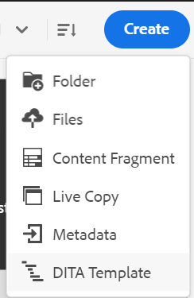
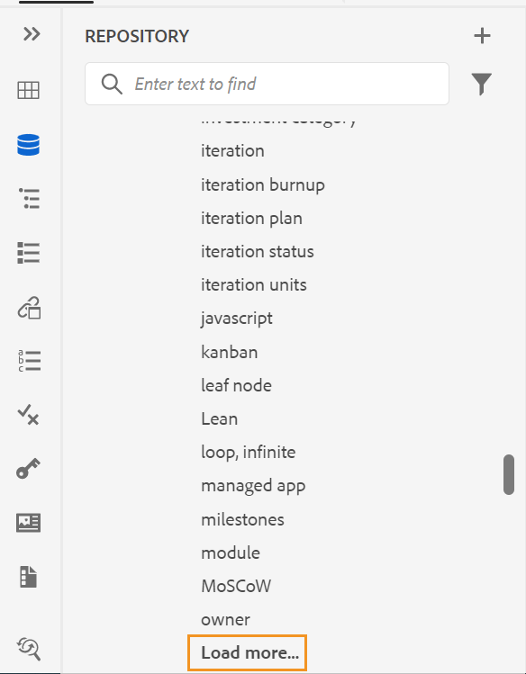
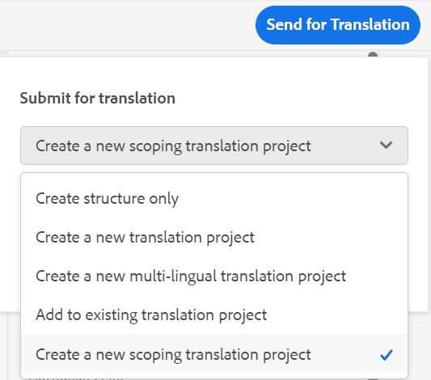
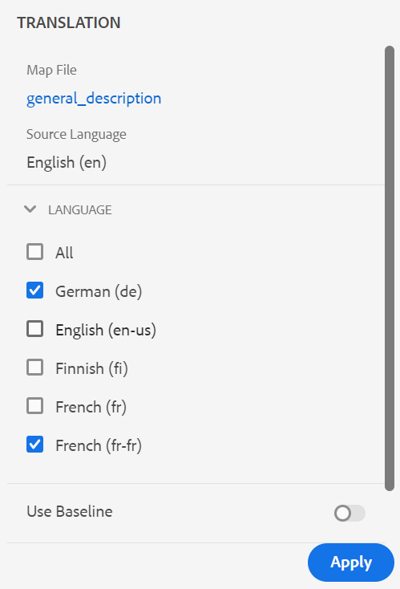

# Adobe Experience Manager Guides as a Cloud Serviceの5月リリース

## 5月リリースへのアップグレード

次の手順を実行して、現在のAdobe Experience Manager Guides as a Cloud Service（後で&#x200B;*AEM Guides as a Cloud Service*&#x200B;と呼ばれます）の設定をアップグレードします。
1. Cloud ServicesのGit コードを確認し、アップグレードする環境に対応するCloud Services パイプラインで設定されたブランチに切り替えます。
1. Cloud Services Git コードの`/dox/dox.installer/pom.xml` ファイルの`<dox.version>` プロパティを2022.5.144に更新します。
1. 変更を確定し、Cloud Services パイプラインを実行して、AEM Guides as a Cloud Serviceの5月リリースにアップグレードします。

## 互換性マトリックス

この節では、AEM Guides as a Cloud Service 2022年5月リリースでサポートされるソフトウェアアプリケーションの互換性マトリックスを示します。

### FrameMakerとFrameMaker Publishing Server

| FMPS | FrameMaker |
| --- | --- |
| 互換性がありません | 2020年アップデート 4以降 |
| | |

* AEMで作成されたベースラインと条件は、2020.2以降のFMPS リリースでサポートされています。

### Oxygen コネクタ

| AEM Guides as a Cloud リリース | Oxygen コネクタウィンドウ | Oxygen Connector Mac |
| --- | --- | --- |
| 2022.5.0 | 2.6.9 | 2.6.9 |
|  |  |  |

## 新機能と機能強化

AEM Guides as a Cloud Serviceには、5月リリースの多くの機能強化と新機能が用意されています。

### 拡張Web エディター

* **カスタマイズされたテンプレートに基づいてマップを作成**

これで、カスタマイズされたマップテンプレートを作成する強力な機能が手に入りました。 それらを使用して、マップテンプレートで参照されるトピックテンプレートやマップテンプレートと共にDITA マップを作成できます。

また、カスタマイズされたマップテンプレートから、他のマップテンプレートやトピックテンプレートを参照することもできます。 参照されるマップテンプレートは、様々なマップテンプレート、トピックテンプレート、トピック、マップ、画像、ビデオ、その他のアセットを参照できます。

カスタマイズされたマップテンプレートを使用すると、マップテンプレートと参照フォルダー構造全体を簡単に複製できます。 これらのカスタマイズされたテンプレートは、再帰的な構造と参照を持つ複数のマップを作成および再作成するのに特に便利です。

* **キーワードを挿入**&#x200B;機能が改善されました。 キーワードがアルファベット順にリストされるため、挿入するキーワードをより簡単に見つけることができるようになりました。 検索ボックスに検索文字列を入力して、キーワードを検索することもできます。

* リポジトリビューファイルでは、ファイルは一括で読み込まれます。 一度に75個のファイルが読み込まれます。 このバッチ読み込みは効率的で、フォルダー内に存在するすべてのファイルを読み込むよりも、ファイルに迅速にアクセスできます。

* プレビュービューやオーサービューを含むがこれらに限定されないすべてのXML エディター画面に、埋め込みデータまたはリンクを含むSVG画像をレンダリングできます。

* デフォルトのXSD/DTDを最新バージョンに更新できます

### 翻訳プロセスの改善

* **スコープ翻訳プロジェクトを作成する機能**
翻訳するプロジェクトのスコープのみを作成する必要がある場合は、**新しいスコープ翻訳プロジェクトを作成**&#x200B;を選択できます。 これにより、翻訳用のコピーは送信されず、ファイルの元の翻訳ステータスが維持されます。

* 翻訳ジョブ内の1つ以上のトピックの翻訳を却下すると、却下されたすべてのトピックの「進行中」翻訳ステータスが元のステータスに戻ります。

* **言語** リストには、言語フォルダーと言語コードが表示されます。 例えば、フランス語（fr）とドイツ語（de）です。

* 翻訳機能では、国と言語の両方を含む言語コードもサポートされるようになりました。 `fr-fr`、`en-us` などです。

* 言語フォルダーの外部にあるDITA マップを読み込むと、バックエンドに例外は記録されません。

翻訳の詳細については、「Adobe Experience Manager Guides as a Cloud Serviceの使用」の「*Web エディターからのドキュメントの翻訳*」セクションを参照してください。

### 公開機能の強化

* マップダッシュボードから出力を生成する際に、「出力」タブから「**公開ダッシュボード**」にアクセスすることもできます。 アクティブなすべての公開タスクのリストは、公開ダッシュボードで使用できます。

* マップダッシュボードから、複数のDITAVAL ファイルを選択して、コンディショナライズされたコンテンツを生成できます。 ファイルを追加または削除することで、ファイルの順序を維持できます。 ファイル名にカーソルを合わせると、ファイルが保存されているAEM リポジトリ内のパスを確認できます。

* **非推奨の機能**
AEM as a Cloud Serviceでは、FrameMaker ドキュメントのDITA出力フォーマットの生成がサポートされなくなりました。 このDITA オプションは、マップダッシュボードの出力プリセットからも削除されました。

### 記事ベースの公開機能の向上

XML エディターでは、Salesforce プロファイルへの公開時に、複数の商品カテゴリを記事にマッピングできます。

### その他の機能強化

* プレビューモードは、DITAの`deliveryTarget`条件付き処理属性もサポートしています。 これは、**audience**、**platform**、**product**、props、**otherprops**&#x200B;と共にドロップダウンフィルターのオプションとして使用できます。
* OxygenのAEM サーバーとローカルシステム間で強制的に同期するオプションが提供されています。

## 修正された問題

様々な領域で修正されたバグを以下に示します。

* Web エディターのレビューパネルで、ユーザーはレビューコメントに返信できません。 (9667)
* 「オプション」メニューで空白のフォルダーを更新した後、空白のフォルダーをクリックすると、アプリケーションが空白になります。 (9639)
* チェックインしたファイルを&#x200B;**保存して**&#x200B;閉じるときに、新しいバージョンが作成されます。 (9638)
* 「**新しいバージョンとして保存**」チェックボックスが有効になっている場合、閉じるボタンは表示されません。 (9637)
* 最初に各章に対して個別のPDFを使用して公開され、次に1つのPDF ファイルを使用する場合、正しいPDFは公開されません（個別のPDF ファイルを作成するチェックはオフになっています）。 (9632)
* マップダッシュボードで、管理者以外のユーザーのメタデータの問題が発生しています。 (9620)
* ベースラインを作成すると、サーバーに複数のファイルがある場合、UIでステータスが「失敗」に設定されます（ステータス呼び出しが失敗する）。10000のファイルは失敗します。 (9608)
* プロパティに大きなデータを保存すると、分割された公開ワークフローが失敗し、公開エラーが発生します。 (9586)
* コンディショナル属性フィルターの状態は、プレビューをSourceに切り替えた際や、再度プレビューモードに切り替えた際には保持されません。 (9553)
* `mainbooktitle` タグを介して名前が指定されていない場合、リポジトリビューでブックマップ名が空白になります。 (9538)
* Oxygenを使用してアップロードされたファイルを開く際にHTTP 400 エラーが発生します。 (9535)
* 以前に開いたマップのプリセットは、プリセットが定義されていないマップを開いても、「出力」タブに表示されたままになります。 (9523)
* アウトラインパネルで、タグと属性の検索機能が機能しない。 (9506)
* 新しく作成されたコレクションは、ブラウザーがブラウザーで更新されるまで表示されません。 (9505)
* 条件付き属性ラベル（値ではなく）は、「すべてのpropを追加」オプションを使用してすべての条件を追加すると、ソースモードで表示されます。 (9501)
* 任意のバージョンに戻すと、ファイルは自動的にチェックアウトされます。 (9482)
* ファイルのバージョンを元に戻すと、Assets UIにタイムスタンプの違いが正しく表示されない。 (9480)
* DITA マップのtopicref エレメントにアイテムを挿入すると、検索結果から複数のアイテムが追加されます。 (9474)
* 「**アップロードされたファイルの新しいバージョンを作成**」の設定がオンの場合、フリーズしたノードを元に戻して保存すると、新しいバージョンが作成されます。 (9473)
* キー参照を定義する際に表示テキストが追加されない場合、リンク URLの変更時にキー参照とコンテンツのキー参照の表示テキストは維持されません。 (9458)
* バージョン履歴では、現在のバージョンのバージョン番号とラベルは表示されません。 (9446)
* 特定のコンテンツファイルをエディターで開くと、エディターがフリーズする。 (9443)
* リポジトリーパネルとtopicrefの参照ダイアログで検索すると、コンテンツが大きいときに画面がフリーズします。 (9432)
* AEM サイト出力に渡されたメタデータは、コンテンツのベースラインを尊重しません。 (9416)
* Oxygenは、AEMでバージョンが復元された後、トピックの誤ったバージョンをチェックアウトします。 (9411)
* 失敗したベースラインは、マップダッシュボードの「プリセット」タブでの編集を無効にします。 (9403)
* 新しいコンテンツの作成時にエラーが常にログに記録されます。 (9388)
* 新しく作成されたDITA アセットは、常に別のユーザーがチェックアウトします。 (9387)
* topicrefをglossrefに変換する際に、エレメント名の変更が正しく機能しない。 (9380)
* バージョン ラベルは、**新しいバージョンとして保存** ダイアログのドロップダウンとして表示されません。 (9379)
* **差分を表示** ドロップダウンから異なるバージョンを切り替えると、条件が適用されません。 (9366)
* プレビューフィルターを使用すると、複数の問題が発生します。 (9365)
* topicrefにDITA以外のアセットとDITAVAL アセットを挿入できません。 (9363)
* 承認済みの翻訳は、ターゲット言語コードに`fr_ca`のような5文字が含まれている場合、ターゲット言語に統合されません。 (9357)
* **詳細オプション** メニューから&#x200B;**フォルダー内のファイルを検索**&#x200B;してファイルを検索できず、アプリが応答しなくなります。 (9337)
* 多数のキーが存在する場合、参照ダイアログがハングする。 (9332)
* 記事ベースの公開中にDITAVAL ファイルが機能しない。 (9330)
* AEM サイト出力の脚注の順序が正しくありません。 (9327)
* 選択パスが変更された場合、検索は自動的には実行されません。 (9323)
* 翻訳が完了すると、翻訳済みアセットの追加バージョンが作成されます。 (9310)
* フォルダープロファイルの管理者ユーザーを削除できません。 (9306)
* コンテンツキー参照から更新されたルートマップは、ページが更新されるまで設定されません。 (9302)
* OxygenでWeb認証が機能しない。 (9296)
* エンコードされた文字を含むWeb リンクが正しく動作しません。 (9227)
* Oxygenで開いたときにファイルがチェックアウトされない。 (9217)
* OxygenでWeb認証を使用してログに記録する際に、チェックアウトしたファイルを更新できません。 (9179)
* 「翻訳」タブと「ベースライン」タブは、マップダッシュボードにしばらく表示されます。 (9146)
* フォルダープロファイルの再読み込み時にエクスペリエンスまたは機能の問題が発生する。 (9103)
* ページレイアウトエディターを削除しても、作成者ビューの中央パネルからは閉じません。 (9087)
* Web エディターで、画像を削除してから新しいバージョンのドキュメントを保存すると、検証エラーが発生します。 (8985)
* 用語集パネルのすべての`glossrefs`を表示できません（コンテンツ固有）。 (8886)
* テキストのない`xref`は、記事ベースの公開出力に表示されません。 (8764)
* 参照は、ファイル名にスペースを含むムービングイメージまたはマルチメディアファイルで無効になります。 (8624)
* `Select All`を選択し、マルチメディアファイルまたはDITA コンテンツを別のフォルダーに移動すると、参照が無効になります。 (8622)
* 「待機中」または「実行中」などのステータスを持つ出力ジョブは、公開ダッシュボードでクリーンアップされません。  (8569)
* 残りの出力履歴ノードが多数ある場合、出力パージ機能が失敗します。 (8568)
* DITA アドオンパッケージは、DAMの重複アセット検出を防ぎます。 (8417)
* DITA以外のファイルに対してレビュータスクを作成ボタンを有効にします。 (8401)
* UIを使用してマップにsubjectrefを追加すると、参照を挿入ダイアログが開きます。 (8212)
* outputclass属性が`tgroup`要素に追加されたときに、各空白`entry`要素に予期しない領域が見つかりました。 (7532)
* アクションが完了すると、リポジトリパネルにチェックインまたはチェックアウト済みのファイルロックアイコンが表示されない。 (5817)
* ファイルがエディターからチェックインされている場合でも、リポジトリビューにロックアイコンが表示されます。  (5756)
* 「出力」タブのAEM プリセットにサイトがありません。 (9567)
* 一部のDITA ファイルを編集しようとすると、XML エディターがハングアップする。 (9537)
* XML エディターで検索を実行すると、ページがフリーズします。 (9452)
* コンテンツが他のフォルダーに移動された場合、ベースラインが機能しないマップをダウンロードします。 (9331)
* Oxygenで再アップロードが失敗する場合、ファイルが同じ場所にAEMに既に存在します。 (9328)
* 横向き表示でハイライト表示の位置が正しくありません。 (9305)
* OxygenからAEMへのドキュメントのチェックイン後、ドキュメント内の日本語コンテンツが疑問符に置き換えられます（???）。 (9276)
* OxygenからAEMへのファイルのアップロードに失敗します。 (9157)
* レビュータスクがインボックスで再割り当てされるときに、メール通知が送信されない。 (8376)

## 既知の問題

エディターを開くと、空白ページが断続的に表示されます。
