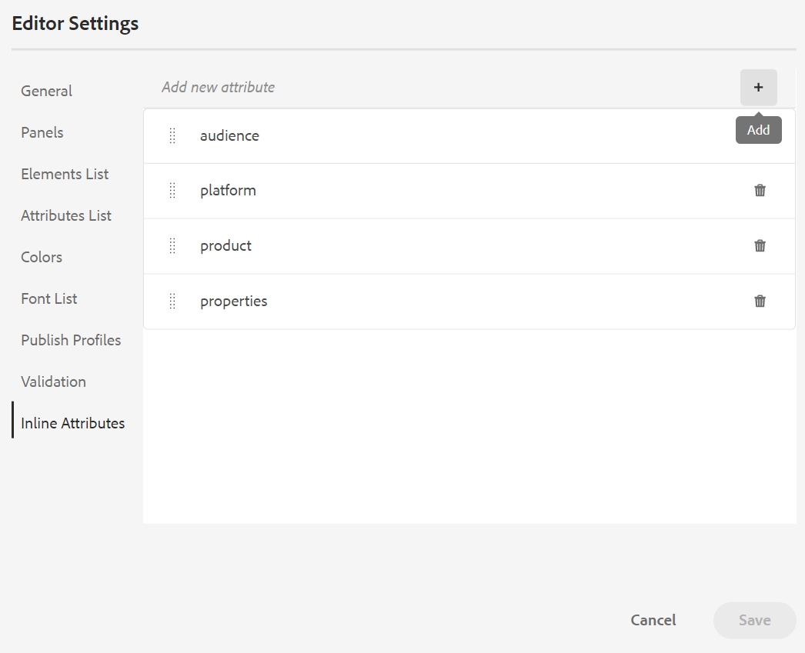

# Adobe Experience Manager Guidesas a Cloud Serviceの 8 月リリース

## 8 月のリリースへのアップグレード

次の手順を実行して、現在のAdobe Experience Manager Guidesのas a Cloud Service（後で *AEM Guidesのas a Cloud Service* と呼ばれます）のセットアップをアップグレードします。
1. Cloud Serviceの Git コードをチェックアウトし、アップグレードする環境に対応する、Cloud Serviceパイプラインで設定されたブランチに切り替えます。
1. Cloud Service`<dox.version>`Git コード `/dox/dox.installer/pom.xml` ファイルのプロパティを 2022.8.167 に更新します。
1. 変更内容をコミットし、Cloud Serviceパイプラインを実行して、8 月のリリースのAEM Guidesas a Cloud Serviceにアップグレードします。

## 互換性マトリックス

この節では、2022 年 8 月リリースのAEM Guidesas a Cloud Serviceでサポートされているソフトウェアアプリケーションの互換性マトリックスを示します。

### FrameMakerとFrameMaker Publishing Server

| FMPS | FrameMaker |
| --- | --- |
| 互換性がありません | 2020 年の更新 4 以降 |
| | |

*AEMで作成されたベースラインと条件は、2020.2 以降の FMPS リリースでサポートされます。

### 酸素コネクタ

| AEM Guides as a Cloud リリース | 酸素コネクタウィンドウ | 酸素コネクタMac |
| --- | --- | --- |
| 2022.8.0 | 2.7.5 | 2.7.5 |
|  |  |  |

## 新機能と機能強化

AEM Guidesのas a Cloud Serviceは、8 月のリリースで多くの機能強化と新機能を提供します。

### マップ エディタのレイアウト ビュー

これで、DITA マップの完全なレイアウトをマップエディタで表示できます。 編集用にマップを開くと、マップ エディタの **レイアウト** ビューが開きます。 このビューでは、マップ階層をツリービューで表示できます。また、マップ内のトピックを整理または構造化することもできます。

レイアウト ビューには、マップ内に存在するトピックに関する多くのタスクを実行するのに役立つ個別のツール バーが含まれています。
トピック参照、トピック グループ、キー定義をマップに挿入できます。 マップ内に存在するトピックを上下、左右に移動して再編成できます。 トピックをドラッグ&amp;ドロップして、マップ内で移動することもできます。 マップ エディタには、ファイルのロックまたはロック解除、バージョン履歴の確認、バージョン ラベル管理を行うためのアイコンもあります。

また、レイアウト ビューには、行番号の表示と非表示、チェック ボックスの表示と非表示、マップ内のトピックのファイル名またはタイトルの表示を切り替える **表示オプション** があります。

また、適用された条件付きフィルターに基づいてトピックを表示することもできます。

マップ ファイル内のトピックを整理する以外に、レイアウト ビューの要素で使用できる **オプション** メニューを使用して、参照を追加、移動、コピー、貼り付け、または削除することもできます。 また、トピックまたはマップを、リポジトリ・パネルからマップ・エディタで開いたマップにドラッグ・アンド・ドロップすることもできます。

右側のパネルには、マップ エディタのレイアウト ビューにコンテンツ プロパティとマップ プロパティが表示されます。 選択したトピックに対して定義されたインライン属性は、レイアウトビューのトピックに対して表示されます。 例えば、platform 属性が `IOS` として定義されているすべてのトピックをすばやく見つけることができます。

これで、トピックまたはマップのメタデータ情報を設定することもできます。 選択したトピックまたはマップのナビゲーション タイトル、リンク テキスト、簡単な説明、およびキーワードを定義できます。

詳しくは、「Adobe Experience Manager Guidesのas a Cloud Serviceの使用」の *レイアウトビュー* の節を参照してください。

### エディター設定のインライン属性

AEM Guidesでは、管理者が **エディター設定** から **インライン属性** を設定できるようになりました。 エディター設定の「**インライン属性**」タブで、新しいインライン属性を追加したり、既存の属性を削除したりすることもできます。
トピックに対して定義された設定済みインライン属性は、レイアウトビューのトピックに対して表示されます。

### リポジトリ表示での追加フィルター

リポジトリビューのフィルター検索がより強力になりました。 ファイルをフィルタリングし、AEM リポジトリで検索を絞り込むための 2 つの新しい検索条件 **Last Modified** と **Tags** が追加されました。
* **最終変更**：選択した日付より後、選択した日付より前に最終変更されたファイルを検索できます。 また、定義済みの条件を使用して、過去 2 時間、先週、先月、昨年に最終変更されたファイルを検索するオプションもあります。
* **タグ**：特定のタグが適用されているファイルを検索することもできます。 タグを入力するか、ドロップダウンリストから選択します。

## 修正された問題

様々な領域で修正されたバグを以下に示します。

* /core/article-publish/src/main/java/com/adobe/dxml/article/publish/util/DoxUtils.javaで非推奨の Lucene インデックスが使用されています（9291）。
* 更新された Node.js は、公開には使用されません。 （9835）
* **プロパティ** ページで行った変更に伴って、DITA トピックが自動的に更新されることはありません。 （8745）
* DITA ブックマップに追加した前線要素が正しく機能しない。 （9507）
* ネイティブPDF |空のPDFが選択されていると、複数のファイルに対して **クイック生成** を使用したときに空白の要素が生成される。 （9822）
* ネイティブPDF |付録は、PDF出力のチャプターとして公開されます。 （9829）
* ネイティブPDF | SVG画像が編集されても、ページレイアウトに更新されて表示されない。 （9069）
* **特殊文字の挿入** ダイアログを使用して `Nonbreaking Hyphen` 文字を挿入すると、通常のハイフン文字が挿入されます。 （8919）
* XML エディターが編集されている場合、トピック内に更新された画像が表示されない。 （9500）
* エディターを使用して出力を公開している間は、「**出力**」タブからプリセットを削除することはできません。 （9100）
* 省略記号メニューの「**すべてを選択**」オプションを使用しても、DITA マップのサブマップはチェックアウトされません。 （9814）
* **テンプレート** メニューから Web エディターのカスタムマップテンプレートにマップまたはトピックテンプレートをドラッグ&amp;ドロップできない。 （9846）
* マップまたはトピック テンプレートのサブフォルダに新しいトピックまたはマップ テンプレートを作成できません。 （9888）
* マップまたはトピック テンプレートのサブフォルダ内にあるトピックまたはマップを参照するオプションはありません。 （9889）
* Schematron ファイルを更新して DITA ファイルと共に保存すると、右側のパネルは表示されません（DITA ファイルが Schematron ファイルに存在する検証を中断した場合）。 （9986）
* 名前が既存のプリセットと同じ場合は、新しい重複した出力プリセットを作成できます。 （9997）
* SVG画像が破損し、HTML出力の生成時に正しく公開されません。 （9949）

## 既知の問題

Adobeでは、2022 年 8 月のAEM Guidesas a Cloud Serviceリリースについて、次の既知の問題を特定しました。

### 回避策に関する既知の問題

次の既知の問題に対して、指定された回避策を使用します。

* マップ エディタにレイアウト ビューが表示されません。

  **回避策**：フォルダープロファイルの ui_config.json を更新します。

* Symbols.json は問題 8919 が発生するようにオーバーライドされます。

  **回避策**：更新された symbols.json は、上書きされた symbols.json と結合する必要があります。

### その他の既知の問題

* リポジトリで検索を実行するときに表示される「結果」セクションから複数のファイルを選択して、オーサービューにドラッグ&amp;ドロップした場合、追加されるファイルは 1 つだけです。
