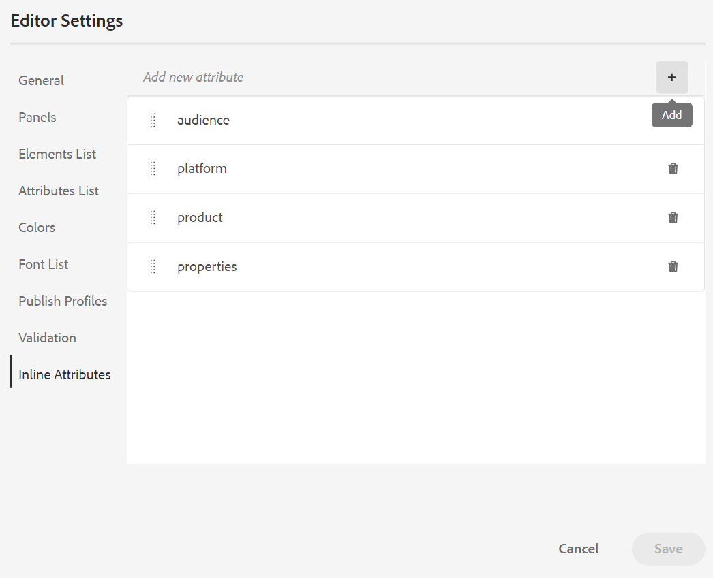

# Adobe Experience Manager Guides as a Cloud Serviceの8月リリース

## 8月リリースへのアップグレード

次の手順を実行して、現在のAdobe Experience Manager Guides as a Cloud Service（後で&#x200B;*AEM Guides as a Cloud Service*&#x200B;と呼ばれます）の設定をアップグレードします。
1. Cloud ServicesのGit コードを確認し、アップグレードする環境に対応するCloud Services パイプラインで設定されたブランチに切り替えます。
1. Cloud Services Git コードの`/dox/dox.installer/pom.xml` ファイルの`<dox.version>` プロパティを2022.8.167に更新します。
1. 変更を確定し、Cloud Services パイプラインを実行して、AEM Guides as a Cloud Serviceの8月リリースにアップグレードします。

## 互換性マトリックス

この節では、AEM Guides as a Cloud Service 2022年8月リリースでサポートされるソフトウェアアプリケーションの互換性マトリックスを示します。

### FrameMakerとFrameMaker Publishing Server

| FMPS | FrameMaker |
| --- | --- |
| 互換性がありません | 2020年アップデート 4以降 |
| | |

* AEMで作成されたベースラインと条件は、2020.2以降のFMPS リリースでサポートされています。

### Oxygen コネクタ

| AEM Guides as a Cloud リリース | Oxygen コネクタウィンドウ | Oxygen Connector Mac |
| --- | --- | --- |
| 2022.8.0 | 2.7.5 | 2.7.5 |
|  |  |  |

## 新機能と機能強化

AEM Guides as a Cloud Serviceには、8月リリースで多くの機能強化と新機能が用意されています。

### マップエディターでのレイアウトビュー

これで、マップエディターでDITA マップの完全なレイアウトを表示できるようになります。 編集のためにマップを開くと、マップエディターの&#x200B;**レイアウト** ビューが開きます。 このビューでは、マップ階層をツリービューで表示したり、マップ内のトピックを整理または構造化したりできます。

レイアウトビューには、マップ内のトピックに関する多くのタスクを実行するのに役立つ別のツールバーが含まれています。
マップには、トピック参照、トピックグループ、キー定義を挿入できます。 マップ内に存在するトピックを上、下、左、または右に移動して、整理を変更できます。 トピックをドラッグ&amp;ドロップして、マップ内に移動することもできます。 マップエディターには、ファイルのロックまたはロック解除、バージョン履歴の確認、バージョンラベル管理を行うためのアイコンも用意されています。

レイアウトビューには、行番号の表示と非表示、チェックボックスの表示と非表示、またはマップ内のトピックのファイル名またはタイトルを表示するための&#x200B;**表示オプション**&#x200B;も用意されています。

また、トピックに適用された条件付きフィルターに基づいてトピックを表示することもできます。

マップファイル内のトピックを整理するだけでなく、レイアウトビューのエレメントで使用可能な&#x200B;**オプション** メニューを使用して、参照を追加、移動、コピー、貼り付け、削除することもできます。 リポジトリーパネルから、マップエディターで開いたマップにトピックまたはマップをドラッグ&amp;ドロップすることもできます。

右側のパネルには、マップエディターのレイアウトビューにコンテンツプロパティとマッププロパティが表示されます。 選択したトピックに対して定義されたインライン属性が、レイアウトビューのトピックに対して表示されます。 例えば、platform属性が`IOS`として定義されているすべてのトピックをすばやく検索できます。

トピックやマップのメタデータ情報も設定できます。 選択したトピックまたはマップのナビゲーションタイトル、リンクテキスト、短い説明、キーワードを定義できます。

詳しくは、「Adobe Experience Manager Guides as a Cloud Serviceの使用」の「*レイアウトビュー*」セクションを参照してください。

### エディター設定のインライン属性

AEM Guidesでは、管理者が&#x200B;**Editor Settings**&#x200B;から&#x200B;**インライン属性**&#x200B;を設定できるようになりました。 新しいインライン属性を追加したり、既存のインライン属性をエディター設定の「**インライン属性**」タブから削除したりすることもできます。
トピックに対して定義された設定されたインライン属性は、レイアウトビューでそのトピックに対して表示されます。

### リポジトリビューでの追加フィルター

これで、リポジトリビューでのフィルター検索がより強力になりました。 2つの新しい検索条件（**最終更新日**&#x200B;および&#x200B;**タグ**）が追加され、ファイルがフィルタリングされ、AEM リポジトリでの検索が絞り込まれます。
* **最終更新日**：選択した日付より後で、選択した日付より前に最終更新日が設定されているファイルを検索できます。 また、事前に定義された基準を使用して、過去2時間、先週、先月、または昨年に最後に変更されたファイルを探すオプションもあります。
* **タグ**：特定のタグが適用されているファイルを探すこともできます。 タグを入力するか、ドロップダウンリストから選択します。

## 修正された問題

様々な領域で修正されたバグを以下に示します。

* 非推奨のLucene インデックスは/core/article-publish/src/main/java/com/adobe/dxml/article/publish/util/DoxUtils.java （9291）で使用されています
* 更新されたNode.jsは公開に使用されません。 (9835)
* DITA トピックは、**プロパティ** ページで行われた変更で自動的に更新されません。 (8745)
* DITA ブックマップに追加すると、Frontmatter エレメントが正しく機能しない。 (9507)
* ネイティブ PDF |空のエレメントを選択すると、複数のファイルに対して&#x200B;**クイック生成**&#x200B;を使用して、空のPDFが生成されます。 (9822)
* ネイティブ PDF |付録は、PDF出力の章として公開されます。 (9829)
* ネイティブ PDF | SVGの画像を編集しても、ページレイアウトで更新された画像は表示されません。 (9069)
* **特殊文字を挿入** ダイアログを使用して`Nonbreaking Hyphen`文字を挿入すると、通常のハイフン文字が挿入されます。 (8919)
* XML エディターでは、トピックが編集されている場合、更新された画像は表示されません。 (9500)
* エディターを介して出力を公開する際に、プリセットを&#x200B;**出力** タブから削除することはできません。 (9100)
* DITA マップのサブマップは、省略記号メニューの「**すべてを選択**」オプションを使用してチェックアウトされません。 (9814)
* マップまたはトピックテンプレートを&#x200B;**テンプレート** メニューからWeb エディターのカスタムマップテンプレートにドラッグ&amp;ドロップできません。 (9846)
* マップまたはトピックテンプレートのサブフォルダーに新しいトピックまたはマップテンプレートを作成できません。 (9888)
* マップまたはトピックテンプレートのサブフォルダー内にあるトピックまたはマップを参照するオプションはありません。 (9889)
* Schematron ファイルが更新され、DITA ファイルとともに保存されると、右側のパネルは表示されません（DITA ファイルがSchematron ファイルに存在する検証を壊す場合）。 (9986)
* 名前が既存のプリセットと同じ場合は、新しい重複した出力プリセットを作成できます。 (9997)
* HTML出力の生成時にSVG画像が破損し、正しく公開されません。 (9949)

## 既知の問題

Adobeでは、AEM Guides as a Cloud Service 2022年8月リリースの既知の問題を次のように特定しました。

### 回避策の既知の問題

次の既知の問題に対して、指定された回避策を使用します。

* レイアウトビューは、マップエディターには表示されません。

  **回避策**: フォルダープロファイルのui_config.jsonを更新します。

* Symbols.jsonがオーバーライドされるので、問題8919が発生します。

  **回避策**：更新されたsymbols.jsonを上書きされたsymbols.jsonと結合する必要があります。

### その他の既知の問題

* リポジトリで検索を実行する際に表示される結果セクションから複数のファイルを選択し、オーサービューでドラッグ&amp;ドロップすると、1つのファイルのみが追加されます。
