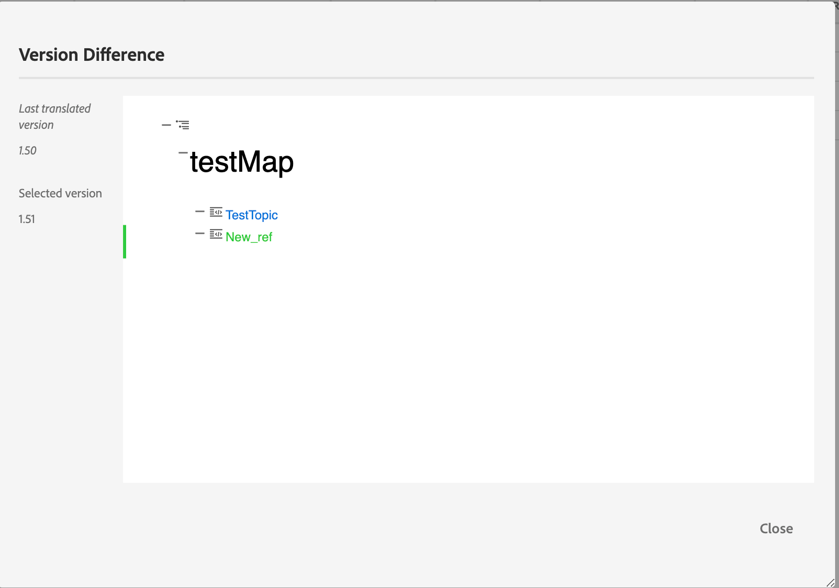

# Adobe Experience Manager Guides as a Cloud Serviceの 9 月リリース

## 9 月リリースへのアップグレード

次の手順を実行して、現在のAdobe Experience Manager Guides as a Cloud Service（後の *AEM Guides as a Cloud Service*）のセットアップをアップグレードします。
1. Cloud Services の Git コードをチェックアウトし、アップグレードする環境に対応する、Cloud Services パイプラインで設定されたブランチに切り替えます。
1. Cloud Services Git コ `<dox.version>` ド `/dox/dox.installer/pom.xml` ファイルのプロパティを 2022.9.178 に更新します。
1. 変更内容をコミットし、Cloud Services パイプラインを実行して、9 月リリースのAEM Guides as a Cloud Serviceにアップグレードします。

## 既存のコンテンツのインデックス作成手順

既存のコンテンツのインデックスを作成し、新しい検索と置換のテキストをマップレベルで使用するには、次の手順を実行します。
* （正しい認証で） サーバーへの POST リクエストを実行します – `http://<server:port>/bin/guides/map-find/indexin`。
（オプション：マップの特定のパスを渡してインデックスを作成できます。デフォルトでは、すべてのマップにインデックスが作成されます ||例：   `https://<Server:port>/bin/guides/map-find/indexing?paths=<map_path_in_repository>`）
* API は jobId を返します。 ジョブのステータスを確認するには、同じエンドポイント `http://<server:port>/bin/guides/map-find/indexing?jobId={jobId}` にジョブ ID を含むGET リクエストを送信します。
（例：`http://<_localhost:8080_>/bin/guides/map-find/indexing?jobId=2022/9/15/7/27/7dfa1271-981e-4617-b5a4-c18379f11c42_678)`
* ジョブが完了すると、上記のGET リクエストが成功を返し、失敗したマップがあるかどうかを示します。 正常にインデックス化されたマップは、サーバ ログから確認できます。

## 互換性マトリックス

この節では、2022 年 9 月リリースのAEM Guides as a Cloud Serviceでサポートされるソフトウェアアプリケーションの互換性マトリックスを示します。

### FrameMakerとFrameMaker Publishing Server

| FMPS | FrameMaker |
| --- | --- |
| 互換性がありません | 2020 年の更新 4 以降 |
| | |

*AEMで作成されたベースラインと条件は、2020.2 以降の FMPS リリースでサポートされます。

### 酸素コネクタ

| AEM Guides as a Cloud リリース | 酸素コネクタウィンドウ | 酸素コネクタMac | 酸素ウィンドウで編集 | Oxygen Macで編集 |
| --- | --- | --- | --- | --- |
| 2022.9.0 | 2.7.13 | 2.7.13 | 2.3 | 2.3 |
|  |  |  |  |  |

## 新機能と機能強化

AEM Guides as a Cloud Serviceは、9 月のリリースで多くの機能強化と新機能を提供します。

### ラベルに基づく動的ベースラインの作成

AEM Guidesには、ラベルに基づいて動的なベースラインを作成する機能が用意されるようになりました。 ベースラインの生成、ベースラインのダウンロード、またはベースラインを使用した翻訳プロジェクトの作成を行うと、更新されたラベルに基づいてファイルが動的に選択されます。 この機能は、ラベルを更新するときにベースラインを変更する必要がないので便利です。
ベースラインのスナップショットを CSV として書き出すこともできます。

### マップ レベルでテキストを検索して置換します

特定のテキストを含むマップ内のファイルを検索できるようになりました。 検索されたテキストは、ファイル内でハイライト表示されます。 検索した単語や語句を、ファイル内の別の単語や語句に置き換えることもできます。
**置換** アイコンを選択して現在のオカレンスを置き換え、**ファイル内のすべてを置換** アイコンを選択して、選択したファイル内のすべてのオカレンスを置き換えます。

デフォルトでは、オプション **置換前にファイルをチェックアウト** および **置換後に新しいバージョンを作成** が選択されているため、テキストを置換する前にファイルがチェックアウトされ、テキストを置換すると新しいバージョンが作成されます。

### 翻訳ダッシュボードから非同期ファイルのバージョンの違いを表示

トピックの 2 つのバージョン間で行われた変更に基づいて **非同期** ファイルを翻訳するように選択できるようになりました。\

翻訳ダッシュボードから、選択したファイルの最新の翻訳バージョンと現在のバージョンの違いを簡単に確認できます。

その違いに基づいて、トピックを翻訳するかどうかを決定できます。

### PDF プリセットで使用可能なメタデータ UI

メタデータは、DITA マップの出力プリセットから設定できます。 タイトル、作成者、件名、キーワードのメタデータを設定できます。 このメタデータは、出力PDFのファイルプロパティのメタデータにマッピングされます。
このメタデータは、ブックレベルで定義されたメタデータを上書きします。 メタデータは各出力プリセットで明確に定義し、出力PDFに渡すことができます。

## 修正された問題

様々な領域で修正されたバグを以下に示します。

* Web エディター | トピック内の要素を移動すると、要素に割り当てられた ID が、自動的に割り当てられた ID で上書きされます。 （7895）
* 変更の追跡 | Enter キーを使用して新しい要素を入力すると、コンテンツが失われます。 （10246）
* dita-templates でメインマップを参照しているサブマップが作成されない。 （10231）
* XML エディター | コピーと貼り付けは、オーサーモードでは機能しません。 （10309）
* 複数のバージョンラベルを一度選択すると、選択が解除されない。 （9561）
* サイトの参照ダイアログのパスへの自動ナビゲーションが、ファイルの参照のように機能しない。 （9920）
* **オーサー** モードから **Source** モードに切り替えても、アウトラインパネルにコンテンツが表示されない。 （10319）
* トピックテンプレートのコンテンツを使用して作成された新しいトピックの Conref が機能しない。 コピーされたハッシュ ID は、コンテンツのコピーでは更新されません。 （9890）
* Web エディター | マップテンプレートからマップを作成している間、ローダーは存在しません。 （9891）
* 新しいマップ エディタ | **オーサー** ビューから **レイアウト** ビューに切り替えた場合、マップのタイトルに太字や斜体のテキストが追加されなくなりました。 （10218）
* 新しいマップ エディタ |参照に適用された条件は、レイアウトビューから削除できません。 （10213）
* 新しいマップ エディタ |条件参照の適用が、オーサービューのようなレイアウトビューでは機能しません。 （10198）
* 新しいマップ エディタ | コンテキストメニューから「左に移動」を選択すると、参照が左に移動できない場合は削除されます。 （10219）
* 新しいマップ エディタ |レイアウト ビューを使用して作成されたマップ内の参照に対して、アイコンが正しく表示されません。 （10197）
* リポジトリーパネル | リポジトリパネル内を右クリックすると、アプリケーションエラーが発生する。 （10123）
* 検索と置換 | Web エディターでダークモードを使用して検索結果を読み取ることができない。 （9978）
* 翻訳 | メタデータとタグは、翻訳済みコピーには反映されません。 （4696）
* オーサーモードでコンテンツをコピーして貼り付けると（ctrl+c/ctrl+v） エラーがスローされる。 （10304）
* PDFテンプレート |背景画像を任意のページレイアウトに追加すると、画像のパスが絶対パスで表示され、画像は出力PDFに表示されません。 （10297）
* ネイティブ PDF |章のタイトルと章の見出しがPDFのパブリッシングで機能しない。 （9947）
* ネイティブ PDF | コンセプトの `xref` は、特定の DITA トピックに対して正しく解決されません。 （10229）
* ネイティブ PDF |生成されたPDF出力でテーブルのキャプションテキストを表示できない。 （9827）
* ネイティブ PDF |付録の参照は、PDF出力では付録として表示されません。 （10182）
* ネイティブ PDF | テーブルの Frame 属性は、（クラスとして）一時HTMLに適用されません。 （10353）
* ネイティブ PDF | temp HTML ファイルは、ソース DITA の値が 0 であっても、td と th に colsep クラスと rowsep クラスを追加します。 （10352）
* ネイティブ PDF | ページレイアウトに追加された critdate のメタデータが無視されます。 （10377）
* ネイティブ PDF |特定のコンテンツに対するPDFの生成が失敗します。 （9927）
* ネイティブ PDF | conkeyref を使用したコンテンツがPDF出力に表示されません。 （9836）
* ネイティブ PDF |画像または外部リンクを含む Keydefs のキー参照が解決されていません。 （10063）
* マップのオーサービューで、テーブルリストと figurelist のプレースホルダーテキストが表示されない。 （10330）
* 新しいベースラインを作成する場合、既に選択されているベースラインフィルターは適用されません。 （9954）
* 親フォルダー名にスペース文字が含まれている場合、ビデオファイルがベースラインに表示されません。 10031）
* ベースラインの作成で、ユーザーのタイムゾーンがサーバーのタイムゾーンと異なる場合、最新バージョンが選択されません。 （10190）
* AEM 6.5.12 にAEM Guides 4.1 をインストールした後、Control + F ショートカットを使用して、Assets コンソールでブラウザー検索モーダルが開かない。 （10189）

## 既知の問題

Adobeでは、AEM Guides as a Cloud Service 2022 年 9 月リリースの次の既知の問題を特定しました。

* 動的ベースラインは、ナレッジベースのパブリッシングとは統合されていません。

* 翻訳 | ターゲットコンテンツが変更されたので、ソースコンテンツに対してバージョン差異アイコンが表示される。
