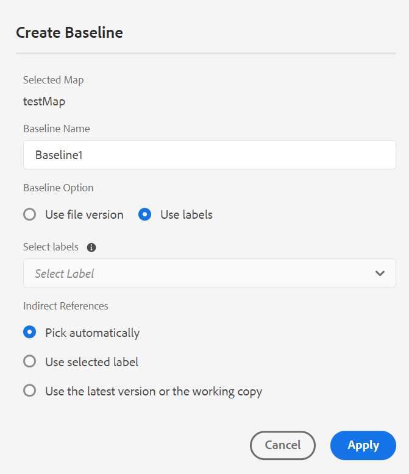
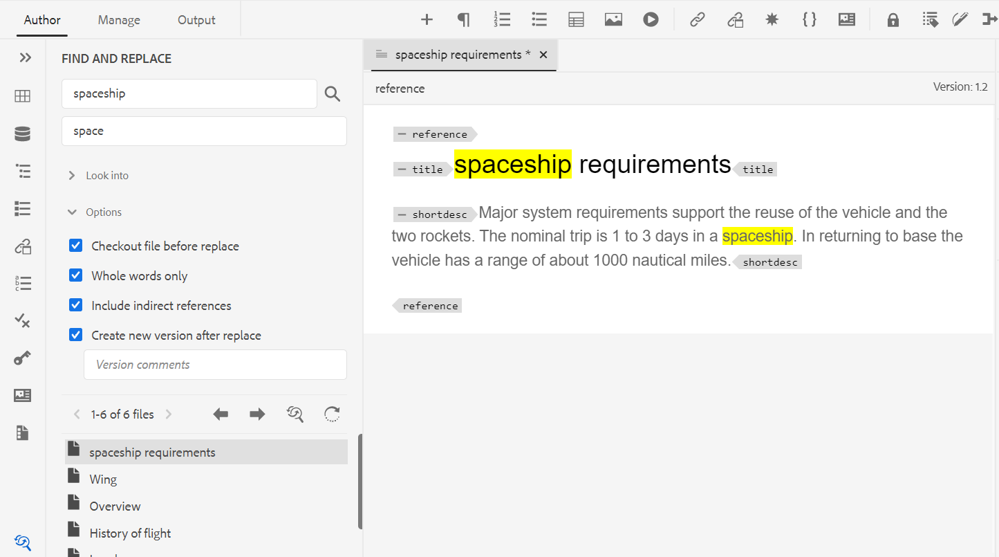

# Adobe Experience Manager Guides as a Cloud Serviceの9月リリース

## 9月リリースへのアップグレード

次の手順を実行して、現在のAdobe Experience Manager Guides as a Cloud Service（後で&#x200B;*AEM Guides as a Cloud Service*&#x200B;と呼ばれます）の設定をアップグレードします。
1. Cloud ServicesのGit コードを確認し、アップグレードする環境に対応するCloud Services パイプラインで設定されたブランチに切り替えます。
1. Cloud Services Git コードの`/dox/dox.installer/pom.xml` ファイルの`<dox.version>` プロパティを2022.9.178に更新します。
1. 変更を確定し、Cloud Services パイプラインを実行して、AEM Guides as a Cloud Serviceの9月リリースにアップグレードします。

## 既存のコンテンツをインデックス化する手順

既存のコンテンツのインデックスを作成するには、次の手順を実行し、マップレベルで新しい検索と置換のテキストを使用します。
* サーバーへのPOST リクエストを実行します（正しい認証を使用） - `http://<server:port>/bin/guides/map-find/indexin`。
（オプション：マップの特定のパスを渡してインデックスを作成できます。デフォルトでは、すべてのマップにインデックスが付けられます||例：`https://<Server:port>/bin/guides/map-find/indexing?paths=<map_path_in_repository>`）
* APIはjobIdを返します。 ジョブのステータスを確認するには、ジョブ IDを持つGET リクエストを同じエンドポイントに送信できます。 `http://<server:port>/bin/guides/map-find/indexing?jobId={jobId}`
（例：`http://<_localhost:8080_>/bin/guides/map-find/indexing?jobId=2022/9/15/7/27/7dfa1271-981e-4617-b5a4-c18379f11c42_678)`
* ジョブが完了すると、上記のGET リクエストは成功して応答し、マップが失敗した場合に言及します。 正常にインデックス化されたマップは、サーバーログから確認できます。

## 互換性マトリックス

この節では、AEM Guides as a Cloud Service 2022年9月リリースでサポートされるソフトウェアアプリケーションの互換性マトリックスを示します。

### FrameMakerとFrameMaker Publishing Server

| FMPS | FrameMaker |
| --- | --- |
| 互換性がありません | 2020年アップデート 4以降 |
| | |

* AEMで作成されたベースラインと条件は、2020.2以降のFMPS リリースでサポートされています。

### Oxygen コネクタ

| AEM Guides as a Cloud リリース | Oxygen コネクタウィンドウ | Oxygen Connector Mac | Oxygen ウィンドウで編集 | Oxygen Macで編集 |
| --- | --- | --- | --- | --- |
| 2022.9.0 | 2.7.13 | 2.7.13 | 2.3 | 2.3 |
|  |  |  |  |  |

## 新機能と機能強化

AEM Guides as a Cloud Serviceには、9月リリースで多くの機能強化と新機能が用意されています。

### ラベルに基づく動的ベースラインの作成

AEM Guidesでは、ラベルにもとづいて動的なベースラインを作成する機能が提供されています。 ベースラインを生成する、ベースラインをダウンロードする、ベースラインを使用して翻訳プロジェクトを作成する場合、更新されたラベルに基づいてファイルが動的に選択されます。 この機能は、ラベルを更新する際にベースラインを変更する必要がないので便利です。
ベースラインのスナップショットをCSVとしてエクスポートすることもできます。

### マップレベルでのテキストの検索と置換

特定のテキストを含むマップ内のファイルを検索できるようになりました。 検索したテキストがファイル内でハイライト表示されます。 検索した単語またはフレーズを、ファイル内の別の単語またはフレーズに置き換えることもできます。
「**置換**」アイコンを選択して現在のオカレンスを置換し、「**ファイル内のすべてを置換**」アイコンを選択して、選択したファイル内のすべてのオカレンスを置換します。

デフォルトでは、「**置換前にファイルをチェックアウトする**」オプションと「**置換後に新しいバージョンを作成する**」オプションが選択されているため、テキストを置き換える前にファイルをチェックアウトし、テキストを置き換えた後に新しいバージョンを作成します。

### 翻訳ダッシュボードから同期されていないファイルのバージョン差を表示する

トピックの2つのバージョン間で行われた変更に基づいて、**同期されていない** ファイルを翻訳できるようになりました。\

翻訳ダッシュボードでは、最後に翻訳されたバージョンと選択したファイルの現在のバージョンの違いを簡単に確認できます。

違いに基づいて、トピックを翻訳するかどうかを決定できます。

### PDF プリセットで使用できるメタデータ UI

DITA マップの出力プリセットからメタデータを設定できます。 タイトル、作成者、件名、キーワードのメタデータを設定できます。 このメタデータは、出力PDFのファイルプロパティのメタデータにマッピングされます。
このメタデータは、ブックレベルで定義されたメタデータを上書きします。 各出力プリセットでメタデータを具体的に定義し、出力PDFに渡すことができます。

## 修正された問題

様々な領域で修正されたバグを以下に示します。

* Web エディター| トピック内の移動エレメントで、エレメントに割り当てられたIDが、自動割り当てられたIDによって上書きされます。 (7895)
* 変更の追跡| Enter キーを使用して新しい要素を入力すると、コンテンツが失われます。 (10246)
* dita-templatesでメインマップを参照しているサブマップが作成されません。 (10231)
* XML エディター| コピー&amp;ペーストはオーサーモードで機能しません。 (10309)
* 一度選択した複数のバージョンラベルは、選択解除されません。 (9561)
* サイト参照ダイアログのパスへの自動ナビゲーションが、ファイル参照のように機能しない。 (9920)
* **作成者**&#x200B;から&#x200B;**Source** モードに切り替えると、アウトラインパネルにコンテンツが表示されない。 (10319)
* トピックテンプレートのコンテンツを使用して作成された新しいトピックのConrefが機能しない。 コピーされたハッシュ IDは、コンテンツコピーで更新されません。 (9890)
* Web エディター| マップテンプレートからマップを作成する際にローダーが存在しません。 (9891)
* 新しいマップエディター| **作成者**&#x200B;から&#x200B;**レイアウト** ビューに切り替えた場合、マップタイトルに太字または斜体のテキストが保持されません。 (10218)
* 新しいマップエディター|任意の参照に適用された条件をレイアウトビューから削除することはできません。 (10213)
* 新しいマップエディター|条件の参照を適用すると、作成者ビューのようなレイアウトビューでは機能しません。 (10198)
* 新しいマップエディター| コンテキストメニューから左に移動すると、左に移動できない場合は参照が削除されます。 (10219)
* 新しいマップエディター|レイアウトビューを使用して作成されたマップ内の参照に対して、アイコンが正しく表示されない。 (10197)
* リポジトリパネル | リポジトリパネルで右クリックすると、アプリケーションエラーが表示されます。 (10123)
* 検索と置換| ダークモードは、web エディターで検索結果を読み取れません。 (9978)
* 翻訳| メタデータとタグは、翻訳されたコピーに反映されません。 (4696)
* コンテンツのコピー貼り付け（ctrl+c/ctrl+v）は、作成者モードでエラーをスローします。 (10304)
* PDF テンプレート | ページレイアウトに背景画像を追加すると、Image Path absoluteが表示され、出力PDFには画像が表示されません。 (10297)
* ネイティブ PDF | PDF パブリッシングで章タイトルと章の見出しが機能しない。 (9947)
* 特定のDITA トピックに対して、コンセプトのネイティブ PDF | `xref`が正しく解決されません。 (10229)
* ネイティブ PDF |生成されたPDF出力の表のキャプションテキストを表示できません。 (9827)
* ネイティブ PDF | PDF出力では、付録の参照が付録として表示されません。 (10182)
* ネイティブ PDF | テーブルのFrame属性が一時HTML（クラスとして）に反映されない。 (10353)
* Native PDF | temp HTML ファイルは、ソース DITAで値が0の場合でも、colsep クラスとrowsep クラスをtdとthに追加します。 (10352)
* ネイティブ PDF | ページレイアウトに追加された基準のメタデータが尊重されません。 (10377)
* ネイティブ PDF |特定のコンテンツに対してPDFの生成が失敗する。 (9927)
* ネイティブ PDF | conkeyrefを介したコンテンツがPDF出力に表示されない。 (9836)
* ネイティブ PDF |画像または外部リンクを含むキーデフのキー参照は解決されません。 (10063)
* マップのオーサービューでは、テーブルリストとfigurelistのプレースホルダーテキストは表示されません。 (10330)
* 新しいベースラインを作成する場合、既に選択されているベースラインフィルターは適用されません。 (9954)
* 親フォルダー名にスペース文字が含まれている場合、ベースラインにビデオファイルがありません。 10031)
* ユーザーのタイムゾーンがサーバーのタイムゾーンと異なる場合、ベースライン作成で最新バージョンが選択されない。 (10190)
* AEM 6.5.12にAEM Guides 4.1をインストールした後、Control + F ショートカットを使用してAssets コンソールでブラウザー検索モーダルを開かない。 (10189)

## 既知の問題

Adobeでは、AEM Guides as a Cloud Service 2022年9月リリースの既知の問題を次のように特定しました。

* 動的なベースラインは、ナレッジベースの公開と統合されていません。

* 翻訳| ターゲットコンテンツの変更により、ソースコンテンツにバージョン差アイコンが表示されます。
