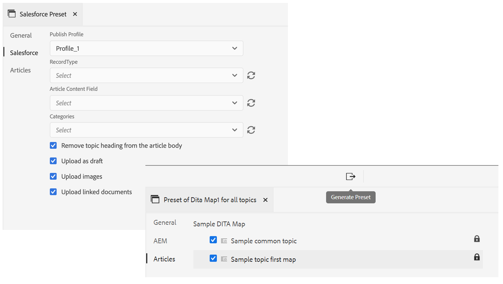
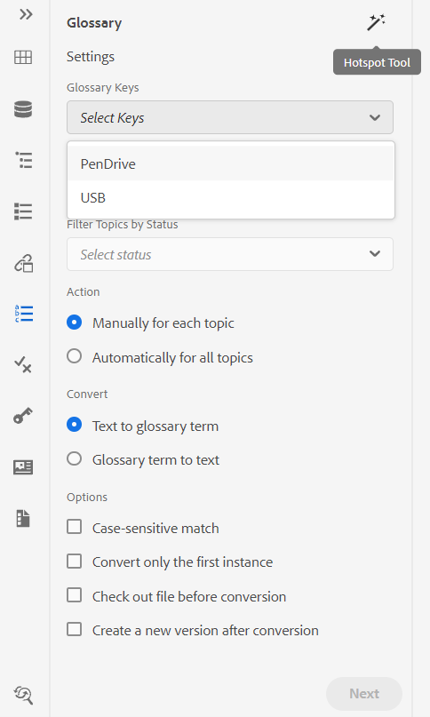
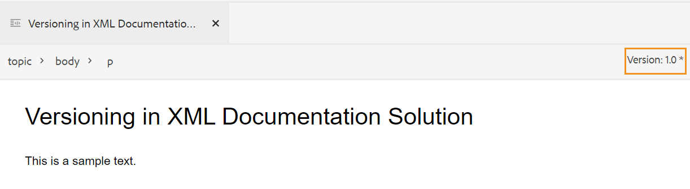

# リリースノート | Adobe Experience Manager Guides 4.0.x

**免責事項**:

*Adobe Experience Manager Guides*&#x200B;は、以前はAdobe Experience Manager *の* XML Documentationとしてブランド化されていました。 ドキュメント内の特定の参照は、以前のブランディングを参照する場合がありますが、現在のオファーに適用されます。

このリリースノートでは、Adobe Experience Manager Guides（後でAEM Guidesと呼ばれます）のバージョン 4.0.xのアップグレード手順、新機能、および機能強化について説明します。

## 4.0.3 | リリースノート

### 互換性マトリックス

この節では、AEM Guides バージョン 4.0.3でサポートされているソフトウェアアプリケーションの互換性マトリックスを示します。

#### Adobe Experience Manager

- バージョン 6.5 サービスパック 12、10、11または9

詳細については、『インストールおよび設定ガイド』の「*技術要件*」セクションを参照してください。

#### FrameMakerとFrameMaker Publishing Server

| リリース | FMPS 2020 | FMPS 2019 | Fm 2020 | Fm 2019 |
|---|---|---|---|---|
| 非UUID | 2020.2以降* | 2019 | 2020.3以降 | 2019.8 （最新アップデート） |
| UUID | 2020.2以降* | 互換性がありません | 2020.4以降 | 互換性がありません |

*XML Documentation ソリューションで作成されたベースラインと条件は、FMPS リリース 2020.2以降でサポートされています。*

#### Oxygen コネクタ

| リリース | Oxygen コネクタウィンドウ | Oxygen Connector Mac | Oxygen ウィンドウで編集 | Oxygen Macで編集 |
|---|---|---|---|---|
| 非UUID | 1.6.8 | 1.6.8 | 1.5 | 1.5 |
| UUID | 2.3.8 | 2.3.8 | 2.2 | 2.2 |

### 修正された問題

様々な領域で修正されたバグを以下に示します。

- Oxygenは、AEMでファイルのバージョンを元に戻した後、トピックの誤ったバージョンをチェックアウトします。 (9661)
- ファイルのバージョンを元に戻すと、Assets UIにタイムスタンプの違いが正しく表示されない。 (9662)
- 任意のバージョンに戻すと、ファイルは自動的にチェックアウトされます。 (9663)
- 言語コードが「fr-fr」または「en-us」と記載されている場合、翻訳されたコンテンツが破損する。 (9665)
- 非UUID バージョンでは、ターゲット言語コードにfr_caなどの5文字が含まれている場合、承認済み翻訳はターゲット言語に統合されません。 (9666)
- 新しいバージョンの作成を有効にして翻訳を行うと、画像のターゲットバージョンがjcr:rootとして表示されます。 (9668)
- ベースラインを使用して翻訳を行うと、間違ったバージョンの画像が翻訳用に送信されます。 (9669)

## 4.0.2 | リリースノート

### 互換性マトリックス

この節では、AEM Guides バージョン 4.0.2でサポートされているソフトウェアアプリケーションの互換性マトリックスを示します。

#### Adobe Experience Manager

- バージョン 6.5 サービスパック 12、10、11または9

詳細については、『インストールおよび設定ガイド』の「*技術要件*」セクションを参照してください。

#### FrameMakerとFrameMaker Publishing Server

| リリース | FMPS 2020 | FMPS 2019 | Fm 2020 | Fm 2019 |
|---|---|---|---|---|
| 非UUID | 2020.2以降* | 2019 | 2020.3以降 | 2019.8 （最新アップデート） |
| UUID | 2020.2以降* | 互換性がありません | 2020.4以降 | 互換性がありません |

*XML Documentation ソリューションで作成されたベースラインと条件は、FMPS リリース 2020.2以降でサポートされています。*

#### Oxygen コネクタ

| リリース | Oxygen コネクタウィンドウ | Oxygen Connector Mac | Oxygen ウィンドウで編集 | Oxygen Macで編集 |
|---|---|---|---|---|
| 非UUID | 1.6.8 | 1.6.8 | 1.5 | 1.5 |
| UUID | 2.3.8 | 2.3.8 | 2.2 | 2.2 |

### 修正された問題

様々な領域で修正されたバグを以下に示します。

- 新しく作成されたレビュードキュメントで、挿入または削除されたテキストの位置が正しくありません。 (9454)
- バージョン 1.0は、4.0.1のアップグレード後、**バージョン履歴** パネルに表示されない場合があります。 (9441)
- バージョン 1.0の現在のバージョンのラベルとコメントは、**バージョン履歴** パネルの特定のケースでは表示されません。 (9440)
- 特定のコンテンツファイルをエディターで開くと、エディターがフリーズする。 (9433)
- リポジトリーパネルで検索すると、大きなコンテンツファイルを検索すると&#x200B;*topicref*&#x200B;参照ダイアログがフリーズする。 (9432)
- Web エディターから1回ファイルを保存すると、1つのファイルに2つのバージョンが作成されます。 (9428)
- topicrefにDITA以外のアセットとditaval以外のアセットを挿入できない。 (9363)
- キーの数が多いマップのプレビューを読み込むと、エディターがハングアップします。 (9332)
- FM アップデート 4を使用したオーサリング時に、ソースファイル内のアセットを移動すると、参照が壊れます。 (9177)

### 既知の問題

- 「**アップロードされたファイルの新しいバージョンを作成**」の設定がオンの場合、「**すべて保存**」を断続的に選択すると、新しいバージョンが作成されます。
- フォルダープロファイルの「ユーザーを削除」機能は、Chrome ブラウザーで断続的に機能しません。 **回避策**: Chrome ブラウザーを更新します。

## 4.0.1 | リリースノート

### 互換性マトリックス

この節では、XML Documentation ソリューションバージョン 4.0.1でサポートされているソフトウェアアプリケーションの互換性マトリックスを示します。

#### Adobe Experience Manager

- バージョン 6.5 サービスパック 12、11または10
- Java: 11

#### FrameMakerとFrameMaker Publishing Server

| リリース | FMPS 2020 | FMPS 2019 | Fm 2020 | Fm 2019 |
|---|---|---|---|---|
| 非UUID | 2020.2以降* | 2019 | 2020.3以降 | 2019.8 （最新アップデート） |
| UUID | 2020.2以降* | 互換性がありません | 2020.4以降 | 互換性がありません |

*XML Documentation ソリューションで作成されたベースラインと条件は、FMPS リリース 2020.2以降でサポートされています。*

#### Oxygen コネクタ

| リリース | Oxygen コネクタウィンドウ | Oxygen Connector Mac | Oxygen ウィンドウで編集 | Oxygen Macで編集 |
|---|---|---|---|---|
| 非UUID | 1.6.8 | 1.6.8 | 1.5 | 1.5 |
| UUID | 2.3.8 | 2.3.8 | 2.2 | 2.2 |

### 修正された問題

様々な領域で修正されたバグを以下に示します。

- 重複するトピック参照が追加または削除されると、マップの参照ツリーが壊れます。 (8922)
- **バージョン履歴**&#x200B;の&#x200B;**現在の** バージョン セクションに複数の問題が存在します。 (8909)
- **すべてを選択**&#x200B;を使用し、マルチメディアファイルまたはDITA コンテンツを他のフォルダーに移動すると、参照が中断されます。 (8897)
- Web エディターの「**相互参照を挿入** > **ファイル参照** > **検索ファイル** > **フィルター** > **検索パスを変更**」ダイアログで、複数のUIの問題が発生します。 (8889)
- マップエディター（8983）で、*topicref*&#x200B;および&#x200B;*ditavalref*&#x200B;の問題を検索します。
- 入力したとおりに検索すると、リポジトリビューで不要な検索リクエストが発生します。 (8982)
- フォルダープロファイルの管理者ユーザーを削除できません。 (8926)
- 参照による脚注を使用しても、AEM サイト出力の脚注セクションにはスクロールされません。 (9061)
- 更新された記事をSalesforceに公開できません。 (9008)
- 横並び表示でハイライト表示の位置が正しくありません。 (9009)
- DITA トピックで条件をドラッグ&amp;ドロップできません。 (9031)
- css_layout.cssをフォルダープロファイルにオーバーレイすることはできません。 (9032)
- アップロード後にアセットを表示すると、例外が受信されます。 (9068)
- XML エディターで許可されている特殊文字のカスタマイズが正しく機能しません。 (9075)
- 翻訳ワークフローでは、翻訳済みアセットの追加バージョンが作成されます。 (9107)
- 他のトピックから&#x200B;*conref*&#x200B;として画像を使用したトピックでのベースライン公開では、画像は出力に表示されません。 (9172)
- ダウンロードマップを使用する場合、ダウンロードが失敗した場合に備えて、一時ディレクトリをクリーンアップしません。 (9176)
- バージョン 4.0では、表の水平方向の整列は使用できません。 (9207)
- *glossref*&#x200B;ではKeys属性が表示されないので、省略形を挿入する参照を使用できません。 (9213)
- *keydef*&#x200B;を作成すると、リンクの選択は4.0でのみ許可されます。 (9214)
- キー定義を挿入/*keyref*&#x200B;機能の動作は、3.8.10と比較して4.0では異なります。 (9215)
- バージョン 3.8.6から3.8.10に存在するWeb エディターの問題を修正しました。 (9219)
- タブのタイトルでキーワードが使用されると、問題が発生します。 (9317)
- Source ビューでは、非条件属性に対して複数のエラーが表示されます。 (9278)
- **パスを選択**&#x200B;の参照ダイアログに問題があります。 (9289)

## 4.0 | リリースノート

### 互換性マトリックス

この節では、XML Documentation ソリューションバージョン 4.0でサポートされているソフトウェアアプリケーションの互換性マトリックスを示します。

#### Adobe Experience Manager

- バージョン 6.5 サービスパック 11、10または9

#### FrameMakerとFrameMaker Publishing Server

| リリース | FMPS 2020 | FMPS 2019 | Fm 2020 | Fm 2019 |
|---|---|---|---|---|
| 非UUID | 2020.2以降* | 2019 | 2020.3以降 | 2019.8 （最新アップデート） |
| UUID | 2020.2以降* | 互換性がありません | 2020.4以降 | 互換性がありません |

*XML Documentation ソリューションで作成されたベースラインと条件は、FMPS リリース 2020.2以降でサポートされています。*

#### Oxygen コネクタ

| リリース | Oxygen コネクタウィンドウ | Oxygen Connector Mac | Oxygen ウィンドウで編集 | Oxygen Macで編集 |
|---|---|---|---|---|
| 非UUID | 1.6.8 | 1.6.8 | 1.5 | 1.5 |
| UUID | 2.3.8 | 2.3.8 | 2.2 | 2.2 |

### 新機能と機能強化

#### 記事ベースの公開

バージョン 4.0では、Web エディターに統合された記事ベースの公開機能が導入されました。 記事ベースの公開機能を使用すると、1つ以上のトピックの出力を段階的に生成したり、ナレッジベースプラットフォームにコンテンツを公開したりできます。

この機能を使用すると、ユーザーはDITA マップを追加的に作成し、トピックを準備ができたときに公開できます。 マップを公開したら、記事ベースの公開機能を使用して、更新された記事に対してのみ増分公開を実行します。

AEMに加えて、この一意の機能を使用して、Salesforceなどのナレッジベースポータルに記事を公開できます。 この機能には、AEMのコアコンポーネント上に構築されたOOTB コンテンツテンプレートも付属しています。これにより、テクニカルコンテンツのナレッジベースのリポジトリを構築できます。 このテンプレートの優れた点は、組織の要件に合わせて完全にカスタマイズでき、企業のイントラネットポータルなどのユースケースもサポートできることです。

外出先でも必要に応じて記事を公開できるため、コンテンツの公開を完全に制御できるだけでなく、更新されたコンテンツを公開するための全体的な時間を短縮できます。

詳しくは、ユーザーガイドの「*Web エディターからの記事ベースの公開*」を参照してください。

#### Web エディターの向上

Web エディターには多くの機能強化と新機能が導入されています。

- コアフレームワークをCoral ベースのUIからSpectrum ベースのUIに変更しました。 これにより、非常に標準化された直感的なUIを利用できます。
- 右側のパネルに新しいファイルのプロパティ機能が導入されました。 アクティブなドキュメントのプロパティを確認できます。 この情報は、次の2つのセクションに分類されます。
   - *一般*: ファイル名、UUID、メタデータタグ、言語、作成日、チェックアウト済みステータス、ドキュメント状態などの一般的なファイルの詳細が含まれます。
   - *参照*：受信および送信の参照が含まれています。

     

- Web エディターに件名スキームのサポートも追加されました。 件名スキームパネルを使用して、件名スキームを作成および使用できるようになりました。 件名スキームの追加により、独自の企業メタデータと分類を使用できるようになりました。

  

- 新しい用語集ホットスポットツールがこのバージョンに導入され、用語集を一括管理できるようになりました。 このツールを使用すると、選択したマップまたは開いているトピックのテキストを用語集にすばやく変換したり、用語集を用語に一括変換したりできます。

  

- 再利用可能なコンテンツパネルに更新機能が追加され、参照ファイル内の再利用可能なコンテンツをすばやく更新できるようになりました。
- 新しいファイル更新インジケーターは、ファイルの現在の（作業コピー）が保存されたバージョンと同期しているかどうかを示します。

  

- リポジトリパネルとファイル参照ダイアログの検索フィルターが強化され、さらにカスタマイズできるフィルターオプションが追加されました。

  

- Web エディターから.docx ファイルをアップロードできるようになりました。
- ユーザー設定は、ブラウザーのCookieではなく、ユーザープロファイルに保存されるようになりました。 これにより、利用者は、ブラウザーやユーザーセッション全体でプリファレンスを維持することができます。

#### 新しい翻訳ダッシュボード

Web エディターに新しい翻訳ダッシュボードが導入され、次の機能が追加されました。

- トピックリストの並べ替え、検索、フィルタリング。
- 参照タイプ（直接参照または間接参照）でコンテンツをフィルタリングします。
- 翻訳リクエストの開始時に、既存のプロジェクトを簡単に見つけることができます。
- 複数の言語に対して翻訳リクエストを開始する際に、各言語に対して複数のプロジェクトを作成することを避けるための多言語翻訳メカニズムを導入しました。
- マップダッシュボードで「翻訳」タブを非表示にする設定を導入しました。 デフォルトでは表示されます。 マップダッシュボードまたはWeb エディターを使用して、コンテンツを翻訳できます。

#### 公開機能の強化

公開プロセスで次の機能強化が利用できるようになりました。

- FrameMaker Publishing ServerによるPDFの生成で、ベースラインと条件プリセットがサポートされるようになりました。
- 作成者は、マップレベルおよびトピックレベルのメタデータをDITA-OT パブリッシングに渡せるようになりました。 これは、カスタム PDF テンプレートが、タグ、作成者、ドキュメントの状態などのファイルメタデータプロパティを使用するように設計されている場合に役立ちます。

  

- AEM サイトの出力生成で「**削除と作成**」オプションを使用すると、削除されるトピックのバージョンを保持または削除できるように、configMgrに新しい設定が追加されました。

#### ファイル処理の改善

AEM Assetsでファイルを操作する際に、次の改善点が確認できるようになりました。

- 新しいファイルのアップロードエクスペリエンスと、競合解決戦略を選択するための新しいダイアログが導入されました。

  

- チェックアウトしたファイルの上書きを防ぐ機能を備えた、アップロードされたファイルの新しいバージョンを作成する機能。
- バージョン履歴ビューから画像のプレビューを直接表示できるようになりました。 また、DITA ファイルとDITA以外のファイルの場合、バージョン履歴には現在のバージョン情報が別々に表示されます。

  バージョン履歴ビューでの

#### 新しいレポート書き出し機能

レポートは、コンテンツの健全性を特定するのに役立ちます。 XML Documentationソリューションには、コンテンツを制御するための様々なレポートが用意されています。 これにより、レポートを表示するだけでなく、レポートデータをCSV ファイルに書き出して、大規模なチームで表示および共有できるようになります。 レポートデータでは、リンク切れや画像の欠落などを簡単に確認できます。

#### Oxygen DAMの更新体験の向上

OxygenでAEM Serverからファイルを更新すると、現在のOxygen セッションに保存されていないファイルがある場合に警告メッセージが表示されます。 更新操作をキャンセルして、保存されていないファイルを保存することができます。 この機能がなければ、ユーザーはドキュメント内の保存されていない情報を失っていました。

#### その他の機能の強化

- AEMのベストプラクティスに従って、アプリケーションデータが/content/fmdita、/etc/fmdita/、/content/dxml/から新しい場所に移行されました。
- DAM アセット更新ワークフローが再導入され、XML後処理ワークフローと共に実行する際の処理が改善され、パフォーマンスが最適化されました。
- XML Documentation API パッケージが、一般にアクセス可能なMaven リポジトリで使用できるようになりました。
- /apps/projects/templates パスの下に新しいDita プロジェクトテンプレートを作成できるようになりました。
- 次に、フォルダープロファイルからデフォルトのui_config.json ファイルをダウンロードします。 これは、アップグレード中に既存のui_config.json ファイルからカスタム変更をマージするために使用できます。

### 修正された問題

様々な領域で修正されたバグを以下に示します。

#### web エディター

- conrefは、壊れていなくても赤い色で表示されます。 (8239)
- DITAVAL エディターで「**すべてのプロパティを追加**」が選択されている場合、条件付き属性の値は自動入力されません。 (8234)
- 作成者は、相対パスを使用してトピックに画像を挿入できません。 (8112)
- 表セルに追加されたPh conrefは、赤色で表示されます。 (8083)
- UUID ベースのシステムの場合、レビュー中のファイルが移動しても、レビュータスク内のリンクは更新されません。 (8080)
- Web エディターで、拡大・縮小プロパティが75%以上に設定されている画像が正しくレンダリングされない。 (8073)
- GIF画像は、Web エディターで静止画像としてレンダリングされます。 (8024)
- ノート要素のconkeyrefは、Web エディターのプレビューまたは出力に表示されません。 (8006)
- 自身がconrefであるエレメントへの外部参照は、エディターで解決されません。 (7933)
- キーを持つタイトルが、エディタープレビューとリポジトリーパネルで正しくレンダリングされない。 (7909)
- 特殊文字を含むスニペットが正しく保存されない。 (7908)
- JS検証の問題がある場合でも、POST リクエストはサーバーに送信されます。 (7989)
- MathML数式の書式設定後にトピックを保存すると、エラーが発生します。 (7954)
- （tm）を持つkeydefがエディターで適切にレンダリングされず、AEM サイト出力に重複するTM シンボルが含まれていました。 (7859)
- スニペットのドラッグ&amp;ドロップは、DTDに従って機能しません。 (7758)
- HTMLは、グラフィックのカスタム定義された寸法を無視しています。 (7718)
- ソースファイルの移動時にconrefend属性が更新されない。 (7698)
- 参照トピックタイプドキュメントを使用すると、複数のUIの問題が発生します。 (7656)
- 作成者がマップにditavalrefを追加すると、DITAVAL ファイルは表示されません。 (7594)
- outputclass属性が`<tgroup>`要素に追加されると、空白の`<entry>`要素ごとに予期しないスペースが見つかります。 (7532)
- マップダッシュボードで開いたトピックに対して、「Source」ボタンが機能しない。 (7465)
- 「プリティプリント」では、FrameMakerまたはOxygenでファイルを開いたときに表示される空白行とスペースが挿入されます。 (7408)
- どのトピックのhref=&quot;/&quot;を含むマップも、AEM サイトでは公開されません（7405）
- ルートマップに多数のkeydefsがある場合に、エディターでパフォーマンスの問題が見つかりました。 (7400)
- カスタムテンプレートを含むマップのドキュメント状態は、対応する状態プロファイルから継承されません。 (7359)
- `<tm>`要素がブロック要素として正しくレンダリングされません。 (7286)
- 新しいテンプレートを作成すると、重複したテンプレートがエディターテンプレートパネルに表示されます。 (5814)
- 追加の属性を設定するための画像に対してui_configで定義されたテンプレートは、ドラッグ&amp;ドロップケースには適用されません。 (5713)
- Menucascadeでのuicontrolのデフォルトの外観が正しくありません。 (5483)
- トピック/マップのカスタムテンプレートで、UIに新しい名前が表示されない。 設定済みの名前を表示するのではなく、「Topic」/「Map」という名前で表示します（4958）

#### Oxygen コネクタ

- 親フォルダーに特殊文字が含まれるファイルは、Oxygenでの読み込み中にエラーが発生します。 (8054)
- Oxygenで新しく作成されたドキュメントを開くと、「GUIDが見つかりません」エラーがスローされます。 (7856)
- Oxygenで編集を使用してAEMからファイルをチェックアウトすると、チェックインオプションが無効になります。 (7471)

#### レビュー

- レビュータスクがAEM インボックスから再割り当てされている場合、タスクに関連付けられているペイロードは担当者が表示できません。 (8003)
- ファイル名にスペースがある場合、「タスクの確認」ページには（マルチメディア）ファイルの内容が表示されません。 (8111)

#### マップダッシュボード

- マップダッシュボードの「トピック」タブまたは「レポート」タブのトピックのタイトルにconref コンテンツが表示されない。 (8263)
- AEM Sites出力| DITA トピックタイトルの更新時に、生成されたサイトページのjcr:titleが更新されない。 (8131)
- ダウンロード MAPは、トピック内で使用されるビデオファイルをダウンロードしません。 (8070)
- ブックマップに同じ名前のトピックが異なるフォルダーに2つある場合、フラット階層でAEMのブックマップのダウンロードが失敗します。 同じ名前で大文字と小文字が異なるファイルがある場合は、重複ファイルとして扱われます。 (8058)
- ダウンロードブックマップ APIを使用してオブジェクトタグを使用すると、メディアファイルがダウンロードされません。 (8057)
- タイトルがconrefで始まるファイルにconrefがあるトピックがある場合、「レポート」タブに正しくないレポートが表示されます。 (4698)

#### 公開

- 「バージョン管理を有効にする」を選択すると、PDFの作成が初めて失敗します。 (8053, 8294)
- UUID以外のコンテンツの場合、conref画像はAEM サイト出力に表示されません。 (7907)
- AEM サイト出力の「tm;」タグの後に、空白の文字が自動的に追加されます。 (7964)
- AEM サイト出力でYouTube ビデオを表示できません。 (7401)
- ユーザーがマップダッシュボードの「ベースライン」タブにあるすべてのトピックを参照をクリックすると、参照コンテンツのラベルによるフィルタリングが失敗します。 (7388)
- プロパティ値SMまたはregを持つ要素`<tm>`を持つトピックを公開すると、生成された出力に正しく表示されません。 (7239)
- 画像を使用したベースラインの公開では、公開済み出力で画像の最新バージョンが選択されません。 (7231)
- 関連参照トピックは、「ベースライン」タブに表示されます。 (5424)
- タイトルにconkeyrefが含まれるトピックの増分公開が期待どおりに機能しません。 (4474)
- この設定がオンになっている場合でも、出力URLの生成にページタイトルは使用されません。 (8257)
- ベースライン公開フリーズされたノードの代わりに、現在のバージョンの画像を選択します。 これは、画像にファイル名にスペースや特殊文字が含まれている場合にも表示されます。 (8274, 8322)
- タイプの件名スキームにmaprefが含まれているDITA マップの増分公開が失敗します。 (8218)

#### AEM Assets

- Assets UIで巨大なコンテンツセットの選択/削除を行う際にパフォーマンスの問題が見つかりました。 (8238)
- DITA述語を検索フィルターに追加すると、保存された検索機能（スマートコレクション）が機能しなくなる。 (8048)
- 画像を古いバージョンに戻すことができません。 （DXML-7903）
- 削除オプションは、削除の権限を持たない作成者にも表示されます。 (7322)
- ASSETS エディターのCCMS オーバーレイで、「削除」オプションのレンダリングが解除される。 (8093)

#### コンテンツ読み込み

- HTMLからDITAへの変換| 「tr」が空の「td」エントリを持つテーブルでは、出力に追加の行が発生します。 (8132)
- HTMLからDITAへの変換|複数の本文を持つテーブルを持つHTMLは、例外として失敗します。 (7940)
- HTMLからDITAへのコンバージョン | ソース HTMLにコメントがある場合にエラーが発生する。 (7937)
- DITA 1.3 DITA ファイルを読み込むと、一部のhrefが不正なリンクに変換されます。 (8019)

#### その他

- バージョン履歴ビューで、画像のサムネールが見つからないか、壊れています。 (7948, 8008)
- zipMapWithDependents APIは、コンテンツ内の参照に誤りがある場合に関連する情報を提供しません。 (7521)
- UUIDのお客様の場合、UUID ファイルを識別するための正規表現、出力を生成するためのページタイトルの使用など、いくつかの設定でデフォルトの設定値が変更されました。 (8301, 8305)

## アップグレード手順 {#upgrade-instructions}

現在のバージョンのAEM Guidesをバージョン 4.0.3に簡単にアップグレードできます。 AEM Guides バージョン 4.0.3へのアップグレードを進める前に、次の点を考慮する必要があります。

- バージョン 4.0.2を使用している場合は、バージョン 4.0.3に直接アップグレードできます。 4.0.3にアップグレードする前に、バージョン 4.0.2にアップグレードする必要があります。
- バージョン 4.0を使用している場合は、バージョン 4.0.2に直接アップグレードできます。
- バージョン 4.0.1を使用している場合は、アンインストールする必要があります。
- バージョン 3.8.5を使用している場合は、バージョン 4.0.2にアップグレードする前にバージョン 4.0にアップグレードする必要があります。
- 3.8.5より前のバージョンを使用している場合は、製品固有のインストールガイドの「アップグレード」セクションを参照してください。

詳しくは、[&#x200B; アップグレード手順](https://helpx.adobe.com/content/dam/help/en/xml-documentation-solution/4-0-3/Adobe-Experience-Manager-Guides_Upgrade-Instructions_EN.pdf)を参照してください。

