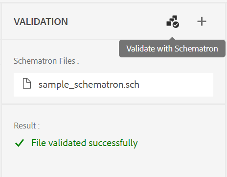
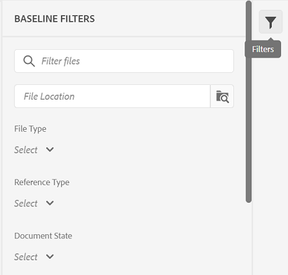

# Adobe Experience Manager Guidesの4.1.x リリース

このリリースノートでは、Adobe Experience Manager Guides（後で&#x200B;*AEM Guides*&#x200B;と呼ばれます）のバージョン 4.1.xのアップグレード手順、新機能、および機能強化について説明します。

## 最新リリースへのアップグレード

現在のバージョンのAEM Guidesをバージョン 4.1.3に簡単にアップグレードできます。 AEM Guides バージョン 4.1.3へのアップグレードを進める前に、次の点を考慮する必要があります。

* バージョン 4.1または4.1.xを使用している場合は、バージョン 4.1.3に直接アップグレードできます。
* バージョン 4.0.xを使用している場合は、バージョン 4.1.3にアップグレードする前に、バージョン 4.1または4.1.xにアップグレードする必要があります。
* バージョン 3.8.5を使用している場合は、4.1にアップグレードする前にバージョン 4.0.xにアップグレードする必要があります。
* 3.8.5より前のバージョンを使用している場合は、製品固有のインストールガイドの「アップグレード」セクションを参照してください。

詳しくは、[ アップグレード手順](assets/Adobe-Experience-Manager-Guides-Upgrade-Instructions-EN.pdf)を参照してください。

## 4.1.3 | リリースノート

## 互換性マトリックス

この節では、AEM Guides 4.1.3 リリースでサポートされているソフトウェアアプリケーションの互換性マトリックスを示します。

### ADOBE EXPERIENCE MANAGER

**非UUID**
バージョン 6.5 サービスパック 13、12、11または10

**UUID**
バージョン 6.5 サービスパック 13、12、11または10

詳しくは、Adobe Experience Manager Guidesのインストールおよび設定ガイドの「技術要件」セクションを参照してください。

### FrameMakerとFrameMaker Publishing Server

| リリース | FMPS 2020 | FMPS 2019 | Fm 2020 | Fm 2019 |
| --- | --- | --- | --- | --- |
| 4.1.3 （非UUID） | 2020.2以降* | 2019 | 2020.3以降 | 2019.8 （最新アップデート） |
| 4.1.3 （UUID） | 2020.2以降* | 互換性がありません | 2020.4以降 | 互換性がありません |
| | | | |  |

* AEMで作成されたベースラインと条件は、2020.2以降のFMPS リリースでサポートされています。

### Oxygen コネクタ

| リリース | Oxygen コネクタウィンドウ | Oxygen Connector Mac | Oxygen ウィンドウで編集 | Oxygen Macで編集 |
| --- | --- | --- |--- |--- |
| 4.1.3 （非UUID） | 2.0 | 2.0 | 1.6 | 1.6 |
| 4.1.3 （UUID） | 2.7 | 2.7 | 2.3 | 2.3 |
|  |  |   |  |  |

## 修正された問題

修正されたバグは次のとおりです。

* Web エディターは断続的に空白ページを読み込みます。 (10678)

## 4.1.2 | リリースノート

## 互換性マトリックス

この節では、AEM Guides 4.1.2 リリースでサポートされているソフトウェアアプリケーションの互換性マトリックスを示します。

### ADOBE EXPERIENCE MANAGER

**非UUID**
バージョン 6.5 サービスパック 13、12、11または10

**UUID**
バージョン 6.5 サービスパック 13、12、11または10

詳しくは、Adobe Experience Manager Guidesのインストールおよび設定ガイドの「技術要件」セクションを参照してください。

### FrameMakerとFrameMaker Publishing Server

| リリース | FMPS 2020 | FMPS 2019 | Fm 2020 | Fm 2019 |
| --- | --- | --- | --- | --- |
| 4.1.2 （非UUID） | 2020.2以降* | 2019 | 2020.3以降 | 2019.8 （最新アップデート） |
| 4.1.2 （UUID） | 2020.2以降* | 互換性がありません | 2020.4以降 | 互換性がありません |
| | | | |  |

* AEMで作成されたベースラインと条件は、2020.2以降のFMPS リリースでサポートされています。

### Oxygen コネクタ

| リリース | Oxygen コネクタウィンドウ | Oxygen Connector Mac | Oxygen ウィンドウで編集 | Oxygen Macで編集 |
| --- | --- | --- |--- |--- |
| 4.1.2 （非UUID） | 2.0 | 2.0 | 1.6 | 1.6 |
| 4.1.2 （UUID） | 2.7 | 2.7 | 2.3 | 2.3 |
|  |  |   |  |  |

## 修正された問題

様々な領域で修正されたバグを以下に示します。

* すべてのフォルダープロファイルを選択すると、見えないフォルダープロファイル（正しくない）が表示されます。 (10393)
* ユーザーのタイムゾーンがサーバーのタイムゾーンと異なる場合、ベースライン作成で最新バージョンが選択されない。 (10336)
* AEM Guides 4.1のインストール後、Assets コンソールでControl + F ショートカットを使用してブラウザー検索モーダルを開かない。 (10339)
* フォルダーへの参照を持つトピックに対して、ベースライン作成エラーが発生します。 (10383)
* 「出力プリセット」タブでは、断続的に空白の画面が表示されます。場合によっては、編集不可能なプリセットが表示されます。 (10390)
* キースペースの管理は、例外やエラーにつながります。 (10449)

### 回避策の既知の問題

* 翻訳中に書き出されたベースラインは、エディターの「ベースライン」タブに読み込まれません。

  **回避策**: DITA マップダッシュボードの「ベースライン」タブを使用します。

## 4.1 | リリースノート

このリリースノートでは、Adobe Experience Manager Guides（後で&#x200B;*AEM Guides*&#x200B;と呼ばれます）のバージョン 4.1.xのアップグレード手順、新機能、および機能強化について説明します。

## 互換性マトリックス

この節では、AEM Guides 4.1 リリースでサポートされているソフトウェアアプリケーションの互換性マトリックスを示します。

### ADOBE EXPERIENCE MANAGER

**非UUID**
バージョン 6.5 サービスパック 13、12、10または11

**UUID**
バージョン 6.5 サービスパック 13、12、10または11

詳しくは、Adobe Experience Manager Guidesのインストールおよび設定ガイドの「技術要件」セクションを参照してください。

### FrameMakerとFrameMaker Publishing Server

| リリース | FMPS 2020 | FMPS 2019 | Fm 2020 | Fm 2019 |
| --- | --- | --- | --- | --- |
| 4.1 （非UUID） | 2020.2以降* | 2019 | 2020.3以降 | 2019.8 （最新アップデート） |
| 4.1 （UUID） | 2020.2以降* | 互換性がありません | 2020.4以降 | 互換性がありません |
| | | | | |

* AEMで作成されたベースラインと条件は、2020.2以降のFMPS リリースでサポートされています。

### Oxygen コネクタ

| リリース | Oxygen コネクタウィンドウ | Oxygen Connector Mac | Oxygen ウィンドウで編集 | Oxygen Macで編集 |
| --- | --- | --- |--- |--- |
| 4.1 （非UUID） | 2.0 | 2.0 | 1.6 | 1.6 |
| 4.1 （UUID） | 2.7 | 2.7 | 2.3 | 2.3 |
|  |  |  | | |

## 新機能と機能強化

AEM Guidesには、4.1 リリースで多くの機能強化と新機能が用意されています。

### PDFとのネイティブな連携

AEM Guidesの4.1 リリースでは、ネイティブPDFを作成するためのサポートも追加されました。 次の機能を備えた新しい公開エンジンが導入されました。

* CSS テンプレートの作成
* 様々なページテンプレートの作成
* CSSとページテンプレートで構成されるPDF テンプレートのデザイン
* PDF形式のマップとトピックコンテンツの公開

### 記事ベースの公開でのナレッジベースサイトパスのサポート

AEM Guidesには、1つ以上のトピックの出力を段階的に生成したり、コンテンツをナレッジベースプラットフォームに公開したりするための記事ベースの公開機能が用意されています。 4.1 リリースでは、トピック/マップを公開する必要があるナレッジベースサイトパスを選択する追加オプションがあります。 パスを選択すると、指定したパスで出力が生成されます。

### 拡張Web エディター

* **キー解決**&#x200B;を改善しました

DITA コンテンツキー参照は、あるトピックのコンテンツの一部を別のトピックに挿入します。 キーを使用してコンテンツを検索します。 DITA トピックに関連付けられている主要な参照を解決する必要があります。 選択したルートマップは、キー参照を解決する際に最も優先されます。

これで、キー参照は、次の優先順位で設定されたルートマップに基づいて解決されます。

1. ユーザーの環境設定
1. マップビューパネル
1. フォルダープロファイル

詳しくは、Adobe Experience Manager Guidesの使用ガイドの「*重要な参照を解決*」セクションを参照してください。

* **左側のパネルにカスタムパネルを追加**

これで、Web エディターの左側のパネルにカスタムパネルを追加できます。 カスタムパネルは、ヘルプの提供やプロジェクトのテストなど、さまざまな目的で使用できます。 カスタムパネルが設定されている場合、**エディター設定**&#x200B;内のパネルのリストにも表示されます。 カスタムパネルの表示と非表示を切り替えることができます。

* **DITA マップ内のトピックのドキュメント状態を変更する機能**

DITA マップ内で選択したトピックのドキュメント状態を簡単に変更できるようになりました。 DITA マップで選択したトピックのプロパティを開いて、マップビューパネルの下部にある&#x200B;**その他のオプション** メニューから編集することもできます。

* **プレビューモードに表示されるバージョン情報**

Web エディターは、バージョンの管理に役立ちます。 また、トピックのプレビューモードで、トピックの「ファイル」タブの右上隅に、アクティブなトピックまたはDITA マップのバージョンが表示されるようになりました。

* **Web エディターの更新動作を改善**

Web エディターのブラウザー更新操作で、次の機能強化が利用できるようになりました。

* これで、編集中にブラウザーを更新するサポートが得られました
web エディターのコンテンツ： ブラウザーの更新アイコンを押すと、1つ以上のファイルが
保存されていない変更が編集用に開かれます。ファイルを保存するか、更新アクションをキャンセルするかを尋ねるメッセージが表示されます。

* ブラウザーを更新しても、左側のパネルと右側のパネルのビューは保持されます。

* アクティブなトピックまたはDITA マップがコンテンツ編集領域で再度開きます。

* **カスタマイズされたテンプレートに基づいてマップを作成**

これで、カスタマイズされたマップテンプレートを作成する強力な機能が手に入りました。 それらを使用して、マップテンプレートで参照されるトピックテンプレートやマップテンプレートと共にDITA マップを作成できます。

また、カスタマイズされたマップテンプレートから、他のマップテンプレートやトピックテンプレートを参照することもできます。 参照されるマップテンプレートは、様々なマップテンプレート、トピックテンプレート、トピック、マップ、画像、ビデオ、その他のアセットを参照できます。

カスタマイズされたマップテンプレートを使用すると、マップテンプレートと参照フォルダー構造全体を簡単に複製できます。 これらのカスタマイズされたテンプレートは、再帰的な構造と参照を持つ複数のマップを作成および再作成するのに特に便利です。

* **Schematron サポート**
「Schematron」とは、XML ファイルのテストを定義するために使用されるルールベースの検証言語を指します。 Schematron ファイルを使用すると、特定のルールを定義し、DITA トピックまたはマップに対して検証できます。 Web エディターはSchematron ファイルをサポートしています。 スキーマトロンファイルを読み込み、Web エディターで編集することもできます。 Web エディターのSchematron サポートは、一連のルールに照らし合わせてファイルを検証し、トピック全体で一貫性と正確性を維持するのに役立ちます。

* **ファイルを閉じる際のダイアログが改善されました**

Web エディターで開いているファイルを閉じようとすると、AEM Guidesに変更内容を保存し、ロックされたファイルのロックを解除するように求められます。 プロンプトは、管理者が設定した「**閉じる**&#x200B;でチェックインを依頼する」および「**閉じる**&#x200B;で新しいバージョンを依頼する」に基づいて表示されます。

設定に基づいて、変更を保存し、ドキュメントの新しいバージョンを作成するオプションが表示されます。 または、ファイルをチェックインして、現在のバージョンに変更を保存することもできます。

詳しくは、「Adobe Experience Manager Guidesを使用する」ガイドの「*ファイルの閉じおよび保存シナリオ*」セクションを参照してください。*「**キーワードを挿入**」機能が改善されました。 キーワードがアルファベット順にリストされるため、挿入するキーワードをより簡単に見つけることができるようになりました。 検索ボックスに検索文字列を入力して、キーワードを検索することもできます。

* Markdown ドキュメントの&#x200B;**サポート**
Markdownは、プレーンテキストドキュメントに書式要素を追加するのに役立つ、軽量なマークアップ言語です。 Web エディターでは、DITA ドキュメントと共にMarkdown ドキュメント（.md）を使用できます。 Web エディターでMarkdown ドキュメントを簡単に作成およびプレビューし、DITA マップエディターを使用してマップファイルに追加できます。  詳しくは、Adobe Experience Manager Guidesの使用ガイドの「Web エディター*」セクションの「* Markdown ドキュメントの作成」を参照してください。

* **デフォルトのタグビューを設定する機能**
ユーザーがWeb エディターからタグビューを有効にした場合、セッション全体でも有効のままになります。  これは、後でタグビューにアクセスするために、もう一度タグビューを有効にする必要がないことを意味します。 管理者は、Web エディターでタグビューのデフォルトの状態を設定できます。 新規ユーザーのセッションのタグビューのデフォルト値は、ui_config.json ファイルのtagsView プロパティによって決まります。

* リポジトリビューファイルでは、ファイルは一括で読み込まれます。 メインまたは`/content/dam folder`に存在するすべてのファイルが一覧表示されます。 しかし、次のレベルまたはセカンダリフォルダーから75 ファイルが一度に読み込まれます。 このバッチ読み込みは効率的で、フォルダー内に存在するすべてのファイルを読み込むよりも、ファイルに迅速にアクセスできます。

### 新しいベースラインダッシュボード

AEM Guides 4.1 リリースには、Web エディター内に統合されたベースライン機能が用意されています。 Web エディターからベースラインを作成し、それを使用して様々なバージョンのトピックを公開または翻訳できるようになりました。

**注**：アップグレードされたシステムの場合は、フォルダープロファイルの最新の&#x200B;**ui_config.json**&#x200B;を更新してください。

この機能を使用して、特定の日時に利用可能なトピックの特定のバージョンを含むベースラインを作成します。 また、トピックのバージョンに対して定義されたラベルを使用して、ベースラインを作成または更新するためのAPI サポートも利用できます。

ファイル名またはファイルの場所に基づいてファイルを検索できます。 ベースライン編集ウィンドウに表示するトピックをフィルタリングし、特定の列に基づいて並べ替えることもできます。

ベースライン作成プロセスのパフォーマンスがさらに向上しました。 ベースラインを作成するプロセスは非同期なので、ベースラインの作成中にWeb エディターで他のファイルの編集を続行できます。 詳しくは、Adobe Experience Manager Guidesの使用ガイドの「*Web エディターからのベースラインの作成と管理*」を参照してください。

注意：マップダッシュボードの「ベースライン」タブは、デフォルトでは非表示になっています。 管理者は、マップダッシュボードの「ベースライン」タブを有効にできます。

* 「マップをダウンロード」 APIのベースラインパラメーターで、ベースラインのタイトルを使用して、バージョン管理されたコンテンツを取得できるようになりました。

### 翻訳プロセスの改善

* **スコープ翻訳プロジェクトを作成する機能**
翻訳するプロジェクトのスコープのみを作成する必要がある場合は、**新しいスコープ翻訳プロジェクトを作成**&#x200B;を選択できます。 これにより、翻訳用のコピーは送信されず、ファイルの元の翻訳ステータスが維持されます。

* **言語** リストには、言語フォルダーと言語コードが表示されます。 例えば、フランス語（fr）とドイツ語（de）です。

翻訳について詳しくは、Adobe Experience Manager Guidesの使用ガイドの「*Web エディターからのドキュメントの翻訳*」セクションを参照してください。

### 公開機能の強化

* マップダッシュボードから出力を生成する際に、「出力」タブから「**公開ダッシュボード**」にアクセスすることもできます。 アクティブなすべての公開タスクのリストは、公開ダッシュボードで使用できます。

* マップダッシュボードから、複数のDITAVAL ファイルを選択して、コンディショナライズされたコンテンツを生成できます。 ファイルを追加または削除することで、ファイルの順序を維持できます。 ファイル名にカーソルを合わせると、ファイルが保存されているAEM リポジトリ内のパスを確認できます。

* ベースラインは、AEM サイト出力のメタデータに対して適用されます。 ベースラインバージョンのプロパティをメタデータとして処理することもできます。 ベースラインが定義されていない場合、最新バージョンのプロパティはメタデータとして処理されます。

* HTML5、EPUB、およびカスタム出力プリセットに対して、**ファイル名**&#x200B;および&#x200B;**DITA-OT コマンドライン引数** オプションが追加されました。 これで、出力を保存するファイル名を指定できます。 出力の生成時にDITA-OTで処理する追加の引数を指定することもできます。

### マップダッシュボード

DITA マップのダウンロードを選択すると、リクエストはキューに入れ、マップのダウンロード準備が整うと通知が届きます。 マップファイルをすぐにダウンロードするか、AEM通知の受信トレイに表示されるリンクから後でダウンロードするかを選択できます。

### その他の機能強化

* AEM Guidesは、Oxygen XML Author バージョン 24.1をサポートするようになりました。
* 「マップをダウンロード」 APIのベースラインパラメーターで、ベースラインのタイトルを使用して、バージョン管理されたコンテンツを取得できるようになりました。

### 非推奨の機能

AEM Guidesでは、FrameMaker ドキュメントのDITA出力フォーマットの生成がサポートされなくなりました。 このDITA オプションは、マップダッシュボードの出力プリセットからも削除されました。

## 修正された問題

様々な領域で修正されたバグを以下に示します。

* オーサリングのサポートは、公開用のファイルパスベースの参照の代替として使用できません。 (8076)
* DITA アドオンパッケージは、DAMの重複アセット検出を防ぎます。 (8417)
* OxygenからAEMへのドキュメントのチェックイン後、ドキュメント内の日本語コンテンツが疑問符に置き換えられます（???）。 (9124)
* OxygenでWeb認証を使用してログに記録する際に、チェックアウトしたファイルを更新できません。 (9179)
* Oxygenで開いたときにファイルがチェックアウトされない。 (9192)
* OxygenからAEMへのドキュメントのチェックイン後、ドキュメント内の日本語コンテンツが疑問符に置き換えられます（???）。 (9276)
* OxygenでWeb認証が機能しない。 (9296)
* Oxygenで再アップロードが失敗する場合、ファイルが同じ場所にAEMに既に存在します。 (9328)
* AEMとローカルシステム間でコンテンツを強制的に同期するオプションは使用できません。 (9439)
* セカンダリツールバーから&#x200B;**再利用可能コンテンツを挿入** ダイアログを使用して追加された要素に対して、IDが自動的に生成されません。 (5826)
* 既存のファイルと同じ名前の画像をエディターを使用してアップロードすると、確認ダイアログが表示されません。 (6011)
* 文字パレットで区切り以外のスペースを使用できません。 (7523)
* エレメントのリスト（Alt+Enter）が、暗いテーマまたは暗いテーマでグレー表示されます。 (7913)
* マップパネルツールバーからトピックのリビジョンを保存しても、バージョンは更新されません。 (8228)
* 有効な場所でも外部参照を挿入できません。 (8354)
* 「getversionlabels」操作には制限があり、期待されるパフォーマンスを提供しません。 (8513)
* 現在エディターで開いていないロックまたは編集されたファイルを閉じる際に、確認ダイアログで問題が発生します。 (8692)
* ユーザーIDが数値の場合、フォルダープロファイルに管理者としてユーザーを追加するとエラーが発生します。 (8908)
* マップエディターでDITA マップを開いても、翻訳パネルが表示されます。 (9053)
* 翻訳パネルに言語コードが表示されない。 (9108)
* 「翻訳」タブと「ベースライン」タブは、マップダッシュボードにしばらく表示されます。 (9146)
* 翻訳が完了すると、翻訳済みアセットの追加バージョンが作成されます。 (9310)
* 承認済みの翻訳は、ターゲット言語コードに`fr_ca`のような5文字が含まれている場合、ターゲット言語に統合されません。 (9357)
* 作成されたターゲット言語コードが`fr-fr, `、`en-us`と記載されていると、翻訳済みコンテンツが破損する。 (9527)
* 言語フォルダーの外部にあるDITA マップを読み込むと、バックエンドに例外が記録されます。（9543）
* エディターからカスタム DITA テンプレートを使用してDITA ファイルを作成できない。 (7262)
* DITA マップは、FMPSを介してUUID DITA マップを公開すると失われます。 (7278)
* アセットがコピーおよびペーストされた場合、AEM Guidesはアセットの一意でないプロパティをコピーしません。 (8241)
* DITA マップファイル名が作成時に小文字に変換されない。 (8383)
* 新しいレビュータスクの割り当て時に送信されるメール通知に、レビュータスクの説明が表示されない。 (8507)
* ダウンロードマップ API | ダウンロードプロセスエラーが発生した場合に備えて、一時フォルダーがクリーンアップされない。 (8523)
* `columnpreview.jsp`はSPに依存しています。  (8543)
* 「待機中」または「実行中」などのステータスを持つ出力ジョブは、公開ダッシュボードでクリーンアップされません。  (8569)
* アイコンプロパティが定義されている場合でも、「生成」ボタンを使用してレポートを生成するときに選択されるデフォルトのアイコン。 (8573)
* 3.8.Xから4.0へのアップグレード中に、レビュープロセスで問題が発生します。 (8788)
* Web エディターのレビューパネルで、ユーザー名が長い場合、承認/却下するアイコンが明確に表示されません。 (8793)
* トピックを削除して移動操作を実行すると、参照ツリーが壊れます。 (8804)
* ユーザーが定義したカスタム DTDは、DITA-OTに埋め込まれた標準のDITA DTDよりも優先されません。 (9104)
* 横向き表示でハイライト表示の位置が正しくありません。 (9305)
* 参照による脚注を使用しても、AEM サイト出力の脚注セクションにはスクロールされません。 (9061)
* AEM サイト出力の脚注の順序が正しくありません。 (9327)
* 新しく作成されたDITA アセットは、常に別のユーザーがチェックアウトします。 (9387)
* 新しいコンテンツの作成時にエラーが常にログに記録されます。 (9388)
* レビュータスク作成プロセスの3番目の画面には、用語集のリストが表示されません。 (4558)
* FrameMaker/Oxygen Connectorから複数のファイルをアップロードする際に割り当てられたUUID参照が正しくありません。 (8269)
* レビュータスクがインボックスで再割り当てされるときに、メール通知が送信されない。 (8376)
* 2番目の管理者ユーザーを最初の管理者ユーザーとしてフォルダーに追加することはできません。 (8430)
* 「ベースライン」タブの「**ラベルを適用**」ダイアログでは、ドロップダウンにラベルが表示されません。 (8455)
* トピックでimageをconrefとして使用したベースライン公開を使用すると、画像は出力に公開されません。 (8564)
* 残りの出力履歴ノードが多数ある場合、出力パージ機能が失敗します。 (8568)
* バージョン履歴パネルでは、現在のバージョンのセクションに誤ったタイムスタンプが表示され、情報によって変更されます。 (8765)
* 定義されたラベルに基づいてベースラインが更新されません。 (8799)
* 親フォルダーのファイル名に特殊文字が含まれているファイルがOxygenで開かれると、エラーが発生します（「**Oxygenで編集**」ボタンを使用）。 (8918)
* OxygenからAEMへのファイルのアップロードに失敗します。 (9157)
* コンテンツが他のフォルダーに移動された場合、ベースラインが機能しないマップをダウンロードします。 (9331)
* Oxygenは、AEMでバージョンが復元された後、トピックの誤ったバージョンをチェックアウトします。 (9411)
* リポジトリーパネルとtopicrefの参照ダイアログで検索すると、コンテンツが大きいときに画面がフリーズします。 (9432)
* 「**アップロードされたファイルの新しいバージョンを作成**」の設定がオンの場合、フリーズしたノードを元に戻して保存すると、新しいバージョンが作成されます。 (9473)
* ファイルのバージョンを元に戻すと、Assets UIにタイムスタンプの違いが正しく表示されない。 (9480)
* 任意のバージョンに戻すと、ファイルは自動的にチェックアウトされます。 (9482)
* ファイルがエディターからチェックインされている場合でも、リポジトリビューにロックアイコンが表示されます。  (5756)
* Web エディターのオーサービューを使用して、ブックマップにfrontmatter、backmatter要素を追加できません。 (7652)
* プレビューモードは、DITAの`deliveryTarget`条件付き処理属性をサポートしていません。 (7685)
* XML エディターで用語集トピックを開くと、AEMは、変更されていなくても強制的に保存します。 (8105)
* UIを使用してマップにsubjectrefを追加すると、参照を挿入ダイアログが開きます。 (8212)
* 特殊文字`[`または`*`を検索すると、コンテンツパネルがクラッシュする。（8279）
* Glossentryをオーサリングすると、Web エディターにコンテンツがメモとして表示されます。 (8384)
* XML エディターはコードブロック内の改行を削除します。 (8522)
* ソース モードとオーサーモードを切り替えると、トピックがダーティとしてマークされ、コンテンツを再度保存する必要があります。（8524）
* ロック解除されたトピックを閉じることができません。 (8545)
* 記事ベースの公開プリセットでナレッジベースのパスを選択するオプションはありません。 (8636)
* お気に入りビューのドラッグ&amp;ドロップを使用してブックマップに章を追加すると、属性が見つかりません。 (8746)
* キーワードを挿入ダイアログには検索機能がなく、キーワードは並べ替えられた順序で表示されません。 (9094)
* XML エディターで検索を実行すると、ページがフリーズします。 (9452)
* 「出力」タブのAEM プリセットにサイトがありません。 (9567)
* XML エディターのオーサーモードで正しくレンダリングされないSVG画像。 (9426)
* Salesforceを介した公開中にベースラインが尊重されない。 (8953)
* ユーザーの環境設定からロードマップをクリアする機能はありません。 (8534)
