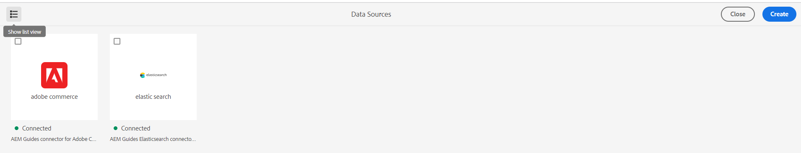

# Adobe Experience Manager Guides as a Cloud Serviceの2023年10月リリースの新機能

この記事では、Adobe Experience Manager Guidesの2023年10月バージョン（後に&#x200B;*AEM Guides as a Cloud Service*&#x200B;と呼ばれます）の新機能と強化機能について説明します。

アップグレード手順、互換性マトリックス、およびこのリリースで修正された問題について詳しくは、[&#x200B; リリースノート &#x200B;](release-notes-2023-10-0.md)を参照してください。

## ユーザーインターフェイスからのデータソースコネクタの設定

Experience Manager Guidesには、データソース用のすぐに使えるコネクタの設定に役立つ&#x200B;**データソース** ツールが用意されています。 JIRA、SQL （MySQL、PostgreSQL、Microsoft SQL Server、SQLite、MariaDB、H2DB）、Adobe Commerce、Elasticsearch データベース用のコネクタを簡単に作成できます。

また、データソースコネクタを簡単に編集、再接続、複製、または削除できます。 ユーザーインターフェイス [&#128279;](../cs-install-guide/conf-data-source-connector-tools.md)からデータソースコネクタを簡単に設定する方法について説明します。

{width="550"}

*データソースパネルからデータソースコネクタを作成して表示します。*

## トピックジェネレーターのログの表示

コンテンツ生成ログファイルを表示できるようになりました。 このログファイルは、警告、エラー、例外を確認するのに役立ちます。  トピックジェネレーター[&#128279;](../user-guide/web-editor-content-snippet.md#options-for-a-topic-generator)の オプションを使用して、トピックジェネレーターを簡単に生成および管理する方法について詳しくは、こちらを参照してください。

## データソーステンプレートでのVelocity ツールのサポート

Experience Manager Guides テンプレートでVelocity ツールを使用できるようになりました。 これらのツールは、データソースから取得したデータに様々な関数を適用するのに役立ちます。 テンプレートは、コンテンツスニペットやトピックの作成時に使用できます。 この機能により、各データセットに同じ機能を手動で適用する時間と労力を節約できます。  また、正確な結果を得ることができます。
例えば、$mathToolを使用して数学関数を実行できます。
データソーステンプレートで[Velocity ツールを使用する方法について詳しくは、](../user-guide/web-editor-content-snippet.md#use-velocity-tools)を参照してください。

## PDFのネイティブ機能

2023年10月リリースでは、次のネイティブ PDFの機能強化が行われました。

### レイアウトの最初のページのページ番号をリセットする

PDFのネイティブ出力では、ページ番号を再起動し、番号付けの開始番号を指定できます。 これで、セクションの最初の出現に対してのみ番号付けを開始することもできます。
ページレイアウト [&#128279;](../native-pdf/design-page-layout.md#page-props-page-layout)のページプロパティを操作する方法について詳しくは、こちらを参照してください。

### 目次で自動番号のない章を表示する

Experience Manager Guidesでは、章番号と章名が目次（TOC）に表示されます。 これで、章番号なしで章名のみを公開するように選択できます。 テンプレート [&#128279;](../native-pdf/components-pdf-template.md#advanced-pdf-settings)の詳細なPDF設定の設定方法について詳しく説明します。

## Web エディターからマップをダウンロードする

これで、Web エディターのマップビューでマップを編集するだけでなく、ダウンロードすることもできます。 特定のベースラインを使用してマップをダウンロードできます。 また、階層を統合し、すべてのファイルとフォルダーを1つのフォルダーに保存するオプションもあります。

詳しくは、[左パネル &#x200B;](../user-guide/web-editor-features.md#id2051EA0M0HS) セクション内の&#x200B;**マップビュー**&#x200B;機能の説明を参照してください。

リポジトリビューでのファイルの{width="550"}

*リポジトリビューでファイルを選択し、ファイルに対してアクションを実行するオプションを選択します。*

## Oxygen コネクタプラグインでのファイルの編集

Experience Manager Guidesでは、Web エディターでファイルを選択し、Oxygen コネクタプラグインでファイルを編集できるようになりました。 このオプションは、標準サポートの一部として有効になっていません。

詳しくは、[左パネル &#x200B;](../user-guide/web-editor-features.md#id2051EA0M0HS) セクション内のファイル **機能の説明に関する** オプションを参照してください。
