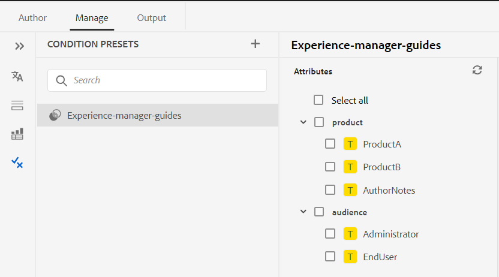

# Adobe Experience Manager Guides as a Cloud Serviceの2023年11月リリースの新機能

この記事では、Adobe Experience Manager Guidesの2023年11月バージョン（後に&#x200B;*Experience Manager Guides as a Cloud Service*&#x200B;と呼ばれます）の新機能と強化機能について説明します。

アップグレード手順、互換性マトリックス、およびこのリリースで修正された問題について詳しくは、[&#x200B; リリースノート &#x200B;](release-notes-2023-11-0.md)を参照してください。

## PDFのネイティブ機能

2023年11月リリースでは、次のネイティブ PDFの機能強化が行われました。

### すぐに使用できるPDFテンプレートの使用と複製

Experience Manager Guidesには、すぐに使用できるPDF テンプレートや、出荷時に使用できるテンプレートが用意されています。 工場出荷時のPDF テンプレートを複製して、カスタムのPDF テンプレートを作成します。

テンプレートを作成および複製する際に、テンプレートのサムネール画像をプレビューすることもできます。 この画像は、編集または削除することもできます。 この機能は、同じ名前のテンプレートをブランディングまたは区別するのに便利です。
[PDF テンプレート &#x200B;](../native-pdf/pdf-template.md)について詳しく説明します。

{width="550"}

*既存のPDF テンプレートを複製します。*

### ページの順序を変更し、シートごとに複数のページを公開する

ソース文書に従ってページを公開するだけでなく、複数ページの文書を公開する際に、PDFでページの順序を変更することもできます。  これにより、奇数ページや偶数ページなど、さまざまな順序でページを柔軟に公開できます。 小冊子として公開したり、本のようにページを読むこともできます。 また、1枚の用紙に公開するページの数を決めることもできます。 詳細については、「[&#x200B; ページ組織](../native-pdf/components-pdf-template.md#page-organization)」セクションを参照してください。

### 並べ替えキーに基づく用語集の用語の並べ替え

ソートキーに基づいて用語集の用語をソートすることもできます。 タグ「sort-as」を使用して、用語集の用語のソートキーを定義できます。 次に、用語の代わりにソートキーに基づいてソートできます。 これにより、様々な言語で使用される用語に従って用語集の用語を並べ替えることができます。 語句または単語のグループを含む用語集の用語に対して、単一の並べ替えキーを定義することもできます。
詳しくは、[PDFの詳細設定](../native-pdf/components-pdf-template.md#advanced-pdf-settings)を参照してください。

### PDFのネイティブテンプレートのリソース管理を改善

Experience Manager Guidesでは、ネイティブ PDF テンプレートのリソース管理が改善されました。 画像、CSS ファイル、フォントファイルなどのリソースを、複数のネイティブPDFテンプレートで共有および再利用できるようになりました。 この改善により、大規模なテンプレート セットのリソースの管理がはるかに容易になります。 テンプレートごとに重複するリソースを作成する必要がなく、共有フォルダーに保存し、すべてのネイティブPDF テンプレートで使用できます。
詳しくは、[PDF テンプレート &#x200B;](../native-pdf/pdf-template.md)を参照してください。

## Web エディターの機能強化

2023年11月リリースでは、次のWeb エディターの機能強化が行われました。

### タイトルまたはファイル名でファイルを表示

Web エディターでファイルを表示するデフォルトの方法を選択できるようになりました。 作成者ビューの様々なパネルから、タイトルまたはファイル名でファイルのリストを表示できます。

{width="550"}

*デフォルトの方法を変更して、**ユーザー環境設定**&#x200B;ダイアログからファイルを表示します。*

### 条件プリセットの管理

DITA トピックで条件属性を定義できます。 次に、条件プリセットの条件属性を使用して、コンテンツをDITA マップで公開します。 Experience Manager Guidesでは、Web エディターから条件プリセットを作成および管理できるようになりました。 また、編集、複製、削除も簡単にできます。

Web エディター{width="550"}の「管理」タブの条件プリセット

詳しくは、[&#x200B; コンディションプリセットの使用](../user-guide/generate-output-use-condition-presets.md)を参照してください。

### ブラウザーの更新時にファイルタブを復元

ブラウザーを更新すると、Experience Manager GuidesはWeb エディターで開いているファイルタブの状態を復元します。 詳細については、[Web エディターのトピックを編集](../user-guide/web-editor-edit-topics.md)の「**ファイルの編集中にブラウザーを更新**」セクションを参照してください。

### エレメントを簡単にラップ解除

これで、Web エディターのエレメントのコンテキストメニューのオプションを使用して、エレメントを簡単にラップ解除できるようになりました。 これにより、エレメントのテキストを親エレメントと簡単に結合できます。
詳細については、Web エディター[&#128279;](../user-guide/web-editor-other-features.md)のその他の機能の&#x200B;**要素のラップ解除** セクションを参照してください。

### カーソルを移動するためのキーボードショートカット

Experience Manager Guidesでは、キーボードショートカットを使用して、Web エディターでカーソルを移動できるようになりました。 キーボードショートカットを使用して、1つの単語を左右にすばやく移動できます。 キーボードショートカットを使用して、行の先頭または末尾に移動することもできます。
キーボードショートカットを使用して、カーソルを次の要素の先頭または前の要素の末尾に移動することもできます。
Web エディター[&#128279;](../user-guide/web-editor-keyboard-shortcuts.md)の キーボードショートカットについて詳しく説明します。
