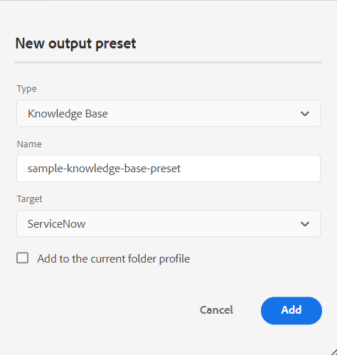
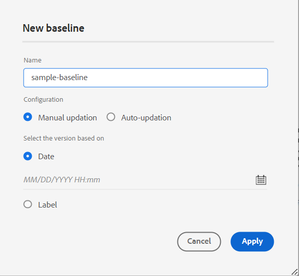

# Adobe Experience Manager Guides as a Cloud Serviceの2023年12月リリースの新機能

この記事では、Adobe Experience Manager Guidesの2023年12月バージョン（後に&#x200B;*Experience Manager Guides as a Cloud Service*&#x200B;と呼ばれます）の新機能と強化機能について説明します。

アップグレード手順、互換性マトリックス、およびこのリリースで修正された問題について詳しくは、[&#x200B; リリースノート &#x200B;](release-notes-2023-12-0.md)を参照してください。

## PDF出力での変数の使用

変数を使用して、再利用可能な情報を動的に挿入および管理できます。 Experience Manager Guidesは、PDF出力を生成する際に、変数を作成、編集、プレビューするのに役立ちます。 変数の値をすばやく変更し、ドキュメントをポータブルで簡単に更新できます。

{width="800"}

*Web エディターで変数を作成および管理します。*

また、デフォルト値を上書きする変数セットを作成し、変数に代替値を割り当てることもできます。 これらの変数をページレイアウト内に挿入し、同じPDF レイアウトを使用します。値のセットごとに個別のレイアウトを作成する必要はありません。 例えば、製品リリースごとに変数セットを作成できます。 この変数セットは、製品名、バージョン番号、リリース日など、製品の詳細ごとに異なる変数で構成できます。 次に、これらの変数に異なる値を追加できます。

**変数セット 1: Adobe-set1**

* 製品名：Experience Manager Guides
* バージョン番号：2311
* リリース日：2023年2月11日（PT）

**変数セット 2: Adobe-set2**

* 製品名：Experience Manager Guides
* バージョン番号：2310
* リリース日：2023年9月27日（PT）

*PDF レイアウトの変数を使用してPDF出力を生成します。*

スタイルを適用し、HTML マークアップを使用して変数を書式設定できます。  必要に応じて任意の変数の値をすばやく更新し、出力を再生成することもできます。 例えば、バージョンの詳細を更新する必要がある場合は、VersionNumber変数でバージョンの値を編集し、出力を再生成できます。

PDF出力[&#128279;](../native-pdf/native-pdf-variables.md)で変数を使用する方法について詳しく説明します。

## 属性を編集するエクスペリエンスが刷新されました

これで、Web エディターの&#x200B;**コンテンツのプロパティ** パネルから、要素の属性を追加または編集するエクスペリエンスが刷新されました。

{width="300"}

*コンテンツのプロパティ パネルから属性を追加します。*

属性を簡単に編集および削除することもできます。

詳しくは、[右側パネル &#x200B;](../user-guide/web-editor-features.md#id2051EB003YK) セクション内の&#x200B;**コンテンツのプロパティ**&#x200B;機能の説明を参照してください。

## オーサリング中にメタデータを編集

これで、オーサリング中に、右側のパネルの&#x200B;**ファイルプロパティ**&#x200B;のドロップダウンを使用して、ファイルメタデータタグを更新できるようになりました。 **さらにプロパティを編集**&#x200B;を選択して、さらにメタデータを更新することもできます。

{width="300"}

*右側のパネルからメタデータを更新し、ファイルのプロパティを編集します。*

詳しくは、[右側パネル &#x200B;](../user-guide/web-editor-features.md#id2051EB003YK) セクション内の&#x200B;**ファイルプロパティ**&#x200B;機能の説明を参照してください。

## ServiceNow ナレッジベースへのコンテンツの公開機能

また、コンテンツをServiceNow ナレッジベースプラットフォームに公開することもできます。

2023年12月リリースでは、管理者として、ServiceNow ナレッジベースサーバーの公開プロファイルを作成できます。 次に、作成者またはパブリッシャーとして、出力プリセットでそのServiceNow パブリッシュプロファイルを選択して、出力を指定したナレッジベースに公開できます。

この機能により、テキスト、ビデオ、画像などのコンテンツをServiceNow ナレッジベースプラットフォームに公開し、包括的なリポジトリを維持することができます。

{width="300"}になりました

*ServiceNow ナレッジベースの出力プリセットを作成します。*

[&#x200B; ナレッジベース &#x200B;](../user-guide/generate-output-knowledge-base.md)出力プリセットについて詳しく説明します。

## 強化されたマップコレクションダッシュボード

Experience Manager Guidesには、強化されたマップコレクションダッシュボードが用意されています。 マップコレクションでは、DITA マップのメタデータプロパティを一括設定できます。 この機能は、各DITA マップのメタデータプロパティを個別に更新する必要がないので便利です。

これで、DITA マップのファイル名を表示できます。 ベースラインも表示できます。 これにより、プリセットに使用されているベースラインをすばやく見つけることができます。

{width="800"}

*マップ コレクション ダッシュボードの表示、編集、および出力の生成。*

出力生成[&#128279;](../user-guide/generate-output-use-map-collection-output-generation.md)にマップコレクションを使用する方法について説明します。

## マップビューでのキー属性の表示

トピックまたはマップ参照のキー属性を定義する場合は、タイトル、対応するアイコン、および左側のパネルのキーを表示することもできます。 キーは`key=<key-name>`として表示されます。

詳しくは、[左パネル &#x200B;](../user-guide/web-editor-features.md#id2051EA0M0HS) セクションの&#x200B;**マップビュー**&#x200B;機能の説明を参照してください。

マップビュー {width="300"}の キー

*マップ ビューでキー属性を表示します。*

## ラベルに基づいてベースラインを複製する機能

Experience Manager Guidesでは、Web エディターからベースラインを作成するための拡張ユーザーエクスペリエンスが提供されるようになりました。\
 {width="300"}
*Web エディターからベースラインを作成します。*

また、ラベルに基づいてベースラインを複製することもできます。 参照バージョンは、複製の際に指定されたラベル（存在する場合）に基づいて選択されるか、複製されたベースラインからバージョンが選択されます。

 {width="300"}を複製

*ラベルに基づいてベースラインを複製するか、正確なコピーを作成します。*

Web エディター[&#128279;](../user-guide/web-editor-baseline.md)からベースラインを作成および管理する方法について詳しく説明します。

## AEM サイト出力でクロスマップリンクを解決する

AEM サイト出力でレンダリングされるクロスマップリンク（スコープピアを含むXREF）が、生成されたマップの公開コンテキストセットのファイルタイトルに従って解決されるようになりました。

## ドキュメントのタイトルを使用するように、AEM サイト出力のURLを設定します

Experience Manager Guidesを使用すると、管理者はAEM サイト出力のURLを設定できます。 ファイル名が存在しない場合、またはすべての特殊文字が含まれている場合は、AEM サイト出力のURLの区切り文字に置き換えるように設定できます。 また、最初の子トピックの名前に置き換えることもできます。 ドキュメント タイトル [&#128279;](../cs-install-guide/conf-output-generation.md#configure-the-url-of-the-aem-site-output-to-use-the-document-title)を使用するように、AEM サイト出力のURLを設定する方法について説明します。
