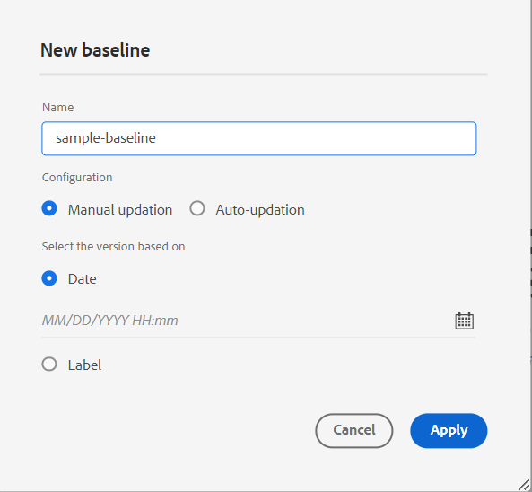

# Adobe Experience Manager Guidesas a Cloud Serviceの 2023 年 12 月リリースの新機能

この記事では、Adobe Experience Manager Guidesの 2023 年 12 月バージョン（後で *Experience Manager Guidesas a Cloud Service* と呼ばれます）の新機能および機能強化について説明します。

アップグレード手順、互換性マトリックス、およびこのリリースで修正された問題について詳しくは、[ リリースノート ](release-notes-2023-12-0.md) を参照してください。

## PDF出力での変数の使用

変数を使用して、再利用可能な情報を動的に挿入および管理できます。 Experience Manager Guidesは、PDF出力を生成する際に、変数を作成、編集およびプレビューするのに役立ちます。 変数の値をすばやく変更して、ドキュメントを移植可能かつ簡単に更新できます。

{width="800" align="left"}

*Web エディターで変数を作成および管理します。*

デフォルト値を上書きする変数セットを作成し、変数に代替値を割り当てることもできます。 これらの変数をページレイアウト内に挿入して、同じPDFレイアウトを使用します。値のセットごとに個別のレイアウトを作成する必要はありません。 例えば、製品リリースごとに変数セットを作成できます。 この変数セットは、製品名、バージョン番号、リリース日など、様々な製品の詳細に対する変数で構成できます。 次に、これらの変数に異なる値を追加できます。

**変数セット 1:Adobeセット 1**

* 製品名：Experience Manager Guides
* バージョン番号：2311
* リリース日：2023 年 2 月 11 日（Pt）

**変数セット 2:Adobeセット 2**

* 製品名：Experience Manager Guides
* バージョン番号：2310
* リリース日：2023 年 9 月 27 日（PT）

*PDFレイアウトの変数を使用してPDF出力を生成します*。

スタイルを適用し、HTMLのマークアップを使用して変数の書式を設定できます。  また、必要に応じて任意の変数の値をすばやく更新し、出力を再生成することもできます。 例えば、バージョンの詳細を更新する必要がある場合、VersionNumber 変数のバージョンの値を編集して、出力を再生成できます。

[PDF出力の変数 ](../native-pdf/native-pdf-variables.md) の使用方法について説明します。

## 属性を編集するエクスペリエンスを改善しました

これで、web エディターの **コンテンツのプロパティ** パネルで、要素の属性を追加または編集するエクスペリエンスが刷新されました。

{width="300" align="left"}

*コンテンツのプロパティパネルからの属性の追加*

また、属性の編集や削除も簡単にできます。

詳しくは、**右パネル [ の節にある** コンテンツのプロパティ ](../user-guide/web-editor-features.md#id2051EB003YK) 機能の説明を参照してください。

## オーサリング時のメタデータの編集

これで、オーサリング中に、右側のパネルの **ファイルのプロパティ** にあるドロップダウンを使用して、ファイルのメタデータタグを更新できます。 また、「**その他のプロパティを編集**」を選択して、さらにメタデータを更新することもできます。

{width="300" align="left"}

*右側のパネルからメタデータを更新してファイルプロパティを編集します。*

詳しくは、**右パネル [ の節にある** ファイルプロパティ ](../user-guide/web-editor-features.md#id2051EB003YK) 機能の説明を参照してください。

## ServiceNow ナレッジベースにコンテンツを公開する機能

また、コンテンツを ServiceNow ナレッジベースプラットフォームに公開できるようになりました。

2023 年 12 月リリースでは、管理者として、ServiceNow ナレッジベースサーバーのパブリッシュプロファイルを作成できます。 その後、オーサーまたはパブリッシャーとして、出力プリセットでその ServiceNow パブリッシュプロファイルを選択し、指定したナレッジベースに出力を公開できます。

この機能を使用すると、テキスト、ビデオ、画像などのコンテンツを ServiceNow ナレッジベースプラットフォームに公開し、包括的なリポジトリを維持することができます。

{width="300" align="left"}

*ServiceNow ナレッジベースの出力プリセットを作成します*。

[ ナレッジベース ](../user-guide/generate-output-knowledge-base.md) 出力プリセットの詳細情報。

## マップ コレクション ダッシュボードの強化

Experience Manager Guidesは、拡張されたマップコレクションダッシュボードを提供します。 マップ コレクションでは、DITA マップのメタデータ プロパティを一括ですばやく設定できます。 この機能は、各 DITA マップのメタデータプロパティを個別に更新する必要がないので便利です。

これで、DITA マップのファイル名を表示できます。 ベースラインを表示することもできます。 これにより、プリセットに使用するベースラインをすばやく見つけることができます。

{width="800" align="left"}

*マップ・コレクション・ダッシュボードからの出力の表示、編集、生成*

方法を説明します [ 出力生成にマップ コレクションを使用する ](../user-guide/generate-output-use-map-collection-output-generation.md)。

## マップ ビューで主要なアトリビュートを表示する

トピックまたはマップ参照のキー属性を定義する場合は、タイトル、対応するアイコン、左側のパネルのキーも表示できます。 キーは `key=<key-name>` のように表示されます。

詳しくは、「[ 左パネル ](../user-guide/web-editor-features.md#id2051EA0M0HS)」セクションの **マップビュー** 機能の説明を参照してください。

 {width="300" align="left"}

*マップ ビューでキー属性を表示します。*

## ラベルに基づくベースラインの複製機能

Experience Manager Guidesでは、web エディターからベースラインを作成する際のユーザーエクスペリエンスが強化されました。\
 {width="300" align="left"}
*Web エディターからベースラインを作成します。*

また、ラベルに基づいてベースラインを複製することもできます。 参照バージョンは、複製中に指定のラベル（存在する場合）に基づいて選択されます。存在しない場合は、複製されたベースラインからバージョンが選択されます。

 複製 {width="300" align="left"}

*ラベルに基づいてベースラインを複製するか、正確なコピーを作成します。*

Web エディターからベースラインを作成および管理 [ する方法について詳しく説明し ](../user-guide/web-editor-baseline.md) す。

## AEM Site 出力でのクロスマップリンクの解決

AEM Site 出力でレンダリングされるクロスマップリンク（スコープ ピアを持つ外部参照）が、生成されたマップに設定された公開コンテキストのファイルタイトルに従って解決されるようになりました。

## ドキュメントタイトルを使用するようにAEM サイト出力の URL を設定します

Experience Manager Guidesを使用すると、管理者としてAEM サイト出力の URL を設定できます。 ファイル名が存在しない場合や、ファイル名にすべての特殊文字が含まれる場合は、を設定して、AEM サイト出力の URL で区切り文字に置き換えることができます。 最初の子トピックの名前に置き換えることもできます。 詳細情報 [ ドキュメントタイトルを使用するようにAEM サイト出力の URL を設定する ](../cs-install-guide/conf-output-generation.md#configure-the-url-of-the-aem-site-output-to-use-the-document-title)
