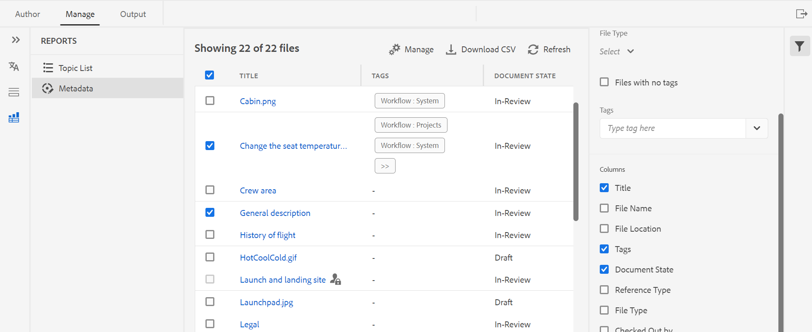

# Adobe Experience Manager Guides as a Cloud Serviceの2023年2月リリースの新機能

この記事では、Adobe Experience Manager Guidesの2023年2月バージョン（後に&#x200B;*AEM Guides as a Cloud Service*&#x200B;と呼ばれます）の新機能と強化機能について説明します。

アップグレード手順、互換性マトリックス、およびこのリリースで修正された問題について詳しくは、[ リリースノート ](release-notes-2023-2-0.md)の記事を参照してください。

## Web エディターからのレポートの生成

AEM Guidesには、Web エディターの機能が搭載されており、技術文書の全体的な完全性を確認し、レポートを生成することができます。
トピックリストを表示したり、メタデータを管理したり、現在のマップのすべての参照で使用されるマルチメディアを表示したりできます。
Web エディターの「**レポート**」タブ。

**トピックリストビューを生成**

参照タイプ、ドキュメントの状態、作成者など、トピックに関する詳細情報を提供するトピックリストを生成できます。 CSVを生成して、DITA マップ内のトピックの現在のスナップショットをダウンロードすることもできます。

**メタデータの管理とドキュメントの状態の変更**

個々のトピックにタグを適用することも、一括タグ付け機能を使用して、複数のトピック、DITA マップ、サブマップに複数のタグを適用することもできます。 選択したすべてのトピックのドキュメント状態を、次に考えられる一般的なドキュメント状態に変更することもできます。

**マルチメディアレポートを生成**

現在のマップ内の参照で使用されるマルチメディアに関する詳細情報を含むマルチメディアレポートを生成できます。 レポートにリストされているマルチメディアファイルを柔軟にフィルタリングおよび並べ替えることができます。
CSVを生成して、DITA マップで使用されているマルチメディアの現在のスナップショットをダウンロードすることもできます。

## レビュー機能のUXを刷新

Adobe AEM guidesでは、共有されたトピックをレビューするのに役立つ改善されたUXが提供されるようになりました。 最新のエクスペリエンスでは、レビュー機能に次の機能強化が加えられました。

* 更新されたユーザーインターフェイス
* トピックで使用可能な条件に従ってコンテンツをハイライト表示できる条件パネル
* コメントパネルの各コメントは、現在のトピック内の対応するテキストにリンクされます。 コメント付きテキストを識別するのに役立ちます。
* 注釈は、文書内の注釈テキストの順序で表示されます。
* レビュータスクの名前がレビューワークフローに表示されます。
* レビューコンテンツで使用されるすべての主要参照と用語集の用語を解決するために使用されるレビュータスクのロードマップを選択します。
* コンテキストツールバー。テキストを素早くハイライトまたは取り消し線で表示します
* 独自のコメントを編集または削除するためのオプションメニュー
* 古いコメントの場合は、トピックの以前のバージョンと現在のレビューバージョンを比較するのに役立つサイドバイサイドビューにアクセスできます。
* フィルターを使用すると、右側のパネルのコメントが選択範囲に従ってフィルタリングされ、
左側のパネルのコメント数は、それに応じて更新されます。

  

## 翻訳の機能強化

これで、Web エディターからドキュメントを簡単に翻訳できる、翻訳ダッシュボードのユーザーフレンドリーな機能強化が追加されました。

**バージョンラベルをターゲットバージョンに渡す**

AEM Guidesでは、ソースファイルのラベルをターゲットファイルに渡すことができます。 これにより、翻訳されたファイルのソースバージョンを簡単に特定できます。

例えば、バージョンラベル Release 1.0が適用されたソースファイルがある場合、ソースラベル（Release 1.0）を翻訳ファイルに渡すこともできます。

**非同期アセットの同期を強制**

一部のアセットに変更を加えた場合、AEM Guidesは一部のアセットを同期しなくなります。 変更したアセットを再翻訳するか、同期外ステータスを解除するかを選択できます。 例えば、翻訳が不要な軽微な変更を加えた場合、ステータスを「同期」としてマークできます。

**トピックまたはマップの進行中の翻訳プロジェクトを表示**

翻訳ダッシュボードの参照の一部が処理中の可能性があります。 現在、AEM Guidesには、選択した参照を含むすべての進行中の翻訳プロジェクト（およびターゲット言語）のリストを表示するのに役立つ機能が用意されています。

## Web エディターから様々な形式で出力を生成

Web エディターからトピックまたはDITA マップの出力を簡単に生成できるようになりました。 AEM サイト、PDF、HTML5など、様々な出力プリセットを設定できます。
JSON （ヘッドレス出力形式）とカスタム出力。 これらの関数を使用して、それぞれの出力を生成できます。

DITA トピックで属性を定義し、条件プリセットを使用して、出力の公開中に条件を適用することができます。 ベースライン公開機能を使用して、特定のバージョンのDITA マップまたはトピックを選択的に公開することもできます。

## マップレベルでのテキストの検索と置換

AEM Guidesでは、特定のテキストを含むマップ内のファイルを検索できます。 検索したテキストがファイル内でハイライト表示されます。 検索した単語やフレーズを、すべてのファイル内の別の単語やフレーズに置き換えることもできます。 リストの右上にある「**すべて置換**」アイコンを選択して、すべてのファイルで検索された用語のすべての出現箇所を置換できます。

## リポジトリーパネルからのファイルの削除と複製

リポジトリパネルで選択したファイルの&#x200B;**オプション** メニューから、ファイルの複製またはコピーを簡単に作成できるようになりました。 デフォルトでは、ファイルはで作成されます
接尾辞（`filename_1.extension`など）。

## その他のWeb エディターの機能強化

* AEM Guidesでは、コンテキストメニューを使用して、画像やメディアファイルに対して一般的な操作を実行できます。 これで、選択した画像またはメディアをリポジトリ内で見つけたり、Assets UIでファイルのプレビューを表示したりすることもできます。

* 現在のフォルダープロファイルの名前は、メインツールバーのユーザー環境設定アイコンのラベルとして表示されます。 これは、作業中のフォルダープロファイルを特定するのに役立ちます。

* マップビューでマップを開くと、現在のマップのタイトルがメインツールバーの中央に表示されます。 これは、現在開いているマップをユーザーに知らせるのに役立ちます。

## Oxygen エディターでUUIDの代わりにタイトルを表示する

AEM Guidesでは、「**エディターでタイトルを使用」および「**」オプションを「設定」で選択できるようになりました。 このオプションを選択すると、エディターまたはDITA マップマネージャーで開いたときに、ファイルのタイトルがファイルのタブに表示されます。 このオプションを選択しない場合、ファイルのUUIDがファイルのタブに表示されます。

## AEM Guides as a Cloud Serviceのマイクロサービスベースの公開

新しいパブリッシングマイクロサービスを使用すると、AEM Guides as a Cloud Serviceで大規模なパブリッシングワークロードを同時に実行し、業界をリードするAdobe I/O Runtime サーバーレスプラットフォームを活用できます。

AEM Guides as a Cloud Serviceでは、公開リクエストごとに個別のコンテナを実行し、ユーザーのリクエストに応じて水平方向にスケーリングします。 これにより、複数の公開リクエストを実行して、パフォーマンスを向上させることができます。

詳しくは、[AEM Guides as a Cloud Service用の新しいマイクロサービスベースの公開の設定](https://experienceleague.adobe.com/docs/experience-manager-guides-learn/tutorials/knowledge-base/publishing/configure-microservices.md)を参照してください。

## ネイティブ PDF | PDF出力にカスタムブックマークを追加

これで、最終的なPDF出力の特定のコンテンツにカスタムブックマークを追加して、簡単に操作できるようになります。 これは、DITA マップのトピックタイトルまたはセクションタイトルから作成される目次に追加されます。

## ネイティブ PDF |目次エントリとトピックコンテンツにカスタムスタイルを適用

AEM Guidesには、PDF出力の目次エントリまたは特定のトピックにカスタムスタイルを適用する機能が用意されています。 例えば、目次のテキストとトピックのタイトルの色を変更できます。 トピック内のコンテンツ全体にスタイルを適用することもできます。

## ネイティブ PDF |脚注コンポーネントのページマーカーのスタイル設定

これで、脚注のページマーカーのスタイルを設定できます。 例えば、角括弧を追加したり、色を変更したりできます。 これらのスタイルは、ユーザーが文書内のページマーカーを簡単に識別するのに役立ちます。

## ネイティブ PDF |目次の変更されたトピックを示す改訂バー

AEM Guidesでは、PDF出力の目次で変更されたトピックをすばやく特定できるようになりました。  目次の変更されたトピックの左側に変更バーが表示されます。 目次のトピックをクリックして、詳細な変更を表示できます。

