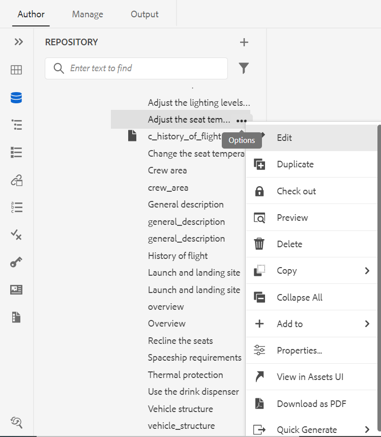

# Adobe Experience Manager Guidesas a Cloud Serviceの 2023 年 2 月リリースの新機能

この記事では、Adobe Experience Manager Guides 2023 年 2 月バージョン（後で *AEM Guidesas a Cloud Service*）の新機能および拡張機能について説明します。

アップグレードの手順、互換性マトリックス、およびこのリリースで修正された問題について詳しくは、[&#x200B; リリースノート &#x200B;](release-notes-2023-2-0.md) の記事を参照してください。

## Web エディターからのレポートの生成

AEM Guidesには、技術文書の全体的な完全性を確認し、レポートを生成できる Web エディターの機能が付属しています。
トピック リストを表示したり、メタデータを管理したり、現在のマップのすべての参照で使用されているマルチメディアを表示することができます。
Web エディターの「**レポート**」タブ。

**トピックリスト表示の生成**

参照タイプ、ドキュメントの状態、作成者など、トピックに関する詳細情報を提供するトピックリストを生成できます。 CSV を生成して、DITA マップ内のトピックの現在のスナップショットをダウンロードすることもできます。

**メタデータの管理とドキュメントの状態の変更**

個々のトピックにタグを適用したり、一括タグ付け機能を使用して、複数のトピック、DITA マップ、またはサブマップに複数のタグを適用できます。 選択したすべてのトピックのドキュメント状態を、次に使用可能な共通ドキュメント状態に変更することもできます。

**マルチメディアレポートの生成**

現在のマップ内の参照で使用されるマルチメディアに関する詳細情報を含むマルチメディア レポートを生成できます。 レポートに一覧表示されるマルチメディア ファイルを柔軟にフィルタ処理および並べ替えることができます。
CSV を生成して、DITA マップで使用されているマルチメディアの現在のスナップショットをダウンロードすることもできます。

## レビュー機能のために UX を刷新

AEM ガイドの UX が向上し、共有されているトピックをレビューするのに役立つようになりました。 最新のエクスペリエンスでは、レビュー機能に次の機能強化が行われています。

* ユーザーインターフェイスを更新しました
* トピックで使用可能な条件に従ってコンテンツをハイライト表示できる条件パネル
* コメントパネル内の各コメントは、現在のトピック内の対応するテキストにリンクされています。 コメントされたテキストを識別するのに役立ちます。
* コメントは、ドキュメント内のコメントされたテキストの順序で表示されます。
* レビュータスクの名前は、レビューワークフローに表示されます。
* レビュータスクのルートマップを選択します。このルートマップは、レビューコンテンツで使用されるすべての主要な参照と用語集の用語を解決するために使用されます。
* テキストのハイライト表示や取り消しをすばやく行うのに役立つコンテキストツールバー
* 独自のコメントを編集または削除するためのオプションメニュー
* 古いコメントの場合は、前のバージョンのトピックと現在のレビューバージョンを比較するのに役立つ並列表示にアクセスできます。
* フィルターを使用すると、右側のパネルのコメントが、選択した項目と
左側のパネルのコメント数は、それに応じて更新されます。

  

## 翻訳機能の強化

翻訳ダッシュボードが強化され、web エディターからドキュメントを簡単に翻訳できるようになりました。

**ターゲットバージョンにバージョンラベルを渡す**

AEM Guidesでは、ソースファイルのラベルをターゲットファイルに渡すことができます。 これにより、翻訳済みファイルのソースバージョンを簡単に識別できます。

例えば、バージョンラベル Release 1.0 が適用されたソースファイルがある場合は、ソースラベル（Release 1.0）を翻訳済みファイルに渡すこともできます。

**非同期アセットの同期を強制**

一部のアセットに変更を加えると、AEM Guidesでは非同期とマークされます。 変更したアセットを再翻訳するか、非同期ステータスを解除するかを選択できます。 例えば、翻訳を必要としない軽微な変更を加えた場合、そのステータスを「同期中」とマークできます。

**トピックまたはマップの進行中の翻訳プロジェクトの表示**

翻訳ダッシュボード上で、一部の参照が進行中の可能性があります。 AEM Guidesには、選択した参照を含むすべての進行中の翻訳プロジェクトのリストを（ターゲット言語と共に）表示するのに役立つ機能が用意されるようになりました。

## Web エディターから様々な形式の出力を生成

これで、Web エディタからトピックまたは DITA マップの出力を簡単に生成できます。 AEM Site、PDF、HTML 5 など、様々な出力プリセットを設定できます。
JSON （ヘッドレス出力形式）とカスタム出力。 その後、これらを使用して、それぞれの出力を生成できます。

DITA トピックで属性を定義し、出力の公開時に条件プリセットを使用して条件を適用できます。 ベースライン公開機能を使用して、DITA マップまたはトピックの特定のバージョンを選択的に公開することもできます。

## マップ レベルでテキストを検索して置換します

AEM Guidesを使用すると、マップ内で特定のテキストを含むファイルを検索できます。 検索されたテキストは、ファイル内でハイライト表示されます。 検索した単語や語句を、すべてのファイル内の別の単語や語句に置き換えることもできます。 リストの上部の右側にある「**すべてを置換**」アイコンを選択すると、すべてのファイルで検索した用語をすべて置換できます。

## リポジトリパネルからのファイルの削除と複製

リポジトリパネル内の選択したファイルの **オプション** メニューから、ファイルの複製またはコピーを簡単に作成できるようになりました。 デフォルトでは、ファイルはで作成されます。
サフィックス（`filename_1.extension` など）。

## その他の web エディターの機能強化

* AEM Guidesでは、コンテキストメニューを使用して、画像ファイルやメディアファイルに対する一般的な操作をいくつか実行できます。 これにより、選択した画像やメディアをリポジトリーで見つけたり、Assets UI でファイルのプレビューを表示したりすることもできます。

* 現在のフォルダープロファイルの名前は、メインツールバーのユーザー環境設定アイコンのラベルとして表示されます。 これにより、作業中のフォルダープロファイルを特定できます。

* マップ ビューでマップを開くと、現在のマップのタイトルがメイン ツールバーの中央に表示されます。 これは、現在開いているマップをユーザーに知らせるのに役立ちます。

## 酸素エディターで UUID の代わりにタイトルを表示

AEM Guidesで、「設定」から「**エディターでタイトルを使用およびマップマネージャー** オプションを選択できるようになりました。 このオプションを選択すると、エディタまたは DITA マップマネージャで開いたときに、ファイルのタイトルがファイルのタブに表示されます。 このオプションを選択しない場合、ファイルの UUID がファイルのタブに表示されます。

## AEM Guidesas a Cloud Service向けのマイクロサービスベースの公開

新しいパブリッシングマイクロサービスを使用すると、AEM Guidesas a Cloud Serviceで大規模なパブリッシングワークロードを同時に実行でき、業界をリードするAdobe I/O Runtime サーバーレスプラットフォームを活用できます。

公開リクエストごとに、AEM Guidesas a Cloud Serviceは個別のコンテナを実行し、ユーザーリクエストに応じて水平方向に拡大・縮小します。 これにより、複数の公開リクエストを実行し、パフォーマンスを向上させることができます。

詳しくは、[AEM Guidesas a Cloud Serviceの新しいマイクロサービスベースの公開を設定する &#x200B;](https://experienceleague.adobe.com/docs/experience-manager-guides-learn/tutorials/knowledge-base/publishing/configure-microservices.md) を参照してください。

## ネイティブPDF | PDF出力へのカスタムブックマークの追加

最終的なPDF出力の特定のコンテンツにカスタムブックマークを追加して、簡単に移動できるようになりました。 これは、DITA マップのトピックまたはセクションタイトルから作成される目次に追加されます。

## ネイティブPDF |目次エントリとトピックコンテンツにカスタムスタイルを適用

AEM Guidesには、目次エントリやPDF出力の特定のトピックにカスタムスタイルを適用する機能があります。 例えば、目次のテキストの色や、トピックのタイトルを変更できます。 トピック内のコンテンツ全体にスタイルを適用することもできます。

## ネイティブPDF |脚注コンポーネントのページマーカーのスタイル設定

これで、フットノートのページマーカーのスタイルを設定できます。 例えば、角括弧を追加したり、色を変更したりできます。 これらのスタイルにより、ユーザーはドキュメント内のページマーカーを簡単に識別できるようになります。

## ネイティブPDF |目次に変更されたトピックを示す変更バー

AEM Guidesで、PDF出力の目次で、変更されたトピックをすばやく特定できるようになりました。  目次の変更されたトピックの左側に変更バーが表示されます。 目次のトピックをクリックすると、詳細な変更を表示できます。

