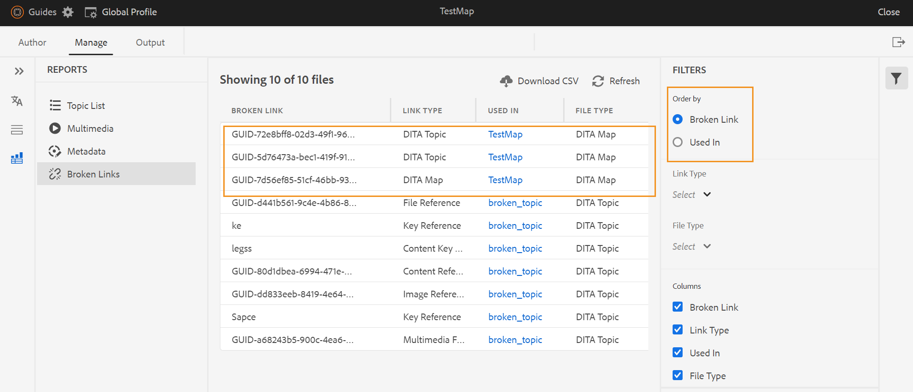
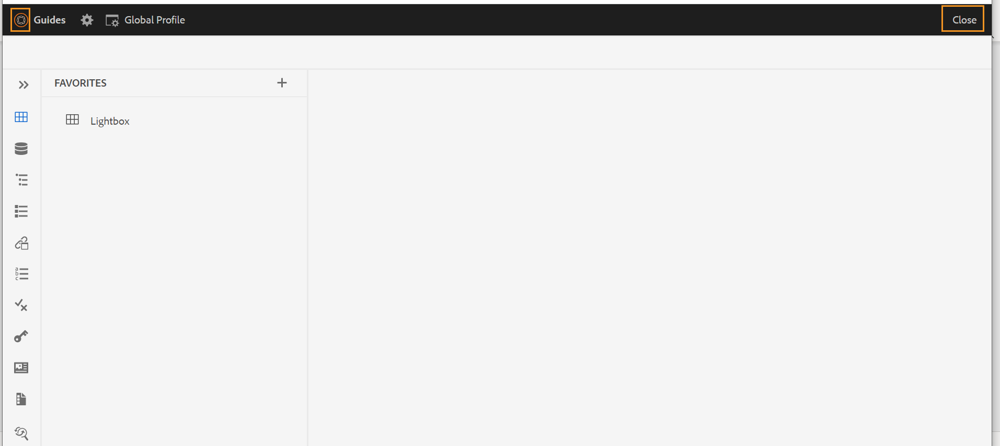

# Adobe Experience Manager Guidesas a Cloud Serviceの 2023 年 6 月リリースの新機能

この記事では、Adobe Experience Manager Guidesの 2023 年 6 月バージョン（後で *AEM Guidesas a Cloud Service* と呼ばれます）の新機能および機能強化について説明します。

アップグレード手順、互換性マトリックス、このリリースで修正された問題について詳しくは、[ リリースノート ](release-notes-2023-6-0.md) を参照してください。

## Web エディターのリンク切れレポート

AEM Guidesでは、技術文書の全体的な完全性を確認し、web エディターからレポートを生成できます。 2023 年 6 月リリースに、AEM Guidesで壊れたリンクを表示および修正する機能が追加されました。 これは、壊れたリンクの管理に役立つ便利なレポートです。 DITA マップに存在する壊れたリンクを簡単に表示して修正できます。
{width="800" align="left"}

リンクを修正すると、壊れたリンクのリストの下に表示されなくなります。

詳しくは、[ 壊れたリンクの表示と修正 ](../user-guide/reports-web-editor.md#report-broken-links) を参照してください。

## リポジトリビュー内でのファイルの名前変更と移動

リポジトリパネルからファイルの名前を変更または移動できるようになりました。 この機能は便利で、リポジトリーパネルからファイルを簡単に管理するのに役立ちます。 ファイルを選択し、選択したファイルの **オプション** メニューを使用して、ファイルの名前を変更したり移動したりできます。 ファイルを移動または名前変更すると、AEM Guidesに成功メッセージが表示されます。

{width="650" align="left"}

ファイルのオプションメニューについて詳しくは、**左パネル [ の** リポジトリ表示 ](../user-guide/web-editor-features.md#id2051EA0M0HS) 機能の説明を参照してください。

## ネイティブPDFの機能強化

### 下書き文書のPDF出力に透かしを追加する

まだ承認されていないドキュメントのPDF出力に透かしを追加できるようになりました。 この透かしは、「承認済み」ドキュメント状態のドキュメントのPDFを生成した場合には表示されません。 例えば、PDF出力に透かしドラフトを追加できます。

詳しくは、[ ドラフトドキュメントのPDF出力に透かしを追加する ](../native-pdf/use-javascript-content-style.md#watermark-draft-document) を参照してください。

### 言語変数のサポート

AEM Guidesでは言語変数をサポートしています。 PDF変数を使用して、標準提供のラベルのローカライズ版を定義できます（メモ、注意、警告、静的テキストなど）。
PDF出力および出力テンプレートの適切なセクションに、言語変数またはローカライズ版のラベルを追加できます。

#### PDF出力の言語変数

言語変数を使用して、メモ、注意、警告などの要素のローカライズされたラベルを定義できます。 これらの変数の値を 1 つ以上のPDFで更新すると、ローカライズされた値が言語の出力で自動的に選択されます。
例えば、次のような方法で「メモ」ラベルをPDF出力に表示できます。

* 英語：Note
* フランス語：Remarque
* ドイツ語：ヒンワイス

#### 出力テンプレートの言語変数

様々な言語でPDF出力を作成する場合は、言語ごとにローカライズされたテキストを含む様々なPDFテンプレートを作成する必要がありました。 現在は、言語変数機能を使用して、テンプレートを作成する必要があるのは 1 回だけです。 次に、ローカライズが必要な静的テキストについて、対応する言語変数を作成し、テンプレートで使用できます。
文全体や段落など、長いテキストに対して言語変数を作成できます。 また、スタイルを適用し、HTMLマークアップを使用してこれらの言語変数の書式を設定することもできます。

詳しくは、[ 言語変数のサポート ](../native-pdf/native-pdf-language-variables.md) を参照してください。

### PDFレイアウトでAEM メタデータを使用する機能

メタデータは、コンテンツの説明または定義です。 このメタデータは、ソース DITA マップのコンテンツに保存されます。

AEM Guidesで、アセットのメタデータプロパティを選択して、ページレイアウトに追加することもできます。 次に、AEM Guidesはアセットのこれらのメタデータプロパティを選択し、PDF出力に公開します。

{width="550" align="left"}

>[!NOTE]
>
> AEM Guidesは、DITA マップのメタデータプロパティもサポートします。

詳しくは、[ フィールドとメタデータの追加 ](../native-pdf/design-page-layout.md#add-fields-metadata) を参照してください。

## スキーマトロンの機能強化

### レポートステートメントを使用してスキーマ内のルールを確認

AEM Guidesでは、スキーマトロンを含むレポートステートメントもサポートするようになりました。 テストステートメントが true と評価されると、report ステートメントがメッセージを生成します。 たとえば、簡単な説明を 150 文字以下にする場合、レポート ステートメントを定義して、簡単な説明が 150 文字を超えるトピックをチェックできます。

詳しくは、[ アサートおよびレポートステートメントを使用してルールをチェックする ](../user-guide/support-schematron-file.md#schematron-assert-report) を参照してください。

### 正規表現式の使用

正規表現を使用して、matches （）関数を含むルールを定義し、Schematron ファイルを使用して検証を実行することもできます。

詳しくは、[ 正規表現の使用 ](../user-guide/support-schematron-file.md#schematron-assert-report) を参照してください。

### 抽象パターンの定義

AEM Guidesは Schematron の抽象パターンもサポートしています。 一般的な抽象パターンを定義し、これらの抽象パターンを再利用できます。 抽象パターンを使用すると、スキーマを簡略化でき、検証ロジックの管理と更新にも役立ちます。

詳しくは、[ 抽象パターンの定義 ](../user-guide/support-schematron-file.md#schematron-abstract-patterns) を参照してください。

## Web エディターからAEM ホームページに移動します。

Web エディターからAEM ホームページに簡単に移動できるようになりました。

{width="800" align="left"}

* **ガイド** アイコン（）をクリックして、AEM ナビゲーション ページに戻ります。

詳しくは、[AEMのナビゲーションページ ](../user-guide/web-editor-launch-editor.md#id2056BG00RZJ) を参照してください。

## サブジェクト定義および列挙の階層定義の処理

AEM Guidesには、分類の対象と制御値を定義するために使用される DITA マップの特殊な形式であるサブジェクトスキーママップを作成する強力な機能が備わっています。 また、AEM Guidesでは、マップ内で件名を定義し、別のマップ内で定義済みリスト定義を定義できるようになりました。 その後、マップ参照を追加し、サブジェクト スキームを使用できます。
サブジェクトの定義済みリストの参照は、同じマップまたは参照先のマップで解決されます。

サブジェクト定義と列挙の階層定義の処理について詳しくは、**左パネル [ の** サブジェクト スキーム ](../user-guide/web-editor-features.md#id2051EA0M0HS) 機能の説明を参照してください。

## 翻訳での XLIFF 形式のサポート

AEM Guidesでは、翻訳機能で XML Localization Interchange File Format （XLIFF）形式もサポートされています。 また、**新しい XLIFF 翻訳プロジェクトを作成** を選択して、XML コンテンツを XLIFF 形式に変換できるようになりました。
この形式を使用すると、コンテンツを業界標準の XLIFF 形式に書き出し、それを翻訳ベンダーに提供できます。 詳しくは、[ 翻訳プロジェクトの作成 ](../user-guide/translate-documents-web-editor.md#create-translation-project) を参照してください。

{width="350" align="left"}

## お気に入りパネルの改善

AEM Guidesを使用すると、ファイルやフォルダーのコレクションやお気に入りのリストを作成し、それらを簡単に使用できます。 **お気に入り** パネルで **オプション** メニューも使用できるようになりました。 選択したコレクションの名前を変更したり、**オプション** メニューから削除したりできます。 「**更新**」オプションを選択すると、リポジトリからファイルまたはフォルダーの新しいリストを取得できます。 フォルダーのコンテンツは、Assets UI でも表示できます。

{width="650" align="left"}

>[!NOTE]
>
> 上部の「**更新** アイコンを使用してリストを更新することもできます。

お気に入りコレクションの **オプション** メニューについて詳しくは、**左パネル [ の** お気に入り ](../user-guide/web-editor-features.md#id2051EA0M0HS) 機能の説明を参照してください。

## システムテーマに切り替える

また、デバイステーマを使用できるようになりました。 **ユーザーの環境設定** を使用して、デバイスのテーマに基づいて明るいテーマと暗いテーマを自動的に切り替えるようにAEM Guidesを設定できます。

{width="550" align="left"}

詳しくは、「メイン **ツールバー** セクションの [ ユーザー環境設定 ](../user-guide/web-editor-features.md#id2051EA0G05Z) 機能の説明を参照してください。
